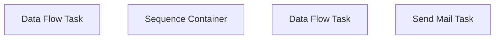

# SSIS Package: CRM_CustomerCreateFromWebSale

**Project:** CRM_CustomerCreateFromWebSale  
**Folder:** CRM  
**Server:** STL-SSIS-P-01  

## Connection Managers

| Name | Type | Server | Catalog | Connection (sanitized) |
|---|---|---|---|---|
| Auditworks | OLEDB | bedrockdb01 | auditworks | Data Source=bedrockdb01; Initial Catalog=auditworks; Provider=SQLNCLI11.1; Integrated Security=SSPI; Auto Translate=False |
| CRM | OLEDB | STL-CRMDB-P-01 | crm | Data Source=STL-CRMDB-P-01; Initial Catalog=crm; Provider=SQLNCLI11.1; Integrated Security=SSPI; Auto Translate=False |
| SMTP | SMTP |  |  |  |
| papamart.DWStaging | OLEDB | papamart | DWStaging | Data Source=papamart; Initial Catalog=DWStaging; Provider=SQLNCLI11.1; Integrated Security=SSPI; Auto Translate=False |
| webpurch.txt | FLATFILE |  |  |  |

## Control Flow Tasks

| Task | Type |
|---|---|
| CRM_CustomerCreateFromWebSale | Package |
| Data Flow Task | Pipeline |
| Sequence Container | SEQUENCE |
| Data Flow Task | Pipeline |
| Send Mail Task | SendMailTask |

## Control Flow Outline

```text
- Send Mail Task [SendMailTask]
- Data Flow Task [Pipeline]
- Sequence Container [SEQUENCE]
  - Data Flow Task [Pipeline]
```

## Architecture Diagram



## Variables

| Namespace | Name | Expression-bound |
|---|---|---|
| System | Propagate | No |
| User | DateTimeStamp | Yes |
| User | EndDate | Yes |
| User | EndDateAsDATE | Yes |
| User | GetDate | Yes |
| User | GetDateAsDATE | Yes |
| User | StartDate | Yes |
| User | StartDateAsDATE | Yes |

### Expression-bound variable values

#### User::DateTimeStamp

**Expression:**

```sql
(DT_WSTR,4)DATEPART("yyyy",GetDate()) 
+ (DT_WSTR,4)DATEPART("mm",GetDate()) 
+ (DT_WSTR,4)DATEPART("dd",GetDate()) 
+ (DT_WSTR,4)DATEPART("hh",GetDate()) 
+ (DT_WSTR,4)DATEPART("mi",GetDate()) 
+ (DT_WSTR,4)DATEPART("ss",GetDate()) 
+ (DT_WSTR,4)DATEPART("ms",GetDate())
```

**Evaluated value:**

```sql
2021112974437433
```

#### User::EndDate

**Expression:**

```sql
dateadd("dd", @[$Package::DaysToInclude], @[User::StartDate])
```

**Evaluated value:**

```sql
11/29/2021
```

#### User::EndDateAsDATE

**Expression:**

```sql
(DT_WSTR, 4) datepart("year", @[User::EndDate])  + "-" + 
(DT_WSTR, 2) datepart("mm", @[User::EndDate])  + "-" + 
(DT_WSTR, 2) datepart("dd",  @[User::EndDate])
```

**Evaluated value:**

```sql
2021-11-29
```

#### User::GetDate

**Expression:**

```sql
(DT_DATE)DATEDIFF("Day", (DT_DATE) 0, GETDATE())
```

**Evaluated value:**

```sql
11/29/2021
```

#### User::GetDateAsDATE

**Expression:**

```sql
(DT_WSTR, 4) datepart("year", @[User::GetDate])  + "-" + 
(DT_WSTR, 2) datepart("mm", @[User::GetDate])  + "-" + 
(DT_WSTR, 2) datepart("dd",  @[User::GetDate])
```

**Evaluated value:**

```sql
2021-11-29
```

#### User::StartDate

**Expression:**

```sql
dateadd("dd", -@[$Package::DaysToGoBack] , @[User::GetDate] )
```

**Evaluated value:**

```sql
11/28/2021
```

#### User::StartDateAsDATE

**Expression:**

```sql
(DT_WSTR, 4) datepart("year", @[User::StartDate])  + "-" + 
(DT_WSTR, 2) datepart("mm", @[User::StartDate])  + "-" + 
(DT_WSTR, 2) datepart("dd",  @[User::StartDate])
```

**Evaluated value:**

```sql
2021-11-28
```

## Execute SQL Tasks

_None detected._

## Data Flow: Sources

| Component | Source Object | Type | Data Flow Task | Connection | SQL Kind |
|---|---|---|---|---|---|
| Sales Audit |  | OLEDBSource | Data Flow Task | papamart.DWStaging | SqlCommand |
| Sales Audit |  | OLEDBSource | Data Flow Task | Auditworks | SqlCommand |

#### Sales Audit — SqlCommand

```sql
select 
	cast(m.email as nvarchar) as email_address,
	cast(m.[first-name] as nvarchar) First_name,
	cast(m.[last-name] as nvarchar) last_name,
	cast(m.address1 as nvarchar) address_1,
	cast(m.address2 as nvarchar) address_2,
	cast(m.city as nvarchar) as city,
	cast(case when len(m.[state-code]) > 2 then NULL else m.[state-code] end as nvarchar) as state,
	cast(m.[postal-code] as nvarchar) post_code,
	case
		when m.[country-code] = 'US' then cast('USA' as nvarchar)
		when m.[country-code] = 'CA' then cast('CAN' as nvarchar)
		else cast(m.[country-code] as nvarchar) 
	end as country,
	null as telephone_no1,
	'0' as PhoneTxtOptIn
from tmpNotInCRM e
join tmpMarketingCloudEmailOptIn m 
	on e.MaxIndexCustomer=m._RowIndex_Customer
	and e.MaxIndexAddress=m._RowIndex_Address
group by 
	m.email,
	m.[first-name],
	m.[last-name],
	m.address1,
	m.address2,
	m.city,
	case when len(m.[state-code]) > 2 then NULL else m.[state-code] end,
	m.[postal-code],
	m.[country-code]
order by m.[country-code]
```

#### Sales Audit — SqlCommand

```sql
with
EmailMaxTransactionID as ---get email's most recent transaction from store 13
	(
		select 
			max(th.transaction_id) MaxTransactionID,
			c.email_address
		from customer c with (nolock) 
		join transaction_header th with (nolock) on c.transaction_id=th.transaction_id
		where th.store_no = 13
		and c.customer_role=1 --purchasing customer??
		and c.email_address not like '%buildabear.com'
		group by c.email_address
	)
select 
	th.transaction_date,
	c.first_name as BillToFName,	
	c.last_name as BillToLName,	
	c.address_1 as BillToAddress1,	
	c.address_2 as BillToAddress2,	
	c.city as BillToCity,	
	c.state as BillToState,	
	c.post_code as BillToPostalCode,	
	c.country as BillToCountry,	
	c.email_address as BillToEmail
from customer c with (nolock) 
join transaction_header th with (nolock) on c.transaction_id=th.transaction_id
join EmailMaxTransactionID et 
	on th.transaction_id=et.MaxTransactionID 
	and c.email_address=et.email_address
where c.customer_role=1
```

## Data Flow: Destinations

| Component | Target Table | Type | Data Flow Task | Connection | SQL Kind |
|---|---|---|---|---|---|
| webpurchtxt |  | FlatFileDestination | Data Flow Task | webpurch.txt |  |
| webpurchtxt |  | FlatFileDestination | Data Flow Task | webpurch.txt |  |
