# SSIS Package: CRM_CustomerDimDelete

**Project:** CRM_CustomerDimDelete  
**Folder:** CRM  
**Server:** STL-SSIS-P-01  

## Connection Managers

| Name | Type | Server | Catalog | Connection (sanitized) |
|---|---|---|---|---|
| Archive | FILE |  |  |  |
| CRM | OLEDB | STL-CRMDB-P-01 | crm | Data Source=STL-CRMDB-P-01; Initial Catalog=crm; Provider=SQLNCLI11.1; Integrated Security=SSPI; Auto Translate=False |
| CRM 1 | OLEDB | stl-crmdb-p-01 | crm | Data Source=stl-crmdb-p-01; Initial Catalog=crm; Provider=SQLNCLI11.1; Integrated Security=SSPI; Auto Translate=False |
| CRMCustomerDimDelete.xlsx | Excel (KingswaySoft) |  |  |  |
| DW | OLEDB | papamart | dw | Data Source=papamart; Initial Catalog=dw; Provider=SQLNCLI11.1; Integrated Security=SSPI; Auto Translate=False |
| DW 1 | OLEDB | papamart | dw | Data Source=papamart; Initial Catalog=dw; Provider=SQLNCLI11.1; Integrated Security=SSPI; Auto Translate=False |
| DWStaging | OLEDB | papamart | DWStaging | Data Source=papamart; Initial Catalog=DWStaging; Provider=SQLNCLI11.1; Integrated Security=SSPI; Auto Translate=False |
| IntegrationStaging | OLEDB | STL-SSIS-P-01 | IntegrationStaging | Data Source=STL-SSIS-P-01; Initial Catalog=IntegrationStaging; Provider=SQLNCLI11.1; Integrated Security=SSPI; Auto Translate=False |
| SMTP | SMTP |  |  |  |

## Control Flow Tasks

| Task | Type |
|---|---|
| CRM_CustomerDimDelete | Package |
| Sequence Container | SEQUENCE |
| prepare data for compare and updates | SEQUENCE |
| CRM results | Pipeline |
| truncate table | ExecuteSQLTask |
| Sequence Container 2 | SEQUENCE |
| Data Flow Task | Pipeline |
| Sequence Container 3 | SEQUENCE |
| Data Flow Task | Pipeline |
| truncate stage | ExecuteSQLTask |
| Sequence Container 1 | SEQUENCE |
| delete customers no longer in CRM from DE table | ExecuteSQLTask |
| Sequence Container 4 | SEQUENCE |
| Sequence Container 5 | SEQUENCE |
| delete from CRMCustomerDim | ExecuteSQLTask |
| set status in CRMDE1 | ExecuteSQLTask |
| Sequence Container 6 | SEQUENCE |
| archive file | FileSystemTask |
| Send Mail Task | SendMailTask |
| Send Mail Task | SendMailTask |

## Control Flow Outline

```text
- Send Mail Task [SendMailTask]
- Sequence Container [SEQUENCE]
- Sequence Container 1 [SEQUENCE]
  - delete customers no longer in CRM from DE table [ExecuteSQLTask]
- Sequence Container 4 [SEQUENCE]
  - Sequence Container 5 [SEQUENCE]
    - delete from CRMCustomerDim [ExecuteSQLTask]
    - set status in CRMDE1 [ExecuteSQLTask]
  - Sequence Container 6 [SEQUENCE]
    - Send Mail Task [SendMailTask]
    - archive file [FileSystemTask]
  - Sequence Container 2 [SEQUENCE]
    - Data Flow Task [Pipeline]
  - Sequence Container 3 [SEQUENCE]
    - Data Flow Task [Pipeline]
    - truncate stage [ExecuteSQLTask]
  - prepare data for compare and updates [SEQUENCE]
    - CRM results [Pipeline]
    - truncate table [ExecuteSQLTask]
```

## Architecture Diagram

```mermaid
flowchart TD
    n_Package_Sequence_Container["Sequence Container"]
    n_Package_Sequence_Container_prepare_data_for_compare_and_updates["prepare data for compare and updates"]
    n_Package_Sequence_Container_prepare_data_for_compare_and_updates_CRM_results["CRM results"]
    n_Package_Sequence_Container_prepare_data_for_compare_and_updates_truncate_table["truncate table"]
    n_Package_Sequence_Container_Sequence_Container_2["Sequence Container 2"]
    n_Package_Sequence_Container_Sequence_Container_2_Data_Flow_Task["Data Flow Task"]
    n_Package_Sequence_Container_Sequence_Container_3["Sequence Container 3"]
    n_Package_Sequence_Container_Sequence_Container_3_Data_Flow_Task["Data Flow Task"]
    n_Package_Sequence_Container_Sequence_Container_3_truncate_stage["truncate stage"]
    n_Package_Sequence_Container_1["Sequence Container 1"]
    n_Package_Sequence_Container_1_delete_customers_no_longer_in_CRM_from_DE_table["delete customers no longer in CRM from DE table"]
    n_Package_Sequence_Container_4["Sequence Container 4"]
    n_Package_Sequence_Container_4_Sequence_Container_5["Sequence Container 5"]
    n_Package_Sequence_Container_4_Sequence_Container_5_delete_from_CRMCustomerDim["delete from CRMCustomerDim"]
    n_Package_Sequence_Container_4_Sequence_Container_5_set_status_in_CRMDE1["set status in CRMDE1"]
    n_Package_Sequence_Container_4_Sequence_Container_6["Sequence Container 6"]
    n_Package_Sequence_Container_4_Sequence_Container_6_archive_file["archive file"]
    n_Package_Sequence_Container_4_Sequence_Container_6_Send_Mail_Task["Send Mail Task"]
    n_Package_EventHandlers_OnError__Send_Mail_Task["Send Mail Task"]
    n_Package_Sequence_Container_prepare_data_for_compare_and_updates_truncate_table --> n_Package_Sequence_Container_prepare_data_for_compare_and_updates_CRM_results
    n_Package_Sequence_Container_Sequence_Container_3_truncate_stage --> n_Package_Sequence_Container_Sequence_Container_3_Data_Flow_Task
    n_Package_Sequence_Container_prepare_data_for_compare_and_updates --> n_Package_Sequence_Container_Sequence_Container_2
    n_Package_Sequence_Container_Sequence_Container_2 --> n_Package_Sequence_Container_Sequence_Container_3
    n_Package_Sequence_Container_4_Sequence_Container_5_delete_from_CRMCustomerDim --> n_Package_Sequence_Container_4_Sequence_Container_5_set_status_in_CRMDE1
    n_Package_Sequence_Container_4_Sequence_Container_6_Send_Mail_Task --> n_Package_Sequence_Container_4_Sequence_Container_6_archive_file
    n_Package_Sequence_Container_4_Sequence_Container_5 --> n_Package_Sequence_Container_4_Sequence_Container_6
    n_Package_Sequence_Container_4 --> n_Package_Sequence_Container_1
    n_Package_Sequence_Container --> n_Package_Sequence_Container_4
```



## Variables

| Namespace | Name | Expression-bound |
|---|---|---|
| System | Propagate | No |
| User | AbandonFiles | No |
| User | BCPOut | No |
| User | CRMFileCheck | No |
| User | CatalogResultsStagedFile | No |
| User | Count_CustomerDimStage | No |
| User | DateTimeStamp | Yes |
| User | EmailFactCheck | No |
| User | EndDate | Yes |
| User | EndDateAsDATE | Yes |
| User | ExactTarget_UKcompareValidationArchivePath | Yes |
| User | ExactTarget_UKcompareValidationErrorPath | Yes |
| User | ExactTarget_UKcompareValidationFilePath | Yes |
| User | GetDate | Yes |
| User | GetDateAsDATE | Yes |
| User | LogID | No |
| User | ParentLogID | No |
| User | ResultFileArchivePath | Yes |
| User | ResultFilePath | Yes |
| User | RowCount | No |
| User | StartDate | Yes |
| User | StartDateAsDATE | Yes |
| User | UKcompareValidationStagedFileName | No |
| User | UploadFileName | No |

### Expression-bound variable values

#### User::DateTimeStamp

**Expression:**

```sql
(DT_WSTR,4)DATEPART("yyyy",GetDate()) 
+ (DT_WSTR,4)DATEPART("mm",GetDate()) 
+ (DT_WSTR,4)DATEPART("dd",GetDate()) 
+ (DT_WSTR,4)DATEPART("hh",GetDate()) 
+ (DT_WSTR,4)DATEPART("mi",GetDate()) 
+ (DT_WSTR,4)DATEPART("ss",GetDate()) 
+ (DT_WSTR,4)DATEPART("ms",GetDate())
```

**Evaluated value:**

```sql
202281715265473
```

#### User::EndDate

**Expression:**

```sql
dateadd("dd", @[$Package::DaysToInclude], @[User::StartDate])
```

**Evaluated value:**

```sql
8/17/2022
```

#### User::EndDateAsDATE

**Expression:**

```sql
(DT_WSTR, 4) datepart("year", @[User::EndDate])  + "-" + 
(DT_WSTR, 2) datepart("mm", @[User::EndDate])  + "-" + 
(DT_WSTR, 2) datepart("dd",  @[User::EndDate])
```

**Evaluated value:**

```sql
2022-8-17
```

#### User::ExactTarget_UKcompareValidationArchivePath

**Expression:**

```sql
@[$Package::ExactTargetFilePath] + "\\Download\\UKcompareValidation\\Archive"
```

**Evaluated value:**

```sql
\\STL-SQL-P-04\T$\FileRepository\ExactTarget\Download\UKcompareValidation\Archive
```

#### User::ExactTarget_UKcompareValidationErrorPath

**Expression:**

```sql
@[$Package::ExactTargetFilePath] + "\\Download\\UKcompareValidation\\Error"
```

**Evaluated value:**

```sql
\\STL-SQL-P-04\T$\FileRepository\ExactTarget\Download\UKcompareValidation\Error
```

#### User::ExactTarget_UKcompareValidationFilePath

**Expression:**

```sql
@[$Package::ExactTargetFilePath] + "Download\\UKcompareValidation\\"
```

**Evaluated value:**

```sql
\\STL-SQL-P-04\T$\FileRepository\ExactTargetDownload\UKcompareValidation\
```

#### User::GetDate

**Expression:**

```sql
(DT_DATE)DATEDIFF("Day", (DT_DATE) 0, GETDATE())
```

**Evaluated value:**

```sql
8/17/2022
```

#### User::GetDateAsDATE

**Expression:**

```sql
(DT_WSTR, 4) datepart("year", @[User::GetDate])  + "-" + 
(DT_WSTR, 2) datepart("mm", @[User::GetDate])  + "-" + 
(DT_WSTR, 2) datepart("dd",  @[User::GetDate])
```

**Evaluated value:**

```sql
2022-8-17
```

#### User::ResultFileArchivePath

**Expression:**

```sql
@[$Package::IntegrationServerFilePath] + "\\Archive\\CRMCustomerDimDeletes_" +  @[User::DateTimeStamp] + ".xlsx"
```

**Evaluated value:**

```sql
\\stl-ssis-p-01\IntegrationStaging\CRM\DataExtension\CRMCustomerDimDelete\\Archive\CRMCustomerDimDeletes_202281715265473.xlsx
```

#### User::ResultFilePath

**Expression:**

```sql
@[$Package::IntegrationServerFilePath] + "CRMCustomerDimDelete.xlsx"
```

**Evaluated value:**

```sql
\\stl-ssis-p-01\IntegrationStaging\CRM\DataExtension\CRMCustomerDimDelete\CRMCustomerDimDelete.xlsx
```

#### User::StartDate

**Expression:**

```sql
dateadd("dd", -@[$Package::DaysToGoBack] , @[User::GetDate] )
```

**Evaluated value:**

```sql
8/16/2022
```

#### User::StartDateAsDATE

**Expression:**

```sql
(DT_WSTR, 4) datepart("year", @[User::StartDate])  + "-" + 
(DT_WSTR, 2) datepart("mm", @[User::StartDate])  + "-" + 
(DT_WSTR, 2) datepart("dd",  @[User::StartDate])
```

**Evaluated value:**

```sql
2022-8-16
```

## Execute SQL Tasks

### delete customers no longer in CRM from DE table

**Path:** `Package\Sequence Container 1\delete customers no longer in CRM from DE table`  
**Connection:** DW 1 (papamart/dw)  

```sql
delete from CRMDE1 where CustomerNumber in 
(
SELECT [customerNumber] FROM [dbo].[tmpCRM_CustomerDimDelete]
)

```

### delete from CRMCustomerDim

**Path:** `Package\Sequence Container 4\Sequence Container 5\delete from CRMCustomerDim`  
**Connection:** DW (papamart/dw)  

```sql
delete from CRMCustomerDim where CustomerID in   
(
SELECT [customerID] FROM [dbo].[tmpCRM_CustomerDimDelete]
)
```

### set status in CRMDE1

**Path:** `Package\Sequence Container 4\Sequence Container 5\set status in CRMDE1`  
**Connection:** DW (papamart/dw)  

```sql
update c  set c.status = 'unsubscribed', c.UpdateDate = getdate()  
from [dbo].[CRMDE1] c
join  [dbo].[tmpCRM_CustomerDimDelete] u on c.customerNumber = u.CustomerNumber

```

### truncate stage

**Path:** `Package\Sequence Container\Sequence Container 3\truncate stage`  
**Connection:** DW (papamart/dw)  

```sql
truncate table tmpCRM_CustomerDimDelete
```

### truncate table

**Path:** `Package\Sequence Container\prepare data for compare and updates\truncate table`  
**Connection:** CRM (STL-CRMDB-P-01/crm)  

```sql
truncate table [dbo].[tmpCRM_CUstomerDimDelete]
```

## Data Flow: Sources

| Component | Source Object | Type | Data Flow Task | Connection | SQL Kind |
|---|---|---|---|---|---|
| CRM + papamart join |  | OLEDBSource | CRM results | CRM | SqlCommand |
| OLE DB Source |  | OLEDBSource | Data Flow Task | CRM | SqlCommand |
| OLE DB Source |  | OLEDBSource | Data Flow Task | CRM 1 |  |

#### CRM + papamart join — SqlCommand

```sql
select CustomerID, CustomerNumber  from papamart.dw.[dbo].[CRMCustomerDim] cD
--where CustomerNumber = '926943103' 
where not exists
(select c.customer_id from customer c where cD.CustomerID = c.customer_id)
```

#### OLE DB Source — SqlCommand

```sql
SELECT [customerNumber] FROM [dbo].[tmpCRM_CustomerDimDelete]
```

## Data Flow: Destinations

| Component | Target Table | Type | Data Flow Task | Connection | SQL Kind |
|---|---|---|---|---|---|
| OLE DB Destination |  | OLEDBDestination | CRM results | CRM |  |
| OLE DB Destination |  | OLEDBDestination | Data Flow Task | DW 1 |  |
