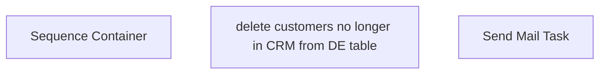

# SSIS Package: CRM_CustomerDimDeleteDE

**Project:** CRM_CustomerDimDeleteDE  
**Folder:** CRM  
**Server:** STL-SSIS-P-01  

## Connection Managers

| Name | Type | Server | Catalog | Connection (sanitized) |
|---|---|---|---|---|
| Archive | FILE |  |  |  |
| CRM | OLEDB | STL-CRMDB-P-01 | crm | Data Source=STL-CRMDB-P-01; Initial Catalog=crm; Provider=SQLNCLI11.1; Integrated Security=SSPI; Auto Translate=False |
| CRM 1 | OLEDB | stl-crmdb-p-01 | crm | Data Source=stl-crmdb-p-01; Initial Catalog=crm; Provider=SQLNCLI11.1; Integrated Security=SSPI; Auto Translate=False |
| CRMCustomerDimDelete.xlsx | Excel (KingswaySoft) |  |  |  |
| DW | OLEDB | papamart | dw | Data Source=papamart; Initial Catalog=dw; Provider=SQLNCLI11.1; Integrated Security=SSPI; Auto Translate=False |
| DW 1 | OLEDB | papamart | dw | Data Source=papamart; Initial Catalog=dw; Provider=SQLNCLI11.1; Integrated Security=SSPI; Auto Translate=False |
| DWStaging | OLEDB | papamart | DWStaging | Data Source=papamart; Initial Catalog=DWStaging; Provider=SQLNCLI11.1; Integrated Security=SSPI; Auto Translate=False |
| IntegrationStaging | OLEDB | STL-SSIS-P-01 | IntegrationStaging | Data Source=STL-SSIS-P-01; Initial Catalog=IntegrationStaging; Provider=SQLNCLI11.1; Integrated Security=SSPI; Auto Translate=False |
| SMTP | SMTP |  |  |  |

## Control Flow Tasks

| Task | Type |
|---|---|
| CRM_CustomerDimDeleteDE | Package |
| Sequence Container | SEQUENCE |
| delete customers no longer in CRM from DE table | ExecuteSQLTask |
| Send Mail Task | SendMailTask |

## Control Flow Outline

```text
- Send Mail Task [SendMailTask]
- Sequence Container [SEQUENCE]
  - delete customers no longer in CRM from DE table [ExecuteSQLTask]
```

## Architecture Diagram



## Variables

| Namespace | Name | Expression-bound |
|---|---|---|
| System | Propagate | No |
| User | AbandonFiles | No |
| User | BCPOut | No |
| User | CRMFileCheck | No |
| User | CatalogResultsStagedFile | No |
| User | Count_CustomerDimStage | No |
| User | DateTimeStamp | Yes |
| User | EmailFactCheck | No |
| User | EndDate | Yes |
| User | EndDateAsDATE | Yes |
| User | ExactTarget_UKcompareValidationArchivePath | Yes |
| User | ExactTarget_UKcompareValidationErrorPath | Yes |
| User | ExactTarget_UKcompareValidationFilePath | Yes |
| User | GetDate | Yes |
| User | GetDateAsDATE | Yes |
| User | LogID | No |
| User | ParentLogID | No |
| User | ResultFileArchivePath | Yes |
| User | ResultFilePath | Yes |
| User | RowCount | No |
| User | StartDate | Yes |
| User | StartDateAsDATE | Yes |
| User | UKcompareValidationStagedFileName | No |
| User | UploadFileName | No |

### Expression-bound variable values

#### User::DateTimeStamp

**Expression:**

```sql
(DT_WSTR,4)DATEPART("yyyy",GetDate()) 
+ (DT_WSTR,4)DATEPART("mm",GetDate()) 
+ (DT_WSTR,4)DATEPART("dd",GetDate()) 
+ (DT_WSTR,4)DATEPART("hh",GetDate()) 
+ (DT_WSTR,4)DATEPART("mi",GetDate()) 
+ (DT_WSTR,4)DATEPART("ss",GetDate()) 
+ (DT_WSTR,4)DATEPART("ms",GetDate())
```

**Evaluated value:**

```sql
202231124334180
```

#### User::EndDate

**Expression:**

```sql
dateadd("dd", @[$Package::DaysToInclude], @[User::StartDate])
```

**Evaluated value:**

```sql
3/1/2022
```

#### User::EndDateAsDATE

**Expression:**

```sql
(DT_WSTR, 4) datepart("year", @[User::EndDate])  + "-" + 
(DT_WSTR, 2) datepart("mm", @[User::EndDate])  + "-" + 
(DT_WSTR, 2) datepart("dd",  @[User::EndDate])
```

**Evaluated value:**

```sql
2022-3-1
```

#### User::ExactTarget_UKcompareValidationArchivePath

**Expression:**

```sql
@[$Package::ExactTargetFilePath] + "\\Download\\UKcompareValidation\\Archive"
```

**Evaluated value:**

```sql
\\STL-SQL-P-04\T$\FileRepository\ExactTarget\Download\UKcompareValidation\Archive
```

#### User::ExactTarget_UKcompareValidationErrorPath

**Expression:**

```sql
@[$Package::ExactTargetFilePath] + "\\Download\\UKcompareValidation\\Error"
```

**Evaluated value:**

```sql
\\STL-SQL-P-04\T$\FileRepository\ExactTarget\Download\UKcompareValidation\Error
```

#### User::ExactTarget_UKcompareValidationFilePath

**Expression:**

```sql
@[$Package::ExactTargetFilePath] + "Download\\UKcompareValidation\\"
```

**Evaluated value:**

```sql
\\STL-SQL-P-04\T$\FileRepository\ExactTargetDownload\UKcompareValidation\
```

#### User::GetDate

**Expression:**

```sql
(DT_DATE)DATEDIFF("Day", (DT_DATE) 0, GETDATE())
```

**Evaluated value:**

```sql
3/1/2022
```

#### User::GetDateAsDATE

**Expression:**

```sql
(DT_WSTR, 4) datepart("year", @[User::GetDate])  + "-" + 
(DT_WSTR, 2) datepart("mm", @[User::GetDate])  + "-" + 
(DT_WSTR, 2) datepart("dd",  @[User::GetDate])
```

**Evaluated value:**

```sql
2022-3-1
```

#### User::ResultFileArchivePath

**Expression:**

```sql
@[$Package::IntegrationServerFilePath] + "\\Archive\\CRMCustomerDimDeletes_" +  @[User::DateTimeStamp] + ".xlsx"
```

**Evaluated value:**

```sql
\\stl-ssis-p-01\IntegrationStaging\CRM\DataExtension\CRMCustomerDimDelete\\Archive\CRMCustomerDimDeletes_202231124334180.xlsx
```

#### User::ResultFilePath

**Expression:**

```sql
@[$Package::IntegrationServerFilePath] + "CRMCustomerDimDelete.xlsx"
```

**Evaluated value:**

```sql
\\stl-ssis-p-01\IntegrationStaging\CRM\DataExtension\CRMCustomerDimDelete\CRMCustomerDimDelete.xlsx
```

#### User::StartDate

**Expression:**

```sql
dateadd("dd", -@[$Package::DaysToGoBack] , @[User::GetDate] )
```

**Evaluated value:**

```sql
2/28/2022
```

#### User::StartDateAsDATE

**Expression:**

```sql
(DT_WSTR, 4) datepart("year", @[User::StartDate])  + "-" + 
(DT_WSTR, 2) datepart("mm", @[User::StartDate])  + "-" + 
(DT_WSTR, 2) datepart("dd",  @[User::StartDate])
```

**Evaluated value:**

```sql
2022-2-28
```

## Execute SQL Tasks

### delete customers no longer in CRM from DE table

**Path:** `Package\Sequence Container\delete customers no longer in CRM from DE table`  
**Connection:** DW 1 (papamart/dw)  

```sql
delete from CRMDE1 where CustomerNumber in 
(
SELECT [customerNumber] FROM [dbo].[tmpCRM_CustomerDimDelete]
)
and cast(UpdateDate as date) >= getdate()-1 and status = 'unsubscribed'


```

## Data Flow: Sources

_None detected._

## Data Flow: Destinations

_None detected._
