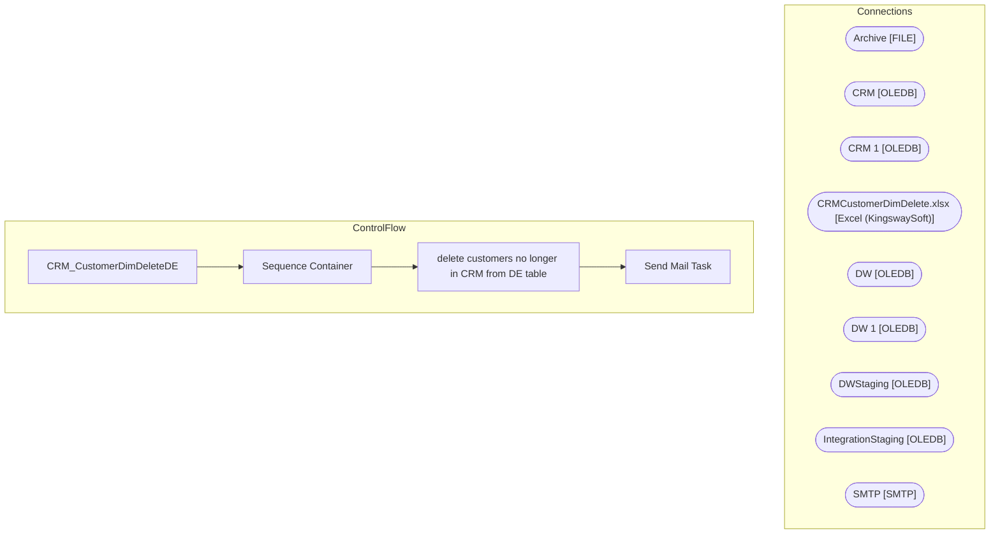

# SSIS Package: CRM_CustomerDimDeleteDE

**Project:** CRM_CustomerDimDeleteDE  
**Folder:** CRM  
**Server:** STL-SSIS-P-01  

## Architecture Diagram

## Connection Managers

| Name | Type |
|---|---|
| Archive | FILE |
| CRM | OLEDB |
| CRM 1 | OLEDB |
| CRMCustomerDimDelete.xlsx | Excel (KingswaySoft) |
| DW | OLEDB |
| DW 1 | OLEDB |
| DWStaging | OLEDB |
| IntegrationStaging | OLEDB |
| SMTP | SMTP |

## Control Flow Tasks

| Task | Type |
|---|---|
| CRM_CustomerDimDeleteDE | Microsoft.Package |
| Sequence Container | STOCK:SEQUENCE |
| delete customers no longer in CRM from DE table | Microsoft.ExecuteSQLTask |
| Send Mail Task | Microsoft.SendMailTask |

## Data Flow: Sources

_None detected._

## Data Flow: Destinations

_None detected._

