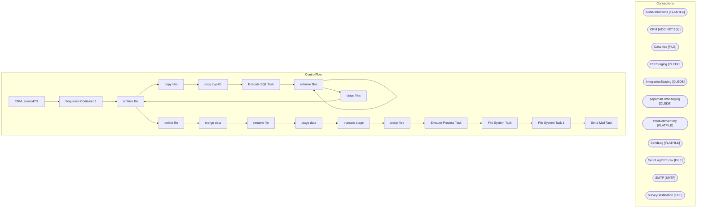

# SSIS Package: CRM_surveyETL

**Project:** CRM_SurveyETL  
**Folder:** CRM  
**Server:** STL-SSIS-P-01  

## Architecture Diagram

## Connection Managers

| Name | Type |
|---|---|
| ASNCorrections | FLATFILE |
| CRM | ADO.NET:SQL |
| Data.xlsx | FILE |
| ESPStaging | OLEDB |
| IntegrationStaging | OLEDB |
| papamart.DWStaging | OLEDB |
| ProductInventory | FLATFILE |
| SendLog | FLATFILE |
| SendLogPIPE.csv | FILE |
| SMTP | SMTP |
| surveyDestination | FILE |

## Control Flow Tasks

| Task | Type |
|---|---|
| CRM_surveyETL | Microsoft.Package |
| Sequence Container 1 | STOCK:SEQUENCE |
| archive file | Microsoft.FileSystemTask |
| copy xlsx | STOCK:FOREACHLOOP |
| copy to p-01 | Microsoft.FileSystemTask |
| Execute SQL Task | Microsoft.ExecuteSQLTask |
| retreive files | STOCK:FOREACHLOOP |
| retreive files | Microsoft.FileSystemTask |
| stage files | STOCK:FOREACHLOOP |
| archive file | Microsoft.FileSystemTask |
| delete file | Microsoft.FileSystemTask |
| merge data | Microsoft.ExecuteSQLTask |
| rename file | Microsoft.FileSystemTask |
| stage data | Microsoft.Pipeline |
| truncate stage | Microsoft.ExecuteSQLTask |
| unzip files | STOCK:FOREACHLOOP |
| Execute Process Task | Microsoft.ExecuteProcess |
| File System Task | Microsoft.FileSystemTask |
| File System Task 1 | Microsoft.FileSystemTask |
| Send Mail Task | Microsoft.SendMailTask |

## Data Flow: Sources

_None detected._

## Data Flow: Destinations

| Component | Destination |
|---|---|
|  | [dbo].[CRM_surveyStage] |

