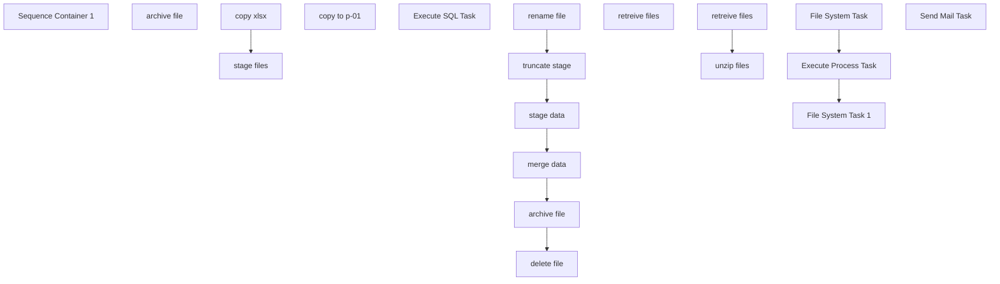

# SSIS Package: CRM_surveyETL

**Project:** CRM_SurveyETL  
**Folder:** CRM  
**Server:** STL-SSIS-P-01  

## Connection Managers

| Name | Type | Server | Catalog | Connection (sanitized) |
|---|---|---|---|---|
| ASNCorrections | FLATFILE |  |  |  |
| CRM | ADO.NET:SQL | stl-crmdb-p-01 |  | Data Source=stl-crmdb-p-01; Integrated Security=SSPI; Connect Timeout=30 |
| Data.xlsx | FILE |  |  |  |
| ESPStaging | OLEDB | stl-sql-p-04 | ESPStaging | Data Source=stl-sql-p-04; Initial Catalog=ESPStaging; Provider=SQLNCLI11.1; Integrated Security=SSPI; Auto Translate=False |
| IntegrationStaging | OLEDB | STL-SSIS-P-01 | IntegrationStaging | Data Source=STL-SSIS-P-01; Initial Catalog=IntegrationStaging; Provider=SQLNCLI11.1; Integrated Security=SSPI; Auto Translate=False |
| ProductInventory | FLATFILE |  |  |  |
| SMTP | SMTP |  |  |  |
| SendLog | FLATFILE |  |  |  |
| SendLogPIPE.csv | FILE |  |  |  |
| papamart.DWStaging | OLEDB | papamart | DWStaging | Data Source=papamart; Initial Catalog=DWStaging; Provider=SQLNCLI11.1; Integrated Security=SSPI; Auto Translate=False |
| surveyDestination | FILE |  |  |  |

## Control Flow Tasks

| Task | Type |
|---|---|
| CRM_surveyETL | Package |
| Sequence Container 1 | SEQUENCE |
| archive file | FileSystemTask |
| copy xlsx | FOREACHLOOP |
| copy to p-01 | FileSystemTask |
| Execute SQL Task | ExecuteSQLTask |
| retreive files | FOREACHLOOP |
| retreive files | FileSystemTask |
| stage files | FOREACHLOOP |
| archive file | FileSystemTask |
| delete file | FileSystemTask |
| merge data | ExecuteSQLTask |
| rename file | FileSystemTask |
| stage data | Pipeline |
| truncate stage | ExecuteSQLTask |
| unzip files | FOREACHLOOP |
| Execute Process Task | ExecuteProcess |
| File System Task | FileSystemTask |
| File System Task 1 | FileSystemTask |
| Send Mail Task | SendMailTask |

## Control Flow Outline

```text
- Send Mail Task [SendMailTask]
- Sequence Container 1 [SEQUENCE]
  - Execute SQL Task [ExecuteSQLTask]
  - archive file [FileSystemTask]
  - copy xlsx [FOREACHLOOP]
    - copy to p-01 [FileSystemTask]
  - retreive files [FOREACHLOOP]
    - retreive files [FileSystemTask]
  - stage files [FOREACHLOOP]
    - archive file [FileSystemTask]
    - delete file [FileSystemTask]
    - merge data [ExecuteSQLTask]
    - rename file [FileSystemTask]
    - stage data [Pipeline]
    - truncate stage [ExecuteSQLTask]
  - unzip files [FOREACHLOOP]
    - Execute Process Task [ExecuteProcess]
    - File System Task [FileSystemTask]
    - File System Task 1 [FileSystemTask]
```

## Architecture Diagram



## Variables

| Namespace | Name | Expression-bound |
|---|---|---|
| System | Propagate | No |
| User | DateTimeStamp | Yes |
| User | EndDate | Yes |
| User | EndDateAsDATE | Yes |
| User | GetDate | Yes |
| User | GetDateAsDATE | Yes |
| User | StartDate | Yes |
| User | StartDateAsDATE | Yes |
| User | surveyFile | No |
| User | surveyFile2 | No |
| User | surveyFile3 | No |
| User | surveyFileArchived | Yes |
| User | surveyFileUnzipped | Yes |

### Expression-bound variable values

#### User::DateTimeStamp

**Expression:**

```sql
(DT_WSTR,4)DATEPART("yyyy",GetDate()) 
+ (DT_WSTR,4)DATEPART("mm",GetDate()) 
+ (DT_WSTR,4)DATEPART("dd",GetDate()) 
+ (DT_WSTR,4)DATEPART("hh",GetDate()) 
+ (DT_WSTR,4)DATEPART("mi",GetDate()) 
+ (DT_WSTR,4)DATEPART("ss",GetDate()) 
+ (DT_WSTR,4)DATEPART("ms",GetDate())
```

**Evaluated value:**

```sql
202391311283697
```

#### User::EndDate

**Expression:**

```sql
dateadd("dd", @[$Package::DaysToInclude], @[User::StartDate])
```

**Evaluated value:**

```sql
9/13/2023
```

#### User::EndDateAsDATE

**Expression:**

```sql
(DT_WSTR, 4) datepart("year", @[User::EndDate])  + "-" +
right("0"+ (DT_WSTR, 2) datepart("mm", @[User::EndDate]),2)  + "-" +
right("0" +(DT_WSTR, 2) datepart("dd",  @[User::EndDate]),2)
```

**Evaluated value:**

```sql
2023-09-13
```

#### User::GetDate

**Expression:**

```sql
(DT_DATE)DATEDIFF("Day", (DT_DATE) 0, GETDATE())
```

**Evaluated value:**

```sql
9/13/2023
```

#### User::GetDateAsDATE

**Expression:**

```sql
(DT_WSTR, 4) datepart("year", @[User::GetDate])  + "-" +
right("0"+ (DT_WSTR, 2) datepart("mm", @[User::GetDate]),2)  + "-" +
right("0" +(DT_WSTR, 2) datepart("dd",  @[User::GetDate]),2)
```

**Evaluated value:**

```sql
2023-09-13
```

#### User::StartDate

**Expression:**

```sql
dateadd("dd", -@[$Package::DaysToGoBack] , @[User::GetDate] )
```

**Evaluated value:**

```sql
9/12/2023
```

#### User::StartDateAsDATE

**Expression:**

```sql
(DT_WSTR, 4) datepart("year", @[User::StartDate])  + "-" +
right("0"+ (DT_WSTR, 2) datepart("mm", @[User::StartDate]),2)  + "-" +
right("0" +(DT_WSTR, 2) datepart("dd",  @[User::StartDate]),2)
```

**Evaluated value:**

```sql
2023-09-12
```

#### User::surveyFileArchived

**Expression:**

```sql
"\\\\stl-ssis-p-01\\IntegrationStaging\\CRM\\survey\\archive\\survey_" +  @[User::DateTimeStamp] + ".xlsx"
```

**Evaluated value:**

```sql
\\stl-ssis-p-01\IntegrationStaging\CRM\survey\archive\survey_202391311283697.xlsx
```

#### User::surveyFileUnzipped

**Expression:**

```sql
"\\\\stl-ssis-p-01\\IntegrationStaging\\CRM\\survey\\eComm.zip"
```

**Evaluated value:**

```sql
\\stl-ssis-p-01\IntegrationStaging\CRM\survey\eComm.zip
```

## Execute SQL Tasks

### Execute SQL Task

**Path:** `Package\Sequence Container 1\Execute SQL Task`  
**Connection:** papamart.DWStaging (papamart/DWStaging)  

```sql
WAITFOR DELAY '00:00:35'
```

### merge data

**Path:** `Package\Sequence Container 1\stage files\merge data`  
**Connection:** papamart.DWStaging (papamart/DWStaging)  

```sql
exec [dbo].[spMergeSurveyResults]
```

### truncate stage

**Path:** `Package\Sequence Container 1\stage files\truncate stage`  
**Connection:** papamart.DWStaging (papamart/DWStaging)  

```sql
truncate table [dbo].[CRM_surveyStage]
```

## Data Flow: Sources

_None detected._

## Data Flow: Destinations

| Component | Target Table | Type | Data Flow Task | Connection | SQL Kind |
|---|---|---|---|---|---|
| OLE DB Destination |  | OLEDBDestination | stage data | papamart.DWStaging |  |
