# SSIS Package: CRM_UKcompareValidation

**Project:** CRM_UKcompareValidation  
**Folder:** CRM  
**Server:** STL-SSIS-P-01  

## Connection Managers

| Name | Type | Server | Catalog | Connection (sanitized) |
|---|---|---|---|---|
| Archive | FILE |  |  |  |
| CRM | OLEDB | STL-CRMDB-P-01 | crm | Data Source=STL-CRMDB-P-01; Initial Catalog=crm; Provider=SQLNCLI11.1; Integrated Security=SSPI; Auto Translate=False |
| DW | OLEDB | papamart | dw | Data Source=papamart; Initial Catalog=dw; Provider=SQLNCLI11.1; Integrated Security=SSPI; Auto Translate=False |
| DW 1 | OLEDB | papamart | dw | Data Source=papamart; Initial Catalog=dw; Provider=SQLNCLI11.1; Integrated Security=SSPI; Auto Translate=False |
| DWStaging | OLEDB | papamart | DWStaging | Data Source=papamart; Initial Catalog=DWStaging; Provider=SQLNCLI11.1; Integrated Security=SSPI; Auto Translate=False |
| ExactTarget | OLEDB | stl-sql-p-04 | ExactTarget | Data Source=stl-sql-p-04; Initial Catalog=ExactTarget; Provider=SQLNCLI11.1; Integrated Security=SSPI; Auto Translate=False |
| Flat File Connection Manager | FLATFILE |  |  |  |
| IntegrationStaging | OLEDB | STL-SSIS-P-01 | IntegrationStaging | Data Source=STL-SSIS-P-01; Initial Catalog=IntegrationStaging; Provider=SQLNCLI11.1; Integrated Security=SSPI; Auto Translate=False |
| SMTP | SMTP |  |  |  |
| UKcompareValidationResults.xlsx | Excel (KingswaySoft) |  |  |  |
| UKcompareValidationTxt | FLATFILE |  |  |  |

## Control Flow Tasks

| Task | Type |
|---|---|
| CRM_UKcompareValidation | Package |
| Download and stage file Sequence | SEQUENCE |
| SEQ - import files | SEQUENCE |
| Foreach Loop Container | FOREACHLOOP |
| Archive File | FileSystemTask |
| ErrorFileMove | FileSystemTask |
| Stage - UKcompareValidation | Pipeline |
| spExactTargetSFTPDownloadUKcompare | ExecuteSQLTask |
| truncate table | ExecuteSQLTask |
| Sequence Container | SEQUENCE |
| Sequence Container 1 | SEQUENCE |
| insert DE1 | ExecuteSQLTask |
| insert DE1 1 | ExecuteSQLTask |
| Sequence Container 2 | SEQUENCE |
| update cDim | ExecuteSQLTask |
| update DE | ExecuteSQLTask |
| Sequence Container 3 | SEQUENCE |
| archive file | FileSystemTask |
| Send Mail Task | SendMailTask |
| Sequence Container 5 | SEQUENCE |
| 30 second pause | FORLOOP |
| prepare data for compare and updates | SEQUENCE |
| CRM results | Pipeline |
| Sequence Container | SEQUENCE |
| move results to dw | Pipeline |
| truncate table | ExecuteSQLTask |
| Sequence Container 4 | SEQUENCE |
| Data Flow Task | Pipeline |
| Data Flow Task (original) | Pipeline |
| Send Mail Task | SendMailTask |

## Control Flow Outline

```text
- Send Mail Task [SendMailTask]
- Download and stage file Sequence [SEQUENCE]
  - SEQ - import files [SEQUENCE]
    - Foreach Loop Container [FOREACHLOOP]
      - Archive File [FileSystemTask]
      - ErrorFileMove [FileSystemTask]
      - Stage - UKcompareValidation [Pipeline]
  - spExactTargetSFTPDownloadUKcompare [ExecuteSQLTask]
  - truncate table [ExecuteSQLTask]
- Sequence Container [SEQUENCE]
- Sequence Container 5 [SEQUENCE]
  - 30 second pause [FORLOOP]
  - Sequence Container [SEQUENCE]
  - Sequence Container 4 [SEQUENCE]
    - Data Flow Task [Pipeline]
    - Data Flow Task (original) [Pipeline]
    - move results to dw [Pipeline]
    - truncate table [ExecuteSQLTask]
  - prepare data for compare and updates [SEQUENCE]
    - CRM results [Pipeline]
  - Sequence Container 1 [SEQUENCE]
    - insert DE1 [ExecuteSQLTask]
    - insert DE1 1 [ExecuteSQLTask]
  - Sequence Container 2 [SEQUENCE]
    - update DE [ExecuteSQLTask]
    - update cDim [ExecuteSQLTask]
  - Sequence Container 3 [SEQUENCE]
    - Send Mail Task [SendMailTask]
    - archive file [FileSystemTask]
```

## Architecture Diagram

```mermaid
flowchart TD
    n_Package_Download_and_stage_file_Sequence["Download and stage file Sequence"]
    n_Package_Download_and_stage_file_Sequence_SEQ___import_files["SEQ - import files"]
    n_Package_Download_and_stage_file_Sequence_SEQ___import_files_Foreach_Loop_Container["Foreach Loop Container"]
    n_Package_Download_and_stage_file_Sequence_SEQ___import_files_Foreach_Loop_Container_Archive_File["Archive File"]
    n_Package_Download_and_stage_file_Sequence_SEQ___import_files_Foreach_Loop_Container_ErrorFileMove["ErrorFileMove"]
    n_Package_Download_and_stage_file_Sequence_SEQ___import_files_Foreach_Loop_Container_Stage___UKcompareValidation["Stage - UKcompareValidation"]
    n_Package_Download_and_stage_file_Sequence_spExactTargetSFTPDownloadUKcompare["spExactTargetSFTPDownloadUKcompare"]
    n_Package_Download_and_stage_file_Sequence_truncate_table["truncate table"]
    n_Package_Sequence_Container["Sequence Container"]
    n_Package_Sequence_Container_Sequence_Container_1["Sequence Container 1"]
    n_Package_Sequence_Container_Sequence_Container_1_insert_DE1["insert DE1"]
    n_Package_Sequence_Container_Sequence_Container_1_insert_DE1_1["insert DE1 1"]
    n_Package_Sequence_Container_Sequence_Container_2["Sequence Container 2"]
    n_Package_Sequence_Container_Sequence_Container_2_update_cDim["update cDim"]
    n_Package_Sequence_Container_Sequence_Container_2_update_DE["update DE"]
    n_Package_Sequence_Container_Sequence_Container_3["Sequence Container 3"]
    n_Package_Sequence_Container_Sequence_Container_3_archive_file["archive file"]
    n_Package_Sequence_Container_Sequence_Container_3_Send_Mail_Task["Send Mail Task"]
    n_Package_Sequence_Container_5["Sequence Container 5"]
    n_Package_Sequence_Container_5_30_second_pause["30 second pause"]
    n_Package_Sequence_Container_5_prepare_data_for_compare_and_updates["prepare data for compare and updates"]
    n_Package_Sequence_Container_5_prepare_data_for_compare_and_updates_CRM_results["CRM results"]
    n_Package_Sequence_Container_5_Sequence_Container["Sequence Container"]
    n_Package_Sequence_Container_5_Sequence_Container_move_results_to_dw["move results to dw"]
    n_Package_Sequence_Container_5_Sequence_Container_truncate_table["truncate table"]
    n_Package_Sequence_Container_5_Sequence_Container_4["Sequence Container 4"]
    n_Package_Sequence_Container_5_Sequence_Container_4_Data_Flow_Task["Data Flow Task"]
    n_Package_Sequence_Container_5_Sequence_Container_4_Data_Flow_Task__original_["Data Flow Task (original)"]
    n_Package_EventHandlers_OnError__Send_Mail_Task["Send Mail Task"]
    n_Package_Download_and_stage_file_Sequence_SEQ___import_files_Foreach_Loop_Container_Stage___UKcompareValidation --> n_Package_Download_and_stage_file_Sequence_SEQ___import_files_Foreach_Loop_Container_Archive_File
    n_Package_Download_and_stage_file_Sequence_SEQ___import_files_Foreach_Loop_Container_Stage___UKcompareValidation --> n_Package_Download_and_stage_file_Sequence_SEQ___import_files_Foreach_Loop_Container_ErrorFileMove
    n_Package_Download_and_stage_file_Sequence_truncate_table --> n_Package_Download_and_stage_file_Sequence_SEQ___import_files
    n_Package_Download_and_stage_file_Sequence_spExactTargetSFTPDownloadUKcompare --> n_Package_Download_and_stage_file_Sequence_truncate_table
    n_Package_Sequence_Container_Sequence_Container_2_update_DE --> n_Package_Sequence_Container_Sequence_Container_2_update_cDim
    n_Package_Sequence_Container_Sequence_Container_3_Send_Mail_Task --> n_Package_Sequence_Container_Sequence_Container_3_archive_file
    n_Package_Sequence_Container_Sequence_Container_2 --> n_Package_Sequence_Container_Sequence_Container_1
    n_Package_Sequence_Container_Sequence_Container_1 --> n_Package_Sequence_Container_Sequence_Container_3
    n_Package_Sequence_Container_5_Sequence_Container_truncate_table --> n_Package_Sequence_Container_5_Sequence_Container_move_results_to_dw
    n_Package_Sequence_Container_5_prepare_data_for_compare_and_updates --> n_Package_Sequence_Container_5_Sequence_Container
    n_Package_Sequence_Container_5_Sequence_Container --> n_Package_Sequence_Container_5_30_second_pause
    n_Package_Sequence_Container_5_30_second_pause --> n_Package_Sequence_Container_5_Sequence_Container_4
    n_Package_Download_and_stage_file_Sequence --> n_Package_Sequence_Container_5
    n_Package_Sequence_Container_5 --> n_Package_Sequence_Container
```



## Variables

| Namespace | Name | Expression-bound |
|---|---|---|
| System | Propagate | No |
| User | AbandonFiles | No |
| User | BCPOut | No |
| User | CRMFileCheck | No |
| User | CatalogResultsStagedFile | No |
| User | Count_CustomerDimStage | No |
| User | DateTimeStamp | Yes |
| User | EmailFactCheck | No |
| User | EndDate | Yes |
| User | EndDateAsDATE | Yes |
| User | ExactTarget_UKcompareValidationArchivePath | Yes |
| User | ExactTarget_UKcompareValidationErrorPath | Yes |
| User | ExactTarget_UKcompareValidationFilePath | Yes |
| User | GetDate | Yes |
| User | GetDateAsDATE | Yes |
| User | LogID | No |
| User | ParentLogID | No |
| User | ResultFileArchivePath | Yes |
| User | ResultFilePath | Yes |
| User | RowCount | No |
| User | StartDate | Yes |
| User | StartDateAsDATE | Yes |
| User | UKcompareValidationStagedFileName | No |
| User | UploadFileName | No |

### Expression-bound variable values

#### User::DateTimeStamp

**Expression:**

```sql
(DT_WSTR,4)DATEPART("yyyy",GetDate()) 
+ (DT_WSTR,4)DATEPART("mm",GetDate()) 
+ (DT_WSTR,4)DATEPART("dd",GetDate()) 
+ (DT_WSTR,4)DATEPART("hh",GetDate()) 
+ (DT_WSTR,4)DATEPART("mi",GetDate()) 
+ (DT_WSTR,4)DATEPART("ss",GetDate()) 
+ (DT_WSTR,4)DATEPART("ms",GetDate())
```

**Evaluated value:**

```sql
202313010588860
```

#### User::EndDate

**Expression:**

```sql
dateadd("dd", @[$Package::DaysToInclude], @[User::StartDate])
```

**Evaluated value:**

```sql
1/30/2023
```

#### User::EndDateAsDATE

**Expression:**

```sql
(DT_WSTR, 4) datepart("year", @[User::EndDate])  + "-" + 
(DT_WSTR, 2) datepart("mm", @[User::EndDate])  + "-" + 
(DT_WSTR, 2) datepart("dd",  @[User::EndDate])
```

**Evaluated value:**

```sql
2023-1-30
```

#### User::ExactTarget_UKcompareValidationArchivePath

**Expression:**

```sql
@[$Package::ExactTargetFilePath] + "\\Download\\UKcompareValidation\\Archive"
```

**Evaluated value:**

```sql
\\STL-SQL-P-04\T$\FileRepository\ExactTarget\Download\UKcompareValidation\Archive
```

#### User::ExactTarget_UKcompareValidationErrorPath

**Expression:**

```sql
@[$Package::ExactTargetFilePath] + "\\Download\\UKcompareValidation\\Error"
```

**Evaluated value:**

```sql
\\STL-SQL-P-04\T$\FileRepository\ExactTarget\Download\UKcompareValidation\Error
```

#### User::ExactTarget_UKcompareValidationFilePath

**Expression:**

```sql
@[$Package::ExactTargetFilePath] + "Download\\UKcompareValidation\\"
```

**Evaluated value:**

```sql
\\STL-SQL-P-04\T$\FileRepository\ExactTargetDownload\UKcompareValidation\
```

#### User::GetDate

**Expression:**

```sql
(DT_DATE)DATEDIFF("Day", (DT_DATE) 0, GETDATE())
```

**Evaluated value:**

```sql
1/30/2023
```

#### User::GetDateAsDATE

**Expression:**

```sql
(DT_WSTR, 4) datepart("year", @[User::GetDate])  + "-" + 
(DT_WSTR, 2) datepart("mm", @[User::GetDate])  + "-" + 
(DT_WSTR, 2) datepart("dd",  @[User::GetDate])
```

**Evaluated value:**

```sql
2023-1-30
```

#### User::ResultFileArchivePath

**Expression:**

```sql
@[$Package::IntegrationServerFilePath] + "\\Archive\\UKcompareValidationResults_" +  @[User::DateTimeStamp] + ".xlsx"
```

**Evaluated value:**

```sql
\\stl-ssis-p-01\IntegrationStaging\CRM\DataExtension\UKcompareValidationResults\\Archive\UKcompareValidationResults_202313010588860.xlsx
```

#### User::ResultFilePath

**Expression:**

```sql
@[$Package::IntegrationServerFilePath] + "UKcompareValidationResults.xlsx"
```

**Evaluated value:**

```sql
\\stl-ssis-p-01\IntegrationStaging\CRM\DataExtension\UKcompareValidationResults\UKcompareValidationResults.xlsx
```

#### User::StartDate

**Expression:**

```sql
dateadd("dd", -@[$Package::DaysToGoBack] , @[User::GetDate] )
```

**Evaluated value:**

```sql
1/29/2023
```

#### User::StartDateAsDATE

**Expression:**

```sql
(DT_WSTR, 4) datepart("year", @[User::StartDate])  + "-" + 
(DT_WSTR, 2) datepart("mm", @[User::StartDate])  + "-" + 
(DT_WSTR, 2) datepart("dd",  @[User::StartDate])
```

**Evaluated value:**

```sql
2023-1-29
```

## Execute SQL Tasks

### spExactTargetSFTPDownloadUKcompare

**Path:** `Package\Download and stage file Sequence\spExactTargetSFTPDownloadUKcompare`  
**Connection:** ExactTarget (stl-sql-p-04/ExactTarget)  

```sql
exec spExactTargetSFTPDownloadUKcompare
```

### truncate table

**Path:** `Package\Download and stage file Sequence\truncate table`  
**Connection:** CRM (STL-CRMDB-P-01/crm)  

```sql
truncate table [dbo].[tmpCRM_UKcompareValidation]
truncate table [dbo].[tmpCRM_UKcompareValidationResults]
```

### truncate table

**Path:** `Package\Sequence Container 5\Sequence Container\truncate table`  
**Connection:** DWStaging (papamart/DWStaging)  

```sql
truncate table [dbo].[tmpCRM_UKcompareValidationResults]
```

### insert DE1

**Path:** `Package\Sequence Container\Sequence Container 1\insert DE1`  
**Connection:** DW (papamart/dw)  

```sql
INSERT INTO [dbo].[CRMde1] ([customerNumber],[SubscriberKey],[status],[dateJoined],[LastSentDate],[LastOpenDate],[LastClickDate],[bonusClubMember],[bonusClubMembershipType],[bonusClubPointsBalance],[hasOnlineAccount],[bonusClubSignUpSource]
,[Country],[FrequencyCount3m],[FrequencyCount6m],[FrequencyCount12m],[FrequencyCount18m],[FrequencyCount24m],[FrequencyCountTTL],[RecencyCount3m],[RecencyCount6m],[RecencyCount12m],[RecencyCount18m],[RecencyCount24m],[RecencyCountTTL]
,[MonetarySum3m],[MonetarySum6m],[MonetarySum12m],[MonetarySum18m],[MonetarySum24m],[MonetarySumTTL],[FrequencyCount1m],[RecencyCount1m],[MonetarySum1m],[address_1],[address_2],[address_3],[address_4],[post_code],[mobile],[locale],[text_opt_in]
,[InsertDate],[UpdateDate],[EmailAddress],[LastTransactionDate],[LastTransactionStore],[PreferredStory],[Emailable],[FrequencyCount36m],[RecencyCount36m],[MonetarySum36m],[LifetimePoints],[FirstTransactionDate],[FirstStoreConcept],[FirstName],[LastName],[UpdateDateRecency])
SELECT u.customer_no as [customerNumber],u.email_address as [SubscriberKey],'unsubscribed' as [status],null as [dateJoined],null as [LastSentDate],null as [LastOpenDate],null as [LastClickDate],0 as [bonusClubMember],null as [bonusClubMembershipType]
,null as [bonusClubPointsBalance],null as [hasOnlineAccount],null as [bonusClubSignUpSource],'GBR'[Country],0 as [FrequencyCount3m],0 as [FrequencyCount6m],0 as [FrequencyCount12m],0 as [FrequencyCount18m] ,0 as [FrequencyCount24m],0 as [FrequencyCountTTL]
,0 as [RecencyCount3m],0 as [RecencyCount6m],0 as [RecencyCount12m],0 as [RecencyCount18m],0 as [RecencyCount24m],0 as [RecencyCountTTL],0 as [MonetarySum3m],0 as [MonetarySum6m],0 as [MonetarySum12m],0 as [MonetarySum18m],0 as [MonetarySum24m]
,0 as [MonetarySumTTL],0 as [FrequencyCount1m],0 as [RecencyCount1m],0 as [MonetarySum1m],null as [address_1],null as [address_2],null as [address_3],null as [address_4],null as [post_code],null as [mobile],null as [locale],null as [text_opt_in]
,getdate() as [InsertDate],getdate() as [UpdateDate],u.email_address as [EmailAddress],null as [LastTransactionDate],null as [LastTransactionStore],null as [PreferredStory],0 as [Emailable],0 as [FrequencyCount36m],0 as [RecencyCount36m],0 as [MonetarySum36m]
,null as [LifetimePoints],null as [FirstTransactionDate],null as [FirstStoreConcept],null as [FirstName],null as [LastName],null as [UpdateDateRecency]
  from [papamart].[DWStaging].[dbo].[tmpCRM_UKcompareValidationResults] u 
where  (u.email_opt_in_flag = 2 OR (u.attribute_grouping_code <> 'GDPR' or u.attribute_code <> 'OPTIN' or u.attribute_value<>1))
and u.inDE = 0  
```

### insert DE1 1

**Path:** `Package\Sequence Container\Sequence Container 1\insert DE1 1`  
**Connection:** DW (papamart/dw)  

```sql
INSERT INTO [dbo].[CRMde1] ([customerNumber],[SubscriberKey],[status],[dateJoined],[LastSentDate],[LastOpenDate],[LastClickDate],[bonusClubMember],[bonusClubMembershipType],[bonusClubPointsBalance],[hasOnlineAccount],[bonusClubSignUpSource]
,[Country],[FrequencyCount3m],[FrequencyCount6m],[FrequencyCount12m],[FrequencyCount18m],[FrequencyCount24m],[FrequencyCountTTL],[RecencyCount3m],[RecencyCount6m],[RecencyCount12m],[RecencyCount18m],[RecencyCount24m],[RecencyCountTTL]
,[MonetarySum3m],[MonetarySum6m],[MonetarySum12m],[MonetarySum18m],[MonetarySum24m],[MonetarySumTTL],[FrequencyCount1m],[RecencyCount1m],[MonetarySum1m],[address_1],[address_2],[address_3],[address_4],[post_code],[mobile],[locale],[text_opt_in]
,[InsertDate],[UpdateDate],[EmailAddress],[LastTransactionDate],[LastTransactionStore],[PreferredStory],[Emailable],[FrequencyCount36m],[RecencyCount36m],[MonetarySum36m],[LifetimePoints],[FirstTransactionDate],[FirstStoreConcept],[FirstName],[LastName],[UpdateDateRecency])
SELECT u.customer_no as [customerNumber],u.email_address as [SubscriberKey],'unsubscribed' as [status],null as [dateJoined],null as [LastSentDate],null as [LastOpenDate],null as [LastClickDate],null as [bonusClubMember],null as [bonusClubMembershipType]
,null as [bonusClubPointsBalance],null as [hasOnlineAccount],null as [bonusClubSignUpSource],'GBR'[Country],0 as [FrequencyCount3m],0 as [FrequencyCount6m],0 as [FrequencyCount12m],0 as [FrequencyCount18m] ,0 as [FrequencyCount24m],0 as [FrequencyCountTTL]
,0 as [RecencyCount3m],0 as [RecencyCount6m],0 as [RecencyCount12m],0 as [RecencyCount18m],0 as [RecencyCount24m],0 as [RecencyCountTTL],0 as [MonetarySum3m],0 as [MonetarySum6m],0 as [MonetarySum12m],0 as [MonetarySum18m],0 as [MonetarySum24m]
,0 as [MonetarySumTTL],0 as [FrequencyCount1m],0 as [RecencyCount1m],0 as [MonetarySum1m],null as [address_1],null as [address_2],null as [address_3],null as [address_4],null as [post_code],null as [mobile],null as [locale],null as [text_opt_in]
,getdate() as [InsertDate],getdate() as [UpdateDate],u.email_address as [EmailAddress],null as [LastTransactionDate],null as [LastTransactionStore],null as [PreferredStory],0 as [Emailable],0 as [FrequencyCount36m],0 as [RecencyCount36m],0 as [MonetarySum36m]
,null as [LifetimePoints],null as [FirstTransactionDate],null as [FirstStoreConcept],null as [FirstName],null as [LastName],null as [UpdateDateRecency]
  from [papamart].[DWStaging].[dbo].[tmpCRM_UKcompareValidationResults] u 
where  u.email_opt_in_flag is null and u.attribute_grouping_code is null and u.attribute_code is null and u.attribute_value is null 
and u.inDE = 0
```

### update DE

**Path:** `Package\Sequence Container\Sequence Container 2\update DE`  
**Connection:** DW (papamart/dw)  

```sql
update c  set c.status = 'unsubscribed', c.UpdateDate = getdate()  
from [papamart].[DW].[dbo].[CRMDE1] c
join [papamart].[DWStaging].[dbo].[tmpCRM_UKcompareValidationResults] u on c.customerNumber = u.customer_no
where (u.email_opt_in_flag = 2 OR (u.attribute_grouping_code <> 'GDPR' or u.attribute_code <> 'OPTIN' or u.attribute_value<>1))
and u.inDE = 1 
```

### update cDim

**Path:** `Package\Sequence Container\Sequence Container 2\update cDim`  
**Connection:** DW (papamart/dw)  

```sql
update cDim set cDim.ClubStatus = 'unsubscribed', cDim.UpdatedDate = getdate()
from [papamart].[DW].[dbo].[CRMcustomerDim] cDim
join [papamart].[DWStaging].[dbo].[tmpCRM_UKcompareValidationResults] u on cDim.customerNumber = u.customer_no
where (u.email_opt_in_flag = 2 OR (u.attribute_grouping_code <> 'GDPR' or u.attribute_code <> 'OPTIN' or u.attribute_value<>1))
and u.inDE = 1 and cDim.ClubStatus <> 'unsubscribed' 

```

## Data Flow: Sources

| Component | Source Object | Type | Data Flow Task | Connection | SQL Kind |
|---|---|---|---|---|---|
| Flat File Source |  | FlatFileSource | Stage - UKcompareValidation | UKcompareValidationTxt |  |
| tmpCRM_UKcompareValidation |  | OLEDBSource | CRM results | CRM | SqlCommand |
| CRM tmpCRM_UKcompareValidationResults |  | OLEDBSource | move results to dw | CRM |  |
| OLE DB Source |  | OLEDBSource | Data Flow Task | DW | SqlCommand |
| OLE DB Source |  | OLEDBSource | Data Flow Task (original) | DW | SqlCommand |

#### tmpCRM_UKcompareValidation — SqlCommand

```sql
select 
distinct(case when c.customer_no is null then u.customerNumber else c.customer_no end ) as customer_no,
e.email_address,
e.email_indicator,
e.email_opt_in_flag,
ca2.attribute_grouping_code,
ca2.attribute_code,
ca2.attribute_value
from [dbo].[tmpCRM_UKcompareValidation] u
left join customer c on u.customerNumber = c.customer_no
left join  tmpEml e on c.customer_id = e.customer_id  
left join tmpCustomerAttr ca2 with (nolock) on c.customer_id = ca2.customer_id
where isnumeric(u.customerNumber) = 1
```

#### OLE DB Source — SqlCommand

```sql
select u.customer_no
from [papamart].[DW].[dbo].[CRMDE1] c
join [papamart].[DWStaging].[dbo].[tmpCRM_UKcompareValidationResults] u on c.customerNumber = u.customer_no
where (u.email_opt_in_flag = 2 OR (u.attribute_grouping_code <> 'GDPR' or u.attribute_code <> 'OPTIN' or u.attribute_value<>1))
and u.inDE = 1 and c.status <> 'unsubscribed'
union
select u.customer_no from [papamart].[DWStaging].[dbo].[tmpCRM_UKcompareValidationResults] u
where  (u.email_opt_in_flag = 2 OR (u.attribute_grouping_code <> 'GDPR' or u.attribute_code <> 'OPTIN' or u.attribute_value<>1))
and u.inDE = 0
```

#### OLE DB Source — SqlCommand

```sql
select u.customer_no
from [papamart].[DW].[dbo].[CRMDE1] c
join [papamart].[DWStaging].[dbo].[tmpCRM_UKcompareValidationResults] u on c.customerNumber = u.customer_no
where (u.email_opt_in_flag = 2 OR (u.attribute_grouping_code <> 'GDPR' or u.attribute_code <> 'OPTIN' or u.attribute_value<>1))
and u.inDE = 1 and c.status <> 'unsubscribed'
union
select u.customer_no from [papamart].[DWStaging].[dbo].[tmpCRM_UKcompareValidationResults] u
where  (u.email_opt_in_flag = 2 OR (u.attribute_grouping_code <> 'GDPR' or u.attribute_code <> 'OPTIN' or u.attribute_value<>1))
and u.inDE = 0
union
select u.customer_no from [papamart].[DWStaging].[dbo].[tmpCRM_UKcompareValidationResults] u
where  u.email_opt_in_flag is null and u.attribute_grouping_code is null and u.attribute_code is null and u.attribute_value is null 
and u.inDE = 0
```

## Data Flow: Destinations

| Component | Target Table | Type | Data Flow Task | Connection | SQL Kind |
|---|---|---|---|---|---|
| OLE DB Destination |  | OLEDBDestination | Stage - UKcompareValidation | CRM |  |
| OLE DB Destination |  | OLEDBDestination | CRM results | CRM |  |
| DWStaging tmpCRM_UKcompareValidationResults |  | OLEDBDestination | move results to dw | DWStaging |  |
