# SSIS Package: CRM_UKcompareValidation

**Project:** CRM_UKcompareValidation  
**Folder:** CRM  
**Server:** STL-SSIS-P-01  

## Architecture Diagram

```mermaid
flowchart TD
    subgraph Connections
        Archive_conn(["Archive [FILE]"])
        CRM_conn(["CRM [OLEDB]"])
        DW_conn(["DW [OLEDB]"])
        DW_1_conn(["DW 1 [OLEDB]"])
        DWStaging_conn(["DWStaging [OLEDB]"])
        ExactTarget_conn(["ExactTarget [OLEDB]"])
        Flat_File_Connection_Manager_conn(["Flat File Connection Manager [FLATFILE]"])
        IntegrationStaging_conn(["IntegrationStaging [OLEDB]"])
        SMTP_conn(["SMTP [SMTP]"])
        UKcompareValidationResults_xlsx_conn(["UKcompareValidationResults.xlsx [Excel (KingswaySoft)]"])
        UKcompareValidationTxt_conn(["UKcompareValidationTxt [FLATFILE]"])
    end
    subgraph ControlFlow
        CRM_UKcompareValidation_task["CRM_UKcompareValidation"]
        Download_and_stage_file_Sequence_task["Download and stage file Sequence"]
        CRM_UKcompareValidation_task --> Download_and_stage_file_Sequence_task
        SEQ___import_files_task["SEQ - import files"]
        Download_and_stage_file_Sequence_task --> SEQ___import_files_task
        Foreach_Loop_Container_task["Foreach Loop Container"]
        SEQ___import_files_task --> Foreach_Loop_Container_task
        Archive_File_task["Archive File"]
        Foreach_Loop_Container_task --> Archive_File_task
        ErrorFileMove_task["ErrorFileMove"]
        Archive_File_task --> ErrorFileMove_task
        Stage___UKcompareValidation_task["Stage - UKcompareValidation"]
        ErrorFileMove_task --> Stage___UKcompareValidation_task
        spExactTargetSFTPDownloadUKcompare_task["spExactTargetSFTPDownloadUKcompare"]
        Stage___UKcompareValidation_task --> spExactTargetSFTPDownloadUKcompare_task
        truncate_table_task["truncate table"]
        spExactTargetSFTPDownloadUKcompare_task --> truncate_table_task
        Sequence_Container_task["Sequence Container"]
        truncate_table_task --> Sequence_Container_task
        Sequence_Container_1_task["Sequence Container 1"]
        Sequence_Container_task --> Sequence_Container_1_task
        insert_DE1_task["insert DE1"]
        Sequence_Container_1_task --> insert_DE1_task
        insert_DE1_1_task["insert DE1 1"]
        insert_DE1_task --> insert_DE1_1_task
        Sequence_Container_2_task["Sequence Container 2"]
        insert_DE1_1_task --> Sequence_Container_2_task
        update_cDim_task["update cDim"]
        Sequence_Container_2_task --> update_cDim_task
        update_DE_task["update DE"]
        update_cDim_task --> update_DE_task
        Sequence_Container_3_task["Sequence Container 3"]
        update_DE_task --> Sequence_Container_3_task
        archive_file_task["archive file"]
        Sequence_Container_3_task --> archive_file_task
        Send_Mail_Task_task["Send Mail Task"]
        archive_file_task --> Send_Mail_Task_task
        Sequence_Container_5_task["Sequence Container 5"]
        Send_Mail_Task_task --> Sequence_Container_5_task
        30_second_pause_task["30 second pause"]
        Sequence_Container_5_task --> 30_second_pause_task
        prepare_data_for_compare_and_updates_task["prepare data for compare and updates"]
        30_second_pause_task --> prepare_data_for_compare_and_updates_task
        CRM_results_task["CRM results"]
        prepare_data_for_compare_and_updates_task --> CRM_results_task
        Sequence_Container_task["Sequence Container"]
        CRM_results_task --> Sequence_Container_task
        move_results_to_dw_task["move results to dw"]
        Sequence_Container_task --> move_results_to_dw_task
        truncate_table_task["truncate table"]
        move_results_to_dw_task --> truncate_table_task
        Sequence_Container_4_task["Sequence Container 4"]
        truncate_table_task --> Sequence_Container_4_task
        Data_Flow_Task_task["Data Flow Task"]
        Sequence_Container_4_task --> Data_Flow_Task_task
        Data_Flow_Task__original__task["Data Flow Task (original)"]
        Data_Flow_Task_task --> Data_Flow_Task__original__task
        Send_Mail_Task_task["Send Mail Task"]
        Data_Flow_Task__original__task --> Send_Mail_Task_task
    end
```

## Connection Managers

| Name | Type |
|---|---|
| Archive | FILE |
| CRM | OLEDB |
| DW | OLEDB |
| DW 1 | OLEDB |
| DWStaging | OLEDB |
| ExactTarget | OLEDB |
| Flat File Connection Manager | FLATFILE |
| IntegrationStaging | OLEDB |
| SMTP | SMTP |
| UKcompareValidationResults.xlsx | Excel (KingswaySoft) |
| UKcompareValidationTxt | FLATFILE |

## Control Flow Tasks

| Task | Type |
|---|---|
| CRM_UKcompareValidation | Microsoft.Package |
| Download and stage file Sequence | STOCK:SEQUENCE |
| SEQ - import files | STOCK:SEQUENCE |
| Foreach Loop Container | STOCK:FOREACHLOOP |
| Archive File | Microsoft.FileSystemTask |
| ErrorFileMove | Microsoft.FileSystemTask |
| Stage - UKcompareValidation | Microsoft.Pipeline |
| spExactTargetSFTPDownloadUKcompare | Microsoft.ExecuteSQLTask |
| truncate table | Microsoft.ExecuteSQLTask |
| Sequence Container | STOCK:SEQUENCE |
| Sequence Container 1 | STOCK:SEQUENCE |
| insert DE1 | Microsoft.ExecuteSQLTask |
| insert DE1 1 | Microsoft.ExecuteSQLTask |
| Sequence Container 2 | STOCK:SEQUENCE |
| update cDim | Microsoft.ExecuteSQLTask |
| update DE | Microsoft.ExecuteSQLTask |
| Sequence Container 3 | STOCK:SEQUENCE |
| archive file | Microsoft.FileSystemTask |
| Send Mail Task | Microsoft.SendMailTask |
| Sequence Container 5 | STOCK:SEQUENCE |
| 30 second pause | STOCK:FORLOOP |
| prepare data for compare and updates | STOCK:SEQUENCE |
| CRM results | Microsoft.Pipeline |
| Sequence Container | STOCK:SEQUENCE |
| move results to dw | Microsoft.Pipeline |
| truncate table | Microsoft.ExecuteSQLTask |
| Sequence Container 4 | STOCK:SEQUENCE |
| Data Flow Task | Microsoft.Pipeline |
| Data Flow Task (original) | Microsoft.Pipeline |
| Send Mail Task | Microsoft.SendMailTask |

## Data Flow: Sources

| Component | SQL Preview |
|---|---|
|  | select  distinct(case when c.customer_no is null then u.customerNumber else c.customer_no end ) as customer_no, e.email_address, e.email_indicator, e.email_opt_in_flag, ca2.attribute_grouping_code, ca2.attribute_code, ca2.attribute_value from [dbo].[tmpCRM_UKcompareValidation] u left join customer c on u.customerNumber = c.customer_no left join  tmpEml e on c.customer_id = e.customer_id   left joi |
|  | select customerNumber from CRMDE1 |
|  | select u.customer_no from [papamart].[DW].[dbo].[CRMDE1] c join [papamart].[DWStaging].[dbo].[tmpCRM_UKcompareValidationResults] u on c.customerNumber = u.customer_no where (u.email_opt_in_flag = 2 OR (u.attribute_grouping_code <> 'GDPR' or u.attribute_code <> 'OPTIN' or u.attribute_value<>1)) and u.inDE = 1 and c.status <> 'unsubscribed' union select u.customer_no from [papamart].[DWStaging].[dbo |
|  | select u.customer_no from [papamart].[DW].[dbo].[CRMDE1] c join [papamart].[DWStaging].[dbo].[tmpCRM_UKcompareValidationResults] u on c.customerNumber = u.customer_no where (u.email_opt_in_flag = 2 OR (u.attribute_grouping_code <> 'GDPR' or u.attribute_code <> 'OPTIN' or u.attribute_value<>1)) and u.inDE = 1 and c.status <> 'unsubscribed' union select u.customer_no from [papamart].[DWStaging].[dbo |

## Data Flow: Destinations

| Component | Destination |
|---|---|
|  | [dbo].[tmpCRM_UKcompareValidation] |
|  | [dbo].[tmpCRM_UKcompareValidationResults] |
|  | [dbo].[tmpCRM_UKcompareValidation] |
|  | [dbo].[tmpCRM_UKcompareValidationResults] |
|  | [dbo].[tmpCRM_UKcompareValidationResults] |

