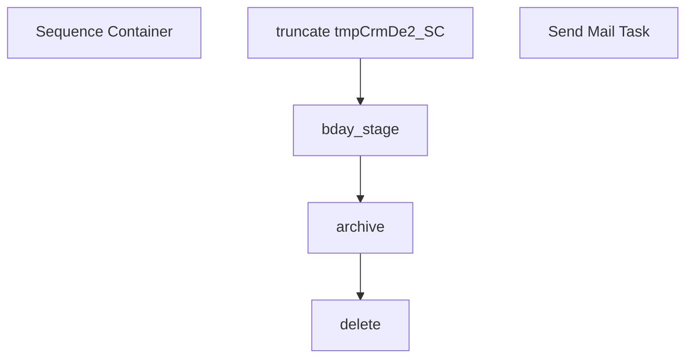

# SSIS Package: CRM_birthdaySCexport

**Project:** CRM_birthdaySCexport  
**Folder:** CRM  
**Server:** STL-SSIS-P-01  

## Connection Managers

| Name | Type | Server | Catalog | Connection (sanitized) |
|---|---|---|---|---|
| 12M | CACHE |  |  |  |
| 18M | CACHE |  |  |  |
| 1M | CACHE |  |  |  |
| 24M | CACHE |  |  |  |
| 3M | CACHE |  |  |  |
| 6M | CACHE |  |  |  |
| CRM | OLEDB | stl-crmdb-p-01 | crm | Data Source=stl-crmdb-p-01; Initial Catalog=crm; Provider=SQLNCLI11.1; Integrated Security=SSPI; Auto Translate=False |
| DW | OLEDB | papamart | dw | Data Source=papamart; Initial Catalog=dw; Provider=SQLNCLI11.1; Integrated Security=SSPI; Auto Translate=False |
| DWStaging | OLEDB | papamart | DWStaging | Data Source=papamart; Initial Catalog=DWStaging; Provider=SQLNCLI11.1; Integrated Security=SSPI; Auto Translate=False |
| Flat File Connection Manager | FLATFILE |  |  |  |
| SMTP | SMTP |  |  |  |
| STL-SSIS-P-01.IntegrationStaging | OLEDB | STL-SSIS-P-01 | IntegrationStaging | Data Source=STL-SSIS-P-01; Initial Catalog=IntegrationStaging; Provider=SQLNCLI11.1; Integrated Security=SSPI; Auto Translate=False |
| archive | FILE |  |  |  |
| birthday_export.csv | FILE |  |  |  |
| cDim | CACHE |  |  |  |
| delta | EXCEL | \\stl-ssis-p-01\IntegrationStaging\CRM\test\delta.xlsx |  | Provider=Microsoft.ACE.OLEDB.12.0; Data Source=\\stl-ssis-p-01\IntegrationStaging\CRM\test\delta.xlsx; Extended Properties="EXCEL 12.0 XML; HDR=YES" |

## Control Flow Tasks

| Task | Type |
|---|---|
| CRM_birthdaySCexport | Package |
| Sequence Container | SEQUENCE |
| archive | FileSystemTask |
| bday_stage | Pipeline |
| delete | FileSystemTask |
| truncate tmpCrmDe2_SC | ExecuteSQLTask |
| Send Mail Task | SendMailTask |

## Control Flow Outline

```text
- Send Mail Task [SendMailTask]
- Sequence Container [SEQUENCE]
  - archive [FileSystemTask]
  - bday_stage [Pipeline]
  - delete [FileSystemTask]
  - truncate tmpCrmDe2_SC [ExecuteSQLTask]
```

## Architecture Diagram



## Variables

| Namespace | Name | Expression-bound |
|---|---|---|
| System | Propagate | No |
| User | DateTimeStamp | Yes |
| User | allRecords | No |
| User | varDEarchivePath | Yes |
| User | varFileToArchive | No |
| User | varStageFolder | No |

### Expression-bound variable values

#### User::DateTimeStamp

**Expression:**

```sql
(DT_WSTR,4)DATEPART("yyyy",GetDate()) 
+ (DT_WSTR,4)DATEPART("mm",GetDate()) 
+ (DT_WSTR,4)DATEPART("dd",GetDate()) 
+ (DT_WSTR,4)DATEPART("hh",GetDate()) 
+ (DT_WSTR,4)DATEPART("mi",GetDate()) 
+ (DT_WSTR,4)DATEPART("ss",GetDate()) 
+ (DT_WSTR,4)DATEPART("ms",GetDate())
```

**Evaluated value:**

```sql
202282695734653
```

#### User::varDEarchivePath

**Expression:**

```sql
"\\\\stl-ssis-p-01\\IntegrationStaging\\CRM\\DataExtension\\archive\\birthday_export" +  @[User::DateTimeStamp] + ".csv"
```

**Evaluated value:**

```sql
\\stl-ssis-p-01\IntegrationStaging\CRM\DataExtension\archive\birthday_export202282695734653.csv
```

## Execute SQL Tasks

### truncate tmpCrmDe2_SC

**Path:** `Package\Sequence Container\truncate tmpCrmDe2_SC`  
**Connection:** DWStaging (papamart/DWStaging)  

```sql
truncate table [dbo].[tmpCrmDe2_SC]
```

## Data Flow: Sources

| Component | Source Object | Type | Data Flow Task | Connection | SQL Kind |
|---|---|---|---|---|---|
| Flat File Source |  | FlatFileSource | bday_stage | Flat File Connection Manager |  |

## Data Flow: Destinations

| Component | Target Table | Type | Data Flow Task | Connection | SQL Kind |
|---|---|---|---|---|---|
| OLE DB Destination |  | OLEDBDestination | bday_stage | DWStaging |  |
