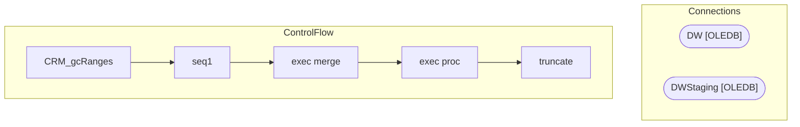

# SSIS Package: CRM_gcRanges

**Project:** CRM_gcRanges  
**Folder:** CRM  
**Server:** STL-SSIS-P-01  

## Architecture Diagram

## Connection Managers

| Name | Type |
|---|---|
| DW | OLEDB |
| DWStaging | OLEDB |

## Control Flow Tasks

| Task | Type |
|---|---|
| CRM_gcRanges | Microsoft.Package |
| seq1 | STOCK:SEQUENCE |
| exec merge | Microsoft.ExecuteSQLTask |
| exec proc | Microsoft.ExecuteSQLTask |
| truncate | Microsoft.ExecuteSQLTask |

## Data Flow: Sources

_None detected._

## Data Flow: Destinations

_None detected._

