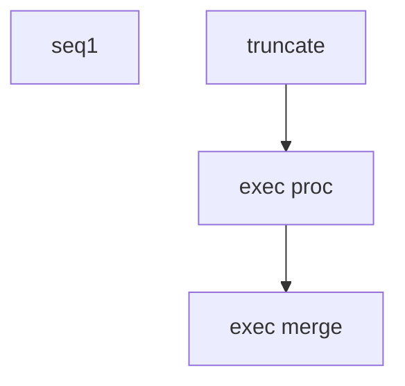

# SSIS Package: CRM_gcRanges

**Project:** CRM_gcRanges  
**Folder:** CRM  
**Server:** STL-SSIS-P-01  

## Connection Managers

| Name | Type | Server | Catalog | Connection (sanitized) |
|---|---|---|---|---|
| DW | OLEDB | papamart | dw | Data Source=papamart; Initial Catalog=dw; Provider=SQLNCLI11.1; Integrated Security=SSPI; Auto Translate=False |
| DWStaging | OLEDB | papamart | DWStaging | Data Source=papamart; Initial Catalog=DWStaging; Provider=SQLNCLI11.1; Integrated Security=SSPI; Auto Translate=False |

## Control Flow Tasks

| Task | Type |
|---|---|
| CRM_gcRanges | Package |
| seq1 | SEQUENCE |
| exec merge | ExecuteSQLTask |
| exec proc | ExecuteSQLTask |
| truncate | ExecuteSQLTask |

## Control Flow Outline

```text
- seq1 [SEQUENCE]
  - exec merge [ExecuteSQLTask]
  - exec proc [ExecuteSQLTask]
  - truncate [ExecuteSQLTask]
```

## Architecture Diagram



## Variables

| Namespace | Name | Expression-bound |
|---|---|---|
| User | DateTimeStamp | Yes |
| User | DateTimeStamp2 | Yes |

### Expression-bound variable values

#### User::DateTimeStamp

**Expression:**

```sql
(DT_WSTR,4)DATEPART("yyyy",GetDate()) 
+ (DT_WSTR,4)DATEPART("mm",GetDate()) 
+ (DT_WSTR,4)DATEPART("dd",GetDate()) 
+ (DT_WSTR,4)DATEPART("hh",GetDate()) 
+ (DT_WSTR,4)DATEPART("mi",GetDate()) 
+ (DT_WSTR,4)DATEPART("ss",GetDate()) 
+ (DT_WSTR,4)DATEPART("ms",GetDate())
```

**Evaluated value:**

```sql
20221223125123860
```

#### User::DateTimeStamp2

**Expression:**

```sql
LEFT( @[User::DateTimeStamp] , 14 )
```

**Evaluated value:**

```sql
20221223125123
```

## Execute SQL Tasks

### exec merge

**Path:** `Package\seq1\exec merge`  
**Connection:** DWStaging (papamart/DWStaging)  

```sql
exec  [dbo].[spMergeGiftCardRanges]
```

### exec proc

**Path:** `Package\seq1\exec proc`  
**Connection:** DW (papamart/dw)  

```sql
exec [dbo].[spCRMLoyaltygcRanges]
```

### truncate

**Path:** `Package\seq1\truncate`  
**Connection:** DWStaging (papamart/DWStaging)  

```sql
truncate table DWSTaging.[dbo].[tmpLoyaltyGCranges]
```

## Data Flow: Sources

_None detected._

## Data Flow: Destinations

_None detected._
