# SSIS Package: CRM_voucherValidation

**Project:** CRM_voucherValidation  
**Folder:** CRM  
**Server:** STL-SSIS-P-01  

## Connection Managers

| Name | Type | Server | Catalog | Connection (sanitized) |
|---|---|---|---|---|
| DW | OLEDB | papamart | dw | Data Source=papamart; Initial Catalog=dw; Provider=SQLNCLI11.1; Integrated Security=SSPI; Auto Translate=False |
| IntegrationStaging | ADO.NET:SQL | stl-ssis-p-01 |  | Data Source=stl-ssis-p-01; Integrated Security=True; Connect Timeout=30; Application Name=SSIS-CRM_voucherValidation-{77FFE4AE-F214-442D-A322-2803795B7356}IntegrationStaging |

## Control Flow Tasks

| Task | Type |
|---|---|
| CRM_voucherValidation | Package |
| Sequence Container | SEQUENCE |
| assign var | SEQUENCE |
| 7 day diff | ExecuteSQLTask |
| daily diff | ExecuteSQLTask |
| create counts | SEQUENCE |
| insert dates | ExecuteSQLTask |
| populate counts | Pipeline |
| populate counts bk | Pipeline |
| truncate | ExecuteSQLTask |
| daily count | SEQUENCE |
| processed today | ExecuteSQLTask |
| XML sent today | ExecuteSQLTask |
| initiate XML delete if found | SEQUENCE |
| count to send | ExecuteSQLTask |
| CRM_voucherXMLcancel_ETL | DbMaintenanceExecuteAgentJobTask |
| initiate XML send | SEQUENCE |
| count to send | ExecuteSQLTask |
| CRM_voucherXML_ETL | DbMaintenanceExecuteAgentJobTask |
| initiate XML send 1 | SEQUENCE |
| count to send | ExecuteSQLTask |
| CRM_voucherXML_ETL | DbMaintenanceExecuteAgentJobTask |
| not yet loaded to SA | SEQUENCE |
| spEmailSalesAuditVoucherValidation | ExecuteSQLTask |
| pause | FORLOOP |
| pause 1 | FORLOOP |
| pause 1 1 | FORLOOP |
| spEmailSalesAuditVoucherValidation | ExecuteSQLTask |
| spEmailSalesAuditVoucherValidation 1 | ExecuteSQLTask |

## Control Flow Outline

```text
- Sequence Container [SEQUENCE]
  - assign var [SEQUENCE]
    - 7 day diff [ExecuteSQLTask]
    - daily diff [ExecuteSQLTask]
  - create counts [SEQUENCE]
    - insert dates [ExecuteSQLTask]
    - populate counts [Pipeline]
    - populate counts bk [Pipeline]
    - truncate [ExecuteSQLTask]
  - daily count [SEQUENCE]
    - XML sent today [ExecuteSQLTask]
    - processed today [ExecuteSQLTask]
  - initiate XML delete if found [SEQUENCE]
    - CRM_voucherXMLcancel_ETL [DbMaintenanceExecuteAgentJobTask]
    - count to send [ExecuteSQLTask]
  - initiate XML send [SEQUENCE]
  - initiate XML send 1 [SEQUENCE]
    - CRM_voucherXML_ETL [DbMaintenanceExecuteAgentJobTask]
    - count to send [ExecuteSQLTask]
    - CRM_voucherXML_ETL [DbMaintenanceExecuteAgentJobTask]
    - count to send [ExecuteSQLTask]
  - not yet loaded to SA [SEQUENCE]
    - spEmailSalesAuditVoucherValidation [ExecuteSQLTask]
  - pause [FORLOOP]
  - pause 1 [FORLOOP]
  - pause 1 1 [FORLOOP]
  - spEmailSalesAuditVoucherValidation [ExecuteSQLTask]
  - spEmailSalesAuditVoucherValidation 1 [ExecuteSQLTask]
```

## Architecture Diagram

```mermaid
flowchart TD
    n_Package_Sequence_Container["Sequence Container"]
    n_Package_Sequence_Container_assign_var["assign var"]
    n_Package_Sequence_Container_assign_var_7_day_diff["7 day diff"]
    n_Package_Sequence_Container_assign_var_daily_diff["daily diff"]
    n_Package_Sequence_Container_create_counts["create counts"]
    n_Package_Sequence_Container_create_counts_insert_dates["insert dates"]
    n_Package_Sequence_Container_create_counts_populate_counts["populate counts"]
    n_Package_Sequence_Container_create_counts_populate_counts_bk["populate counts bk"]
    n_Package_Sequence_Container_create_counts_truncate["truncate"]
    n_Package_Sequence_Container_daily_count["daily count"]
    n_Package_Sequence_Container_daily_count_processed_today["processed today"]
    n_Package_Sequence_Container_daily_count_XML_sent_today["XML sent today"]
    n_Package_Sequence_Container_initiate_XML_delete_if_found["initiate XML delete if found"]
    n_Package_Sequence_Container_initiate_XML_delete_if_found_count_to_send["count to send"]
    n_Package_Sequence_Container_initiate_XML_delete_if_found_CRM_voucherXMLcancel_ETL["CRM_voucherXMLcancel_ETL"]
    n_Package_Sequence_Container_initiate_XML_send["initiate XML send"]
    n_Package_Sequence_Container_initiate_XML_send_count_to_send["count to send"]
    n_Package_Sequence_Container_initiate_XML_send_CRM_voucherXML_ETL["CRM_voucherXML_ETL"]
    n_Package_Sequence_Container_initiate_XML_send_1["initiate XML send 1"]
    n_Package_Sequence_Container_initiate_XML_send_1_count_to_send["count to send"]
    n_Package_Sequence_Container_initiate_XML_send_1_CRM_voucherXML_ETL["CRM_voucherXML_ETL"]
    n_Package_Sequence_Container_not_yet_loaded_to_SA["not yet loaded to SA"]
    n_Package_Sequence_Container_not_yet_loaded_to_SA_spEmailSalesAuditVoucherValidation["spEmailSalesAuditVoucherValidation"]
    n_Package_Sequence_Container_pause["pause"]
    n_Package_Sequence_Container_pause_1["pause 1"]
    n_Package_Sequence_Container_pause_1_1["pause 1 1"]
    n_Package_Sequence_Container_spEmailSalesAuditVoucherValidation["spEmailSalesAuditVoucherValidation"]
    n_Package_Sequence_Container_spEmailSalesAuditVoucherValidation_1["spEmailSalesAuditVoucherValidation 1"]
    n_Package_Sequence_Container_create_counts_truncate --> n_Package_Sequence_Container_create_counts_insert_dates
    n_Package_Sequence_Container_create_counts_insert_dates --> n_Package_Sequence_Container_create_counts_populate_counts
    n_Package_Sequence_Container_daily_count_processed_today --> n_Package_Sequence_Container_daily_count_XML_sent_today
    n_Package_Sequence_Container_initiate_XML_delete_if_found_count_to_send --> n_Package_Sequence_Container_initiate_XML_delete_if_found_CRM_voucherXMLcancel_ETL
    n_Package_Sequence_Container_initiate_XML_send_count_to_send --> n_Package_Sequence_Container_initiate_XML_send_CRM_voucherXML_ETL
    n_Package_Sequence_Container_initiate_XML_send_1_count_to_send --> n_Package_Sequence_Container_initiate_XML_send_1_CRM_voucherXML_ETL
    n_Package_Sequence_Container_assign_var --> n_Package_Sequence_Container_initiate_XML_send
    n_Package_Sequence_Container_create_counts --> n_Package_Sequence_Container_pause
    n_Package_Sequence_Container_pause_1_1 --> n_Package_Sequence_Container_initiate_XML_delete_if_found
    n_Package_Sequence_Container_assign_var --> n_Package_Sequence_Container_not_yet_loaded_to_SA
    n_Package_Sequence_Container_daily_count --> n_Package_Sequence_Container_assign_var
    n_Package_Sequence_Container_pause --> n_Package_Sequence_Container_initiate_XML_send_1
    n_Package_Sequence_Container_daily_count --> n_Package_Sequence_Container_spEmailSalesAuditVoucherValidation
    n_Package_Sequence_Container_daily_count --> n_Package_Sequence_Container_spEmailSalesAuditVoucherValidation_1
    n_Package_Sequence_Container_initiate_XML_delete_if_found --> n_Package_Sequence_Container_pause_1
    n_Package_Sequence_Container_pause_1 --> n_Package_Sequence_Container_daily_count
    n_Package_Sequence_Container_initiate_XML_send_1 --> n_Package_Sequence_Container_pause_1_1
```



## Variables

| Namespace | Name | Expression-bound |
|---|---|---|
| User | DateTimeStamp | Yes |
| User | var7dayDifference | No |
| User | varRowCount | No |
| User | varTodayDifference | No |
| User | varValidatedCount | No |
| User | varVouchersCancelledNoXML | No |
| User | varVouchersProcessed | No |
| User | varVouchersProcessedNoXML | No |
| User | varVouchersSent | No |
| User | varVouchersSentXML | No |

### Expression-bound variable values

#### User::DateTimeStamp

**Expression:**

```sql
(DT_WSTR,4)DATEPART("yyyy",GetDate()) 
+ (DT_WSTR,4)DATEPART("mm",GetDate()) 
+ (DT_WSTR,4)DATEPART("dd",GetDate()) 
+ (DT_WSTR,4)DATEPART("hh",GetDate()) 
+ (DT_WSTR,4)DATEPART("mi",GetDate()) 
+ (DT_WSTR,4)DATEPART("ss",GetDate()) 
+ (DT_WSTR,4)DATEPART("ms",GetDate())
```

**Evaluated value:**

```sql
2023522026467
```

## Execute SQL Tasks

### 7 day diff

**Path:** `Package\Sequence Container\assign var\7 day diff`  
**Connection:** DW (papamart/dw)  

```sql
;
	with 
	vouchersSent
	as
	(
     select cast(ExportedDate as date) as 'importedDate' ,
     count(*) as 'recCount'
     from [dbo].[SerializedVoucher] where  isExported = 1  and cast(ExportedDate as date)  >=  cast(getdate()-7 as date) group by cast(ExportedDate as date) 
	 --order by cast(ExportedDate as date)
	),
	vouchersProcessed
	as
	(
	select  cast(last_modified_by_aw as date) as 'importedDate' ,
	count(*) as 'recCount' 
	from bedrockdb01.auditworks.dbo.cust_liability
	where 1=1
	and cast(last_modified_by_aw as date) >= cast(getdate()-10 as date)
	and reference_no in 
	(
	select cast(SerializedNumber as nvarchar(20)) from [dbo].[SerializedVoucher]
	)
	
	group by cast(last_modified_by_aw as date) 

	--order by cast(last_modified_by_aw as date)
	),
	combined
	as
	(
	select vs.importedDate, 
	isnull(vs.recCount,0) as 'vouchersSent', 
	isnull(vp.recCount,0)  as 'vouchersProcessed' 
	from vouchersSent vs
	left join vouchersProcessed vp on vs.importedDate = vp.importedDate
	--order by vs.importedDate asc 
	)
	
	select sum(vouchersSent-vouchersProcessed) as 'sevenDayDiff'  from combined 
```

### daily diff

**Path:** `Package\Sequence Container\assign var\daily diff`  
**Connection:** DW (papamart/dw)  

```sql

declare @num1 float,@num2 float,@num3 float, @num4 float, @num5 float

set @num2 = (select vouchersProcessed from [dbo].[SerializedVoucherCounts] where cast(processDate as date) = cast(getdate() as date) )
set @num1 = (select ABS(vouchersProcessed-vouchersSent) from [dbo].[SerializedVoucherCounts] where cast(processDate as date) = cast(getdate() as date) )
set @num3 = (select @num1/@num2)*100
set @num4 = (select vouchersProcessed from [dbo].[SerializedVoucherCounts] where cast(processDate as date) = cast(getdate() as date) )

IF @num4 >= @num2 
  BEGIN
      set @num5 = 0
  END

  IF @num4 < @num2 
  BEGIN
      set @num5 = @num3
  END


  select @num5 as dailyDiff
```

### insert dates

**Path:** `Package\Sequence Container\create counts\insert dates`  
**Connection:** DW (papamart/dw)  

```sql
INSERT INTO [dbo].[SerializedVoucherCounts] ([processDate]) select cast(actual_date as date) as previousDates from date_dim where   cast(actual_date as date)  >=  cast(getdate()-6 as date) and  cast(actual_date as date)  <  cast(getdate()+1 as date)
```

### truncate

**Path:** `Package\Sequence Container\create counts\truncate`  
**Connection:** DW (papamart/dw)  

```sql
truncate table [dbo].[SerializedVoucherCounts]
```

### XML sent today

**Path:** `Package\Sequence Container\daily count\XML sent today`  
**Connection:** DW (papamart/dw)  

```sql
select vouchersSentXML as vouchersSentXML  from [dbo].[SerializedVoucherCounts] where cast(processDate as date) = cast(getdate() as date)
```

### processed today

**Path:** `Package\Sequence Container\daily count\processed today`  
**Connection:** DW (papamart/dw)  

```sql
select vouchersProcessed as processedToday from [dbo].[SerializedVoucherCounts] where cast(processDate as date) = cast(getdate() as date)
```

### count to send

**Path:** `Package\Sequence Container\initiate XML delete if found\count to send`  
**Connection:** DW (papamart/dw)  

```sql
select count(*) as 'recordsToSend' from SerializedVoucherCancelled where ExportedDateXML is null 
```

### count to send

**Path:** `Package\Sequence Container\initiate XML send 1\count to send`  
**Connection:** DW (papamart/dw)  

```sql
select count(*) as 'recordsToSend' from SerializedVoucher where cast(ExportedDate as date) = cast(getdate() as date) and ExportedDateXML is null 
```

### count to send

**Path:** `Package\Sequence Container\initiate XML send\count to send`  
**Connection:** DW (papamart/dw)  

```sql
select count(*) as 'recordsToSend' from SerializedVoucher where cast(ExportedDate as date) = cast(getdate() as date) and ExportedDateXML is null 
```

### spEmailSalesAuditVoucherValidation

**Path:** `Package\Sequence Container\not yet loaded to SA\spEmailSalesAuditVoucherValidation`  
**Connection:** DW (papamart/dw)  

```sql
exec [dbo].[spEmailSalesAuditVoucherValidation] 
```

### spEmailSalesAuditVoucherValidation

**Path:** `Package\Sequence Container\spEmailSalesAuditVoucherValidation`  
**Connection:** DW (papamart/dw)  

```sql
exec [dbo].[spEmailSalesAuditVoucherValidation] 
```

### spEmailSalesAuditVoucherValidation 1

**Path:** `Package\Sequence Container\spEmailSalesAuditVoucherValidation 1`  
**Connection:** DW (papamart/dw)  

```sql
exec [dbo].[spEmailSalesAuditVoucherValidation] 
```

## Data Flow: Sources

| Component | Source Object | Type | Data Flow Task | Connection | SQL Kind |
|---|---|---|---|---|---|
| OLE DB Source |  | OLEDBSource | populate counts | DW | SqlCommand |
| OLE DB Source |  | OLEDBSource | populate counts bk | DW | SqlCommand |

#### OLE DB Source — SqlCommand

```sql
;
	with 
	previousDays
	as
	(
	select cast(actual_date as date) as previousDates from date_dim where   cast(actual_date as date)  >=  cast(getdate()-6 as date) and  cast(actual_date as date)  <  cast(getdate()+1 as date)
	),
	vouchersSent
	as
	(
     select cast(ExportedDate as date) as 'importedDate' ,
     count(*) as 'recCount'
     from [dbo].[SerializedVoucher] where  isExported = 1  and cast(ExportedDate as date)  >=  cast(getdate()-10 as date) group by cast(ExportedDate as date) 
	 --order by cast(ExportedDate as date)
	),
	vouchersProcessed
	as
	(
	select  cast(last_modified_by_aw as date) as 'importedDate',count(*) as 'recCount' 
	from bedrockdb01.auditworks.dbo.cust_liability 
	where 1=1
	and cast(last_modified_by_aw as date) >= cast(getdate()-7 as date)
		and customer_no is not null 
	--and reference_no in 
	--(
	--select cast(SerializedNumber as nvarchar(20)) from [dbo].[SerializedVoucher]
	--)
	group by cast(last_modified_by_aw as date) 
	--order by cast(last_modified_by_aw as date)
	),
	vouchersSentXML
	as
	(
	select cast(ExportedDateXML as date) as 'exportedXMLdate' ,
     count(*) as 'recCount'
     from [dbo].[SerializedVoucher] where  isExported = 1  and cast(ExportedDateXML as date)  >=  cast(getdate()-6 as date) group by cast(ExportedDateXML as date) 
	),
	combined
	as
	(
	--select vs.importedDate, 
	select pd.previousDates,
	isnull(vs.recCount,0) as 'vouchersSent', 
	isnull(vp.recCount,0)  as 'vouchersProcessed' ,
	isnull(vx.recCount,0) as 'vouchersXMLsent'
	from previousDays pd
	left join vouchersSent vs on vs.importedDate = pd.previousDates
	left join vouchersProcessed vp on  pd.previousDates = vp.importedDate
	left join vouchersSentXML vx on pd.previousDates = vx.exportedXMLdate
	--order by vs.importedDate asc 
	)
	
	select CONVERT(char(10), previousDates,126) as previousDates, vouchersSent, vouchersProcessed ,vouchersXMLsent from combined order by previousDates asc
```

## Data Flow: Destinations

| Component | Target Table | Type | Data Flow Task | Connection | SQL Kind |
|---|---|---|---|---|---|
| OLE DB Destination |  | OLEDBDestination | populate counts bk | DW |  |
