# SSIS Package: CRM_voucherValidation

**Project:** CRM_voucherValidation  
**Folder:** CRM  
**Server:** STL-SSIS-P-01  

## Architecture Diagram

```mermaid
flowchart TD
    subgraph Connections
        DW_conn(["DW [OLEDB]"])
        IntegrationStaging_conn(["IntegrationStaging [ADO.NET:SQL]"])
    end
    subgraph ControlFlow
        CRM_voucherValidation_task["CRM_voucherValidation"]
        Sequence_Container_task["Sequence Container"]
        CRM_voucherValidation_task --> Sequence_Container_task
        assign_var_task["assign var"]
        Sequence_Container_task --> assign_var_task
        7_day_diff_task["7 day diff"]
        assign_var_task --> 7_day_diff_task
        daily_diff_task["daily diff"]
        7_day_diff_task --> daily_diff_task
        create_counts_task["create counts"]
        daily_diff_task --> create_counts_task
        insert_dates_task["insert dates"]
        create_counts_task --> insert_dates_task
        populate_counts_task["populate counts"]
        insert_dates_task --> populate_counts_task
        populate_counts_bk_task["populate counts bk"]
        populate_counts_task --> populate_counts_bk_task
        truncate_task["truncate"]
        populate_counts_bk_task --> truncate_task
        daily_count_task["daily count"]
        truncate_task --> daily_count_task
        processed_today_task["processed today"]
        daily_count_task --> processed_today_task
        XML_sent_today_task["XML sent today"]
        processed_today_task --> XML_sent_today_task
        initiate_XML_delete_if_found_task["initiate XML delete if found"]
        XML_sent_today_task --> initiate_XML_delete_if_found_task
        count_to_send_task["count to send"]
        initiate_XML_delete_if_found_task --> count_to_send_task
        CRM_voucherXMLcancel_ETL_task["CRM_voucherXMLcancel_ETL"]
        count_to_send_task --> CRM_voucherXMLcancel_ETL_task
        initiate_XML_send_task["initiate XML send"]
        CRM_voucherXMLcancel_ETL_task --> initiate_XML_send_task
        count_to_send_task["count to send"]
        initiate_XML_send_task --> count_to_send_task
        CRM_voucherXML_ETL_task["CRM_voucherXML_ETL"]
        count_to_send_task --> CRM_voucherXML_ETL_task
        initiate_XML_send_1_task["initiate XML send 1"]
        CRM_voucherXML_ETL_task --> initiate_XML_send_1_task
        count_to_send_task["count to send"]
        initiate_XML_send_1_task --> count_to_send_task
        CRM_voucherXML_ETL_task["CRM_voucherXML_ETL"]
        count_to_send_task --> CRM_voucherXML_ETL_task
        not_yet_loaded_to_SA_task["not yet loaded to SA"]
        CRM_voucherXML_ETL_task --> not_yet_loaded_to_SA_task
        spEmailSalesAuditVoucherValidation_task["spEmailSalesAuditVoucherValidation"]
        not_yet_loaded_to_SA_task --> spEmailSalesAuditVoucherValidation_task
        pause_task["pause"]
        spEmailSalesAuditVoucherValidation_task --> pause_task
        pause_1_task["pause 1"]
        pause_task --> pause_1_task
        pause_1_1_task["pause 1 1"]
        pause_1_task --> pause_1_1_task
        spEmailSalesAuditVoucherValidation_task["spEmailSalesAuditVoucherValidation"]
        pause_1_1_task --> spEmailSalesAuditVoucherValidation_task
        spEmailSalesAuditVoucherValidation_1_task["spEmailSalesAuditVoucherValidation 1"]
        spEmailSalesAuditVoucherValidation_task --> spEmailSalesAuditVoucherValidation_1_task
    end
```

## Connection Managers

| Name | Type |
|---|---|
| DW | OLEDB |
| IntegrationStaging | ADO.NET:SQL |

## Control Flow Tasks

| Task | Type |
|---|---|
| CRM_voucherValidation | Microsoft.Package |
| Sequence Container | STOCK:SEQUENCE |
| assign var | STOCK:SEQUENCE |
| 7 day diff | Microsoft.ExecuteSQLTask |
| daily diff | Microsoft.ExecuteSQLTask |
| create counts | STOCK:SEQUENCE |
| insert dates | Microsoft.ExecuteSQLTask |
| populate counts | Microsoft.Pipeline |
| populate counts bk | Microsoft.Pipeline |
| truncate | Microsoft.ExecuteSQLTask |
| daily count | STOCK:SEQUENCE |
| processed today | Microsoft.ExecuteSQLTask |
| XML sent today | Microsoft.ExecuteSQLTask |
| initiate XML delete if found | STOCK:SEQUENCE |
| count to send | Microsoft.ExecuteSQLTask |
| CRM_voucherXMLcancel_ETL | Microsoft.DbMaintenanceExecuteAgentJobTask |
| initiate XML send | STOCK:SEQUENCE |
| count to send | Microsoft.ExecuteSQLTask |
| CRM_voucherXML_ETL | Microsoft.DbMaintenanceExecuteAgentJobTask |
| initiate XML send 1 | STOCK:SEQUENCE |
| count to send | Microsoft.ExecuteSQLTask |
| CRM_voucherXML_ETL | Microsoft.DbMaintenanceExecuteAgentJobTask |
| not yet loaded to SA | STOCK:SEQUENCE |
| spEmailSalesAuditVoucherValidation | Microsoft.ExecuteSQLTask |
| pause | STOCK:FORLOOP |
| pause 1 | STOCK:FORLOOP |
| pause 1 1 | STOCK:FORLOOP |
| spEmailSalesAuditVoucherValidation | Microsoft.ExecuteSQLTask |
| spEmailSalesAuditVoucherValidation 1 | Microsoft.ExecuteSQLTask |

## Data Flow: Sources

| Component | SQL Preview |
|---|---|
|  | ; 	with  	previousDays 	as 	( 	select cast(actual_date as date) as previousDates from date_dim where   cast(actual_date as date)  >=  cast(getdate()-6 as date) and  cast(actual_date as date)  <  cast(getdate()+1 as date) 	), 	vouchersSent 	as 	(      select cast(ExportedDate as date) as 'importedDate' ,      count(*) as 'recCount'      from [dbo].[SerializedVoucher] where  isExported = 1  and cast |
|  | update [dbo].[SerializedVoucherCounts] set vouchersProcessed = ? where processDate = ? |
|  | update [dbo].[SerializedVoucherCounts] set vouchersSent = ? where processDate = ? |
|  | update [dbo].[SerializedVoucherCounts] set vouchersSentXML = ? where processDate = ? |
|  | ; 	with  	previousDays 	as 	( 	select cast(actual_date as date) as previousDates from date_dim where   cast(actual_date as date)  >=  cast(getdate()-6 as date) and  cast(actual_date as date)  <  cast(getdate()+1 as date) 	), 	vouchersSent 	as 	(      select cast(ExportedDate as date) as 'importedDate' ,      count(*) as 'recCount'      from [dbo].[SerializedVoucher] where  isExported = 1  and cast |

## Data Flow: Destinations

| Component | Destination |
|---|---|
|  | [dbo].[SerializedVoucherCounts] |

