# SSIS Package: CRM_voucherXML_ETL

**Project:** CRM_voucherXML_ETL  
**Folder:** CRM  
**Server:** STL-SSIS-P-01  

## Connection Managers

| Name | Type | Server | Catalog | Connection (sanitized) |
|---|---|---|---|---|
| AzureVouchersUKXML | FLATFILE |  |  |  |
| AzureVouchersUSXML | FLATFILE |  |  |  |
| DW | OLEDB | papamart | dw | Data Source=papamart; Initial Catalog=dw; Provider=SQLNCLI11.1; Integrated Security=SSPI; Auto Translate=False |

## Control Flow Tasks

| Task | Type |
|---|---|
| CRM_voucherXML_ETL | Package |
| count | SEQUENCE |
| count | ExecuteSQLTask |
| create zip and move file | SEQUENCE |
| Foreach Loop Container | FOREACHLOOP |
| archive file | FileSystemTask |
| move file to FTP folder | FileSystemTask |
| delete voucher XML | SEQUENCE |
| placeholder | ExecuteSQLTask |
| fix any countries | SEQUENCE |
| UK | ExecuteSQLTask |
| US | ExecuteSQLTask |
| pause | FORLOOP |
| Sequence Container 1 | SEQUENCE |
| spEmailSalesAuditVoucherValidation | ExecuteSQLTask |
| Sequence Container 2 | SEQUENCE |
| create zip and move file | SEQUENCE |
| Foreach Loop Container | FOREACHLOOP |
| archive file | FileSystemTask |
| move file to FTP folder | FileSystemTask |
| zip files | ExecuteProcess |
| encode | SEQUENCE |
| e1 | ExecuteProcess |
| e2 | ExecuteProcess |
| pause | FORLOOP |
| ForEach | FOREACHLOOP |
| export | ExecuteSQLTask |
| Sequence Container | SEQUENCE |
| get CouponID list | ExecuteSQLTask |
| SerializedVoucherExport | Pipeline |
| truncate | ExecuteSQLTask |
| update XML exported date | SEQUENCE |
| count updates | ExecuteSQLTask |
| pause | FORLOOP |
| update counts table | ExecuteSQLTask |
| update export date | ExecuteSQLTask |

## Control Flow Outline

```text
- Sequence Container 1 [SEQUENCE]
  - spEmailSalesAuditVoucherValidation [ExecuteSQLTask]
- Sequence Container 2 [SEQUENCE]
  - ForEach [FOREACHLOOP]
    - export [ExecuteSQLTask]
  - Sequence Container [SEQUENCE]
    - SerializedVoucherExport [Pipeline]
    - get CouponID list [ExecuteSQLTask]
    - truncate [ExecuteSQLTask]
  - create zip and move file [SEQUENCE]
    - Foreach Loop Container [FOREACHLOOP]
      - archive file [FileSystemTask]
      - move file to FTP folder [FileSystemTask]
    - zip files [ExecuteProcess]
  - encode [SEQUENCE]
    - e1 [ExecuteProcess]
    - e2 [ExecuteProcess]
    - pause [FORLOOP]
- count [SEQUENCE]
  - count [ExecuteSQLTask]
- create zip and move file [SEQUENCE]
  - Foreach Loop Container [FOREACHLOOP]
    - archive file [FileSystemTask]
    - move file to FTP folder [FileSystemTask]
- delete voucher XML [SEQUENCE]
  - placeholder [ExecuteSQLTask]
- fix any countries [SEQUENCE]
  - UK [ExecuteSQLTask]
  - US [ExecuteSQLTask]
- pause [FORLOOP]
- update XML exported date [SEQUENCE]
  - count updates [ExecuteSQLTask]
  - pause [FORLOOP]
  - update counts table [ExecuteSQLTask]
  - update export date [ExecuteSQLTask]
```

## Architecture Diagram

```mermaid
flowchart TD
    n_Package_count["count"]
    n_Package_count_count["count"]
    n_Package_create_zip_and_move_file["create zip and move file"]
    n_Package_create_zip_and_move_file_Foreach_Loop_Container["Foreach Loop Container"]
    n_Package_create_zip_and_move_file_Foreach_Loop_Container_archive_file["archive file"]
    n_Package_create_zip_and_move_file_Foreach_Loop_Container_move_file_to_FTP_folder["move file to FTP folder"]
    n_Package_delete_voucher_XML["delete voucher XML"]
    n_Package_delete_voucher_XML_placeholder["placeholder"]
    n_Package_fix_any_countries["fix any countries"]
    n_Package_fix_any_countries_UK["UK"]
    n_Package_fix_any_countries_US["US"]
    n_Package_pause["pause"]
    n_Package_Sequence_Container_1["Sequence Container 1"]
    n_Package_Sequence_Container_1_spEmailSalesAuditVoucherValidation["spEmailSalesAuditVoucherValidation"]
    n_Package_Sequence_Container_2["Sequence Container 2"]
    n_Package_Sequence_Container_2_create_zip_and_move_file["create zip and move file"]
    n_Package_Sequence_Container_2_create_zip_and_move_file_Foreach_Loop_Container["Foreach Loop Container"]
    n_Package_Sequence_Container_2_create_zip_and_move_file_Foreach_Loop_Container_archive_file["archive file"]
    n_Package_Sequence_Container_2_create_zip_and_move_file_Foreach_Loop_Container_move_file_to_FTP_folder["move file to FTP folder"]
    n_Package_Sequence_Container_2_create_zip_and_move_file_zip_files["zip files"]
    n_Package_Sequence_Container_2_encode["encode"]
    n_Package_Sequence_Container_2_encode_e1["e1"]
    n_Package_Sequence_Container_2_encode_e2["e2"]
    n_Package_Sequence_Container_2_encode_pause["pause"]
    n_Package_Sequence_Container_2_ForEach["ForEach"]
    n_Package_Sequence_Container_2_ForEach_export["export"]
    n_Package_Sequence_Container_2_Sequence_Container["Sequence Container"]
    n_Package_Sequence_Container_2_Sequence_Container_get_CouponID_list["get CouponID list"]
    n_Package_Sequence_Container_2_Sequence_Container_SerializedVoucherExport["SerializedVoucherExport"]
    n_Package_Sequence_Container_2_Sequence_Container_truncate["truncate"]
    n_Package_update_XML_exported_date["update XML exported date"]
    n_Package_update_XML_exported_date_count_updates["count updates"]
    n_Package_update_XML_exported_date_pause["pause"]
    n_Package_update_XML_exported_date_update_counts_table["update counts table"]
    n_Package_update_XML_exported_date_update_export_date["update export date"]
    n_Package_create_zip_and_move_file_Foreach_Loop_Container_archive_file --> n_Package_create_zip_and_move_file_Foreach_Loop_Container_move_file_to_FTP_folder
    n_Package_fix_any_countries_US --> n_Package_fix_any_countries_UK
    n_Package_Sequence_Container_2_create_zip_and_move_file_Foreach_Loop_Container_archive_file --> n_Package_Sequence_Container_2_create_zip_and_move_file_Foreach_Loop_Container_move_file_to_FTP_folder
    n_Package_Sequence_Container_2_create_zip_and_move_file_zip_files --> n_Package_Sequence_Container_2_create_zip_and_move_file_Foreach_Loop_Container
    n_Package_Sequence_Container_2_encode_e1 --> n_Package_Sequence_Container_2_encode_pause
    n_Package_Sequence_Container_2_encode_pause --> n_Package_Sequence_Container_2_encode_e2
    n_Package_Sequence_Container_2_Sequence_Container_truncate --> n_Package_Sequence_Container_2_Sequence_Container_SerializedVoucherExport
    n_Package_Sequence_Container_2_Sequence_Container_SerializedVoucherExport --> n_Package_Sequence_Container_2_Sequence_Container_get_CouponID_list
    n_Package_Sequence_Container_2_ForEach --> n_Package_Sequence_Container_2_encode
    n_Package_Sequence_Container_2_Sequence_Container --> n_Package_Sequence_Container_2_ForEach
    n_Package_Sequence_Container_2_encode --> n_Package_Sequence_Container_2_create_zip_and_move_file
    n_Package_update_XML_exported_date_update_export_date --> n_Package_update_XML_exported_date_pause
    n_Package_update_XML_exported_date_count_updates --> n_Package_update_XML_exported_date_update_counts_table
    n_Package_update_XML_exported_date_pause --> n_Package_update_XML_exported_date_count_updates
    n_Package_count --> n_Package_fix_any_countries
    n_Package_fix_any_countries --> n_Package_Sequence_Container_2
    n_Package_update_XML_exported_date --> n_Package_pause
    n_Package_Sequence_Container_2 --> n_Package_update_XML_exported_date
    n_Package_pause --> n_Package_Sequence_Container_1
```



## Variables

| Namespace | Name | Expression-bound |
|---|---|---|
| User | Current_cntryAbbr | No |
| User | Current_discountAmount | No |
| User | Current_discountID | No |
| User | Current_endingDate | No |
| User | DateTimeStamp | Yes |
| User | DateTimeStamp2 | Yes |
| User | SerializedVoucherList | No |
| User | ZipCommand | Yes |
| User | ZipDest | Yes |
| User | ZipSource | Yes |
| User | varCurrentZipFile | No |
| User | varRowCount | No |
| User | varRowsUpdated | No |

### Expression-bound variable values

#### User::DateTimeStamp

**Expression:**

```sql
(DT_WSTR,4)DATEPART("yyyy",GetDate()) 
+ (DT_WSTR,4)DATEPART("mm",GetDate()) 
+ (DT_WSTR,4)DATEPART("dd",GetDate()) 
+ (DT_WSTR,4)DATEPART("hh",GetDate()) 
+ (DT_WSTR,4)DATEPART("mi",GetDate()) 
+ (DT_WSTR,4)DATEPART("ss",GetDate()) 
+ (DT_WSTR,4)DATEPART("ms",GetDate())
```

**Evaluated value:**

```sql
202512193750820
```

#### User::DateTimeStamp2

**Expression:**

```sql
LEFT( @[User::DateTimeStamp] , 14 )
```

**Evaluated value:**

```sql
20251219375082
```

#### User::ZipCommand

**Expression:**

```sql
"a -tzip \""+ @[User::ZipDest]  + "\"  \"" +  @[User::ZipSource]  +"\" -sdel"
```

**Evaluated value:**

```sql
a -tzip "\\stl-ssis-p-01\IntegrationStaging\WEB\Outbound\Coupons\Coupons20251219375082.zip"  "*.xml" -sdel
```

#### User::ZipDest

**Expression:**

```sql
@[$Package::varSCvoucherFilePath] + "Coupons" +  @[User::DateTimeStamp2] + ".zip"
```

**Evaluated value:**

```sql
\\stl-ssis-p-01\IntegrationStaging\WEB\Outbound\Coupons\Coupons20251219375082.zip
```

#### User::ZipSource

**Expression:**

```sql
"*.xml"
```

**Evaluated value:**

```sql
*.xml
```

## Execute SQL Tasks

### spEmailSalesAuditVoucherValidation

**Path:** `Package\Sequence Container 1\spEmailSalesAuditVoucherValidation`  
**Connection:** DW (papamart/dw)  

```sql
exec [dbo].[spEmailSalesAuditVoucherValidation] 
```

### export

**Path:** `Package\Sequence Container 2\ForEach\export`  
**Connection:** DW (papamart/dw)  

```sql
EXEC [dbo].[spExportWebCouponFiles] @discountID = ?, @cntryAbbr = ?
```

### get CouponID list

**Path:** `Package\Sequence Container 2\Sequence Container\get CouponID list`  
**Connection:** DW (papamart/dw)  

```sql
select * from [dbo].[SerializedVoucherExport]
```

### truncate

**Path:** `Package\Sequence Container 2\Sequence Container\truncate`  
**Connection:** DW (papamart/dw)  

```sql
truncate table [dbo].[SerializedVoucherExport]
```

### count

**Path:** `Package\count\count`  
**Connection:** DW (papamart/dw)  

```sql
--select count(*) as 'varRowCount' from SerializedVoucher where ExportedDateXML is null  and cast(ExportedDate as date) = cast(getdate() as date) 
select count(*) as 'varRowCount' from SerializedVoucher where ExportedDateXML is null  and cast(ExportedDate as date) between cast(getdate()-8 as date) and cast(getdate() as date)
```

### placeholder

**Path:** `Package\delete voucher XML\placeholder`  
**Connection:** DW (papamart/dw)  

```sql
-- do nothing
```

### UK

**Path:** `Package\fix any countries\UK`  
**Connection:** DW (papamart/dw)  

```sql
--update SerializedVoucher set Country = 'UK' where cast(ExportedDate as date) = cast(getdate() as date) and Country in ('US','CA','MX') and Description not like '%US%'


update SerializedVoucher set Country = 'UK' where cast(ExportedDate as date) between cast(getdate()-8 as date) and cast(getdate() as date) and ExportedDateXML is null  and Country in  ('US','CA','MX') and Description not like '%US%'

```

### US

**Path:** `Package\fix any countries\US`  
**Connection:** DW (papamart/dw)  

```sql
--update SerializedVoucher set Country = 'US' where cast(ExportedDate as date) = cast(getdate() as date) and Country in ('GB','GBR','UK') and Description not like '%UK%'

update SerializedVoucher set Country = 'US' where cast(ExportedDate as date) between cast(getdate()-8 as date) and cast(getdate() as date) and ExportedDateXML is null  and Country in ('GB','GBR','UK','AE','AU','CA','FR','KR') and Description not like '%UK%'

```

### count updates

**Path:** `Package\update XML exported date\count updates`  
**Connection:** DW (papamart/dw)  

```sql
select count(*) as 'varRowsUpdated' from SerializedVoucher where cast(ExportedDate as date) = cast(getdate() as date) and ExportedDateXML is not null 
```

### update counts table

**Path:** `Package\update XML exported date\update counts table`  
**Connection:** DW (papamart/dw)  

```sql
update SerializedVoucherCounts set vouchersSentXML = ? where cast(processDate as date) = cast(getdate() as date)
```

### update export date

**Path:** `Package\update XML exported date\update export date`  
**Connection:** DW (papamart/dw)  

```sql
update  SerializedVoucher set ExportedDateXML = getdate() where isExported = 1 and ExportedDateXML is null 
```

## Data Flow: Sources

| Component | Source Object | Type | Data Flow Task | Connection | SQL Kind |
|---|---|---|---|---|---|
| OLE DB Source |  | OLEDBSource | SerializedVoucherExport | DW | SqlCommand |

#### OLE DB Source — SqlCommand

```sql
select 
CouponID, 
CouponID as DiscountID, 
case when Country in ('US','CA','MX','','AU','CH','NZ') then 'US' 
when Country in ('UK' ,'GB') then 'UK' else 'US' end as Country, 
count(CouponID) as totalCoupons 
from SerializedVoucher 
where 1=1 
--cast(ExportedDate as date) = cast(getdate() as date) 
and ExportedDateXML is null
--and SerializedNumber = '52979899535755281'
--and cast(ExportedDate as date) between cast(getdate()-8 as date) and cast(getdate() as date)
--and cast(ExportedDate as date) = '11/29/2022'
GROUP BY CouponID,
case when Country in ('US','CA','MX','','AU','CH','NZ') then 'US' 
when Country in ('UK' ,'GB') then 'UK' else 'US' end
```

## Data Flow: Destinations

| Component | Target Table | Type | Data Flow Task | Connection | SQL Kind |
|---|---|---|---|---|---|
| OLE DB Destination |  | OLEDBDestination | SerializedVoucherExport | DW |  |
