# SSIS Package: CRM_voucherXMLcancel_ETL

**Project:** CRM_voucherXMLcancel_ETL  
**Folder:** CRM  
**Server:** STL-SSIS-P-01  

## Architecture Diagram

```mermaid
flowchart TD
    subgraph Connections
        AzureVouchersUKXML_conn(["AzureVouchersUKXML [FLATFILE]"])
        AzureVouchersUSXML_conn(["AzureVouchersUSXML [FLATFILE]"])
        DW_conn(["DW [OLEDB]"])
    end
    subgraph ControlFlow
        CRM_voucherXMLcancel_ETL_task["CRM_voucherXMLcancel_ETL"]
        count_task["count"]
        CRM_voucherXMLcancel_ETL_task --> count_task
        count_task["count"]
        count_task --> count_task
        fix_any_countries_task["fix any countries"]
        count_task --> fix_any_countries_task
        UK_task["UK"]
        fix_any_countries_task --> UK_task
        US_task["US"]
        UK_task --> US_task
        one_time_cancel_DM_voucers_redeemed_in_SA_task["one time cancel DM voucers redeemed in SA"]
        US_task --> one_time_cancel_DM_voucers_redeemed_in_SA_task
        ForEach_1_task["ForEach 1"]
        one_time_cancel_DM_voucers_redeemed_in_SA_task --> ForEach_1_task
        export_task["export"]
        ForEach_1_task --> export_task
        Sequence_Container_2_task["Sequence Container 2"]
        export_task --> Sequence_Container_2_task
        get_CouponID_list_task["get CouponID list"]
        Sequence_Container_2_task --> get_CouponID_list_task
        SerializedVoucherExport_task["SerializedVoucherExport"]
        get_CouponID_list_task --> SerializedVoucherExport_task
        truncate_task["truncate"]
        SerializedVoucherExport_task --> truncate_task
        one_time_cancel_loyalty_voucers_redeemed_in_SA_task["one time cancel loyalty voucers redeemed in SA"]
        truncate_task --> one_time_cancel_loyalty_voucers_redeemed_in_SA_task
        ForEach_1_task["ForEach 1"]
        one_time_cancel_loyalty_voucers_redeemed_in_SA_task --> ForEach_1_task
        export_task["export"]
        ForEach_1_task --> export_task
        Sequence_Container_2_task["Sequence Container 2"]
        export_task --> Sequence_Container_2_task
        get_CouponID_list_task["get CouponID list"]
        Sequence_Container_2_task --> get_CouponID_list_task
        SerializedVoucherExport_task["SerializedVoucherExport"]
        get_CouponID_list_task --> SerializedVoucherExport_task
        truncate_task["truncate"]
        SerializedVoucherExport_task --> truncate_task
        pause_task["pause"]
        truncate_task --> pause_task
        Sequence_Container_1_task["Sequence Container 1"]
        pause_task --> Sequence_Container_1_task
        spEmailSalesAuditVoucherValidation_task["spEmailSalesAuditVoucherValidation"]
        Sequence_Container_1_task --> spEmailSalesAuditVoucherValidation_task
        Sequence_Container_2_task["Sequence Container 2"]
        spEmailSalesAuditVoucherValidation_task --> Sequence_Container_2_task
        create_zip_and_move_file_task["create zip and move file"]
        Sequence_Container_2_task --> create_zip_and_move_file_task
        Foreach_Loop_Container_task["Foreach Loop Container"]
        create_zip_and_move_file_task --> Foreach_Loop_Container_task
        archive_file_task["archive file"]
        Foreach_Loop_Container_task --> archive_file_task
        move_file_to_FTP_folder_task["move file to FTP folder"]
        archive_file_task --> move_file_to_FTP_folder_task
        zip_files_task["zip files"]
        move_file_to_FTP_folder_task --> zip_files_task
        encode_task["encode"]
        zip_files_task --> encode_task
        e1_task["e1"]
        encode_task --> e1_task
        e2_task["e2"]
        e1_task --> e2_task
        pause_task["pause"]
        e2_task --> pause_task
        ForEach_task["ForEach"]
        pause_task --> ForEach_task
        export_task["export"]
        ForEach_task --> export_task
        Sequence_Container_task["Sequence Container"]
        export_task --> Sequence_Container_task
        get_CouponID_list_task["get CouponID list"]
        Sequence_Container_task --> get_CouponID_list_task
        SerializedVoucherExport_task["SerializedVoucherExport"]
        get_CouponID_list_task --> SerializedVoucherExport_task
        truncate_task["truncate"]
        SerializedVoucherExport_task --> truncate_task
        update_XML_exported_date_task["update XML exported date"]
        truncate_task --> update_XML_exported_date_task
        count_updates_task["count updates"]
        update_XML_exported_date_task --> count_updates_task
        pause_task["pause"]
        count_updates_task --> pause_task
        update_counts_table_task["update counts table"]
        pause_task --> update_counts_table_task
        update_export_date_task["update export date"]
        update_counts_table_task --> update_export_date_task
    end
```

## Connection Managers

| Name | Type |
|---|---|
| AzureVouchersUKXML | FLATFILE |
| AzureVouchersUSXML | FLATFILE |
| DW | OLEDB |

## Control Flow Tasks

| Task | Type |
|---|---|
| CRM_voucherXMLcancel_ETL | Microsoft.Package |
| count | STOCK:SEQUENCE |
| count | Microsoft.ExecuteSQLTask |
| fix any countries | STOCK:SEQUENCE |
| UK | Microsoft.ExecuteSQLTask |
| US | Microsoft.ExecuteSQLTask |
| one time cancel DM voucers redeemed in SA | STOCK:SEQUENCE |
| ForEach 1 | STOCK:FOREACHLOOP |
| export | Microsoft.ExecuteSQLTask |
| Sequence Container 2 | STOCK:SEQUENCE |
| get CouponID list | Microsoft.ExecuteSQLTask |
| SerializedVoucherExport | Microsoft.Pipeline |
| truncate | Microsoft.ExecuteSQLTask |
| one time cancel loyalty voucers redeemed in SA | STOCK:SEQUENCE |
| ForEach 1 | STOCK:FOREACHLOOP |
| export | Microsoft.ExecuteSQLTask |
| Sequence Container 2 | STOCK:SEQUENCE |
| get CouponID list | Microsoft.ExecuteSQLTask |
| SerializedVoucherExport | Microsoft.Pipeline |
| truncate | Microsoft.ExecuteSQLTask |
| pause | STOCK:FORLOOP |
| Sequence Container 1 | STOCK:SEQUENCE |
| spEmailSalesAuditVoucherValidation | Microsoft.ExecuteSQLTask |
| Sequence Container 2 | STOCK:SEQUENCE |
| create zip and move file | STOCK:SEQUENCE |
| Foreach Loop Container | STOCK:FOREACHLOOP |
| archive file | Microsoft.FileSystemTask |
| move file to FTP folder | Microsoft.FileSystemTask |
| zip files | Microsoft.ExecuteProcess |
| encode | STOCK:SEQUENCE |
| e1 | Microsoft.ExecuteProcess |
| e2 | Microsoft.ExecuteProcess |
| pause | STOCK:FORLOOP |
| ForEach | STOCK:FOREACHLOOP |
| export | Microsoft.ExecuteSQLTask |
| Sequence Container | STOCK:SEQUENCE |
| get CouponID list | Microsoft.ExecuteSQLTask |
| SerializedVoucherExport | Microsoft.Pipeline |
| truncate | Microsoft.ExecuteSQLTask |
| update XML exported date | STOCK:SEQUENCE |
| count updates | Microsoft.ExecuteSQLTask |
| pause | STOCK:FORLOOP |
| update counts table | Microsoft.ExecuteSQLTask |
| update export date | Microsoft.ExecuteSQLTask |

## Data Flow: Sources

| Component | SQL Preview |
|---|---|
|  | select  CouponID,  CouponID as DiscountID,  case when Country in ('US','CA','MX','','AU','CH') then 'US'  when Country in ('UK' ,'GB') then 'UK' end as Country,  count(CouponID) as totalCoupons  from SerializedVoucher  where 1=1  and SerializedNumber in  (select reference_no from  bedrockdb01.auditworks.dbo.cust_liability where cast(date_issued as date) >= '08/01/2022'  and liability_amount = 0 an |
|  | select  CouponID,  CouponID as DiscountID,  case when Country in ('US','CA','MX','','AU','CH') then 'US'  when Country in ('UK' ,'GB') then 'UK' end as Country,  count(CouponID) as totalCoupons  from SerializedVoucher  where 1=1  and SerializedNumber in  (select reference_no from  bedrockdb01.auditworks.dbo.cust_liability where cast(date_issued as date) >= '08/01/2022'  and liability_amount = 0 an |
|  | select  CouponID,  CouponID as DiscountID,  case when Country in ('US','CA','MX','','AU','CH') then 'US'  when Country in ('UK' ,'GB') then 'UK' else 'US' end as Country,  count(CouponID) as totalCoupons  from SerializedVoucherCancelled  where 1=1  --cast(ExportedDate as date) = cast(getdate() as date)  and ExportedDateXML is null --and cast(ExportedDate as date) between cast(getdate()-8 as date)  |

## Data Flow: Destinations

| Component | Destination |
|---|---|
|  | [dbo].[SerializedVoucherCancelledExport] |
|  | [dbo].[SerializedVoucherCancelledExport] |
|  | [dbo].[SerializedVoucherCancelledExport] |

