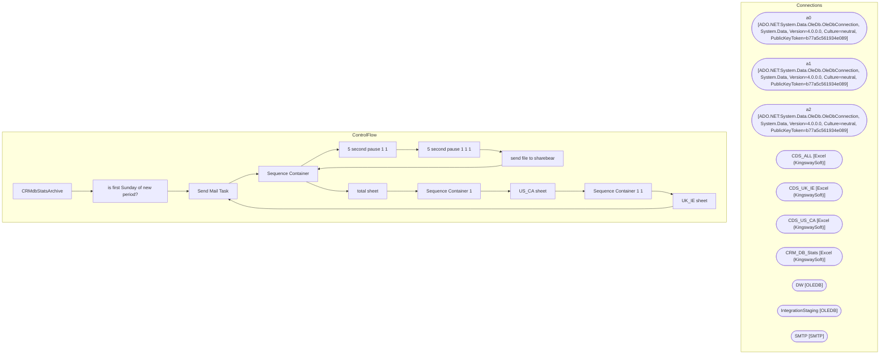

# SSIS Package: CRMdbStatsArchive

**Project:** CRMdbStatsArchive  
**Folder:** CRM  
**Server:** STL-SSIS-P-01  

## Architecture Diagram

## Connection Managers

| Name | Type |
|---|---|
| a0 | ADO.NET:System.Data.OleDb.OleDbConnection, System.Data, Version=4.0.0.0, Culture=neutral, PublicKeyToken=b77a5c561934e089 |
| a1 | ADO.NET:System.Data.OleDb.OleDbConnection, System.Data, Version=4.0.0.0, Culture=neutral, PublicKeyToken=b77a5c561934e089 |
| a2 | ADO.NET:System.Data.OleDb.OleDbConnection, System.Data, Version=4.0.0.0, Culture=neutral, PublicKeyToken=b77a5c561934e089 |
| CDS_ALL | Excel (KingswaySoft) |
| CDS_UK_IE | Excel (KingswaySoft) |
| CDS_US_CA | Excel (KingswaySoft) |
| CRM_DB_Stats | Excel (KingswaySoft) |
| DW | OLEDB |
| IntegrationStaging | OLEDB |
| SMTP | SMTP |

## Control Flow Tasks

| Task | Type |
|---|---|
| CRMdbStatsArchive | Microsoft.Package |
| is first Sunday of new period? | Microsoft.ExecuteSQLTask |
| Send Mail Task | Microsoft.SendMailTask |
| Sequence Container | STOCK:SEQUENCE |
| 5 second pause 1 1 | STOCK:FORLOOP |
| 5 second pause 1 1 1 | STOCK:FORLOOP |
| send file to sharebear | Microsoft.FileSystemTask |
| Sequence Container | STOCK:SEQUENCE |
| total sheet | Microsoft.Pipeline |
| Sequence Container 1 | STOCK:SEQUENCE |
| US_CA sheet | Microsoft.Pipeline |
| Sequence Container 1 1 | STOCK:SEQUENCE |
| UK_IE sheet | Microsoft.Pipeline |
| Send Mail Task | Microsoft.SendMailTask |

## Data Flow: Sources

_None detected._

## Data Flow: Destinations

_None detected._

