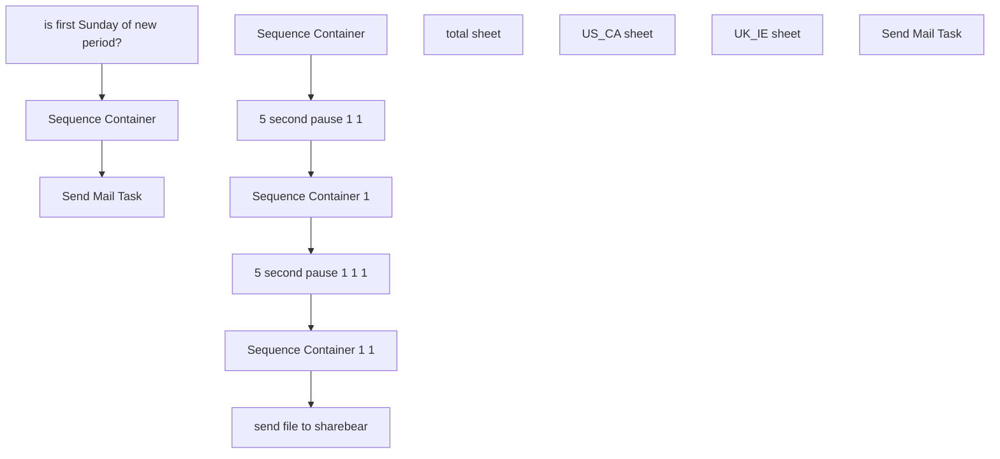

# SSIS Package: CRMdbStatsArchive

**Project:** CRMdbStatsArchive  
**Folder:** CRM  
**Server:** STL-SSIS-P-01  

## Connection Managers

| Name | Type | Server | Catalog | Connection (sanitized) |
|---|---|---|---|---|
| CDS_ALL | Excel (KingswaySoft) |  |  |  |
| CDS_UK_IE | Excel (KingswaySoft) |  |  |  |
| CDS_US_CA | Excel (KingswaySoft) |  |  |  |
| CRM_DB_Stats | Excel (KingswaySoft) |  |  |  |
| DW | OLEDB | papamart | dw | Data Source=papamart; Initial Catalog=dw; Provider=SQLNCLI11.1; Integrated Security=SSPI; Auto Translate=False |
| IntegrationStaging | OLEDB | STL-SSIS-P-01 | IntegrationStaging | Data Source=STL-SSIS-P-01; Initial Catalog=IntegrationStaging; Provider=SQLNCLI11.1; Integrated Security=SSPI; Auto Translate=False |
| SMTP | SMTP |  |  |  |
| a0 | ADO.NET:System.Data.OleDb.OleDbConnection, System.Data, Version=4.0.0.0, Culture=neutral, PublicKeyToken=b77a5c561934e089 | asazure://northcentralus.asazure.windows.net/azasp01 | BABW-DW | Data Source=asazure://northcentralus.asazure.windows.net/azasp01; Initial Catalog=BABW-DW; Provider=MSOLAP.7; Connect Timeout=60 |
| a1 | ADO.NET:System.Data.OleDb.OleDbConnection, System.Data, Version=4.0.0.0, Culture=neutral, PublicKeyToken=b77a5c561934e089 | asazure://northcentralus.asazure.windows.net/azasp01 | BABW-DW | Data Source=asazure://northcentralus.asazure.windows.net/azasp01; Initial Catalog=BABW-DW; Provider=MSOLAP.7; Connect Timeout=60 |
| a2 | ADO.NET:System.Data.OleDb.OleDbConnection, System.Data, Version=4.0.0.0, Culture=neutral, PublicKeyToken=b77a5c561934e089 | asazure://northcentralus.asazure.windows.net/azasp01 | BABW-DW | Data Source=asazure://northcentralus.asazure.windows.net/azasp01; Initial Catalog=BABW-DW; Provider=MSOLAP.7; Connect Timeout=60 |

## Control Flow Tasks

| Task | Type |
|---|---|
| CRMdbStatsArchive | Package |
| is first Sunday of new period? | ExecuteSQLTask |
| Send Mail Task | SendMailTask |
| Sequence Container | SEQUENCE |
| 5 second pause 1 1 | FORLOOP |
| 5 second pause 1 1 1 | FORLOOP |
| send file to sharebear | FileSystemTask |
| Sequence Container | SEQUENCE |
| total sheet | Pipeline |
| Sequence Container 1 | SEQUENCE |
| US_CA sheet | Pipeline |
| Sequence Container 1 1 | SEQUENCE |
| UK_IE sheet | Pipeline |
| Send Mail Task | SendMailTask |

## Control Flow Outline

```text
- Send Mail Task [SendMailTask]
- Send Mail Task [SendMailTask]
- Sequence Container [SEQUENCE]
  - 5 second pause 1 1 [FORLOOP]
  - 5 second pause 1 1 1 [FORLOOP]
  - Sequence Container [SEQUENCE]
  - Sequence Container 1 [SEQUENCE]
  - Sequence Container 1 1 [SEQUENCE]
    - UK_IE sheet [Pipeline]
    - US_CA sheet [Pipeline]
    - total sheet [Pipeline]
  - send file to sharebear [FileSystemTask]
- is first Sunday of new period? [ExecuteSQLTask]
```

## Architecture Diagram



## Variables

| Namespace | Name | Expression-bound |
|---|---|---|
| System | Propagate | No |
| User | DateTimeStamp | Yes |
| User | EndDate | Yes |
| User | EndDateAsDATE | Yes |
| User | GetDate | Yes |
| User | GetDateAsDATE | Yes |
| User | StartDate | Yes |
| User | StartDateAsDATE | Yes |
| User | destinationServerPath | Yes |
| User | integrationServerPath | Yes |
| User | varFirstSundayFirstWOP | No |

### Expression-bound variable values

#### User::DateTimeStamp

**Expression:**

```sql
(DT_WSTR,4)DATEPART("yyyy",GetDate()) 
+ (DT_WSTR,4)DATEPART("mm",GetDate()) 
+ (DT_WSTR,4)DATEPART("dd",GetDate()) 
+ (DT_WSTR,4)DATEPART("hh",GetDate()) 
+ (DT_WSTR,4)DATEPART("mi",GetDate()) 
+ (DT_WSTR,4)DATEPART("ss",GetDate()) 
+ (DT_WSTR,4)DATEPART("ms",GetDate())
```

**Evaluated value:**

```sql
2021112122352437
```

#### User::EndDate

**Expression:**

```sql
dateadd("dd", @[$Package::DaysToInclude], @[User::StartDate])
```

**Evaluated value:**

```sql
11/1/2021
```

#### User::EndDateAsDATE

**Expression:**

```sql
(DT_WSTR, 4) datepart("year", @[User::EndDate])  + "-" +
right("0"+ (DT_WSTR, 2) datepart("mm", @[User::EndDate]),2)  + "-" +
right("0" +(DT_WSTR, 2) datepart("dd",  @[User::EndDate]),2)
```

**Evaluated value:**

```sql
2021-11-01
```

#### User::GetDate

**Expression:**

```sql
(DT_DATE)DATEDIFF("Day", (DT_DATE) 0, GETDATE())
```

**Evaluated value:**

```sql
11/2/2021
```

#### User::GetDateAsDATE

**Expression:**

```sql
(DT_WSTR, 4) datepart("year", @[User::GetDate])  + "-" +
right("0"+ (DT_WSTR, 2) datepart("mm", @[User::GetDate]),2)  + "-" +
right("0" +(DT_WSTR, 2) datepart("dd",  @[User::GetDate]),2)
```

**Evaluated value:**

```sql
2021-11-02
```

#### User::StartDate

**Expression:**

```sql
dateadd("dd", -@[$Package::DaysToGoBack] , @[User::GetDate] )
```

**Evaluated value:**

```sql
10/2/2021
```

#### User::StartDateAsDATE

**Expression:**

```sql
(DT_WSTR, 4) datepart("year", @[User::StartDate])  + "-" +
right("0"+ (DT_WSTR, 2) datepart("mm", @[User::StartDate]),2)  + "-" +
right("0" +(DT_WSTR, 2) datepart("dd",  @[User::StartDate]),2)
```

**Evaluated value:**

```sql
2021-10-02
```

#### User::destinationServerPath

**Expression:**

```sql
"\\\\sharebear1\\shared\\CRM-Loyalty\\Database Stats\\CRM_DB_Stats_" +  @[User::DateTimeStamp] + ".xlsx"
```

**Evaluated value:**

```sql
\\sharebear1\shared\CRM-Loyalty\Database Stats\CRM_DB_Stats_2021112122352437.xlsx
```

#### User::integrationServerPath

**Expression:**

```sql
@[$Package::CRMfileStagePath] + "CRM_DB_Stats.xlsx"
```

**Evaluated value:**

```sql
\\stl-ssis-p-01\IntegrationStaging\CRM\DBstatsArchive\CRM_DB_Stats.xlsx
```

## Execute SQL Tasks

### is first Sunday of new period?

**Path:** `Package\is first Sunday of new period?`  
**Connection:** DW (papamart/dw)  

```sql
select 'varFirstSundayFirstWOP' = case when a.day_of_week = 1 and a.week_of_period = 1 then 1 else 0 end
from 
(
select * from [dbo].[date_dim] where cast(actual_date as date) = cast(getdate() as date)
) a
```

## Data Flow: Sources

_None detected._

## Data Flow: Destinations

_None detected._
