# SSIS Package: CRMmarketingCloudFileCreate

**Project:** CRMmarketingCloudFileCreate  
**Folder:** CRM  
**Server:** STL-SSIS-P-01  

## Connection Managers

| Name | Type | Server | Catalog | Connection (sanitized) |
|---|---|---|---|---|
| CRM | OLEDB | stl-crmdb-p-01 | crm | Data Source=stl-crmdb-p-01; Initial Catalog=crm; Provider=SQLNCLI11.1; Integrated Security=SSPI; Auto Translate=False |
| DW | OLEDB | papamart | dw | Data Source=papamart; Initial Catalog=dw; Provider=SQLNCLI11.1; Integrated Security=SSPI; Auto Translate=False |
| DWStaging | OLEDB | papamart | DWStaging | Data Source=papamart; Initial Catalog=DWStaging; Provider=SQLNCLI11.1; Integrated Security=SSPI; Auto Translate=False |
| SMTP | SMTP |  |  |  |
| STL-SSIS-P-01.IntegrationStaging | OLEDB | STL-SSIS-P-01 | IntegrationStaging | Data Source=STL-SSIS-P-01; Initial Catalog=IntegrationStaging; Provider=SQLNCLI11.1; Integrated Security=SSPI; Auto Translate=False |
| archive | FILE |  |  |  |
| cDim | CACHE |  |  |  |

## Control Flow Tasks

| Task | Type |
|---|---|
| CRMmarketingCloudFileCreate | Package |
| SEQ - Marketing Cloud file split | SEQUENCE |
| full or delta load? | ExecuteSQLTask |
| Sequence Container | SEQUENCE |
| loop file create proc | FORLOOP |
| file output | ExecuteSQLTask |
| pause | FORLOOP |
| remove double quotes | ExecuteSQLTask |
| remove extra pipes | ExecuteSQLTask |
| remove line breaks | ExecuteSQLTask |
| stage delta records | ExecuteSQLTask |
| truncate stage | ExecuteSQLTask |
| Sequence Container 1 | SEQUENCE |
| loop file create proc | FORLOOP |
| file output | ExecuteSQLTask |
| file output 1 | ExecuteSQLTask |
| pause | FORLOOP |
| Send Mail Task | SendMailTask |
| remove special characters | ExecuteSQLTask |
| stage full records | ExecuteSQLTask |
| truncate stage | ExecuteSQLTask |
| set loop # for delta | ExecuteSQLTask |
| set loop # for full | ExecuteSQLTask |
| upload files | SEQUENCE |
| Foreach Loop - Move to Archive | FOREACHLOOP |
| Archive File | FileSystemTask |
| FTP script | ExecuteSQLTask |
| Send Mail Task | SendMailTask |

## Control Flow Outline

```text
- Send Mail Task [SendMailTask]
- SEQ - Marketing Cloud file split [SEQUENCE]
  - Sequence Container [SEQUENCE]
  - Sequence Container 1 [SEQUENCE]
    - loop file create proc [FORLOOP]
      - Send Mail Task [SendMailTask]
      - file output [ExecuteSQLTask]
      - file output 1 [ExecuteSQLTask]
      - pause [FORLOOP]
    - remove special characters [ExecuteSQLTask]
    - stage full records [ExecuteSQLTask]
    - truncate stage [ExecuteSQLTask]
    - loop file create proc [FORLOOP]
      - file output [ExecuteSQLTask]
      - pause [FORLOOP]
    - remove double quotes [ExecuteSQLTask]
    - remove extra pipes [ExecuteSQLTask]
    - remove line breaks [ExecuteSQLTask]
    - stage delta records [ExecuteSQLTask]
    - truncate stage [ExecuteSQLTask]
  - full or delta load? [ExecuteSQLTask]
  - set loop # for delta [ExecuteSQLTask]
  - set loop # for full [ExecuteSQLTask]
- upload files [SEQUENCE]
  - FTP script [ExecuteSQLTask]
  - Foreach Loop - Move to Archive [FOREACHLOOP]
    - Archive File [FileSystemTask]
```

## Architecture Diagram

```mermaid
flowchart TD
    n_Package_SEQ___Marketing_Cloud_file_split["SEQ - Marketing Cloud file split"]
    n_Package_SEQ___Marketing_Cloud_file_split_full_or_delta_load_["full or delta load?"]
    n_Package_SEQ___Marketing_Cloud_file_split_Sequence_Container["Sequence Container"]
    n_Package_SEQ___Marketing_Cloud_file_split_Sequence_Container_loop_file_create_proc["loop file create proc"]
    n_Package_SEQ___Marketing_Cloud_file_split_Sequence_Container_loop_file_create_proc_file_output["file output"]
    n_Package_SEQ___Marketing_Cloud_file_split_Sequence_Container_loop_file_create_proc_pause["pause"]
    n_Package_SEQ___Marketing_Cloud_file_split_Sequence_Container_remove_double_quotes["remove double quotes"]
    n_Package_SEQ___Marketing_Cloud_file_split_Sequence_Container_remove_extra_pipes["remove extra pipes"]
    n_Package_SEQ___Marketing_Cloud_file_split_Sequence_Container_remove_line_breaks["remove line breaks"]
    n_Package_SEQ___Marketing_Cloud_file_split_Sequence_Container_stage_delta_records["stage delta records"]
    n_Package_SEQ___Marketing_Cloud_file_split_Sequence_Container_truncate_stage["truncate stage"]
    n_Package_SEQ___Marketing_Cloud_file_split_Sequence_Container_1["Sequence Container 1"]
    n_Package_SEQ___Marketing_Cloud_file_split_Sequence_Container_1_loop_file_create_proc["loop file create proc"]
    n_Package_SEQ___Marketing_Cloud_file_split_Sequence_Container_1_loop_file_create_proc_file_output["file output"]
    n_Package_SEQ___Marketing_Cloud_file_split_Sequence_Container_1_loop_file_create_proc_file_output_1["file output 1"]
    n_Package_SEQ___Marketing_Cloud_file_split_Sequence_Container_1_loop_file_create_proc_pause["pause"]
    n_Package_SEQ___Marketing_Cloud_file_split_Sequence_Container_1_loop_file_create_proc_Send_Mail_Task["Send Mail Task"]
    n_Package_SEQ___Marketing_Cloud_file_split_Sequence_Container_1_remove_special_characters["remove special characters"]
    n_Package_SEQ___Marketing_Cloud_file_split_Sequence_Container_1_stage_full_records["stage full records"]
    n_Package_SEQ___Marketing_Cloud_file_split_Sequence_Container_1_truncate_stage["truncate stage"]
    n_Package_SEQ___Marketing_Cloud_file_split_set_loop___for_delta["set loop # for delta"]
    n_Package_SEQ___Marketing_Cloud_file_split_set_loop___for_full["set loop # for full"]
    n_Package_upload_files["upload files"]
    n_Package_upload_files_Foreach_Loop___Move_to_Archive["Foreach Loop - Move to Archive"]
    n_Package_upload_files_Foreach_Loop___Move_to_Archive_Archive_File["Archive File"]
    n_Package_upload_files_FTP_script["FTP script"]
    n_Package_EventHandlers_OnError__Send_Mail_Task["Send Mail Task"]
    n_Package_SEQ___Marketing_Cloud_file_split_Sequence_Container_loop_file_create_proc_file_output --> n_Package_SEQ___Marketing_Cloud_file_split_Sequence_Container_loop_file_create_proc_pause
    n_Package_SEQ___Marketing_Cloud_file_split_Sequence_Container_truncate_stage --> n_Package_SEQ___Marketing_Cloud_file_split_Sequence_Container_stage_delta_records
    n_Package_SEQ___Marketing_Cloud_file_split_Sequence_Container_stage_delta_records --> n_Package_SEQ___Marketing_Cloud_file_split_Sequence_Container_remove_extra_pipes
    n_Package_SEQ___Marketing_Cloud_file_split_Sequence_Container_remove_extra_pipes --> n_Package_SEQ___Marketing_Cloud_file_split_Sequence_Container_remove_line_breaks
    n_Package_SEQ___Marketing_Cloud_file_split_Sequence_Container_remove_line_breaks --> n_Package_SEQ___Marketing_Cloud_file_split_Sequence_Container_remove_double_quotes
    n_Package_SEQ___Marketing_Cloud_file_split_Sequence_Container_remove_double_quotes --> n_Package_SEQ___Marketing_Cloud_file_split_Sequence_Container_loop_file_create_proc
    n_Package_SEQ___Marketing_Cloud_file_split_Sequence_Container_1_loop_file_create_proc_file_output_1 --> n_Package_SEQ___Marketing_Cloud_file_split_Sequence_Container_1_loop_file_create_proc_pause
    n_Package_SEQ___Marketing_Cloud_file_split_Sequence_Container_1_truncate_stage --> n_Package_SEQ___Marketing_Cloud_file_split_Sequence_Container_1_stage_full_records
    n_Package_SEQ___Marketing_Cloud_file_split_Sequence_Container_1_stage_full_records --> n_Package_SEQ___Marketing_Cloud_file_split_Sequence_Container_1_loop_file_create_proc
    n_Package_SEQ___Marketing_Cloud_file_split_full_or_delta_load_ --> n_Package_SEQ___Marketing_Cloud_file_split_set_loop___for_delta
    n_Package_SEQ___Marketing_Cloud_file_split_full_or_delta_load_ --> n_Package_SEQ___Marketing_Cloud_file_split_set_loop___for_full
    n_Package_SEQ___Marketing_Cloud_file_split_set_loop___for_full --> n_Package_SEQ___Marketing_Cloud_file_split_Sequence_Container_1
    n_Package_SEQ___Marketing_Cloud_file_split_set_loop___for_delta --> n_Package_SEQ___Marketing_Cloud_file_split_Sequence_Container
    n_Package_upload_files_FTP_script --> n_Package_upload_files_Foreach_Loop___Move_to_Archive
    n_Package_SEQ___Marketing_Cloud_file_split --> n_Package_upload_files
```



## Variables

| Namespace | Name | Expression-bound |
|---|---|---|
| System | Propagate | No |
| User | allRecords | No |
| User | varCounter | No |
| User | varFileToArchive | No |
| User | varNumberOfGroups | No |
| User | varStageFolder | No |

## Execute SQL Tasks

### file output

**Path:** `Package\SEQ - Marketing Cloud file split\Sequence Container 1\loop file create proc\file output`  
**Connection:** DW (papamart/dw)  

```sql
exec spCRMdataExtension1FileOutputCSVbyGroup @path = '\\stl-ssis-p-01\IntegrationStaging\CRM\test\ServiceCloud\', @filepart = 'MasterDE_',@tablename = 'CRMde1',@compress = 0,@allRecords=?, @groupNum=?
```

### file output 1

**Path:** `Package\SEQ - Marketing Cloud file split\Sequence Container 1\loop file create proc\file output 1`  
**Connection:** DW (papamart/dw)  

```sql
exec spCRMdataExtension1FileOutputPSVbyGroup @path = '\\stl-ssis-p-01\IntegrationStaging\CRM\DataExtension\', @filepart = 'MasterDE_',@tablename = 'CRMde1',@compress = 0,@allRecords=?, @groupNum=?
```

### remove special characters

**Path:** `Package\SEQ - Marketing Cloud file split\Sequence Container 1\remove special characters`  
**Connection:** DW (papamart/dw)  

```sql
update tmpCRMserviceCloudDelta set address_1 = replace(address_1,'"',' ') 
update tmpCRMserviceCloudDelta set address_1 = replace(address_1,'à', 'a') 
update tmpCRMserviceCloudDelta set address_1 = replace(address_1,'è', 'e') 
update tmpCRMserviceCloudDelta set address_1 = replace(address_1,'é', 'e') 
update tmpCRMserviceCloudDelta set address_1 = replace(address_1,'ì', 'i') 
update tmpCRMserviceCloudDelta set address_1 = replace(address_1,'ò', 'o') 
update tmpCRMserviceCloudDelta set address_1 = replace(address_1,'ù', 'u') 
update tmpCRMserviceCloudDelta set address_1 = replace(address_1,'ç', 'c') 
update tmpCRMserviceCloudDelta set address_1 = replace(address_1,',',' ') 
update tmpCRMserviceCloudDelta set address_1 = replace(address_1,'"',' ') 
update tmpCRMserviceCloudDelta set address_1 = replace(address_1,'''',' ') 
 update tmpCRMserviceCloudDelta set address_1 = replace(address_1,'“', '') 
 update tmpCRMserviceCloudDelta set address_1 = replace(address_1,'‚','') 

 update tmpCRMserviceCloudDelta set address_2 = replace(address_2,'"',' ') 
update tmpCRMserviceCloudDelta set address_2 = replace(address_2,'à', 'a') 
update tmpCRMserviceCloudDelta set address_2 = replace(address_2,'è', 'e') 
update tmpCRMserviceCloudDelta set address_2 = replace(address_2,'é', 'e') 
update tmpCRMserviceCloudDelta set address_2 = replace(address_2,'ì', 'i') 
update tmpCRMserviceCloudDelta set address_2 = replace(address_2,'ò', 'o') 
update tmpCRMserviceCloudDelta set address_2 = replace(address_2,'ù', 'u') 
update tmpCRMserviceCloudDelta set address_2 = replace(address_2,'ç', 'c') 
update tmpCRMserviceCloudDelta set address_2 = replace(address_2,',',' ') 
update tmpCRMserviceCloudDelta set address_2 = replace(address_2,'"',' ') 
update tmpCRMserviceCloudDelta set address_2 = replace(address_2,'''',' ') 
 update tmpCRMserviceCloudDelta set address_2 = replace(address_2,'“', '') 
 update tmpCRMserviceCloudDelta set address_2 = replace(address_2,'‚','') 

update tmpCRMserviceCloudDelta set address_3 = replace(address_3,'"',' ') 
update tmpCRMserviceCloudDelta set address_3 = replace(address_3,'à', 'a') 
update tmpCRMserviceCloudDelta set address_3 = replace(address_3,'è', 'e') 
update tmpCRMserviceCloudDelta set address_3 = replace(address_3,'é', 'e') 
update tmpCRMserviceCloudDelta set address_3 = replace(address_3,'ì', 'i') 
update tmpCRMserviceCloudDelta set address_3 = replace(address_3,'ò', 'o') 
update tmpCRMserviceCloudDelta set address_3 = replace(address_3,'ù', 'u') 
update tmpCRMserviceCloudDelta set address_3 = replace(address_3,'ç', 'c') 
update tmpCRMserviceCloudDelta set address_3 = replace(address_3,',',' ') 
update tmpCRMserviceCloudDelta set address_3 = replace(address_3,'"',' ') 
update tmpCRMserviceCloudDelta set address_3 = replace(address_3,'''',' ') 
 update tmpCRMserviceCloudDelta set address_3 = replace(address_3,'“', '') 
 update tmpCRMserviceCloudDelta set address_3 = replace(address_3,'‚','') 

 update tmpCRMserviceCloudDelta set address_4 = replace(address_4,'"',' ') 
update tmpCRMserviceCloudDelta set address_4 = replace(address_4,'à', 'a') 
update tmpCRMserviceCloudDelta set address_4 = replace(address_4,'è', 'e') 
update tmpCRMserviceCloudDelta set address_4 = replace(address_4,'é', 'e') 
update tmpCRMserviceCloudDelta set address_4 = replace(address_4,'ì', 'i') 
update tmpCRMserviceCloudDelta set address_4 = replace(address_4,'ò', 'o') 
update tmpCRMserviceCloudDelta set address_4 = replace(address_4,'ù', 'u') 
update tmpCRMserviceCloudDelta set address_4 = replace(address_4,'ç', 'c') 
update tmpCRMserviceCloudDelta set address_4 = replace(address_4,',',' ') 
update tmpCRMserviceCloudDelta set address_4 = replace(address_4,'"',' ') 
update tmpCRMserviceCloudDelta set address_4 = replace(address_4,'''',' ') 
 update tmpCRMserviceCloudDelta set address_4 = replace(address_4,'“', '') 
 update tmpCRMserviceCloudDelta set address_4 = replace(address_4,'‚','') 

 update tmpCRMserviceCloudDelta set post_code = replace(post_code,'"',' ') 
update tmpCRMserviceCloudDelta set post_code = replace(post_code,'à', 'a') 
update tmpCRMserviceCloudDelta set post_code = replace(post_code,'è', 'e') 
update tmpCRMserviceCloudDelta set post_code = replace(post_code,'é', 'e') 
update tmpCRMserviceCloudDelta set post_code = replace(post_code,'ì', 'i') 
update tmpCRMserviceCloudDelta set post_code = replace(post_code,'ò', 'o') 
update tmpCRMserviceCloudDelta set post_code = replace(post_code,'ù', 'u') 
update tmpCRMserviceCloudDelta set post_code = replace(post_code,'ç', 'c') 
update tmpCRMserviceCloudDelta set post_code = replace(post_code,',',' ') 
update tmpCRMserviceCloudDelta set post_code = replace(post_code,'"',' ') 
update tmpCRMserviceCloudDelta set post_code = replace(post_code,'''',' ') 
 update tmpCRMserviceCloudDelta set post_code = replace(post_code,'“', '') 
 update tmpCRMserviceCloudDelta set post_code = replace(post_code,'‚','') 

update tmpCRMserviceCloudDelta set FirstName = replace(FirstName,'"',' ') 
update tmpCRMserviceCloudDelta set FirstName = replace(FirstName,'à', 'a') 
update tmpCRMserviceCloudDelta set FirstName = replace(FirstName,'è', 'e') 
update tmpCRMserviceCloudDelta set FirstName = replace(FirstName,'é', 'e') 
update tmpCRMserviceCloudDelta set FirstName = replace(FirstName,'ì', 'i') 
update tmpCRMserviceCloudDelta set FirstName = replace(FirstName,'ò', 'o') 
update tmpCRMserviceCloudDelta set FirstName = replace(FirstName,'ù', 'u') 
update tmpCRMserviceCloudDelta set FirstName = replace(FirstName,'ç', 'c') 
update tmpCRMserviceCloudDelta set FirstName = replace(FirstName,',',' ') 
update tmpCRMserviceCloudDelta set FirstName = replace(FirstName,'"',' ') 
update tmpCRMserviceCloudDelta set FirstName = replace(FirstName,'''',' ') 
update tmpCRMserviceCloudDelta set FirstName = replace(FirstName,'‚','') 


update tmpCRMserviceCloudDelta set LastName = replace(LastName,'"',' ') 
update tmpCRMserviceCloudDelta set LastName = replace(LastName,'à', 'a') 
update tmpCRMserviceCloudDelta set LastName = replace(LastName,'è', 'e') 
update tmpCRMserviceCloudDelta set LastName = replace(LastName,'é', 'e') 
update tmpCRMserviceCloudDelta set LastName = replace(LastName,'ì', 'i') 
update tmpCRMserviceCloudDelta set LastName = replace(LastName,'ò', 'o') 
update tmpCRMserviceCloudDelta set LastName = replace(LastName,'ù', 'u') 
update tmpCRMserviceCloudDelta set LastName = replace(LastName,'ç', 'c') 
update tmpCRMserviceCloudDelta set LastName = replace(LastName,',',' ') 
update tmpCRMserviceCloudDelta set LastName = replace(LastName,'"',' ') 
update tmpCRMserviceCloudDelta set LastName = replace(LastName,'''',' ') 
update tmpCRMserviceCloudDelta set LastName = replace(LastName,'‚','') 

```

### stage full records

**Path:** `Package\SEQ - Marketing Cloud file split\Sequence Container 1\stage full records`  
**Connection:** DW (papamart/dw)  

```sql
Insert into tmpCRMmarketingCloudDelta 
exec DW.dbo.spCRMdataExtension1MCFileOutputNtileResultsFull
```

### truncate stage

**Path:** `Package\SEQ - Marketing Cloud file split\Sequence Container 1\truncate stage`  
**Connection:** DW (papamart/dw)  

```sql
truncate table tmpCRMmarketingCloudDelta
```

### file output

**Path:** `Package\SEQ - Marketing Cloud file split\Sequence Container\loop file create proc\file output`  
**Connection:** DW (papamart/dw)  

```sql
exec spCRMdataExtension1FileOutputPSVbyGroup @path = '\\stl-ssis-p-01\IntegrationStaging\CRM\DataExtension\', @filepart = 'MasterDE_',@tablename = 'CRMde1',@compress = 1,@allRecords=?, @groupNum=?
```

### remove double quotes

**Path:** `Package\SEQ - Marketing Cloud file split\Sequence Container\remove double quotes`  
**Connection:** DW (papamart/dw)  

```sql
update  [dbo].[tmpCRMmarketingCloudDelta] set address_1 = REPLACE(address_1, '"', '')
update  [dbo].[tmpCRMmarketingCloudDelta] set address_2 = REPLACE(address_2, '"', '') 
update  [dbo].[tmpCRMmarketingCloudDelta] set address_3 = REPLACE(address_3, '"', '') 
update  [dbo].[tmpCRMmarketingCloudDelta] set address_4 = REPLACE(address_4, '"', '') 
update  [dbo].[tmpCRMmarketingCloudDelta] set post_code = REPLACE(post_code, '"', '') 
update  [dbo].[tmpCRMmarketingCloudDelta] set FirstName = REPLACE(FirstName, '"', '') 
update  [dbo].[tmpCRMmarketingCloudDelta] set LastName = REPLACE(LastName, '"', '') 

```

### remove extra pipes

**Path:** `Package\SEQ - Marketing Cloud file split\Sequence Container\remove extra pipes`  
**Connection:** DW (papamart/dw)  

```sql
delete from tmpCRMmarketingCloudDelta where 
SubscriberKey like '%|%' or FirstName like '%|%' or  LastName like '%|%' or Address_1 like '%|%' or   Address_2 like '%|%' or   Address_3 like '%|%'  or   Address_3 like '%|%'
or post_code like '%|%' or  EmailAddress like  '%|%'      
```

### remove line breaks

**Path:** `Package\SEQ - Marketing Cloud file split\Sequence Container\remove line breaks`  
**Connection:** DW (papamart/dw)  

```sql
update [dbo].[tmpCRMmarketingCloudDelta] set address_1 = REPLACE(REPLACE(address_1, CHAR(13), ''), CHAR(10), '') from [dbo].[tmpCRMmarketingCloudDelta]
update [dbo].[tmpCRMmarketingCloudDelta] set address_2 = REPLACE(REPLACE(address_2, CHAR(13), ''), CHAR(10), '') from [dbo].[tmpCRMmarketingCloudDelta]
update [dbo].[tmpCRMmarketingCloudDelta] set address_3 = REPLACE(REPLACE(address_3, CHAR(13), ''), CHAR(10), '') from [dbo].[tmpCRMmarketingCloudDelta]
update [dbo].[tmpCRMmarketingCloudDelta] set address_4 = REPLACE(REPLACE(address_4, CHAR(13), ''), CHAR(10), '') from [dbo].[tmpCRMmarketingCloudDelta]
update [dbo].[tmpCRMmarketingCloudDelta] set post_code = REPLACE(REPLACE(post_code, CHAR(13), ''), CHAR(10), '') from [dbo].[tmpCRMmarketingCloudDelta]
update [dbo].[tmpCRMmarketingCloudDelta] set FirstName = REPLACE(REPLACE(FirstName, CHAR(13), ''), CHAR(10), '') from [dbo].[tmpCRMmarketingCloudDelta]
update [dbo].[tmpCRMmarketingCloudDelta] set LastName = REPLACE(REPLACE(LastName, CHAR(13), ''), CHAR(10), '') from [dbo].[tmpCRMmarketingCloudDelta]


```

### stage delta records

**Path:** `Package\SEQ - Marketing Cloud file split\Sequence Container\stage delta records`  
**Connection:** DW (papamart/dw)  

```sql
Insert into tmpCRMmarketingCloudDelta 
exec DW.dbo.spCRMdataExtension1MCFileOutputNtileResultsDelta


```

### truncate stage

**Path:** `Package\SEQ - Marketing Cloud file split\Sequence Container\truncate stage`  
**Connection:** DW (papamart/dw)  

```sql
truncate table tmpCRMmarketingCloudDelta
```

### full or delta load?

**Path:** `Package\SEQ - Marketing Cloud file split\full or delta load?`  
**Connection:** DW (papamart/dw)  

```sql
-- do nothing
```

### set loop # for delta

**Path:** `Package\SEQ - Marketing Cloud file split\set loop # for delta`  
**Connection:** DW (papamart/dw)  

```sql
--select (count(*)/1900000)+1 as varNumberOfGroups from DW.dbo.CRMde1 where cast(InsertDate as date) = cast(getdate() as date) or cast(UpdateDate as date)  = cast(getdate() as date)
select 1 as varNumberOfGroups


```

### set loop # for full

**Path:** `Package\SEQ - Marketing Cloud file split\set loop # for full`  
**Connection:** DW (papamart/dw)  

```sql
select (count(*)/2375000)+1 as varNumberOfGroups from DW.dbo.CRMde1
```

### FTP script

**Path:** `Package\upload files\FTP script`  
**Connection:** STL-SSIS-P-01.IntegrationStaging (STL-SSIS-P-01/IntegrationStaging)  

```sql
declare 
 @winSCP varchar(1000),
 @script varchar(1000),
 @log varchar(1000),
 @FTP varchar(4000),
 @Log_query varchar(1000),
 @Log_filename varchar(100),
 @Log_file_location varchar(100),
 @Log_bcp varchar(1000),
 @body varchar(4000)
select
 @winSCP = '"\\stl-ssis-p-01\C$\Program Files (x86)\WinSCP\WinSCP.exe"',
 @script = ' /script=\\stl-ssis-p-01\IntegrationStaging\CRM\FTP\sFTPuploadScript2.txt',
 @log = ' /log=\\stl-ssis-p-01\IntegrationStaging\CRM\FTP\upload.log',
 @FTP = (@winSCP + @script + @log)
   
   
exec master..xp_cmdshell @FTP
```

## Data Flow: Sources

_None detected._

## Data Flow: Destinations

_None detected._
