# SSIS Package: CRMserviceCloudFileCreate

**Project:** CRMserviceCloudFileCreate  
**Folder:** CRM  
**Server:** STL-SSIS-P-01  

## Connection Managers

| Name | Type | Server | Catalog | Connection (sanitized) |
|---|---|---|---|---|
| CRM | OLEDB | stl-crmdb-p-01 | crm | Data Source=stl-crmdb-p-01; Initial Catalog=crm; Provider=SQLNCLI11.1; Integrated Security=SSPI; Auto Translate=False |
| DW | OLEDB | papamart | dw | Data Source=papamart; Initial Catalog=dw; Provider=SQLNCLI11.1; Integrated Security=SSPI; Auto Translate=False |
| DWStaging | OLEDB | papamart | DWStaging | Data Source=papamart; Initial Catalog=DWStaging; Provider=SQLNCLI11.1; Integrated Security=SSPI; Auto Translate=False |
| SMTP | SMTP |  |  |  |
| STL-SSIS-P-01.IntegrationStaging | OLEDB | STL-SSIS-P-01 | IntegrationStaging | Data Source=STL-SSIS-P-01; Initial Catalog=IntegrationStaging; Provider=SQLNCLI11.1; Integrated Security=SSPI; Auto Translate=False |
| archive | FILE |  |  |  |
| cDim | CACHE |  |  |  |

## Control Flow Tasks

| Task | Type |
|---|---|
| CRMserviceCloudFileCreate | Package |
| Sequence Container | SEQUENCE |
| full or delta load? | ExecuteSQLTask |
| Sequence Container | SEQUENCE |
| loop file create proc | FORLOOP |
| file output | ExecuteSQLTask |
| pause | FORLOOP |
| remove double quotes | ExecuteSQLTask |
| remove double quotes 2 | ExecuteSQLTask |
| remove double quotes 3 | ExecuteSQLTask |
| remove line breaks | ExecuteSQLTask |
| remove special characters | ExecuteSQLTask |
| remove tabs | ExecuteSQLTask |
| stage delta records | ExecuteSQLTask |
| suppress bad character records | ExecuteSQLTask |
| truncate stage | ExecuteSQLTask |
| Sequence Container 1 | SEQUENCE |
| loop file create proc | FORLOOP |
| file output 1 | ExecuteSQLTask |
| pause | FORLOOP |
| Send Mail Task | SendMailTask |
| remove double quotes | ExecuteSQLTask |
| remove double quotes 2 | ExecuteSQLTask |
| remove double quotes 3 | ExecuteSQLTask |
| remove line breaks | ExecuteSQLTask |
| remove special characters | ExecuteSQLTask |
| remove tabs | ExecuteSQLTask |
| stage delta records | ExecuteSQLTask |
| suppress bad character records | ExecuteSQLTask |
| truncate stage | ExecuteSQLTask |
| set loop # for delta | ExecuteSQLTask |
| set loop # for full | ExecuteSQLTask |
| Sequence Container 1 | SEQUENCE |
| Data Flow Task | Pipeline |
| delete customers no longer in CRM | ExecuteSQLTask |
| truncate stage | ExecuteSQLTask |
| Send Mail Task | SendMailTask |

## Control Flow Outline

```text
- Send Mail Task [SendMailTask]
- Sequence Container [SEQUENCE]
- Sequence Container 1 [SEQUENCE]
  - Data Flow Task [Pipeline]
  - delete customers no longer in CRM [ExecuteSQLTask]
  - truncate stage [ExecuteSQLTask]
  - Sequence Container [SEQUENCE]
  - Sequence Container 1 [SEQUENCE]
    - loop file create proc [FORLOOP]
      - Send Mail Task [SendMailTask]
      - file output 1 [ExecuteSQLTask]
      - pause [FORLOOP]
    - remove double quotes [ExecuteSQLTask]
    - remove double quotes 2 [ExecuteSQLTask]
    - remove double quotes 3 [ExecuteSQLTask]
    - remove line breaks [ExecuteSQLTask]
    - remove special characters [ExecuteSQLTask]
    - remove tabs [ExecuteSQLTask]
    - stage delta records [ExecuteSQLTask]
    - suppress bad character records [ExecuteSQLTask]
    - truncate stage [ExecuteSQLTask]
    - loop file create proc [FORLOOP]
      - file output [ExecuteSQLTask]
      - pause [FORLOOP]
    - remove double quotes [ExecuteSQLTask]
    - remove double quotes 2 [ExecuteSQLTask]
    - remove double quotes 3 [ExecuteSQLTask]
    - remove line breaks [ExecuteSQLTask]
    - remove special characters [ExecuteSQLTask]
    - remove tabs [ExecuteSQLTask]
    - stage delta records [ExecuteSQLTask]
    - suppress bad character records [ExecuteSQLTask]
    - truncate stage [ExecuteSQLTask]
  - full or delta load? [ExecuteSQLTask]
  - set loop # for delta [ExecuteSQLTask]
  - set loop # for full [ExecuteSQLTask]
```

## Architecture Diagram

```mermaid
flowchart TD
    n_Package_Sequence_Container["Sequence Container"]
    n_Package_Sequence_Container_full_or_delta_load_["full or delta load?"]
    n_Package_Sequence_Container_Sequence_Container["Sequence Container"]
    n_Package_Sequence_Container_Sequence_Container_loop_file_create_proc["loop file create proc"]
    n_Package_Sequence_Container_Sequence_Container_loop_file_create_proc_file_output["file output"]
    n_Package_Sequence_Container_Sequence_Container_loop_file_create_proc_pause["pause"]
    n_Package_Sequence_Container_Sequence_Container_remove_double_quotes["remove double quotes"]
    n_Package_Sequence_Container_Sequence_Container_remove_double_quotes_2["remove double quotes 2"]
    n_Package_Sequence_Container_Sequence_Container_remove_double_quotes_3["remove double quotes 3"]
    n_Package_Sequence_Container_Sequence_Container_remove_line_breaks["remove line breaks"]
    n_Package_Sequence_Container_Sequence_Container_remove_special_characters["remove special characters"]
    n_Package_Sequence_Container_Sequence_Container_remove_tabs["remove tabs"]
    n_Package_Sequence_Container_Sequence_Container_stage_delta_records["stage delta records"]
    n_Package_Sequence_Container_Sequence_Container_suppress_bad_character_records["suppress bad character records"]
    n_Package_Sequence_Container_Sequence_Container_truncate_stage["truncate stage"]
    n_Package_Sequence_Container_Sequence_Container_1["Sequence Container 1"]
    n_Package_Sequence_Container_Sequence_Container_1_loop_file_create_proc["loop file create proc"]
    n_Package_Sequence_Container_Sequence_Container_1_loop_file_create_proc_file_output_1["file output 1"]
    n_Package_Sequence_Container_Sequence_Container_1_loop_file_create_proc_pause["pause"]
    n_Package_Sequence_Container_Sequence_Container_1_loop_file_create_proc_Send_Mail_Task["Send Mail Task"]
    n_Package_Sequence_Container_Sequence_Container_1_remove_double_quotes["remove double quotes"]
    n_Package_Sequence_Container_Sequence_Container_1_remove_double_quotes_2["remove double quotes 2"]
    n_Package_Sequence_Container_Sequence_Container_1_remove_double_quotes_3["remove double quotes 3"]
    n_Package_Sequence_Container_Sequence_Container_1_remove_line_breaks["remove line breaks"]
    n_Package_Sequence_Container_Sequence_Container_1_remove_special_characters["remove special characters"]
    n_Package_Sequence_Container_Sequence_Container_1_remove_tabs["remove tabs"]
    n_Package_Sequence_Container_Sequence_Container_1_stage_delta_records["stage delta records"]
    n_Package_Sequence_Container_Sequence_Container_1_suppress_bad_character_records["suppress bad character records"]
    n_Package_Sequence_Container_Sequence_Container_1_truncate_stage["truncate stage"]
    n_Package_Sequence_Container_set_loop___for_delta["set loop # for delta"]
    n_Package_Sequence_Container_set_loop___for_full["set loop # for full"]
    n_Package_Sequence_Container_1["Sequence Container 1"]
    n_Package_Sequence_Container_1_Data_Flow_Task["Data Flow Task"]
    n_Package_Sequence_Container_1_delete_customers_no_longer_in_CRM["delete customers no longer in CRM"]
    n_Package_Sequence_Container_1_truncate_stage["truncate stage"]
    n_Package_EventHandlers_OnError__Send_Mail_Task["Send Mail Task"]
    n_Package_Sequence_Container_Sequence_Container_loop_file_create_proc_file_output --> n_Package_Sequence_Container_Sequence_Container_loop_file_create_proc_pause
    n_Package_Sequence_Container_Sequence_Container_truncate_stage --> n_Package_Sequence_Container_Sequence_Container_stage_delta_records
    n_Package_Sequence_Container_Sequence_Container_stage_delta_records --> n_Package_Sequence_Container_Sequence_Container_remove_special_characters
    n_Package_Sequence_Container_Sequence_Container_remove_special_characters --> n_Package_Sequence_Container_Sequence_Container_remove_line_breaks
    n_Package_Sequence_Container_Sequence_Container_remove_line_breaks --> n_Package_Sequence_Container_Sequence_Container_remove_tabs
    n_Package_Sequence_Container_Sequence_Container_remove_tabs --> n_Package_Sequence_Container_Sequence_Container_remove_double_quotes
    n_Package_Sequence_Container_Sequence_Container_remove_double_quotes --> n_Package_Sequence_Container_Sequence_Container_remove_double_quotes_2
    n_Package_Sequence_Container_Sequence_Container_remove_double_quotes_2 --> n_Package_Sequence_Container_Sequence_Container_remove_double_quotes_3
    n_Package_Sequence_Container_Sequence_Container_suppress_bad_character_records --> n_Package_Sequence_Container_Sequence_Container_loop_file_create_proc
    n_Package_Sequence_Container_Sequence_Container_remove_double_quotes_3 --> n_Package_Sequence_Container_Sequence_Container_suppress_bad_character_records
    n_Package_Sequence_Container_Sequence_Container_1_loop_file_create_proc_file_output_1 --> n_Package_Sequence_Container_Sequence_Container_1_loop_file_create_proc_pause
    n_Package_Sequence_Container_Sequence_Container_1_truncate_stage --> n_Package_Sequence_Container_Sequence_Container_1_stage_delta_records
    n_Package_Sequence_Container_Sequence_Container_1_stage_delta_records --> n_Package_Sequence_Container_Sequence_Container_1_remove_special_characters
    n_Package_Sequence_Container_Sequence_Container_1_remove_line_breaks --> n_Package_Sequence_Container_Sequence_Container_1_remove_tabs
    n_Package_Sequence_Container_Sequence_Container_1_remove_tabs --> n_Package_Sequence_Container_Sequence_Container_1_remove_double_quotes
    n_Package_Sequence_Container_Sequence_Container_1_remove_double_quotes --> n_Package_Sequence_Container_Sequence_Container_1_remove_double_quotes_2
    n_Package_Sequence_Container_Sequence_Container_1_remove_special_characters --> n_Package_Sequence_Container_Sequence_Container_1_remove_line_breaks
    n_Package_Sequence_Container_Sequence_Container_1_remove_double_quotes_2 --> n_Package_Sequence_Container_Sequence_Container_1_remove_double_quotes_3
    n_Package_Sequence_Container_Sequence_Container_1_suppress_bad_character_records --> n_Package_Sequence_Container_Sequence_Container_1_loop_file_create_proc
    n_Package_Sequence_Container_Sequence_Container_1_remove_double_quotes_3 --> n_Package_Sequence_Container_Sequence_Container_1_suppress_bad_character_records
    n_Package_Sequence_Container_full_or_delta_load_ --> n_Package_Sequence_Container_set_loop___for_delta
    n_Package_Sequence_Container_full_or_delta_load_ --> n_Package_Sequence_Container_set_loop___for_full
    n_Package_Sequence_Container_set_loop___for_full --> n_Package_Sequence_Container_Sequence_Container_1
    n_Package_Sequence_Container_set_loop___for_delta --> n_Package_Sequence_Container_Sequence_Container
    n_Package_Sequence_Container_1_Data_Flow_Task --> n_Package_Sequence_Container_1_delete_customers_no_longer_in_CRM
    n_Package_Sequence_Container_1_truncate_stage --> n_Package_Sequence_Container_1_Data_Flow_Task
```



## Variables

| Namespace | Name | Expression-bound |
|---|---|---|
| System | Propagate | No |
| User | allRecords | No |
| User | varCounter | No |
| User | varFileToArchive | No |
| User | varNumberOfGroups | No |
| User | varStageFolder | No |

## Execute SQL Tasks

### delete customers no longer in CRM

**Path:** `Package\Sequence Container 1\delete customers no longer in CRM`  
**Connection:** DW (papamart/dw)  

```sql
delete from CRMDE1 where CustomerNumber in 
(
SELECT [customerNumber] FROM [dbo].[tmpCRM_CustomerDimDelete]
)
and cast(UpdateDate as date) >= getdate()-1 and status = 'unsubscribed'


```

### truncate stage

**Path:** `Package\Sequence Container 1\truncate stage`  
**Connection:** DW (papamart/dw)  

```sql
truncate table tmpCRM_CustomerDimDelete
```

### file output 1

**Path:** `Package\Sequence Container\Sequence Container 1\loop file create proc\file output 1`  
**Connection:** DW (papamart/dw)  

```sql
exec spCRMdataExtension1FileOutputCSVbyGroup @path = '\\stl-sftp-p-01\ecommerce\to-sfsc\crm\stage\', @filepart = 'MasterDE_pre2018_',@tablename = 'CRMde1',@compress = 0,@allRecords=?, @groupNum=?
```

### remove double quotes

**Path:** `Package\Sequence Container\Sequence Container 1\remove double quotes`  
**Connection:** DW (papamart/dw)  

```sql
update  [dbo].[tmpCRMserviceCloudDelta] set address_1 = REPLACE(address_1, '"', '')
update  [dbo].[tmpCRMserviceCloudDelta] set address_2 = REPLACE(address_2, '"', '') 
update  [dbo].[tmpCRMserviceCloudDelta] set address_3 = REPLACE(address_3, '"', '') 
update  [dbo].[tmpCRMserviceCloudDelta] set address_4 = REPLACE(address_4, '"', '') 
update  [dbo].[tmpCRMserviceCloudDelta] set post_code = REPLACE(post_code, '"', '') 
update  [dbo].[tmpCRMserviceCloudDelta] set FirstName = REPLACE(FirstName, '"', '') 
update  [dbo].[tmpCRMserviceCloudDelta] set LastName = REPLACE(LastName, '"', '') 

```

### remove double quotes 2

**Path:** `Package\Sequence Container\Sequence Container 1\remove double quotes 2`  
**Connection:** DW (papamart/dw)  

```sql
update  [dbo].[tmpCRMserviceCloudDelta] set address_1 = REPLACE(address_1, '“', '')
update  [dbo].[tmpCRMserviceCloudDelta] set address_2 = REPLACE(address_2, '"', '') 
update  [dbo].[tmpCRMserviceCloudDelta] set address_3 = REPLACE(address_3, '"', '') 
update  [dbo].[tmpCRMserviceCloudDelta] set address_4 = REPLACE(address_4, '“', '')
update  [dbo].[tmpCRMserviceCloudDelta] set post_code = REPLACE(post_code, '“', '')
update  [dbo].[tmpCRMserviceCloudDelta] set FirstName = REPLACE(FirstName, '“', '')
update  [dbo].[tmpCRMserviceCloudDelta] set LastName = REPLACE(LastName, '“', '')

```

### remove double quotes 3

**Path:** `Package\Sequence Container\Sequence Container 1\remove double quotes 3`  
**Connection:** DW (papamart/dw)  

```sql
update  [dbo].[tmpCRMserviceCloudDelta] set address_1 = REPLACE(address_1, '”', '')
update  [dbo].[tmpCRMserviceCloudDelta] set address_2 = REPLACE(address_2, '”', '')
update  [dbo].[tmpCRMserviceCloudDelta] set address_3 = REPLACE(address_3, '”', '')
update  [dbo].[tmpCRMserviceCloudDelta] set address_4 = REPLACE(address_4, '”', '')
update  [dbo].[tmpCRMserviceCloudDelta] set post_code = REPLACE(post_code, '”', '')
update  [dbo].[tmpCRMserviceCloudDelta] set FirstName = REPLACE(FirstName, '”', '')
update  [dbo].[tmpCRMserviceCloudDelta] set LastName = REPLACE(LastName, '”', '')
```

### remove line breaks

**Path:** `Package\Sequence Container\Sequence Container 1\remove line breaks`  
**Connection:** DW (papamart/dw)  

```sql
update [dbo].[tmpCRMserviceCloudDelta] set address_1 = REPLACE(REPLACE(address_1, CHAR(13), ''), CHAR(10), '')
update [dbo].[tmpCRMserviceCloudDelta] set address_2 = REPLACE(REPLACE(address_2, CHAR(13), ''), CHAR(10), '') 
update [dbo].[tmpCRMserviceCloudDelta] set address_3 = REPLACE(REPLACE(address_3, CHAR(13), ''), CHAR(10), '')
update [dbo].[tmpCRMserviceCloudDelta] set address_4 = REPLACE(REPLACE(address_4, CHAR(13), ''), CHAR(10), '')
update [dbo].[tmpCRMserviceCloudDelta] set post_code = REPLACE(REPLACE(post_code, CHAR(13), ''), CHAR(10), '')
update [dbo].[tmpCRMserviceCloudDelta] set FirstName = REPLACE(REPLACE(FirstName, CHAR(13), ''), CHAR(10), '') 
update [dbo].[tmpCRMserviceCloudDelta] set LastName = REPLACE(REPLACE(LastName, CHAR(13), ''), CHAR(10), '') 


```

### remove special characters

**Path:** `Package\Sequence Container\Sequence Container 1\remove special characters`  
**Connection:** DW (papamart/dw)  

```sql
update tmpCRMserviceCloudDelta set address_1 = replace(address_1,'"',' ') 
update tmpCRMserviceCloudDelta set address_1 = replace(address_1,'à', 'a') 
update tmpCRMserviceCloudDelta set address_1 = replace(address_1,'è', 'e') 
update tmpCRMserviceCloudDelta set address_1 = replace(address_1,'é', 'e') 
update tmpCRMserviceCloudDelta set address_1 = replace(address_1,'ì', 'i') 
update tmpCRMserviceCloudDelta set address_1 = replace(address_1,'ò', 'o') 
update tmpCRMserviceCloudDelta set address_1 = replace(address_1,'ù', 'u') 
update tmpCRMserviceCloudDelta set address_1 = replace(address_1,'ç', 'c') 
update tmpCRMserviceCloudDelta set address_1 = replace(address_1,',',' ') 
update tmpCRMserviceCloudDelta set address_1 = replace(address_1,'"',' ') 
update tmpCRMserviceCloudDelta set address_1 = replace(address_1,'''',' ') 
 update tmpCRMserviceCloudDelta set address_1 = replace(address_1,'“', '') 
 update tmpCRMserviceCloudDelta set address_1 = replace(address_1,'‚','') 

 update tmpCRMserviceCloudDelta set address_2 = replace(address_2,'"',' ') 
update tmpCRMserviceCloudDelta set address_2 = replace(address_2,'à', 'a') 
update tmpCRMserviceCloudDelta set address_2 = replace(address_2,'è', 'e') 
update tmpCRMserviceCloudDelta set address_2 = replace(address_2,'é', 'e') 
update tmpCRMserviceCloudDelta set address_2 = replace(address_2,'ì', 'i') 
update tmpCRMserviceCloudDelta set address_2 = replace(address_2,'ò', 'o') 
update tmpCRMserviceCloudDelta set address_2 = replace(address_2,'ù', 'u') 
update tmpCRMserviceCloudDelta set address_2 = replace(address_2,'ç', 'c') 
update tmpCRMserviceCloudDelta set address_2 = replace(address_2,',',' ') 
update tmpCRMserviceCloudDelta set address_2 = replace(address_2,'"',' ') 
update tmpCRMserviceCloudDelta set address_2 = replace(address_2,'''',' ') 
 update tmpCRMserviceCloudDelta set address_2 = replace(address_2,'“', '') 
 update tmpCRMserviceCloudDelta set address_2 = replace(address_2,'‚','') 

update tmpCRMserviceCloudDelta set address_3 = replace(address_3,'"',' ') 
update tmpCRMserviceCloudDelta set address_3 = replace(address_3,'à', 'a') 
update tmpCRMserviceCloudDelta set address_3 = replace(address_3,'è', 'e') 
update tmpCRMserviceCloudDelta set address_3 = replace(address_3,'é', 'e') 
update tmpCRMserviceCloudDelta set address_3 = replace(address_3,'ì', 'i') 
update tmpCRMserviceCloudDelta set address_3 = replace(address_3,'ò', 'o') 
update tmpCRMserviceCloudDelta set address_3 = replace(address_3,'ù', 'u') 
update tmpCRMserviceCloudDelta set address_3 = replace(address_3,'ç', 'c') 
update tmpCRMserviceCloudDelta set address_3 = replace(address_3,',',' ') 
update tmpCRMserviceCloudDelta set address_3 = replace(address_3,'"',' ') 
update tmpCRMserviceCloudDelta set address_3 = replace(address_3,'''',' ') 
 update tmpCRMserviceCloudDelta set address_3 = replace(address_3,'“', '') 
 update tmpCRMserviceCloudDelta set address_3 = replace(address_3,'‚','') 

 update tmpCRMserviceCloudDelta set address_4 = replace(address_4,'"',' ') 
update tmpCRMserviceCloudDelta set address_4 = replace(address_4,'à', 'a') 
update tmpCRMserviceCloudDelta set address_4 = replace(address_4,'è', 'e') 
update tmpCRMserviceCloudDelta set address_4 = replace(address_4,'é', 'e') 
update tmpCRMserviceCloudDelta set address_4 = replace(address_4,'ì', 'i') 
update tmpCRMserviceCloudDelta set address_4 = replace(address_4,'ò', 'o') 
update tmpCRMserviceCloudDelta set address_4 = replace(address_4,'ù', 'u') 
update tmpCRMserviceCloudDelta set address_4 = replace(address_4,'ç', 'c') 
update tmpCRMserviceCloudDelta set address_4 = replace(address_4,',',' ') 
update tmpCRMserviceCloudDelta set address_4 = replace(address_4,'"',' ') 
update tmpCRMserviceCloudDelta set address_4 = replace(address_4,'''',' ') 
 update tmpCRMserviceCloudDelta set address_4 = replace(address_4,'“', '') 
 update tmpCRMserviceCloudDelta set address_4 = replace(address_4,'‚','') 

 update tmpCRMserviceCloudDelta set post_code = replace(post_code,'"',' ') 
update tmpCRMserviceCloudDelta set post_code = replace(post_code,'à', 'a') 
update tmpCRMserviceCloudDelta set post_code = replace(post_code,'è', 'e') 
update tmpCRMserviceCloudDelta set post_code = replace(post_code,'é', 'e') 
update tmpCRMserviceCloudDelta set post_code = replace(post_code,'ì', 'i') 
update tmpCRMserviceCloudDelta set post_code = replace(post_code,'ò', 'o') 
update tmpCRMserviceCloudDelta set post_code = replace(post_code,'ù', 'u') 
update tmpCRMserviceCloudDelta set post_code = replace(post_code,'ç', 'c') 
update tmpCRMserviceCloudDelta set post_code = replace(post_code,',',' ') 
update tmpCRMserviceCloudDelta set post_code = replace(post_code,'"',' ') 
update tmpCRMserviceCloudDelta set post_code = replace(post_code,'''',' ') 
 update tmpCRMserviceCloudDelta set post_code = replace(post_code,'“', '') 
 update tmpCRMserviceCloudDelta set post_code = replace(post_code,'‚','') 

update tmpCRMserviceCloudDelta set FirstName = replace(FirstName,'"',' ') 
update tmpCRMserviceCloudDelta set FirstName = replace(FirstName,'à', 'a') 
update tmpCRMserviceCloudDelta set FirstName = replace(FirstName,'è', 'e') 
update tmpCRMserviceCloudDelta set FirstName = replace(FirstName,'é', 'e') 
update tmpCRMserviceCloudDelta set FirstName = replace(FirstName,'ì', 'i') 
update tmpCRMserviceCloudDelta set FirstName = replace(FirstName,'ò', 'o') 
update tmpCRMserviceCloudDelta set FirstName = replace(FirstName,'ù', 'u') 
update tmpCRMserviceCloudDelta set FirstName = replace(FirstName,'ç', 'c') 
update tmpCRMserviceCloudDelta set FirstName = replace(FirstName,',',' ') 
update tmpCRMserviceCloudDelta set FirstName = replace(FirstName,'"',' ') 
update tmpCRMserviceCloudDelta set FirstName = replace(FirstName,'''',' ') 
update tmpCRMserviceCloudDelta set FirstName = replace(FirstName,'‚','') 


update tmpCRMserviceCloudDelta set LastName = replace(LastName,'"',' ') 
update tmpCRMserviceCloudDelta set LastName = replace(LastName,'à', 'a') 
update tmpCRMserviceCloudDelta set LastName = replace(LastName,'è', 'e') 
update tmpCRMserviceCloudDelta set LastName = replace(LastName,'é', 'e') 
update tmpCRMserviceCloudDelta set LastName = replace(LastName,'ì', 'i') 
update tmpCRMserviceCloudDelta set LastName = replace(LastName,'ò', 'o') 
update tmpCRMserviceCloudDelta set LastName = replace(LastName,'ù', 'u') 
update tmpCRMserviceCloudDelta set LastName = replace(LastName,'ç', 'c') 
update tmpCRMserviceCloudDelta set LastName = replace(LastName,',',' ') 
update tmpCRMserviceCloudDelta set LastName = replace(LastName,'"',' ') 
update tmpCRMserviceCloudDelta set LastName = replace(LastName,'''',' ') 
update tmpCRMserviceCloudDelta set LastName = replace(LastName,'‚','') 

```

### remove tabs

**Path:** `Package\Sequence Container\Sequence Container 1\remove tabs`  
**Connection:** DW (papamart/dw)  

```sql
update [dbo].[tmpCRMserviceCloudDelta] set address_1 = REPLACE(address_1, CHAR(9), '')
update [dbo].[tmpCRMserviceCloudDelta] set address_2 =  REPLACE(address_2, CHAR(9), '')
update [dbo].[tmpCRMserviceCloudDelta] set address_3 =  REPLACE(address_3, CHAR(9), '')
update [dbo].[tmpCRMserviceCloudDelta] set address_4 =  REPLACE(address_4, CHAR(9), '')
update [dbo].[tmpCRMserviceCloudDelta] set post_code =  REPLACE(post_code, CHAR(9), '')
update [dbo].[tmpCRMserviceCloudDelta] set FirstName =  REPLACE(FirstName, CHAR(9), '')
update [dbo].[tmpCRMserviceCloudDelta] set LastName =  REPLACE(LastName, CHAR(9), '')


```

### stage delta records

**Path:** `Package\Sequence Container\Sequence Container 1\stage delta records`  
**Connection:** DW (papamart/dw)  

```sql
Insert into tmpCRMserviceCloudDelta 
exec DW.dbo.spCRMdataExtension1FileOutputNtileResultsFull
```

### suppress bad character records

**Path:** `Package\Sequence Container\Sequence Container 1\suppress bad character records`  
**Connection:** DW (papamart/dw)  

```sql
delete from [dbo].[tmpCRMserviceCloudDelta] where SubscriberKey LIKE '%"%'
delete from [dbo].[tmpCRMserviceCloudDelta] where SubscriberKey LIKE '%“%'
delete from [dbo].[tmpCRMserviceCloudDelta] where customerNumber in ('856268248', '850533986','853271928','853262328','853094708', '852680960', '852479882','921899243', '921917090', '922800445', '921863212', '922917162', '921857051' ,'921853631', '921897752')
```

### truncate stage

**Path:** `Package\Sequence Container\Sequence Container 1\truncate stage`  
**Connection:** DW (papamart/dw)  

```sql
truncate table tmpCRMserviceCloudDelta
```

### file output

**Path:** `Package\Sequence Container\Sequence Container\loop file create proc\file output`  
**Connection:** DW (papamart/dw)  

```sql
exec spCRMdataExtension1FileOutputCSVbyGroup @path = '\\stl-sftp-p-01\ecommerce\to-sfsc\crm\prod\', @filepart = 'MasterDE_',@tablename = 'CRMde1',@compress = 0,@allRecords=?, @groupNum=?
```

### remove double quotes

**Path:** `Package\Sequence Container\Sequence Container\remove double quotes`  
**Connection:** DW (papamart/dw)  

```sql
update  [dbo].[tmpCRMserviceCloudDelta] set address_1 = REPLACE(address_1, '"', '')
update  [dbo].[tmpCRMserviceCloudDelta] set address_2 = REPLACE(address_2, '"', '') 
update  [dbo].[tmpCRMserviceCloudDelta] set address_3 = REPLACE(address_3, '"', '') 
update  [dbo].[tmpCRMserviceCloudDelta] set address_4 = REPLACE(address_4, '"', '') 
update  [dbo].[tmpCRMserviceCloudDelta] set post_code = REPLACE(post_code, '"', '') 
update  [dbo].[tmpCRMserviceCloudDelta] set FirstName = REPLACE(FirstName, '"', '') 
update  [dbo].[tmpCRMserviceCloudDelta] set LastName = REPLACE(LastName, '"', '') 

```

### remove double quotes 2

**Path:** `Package\Sequence Container\Sequence Container\remove double quotes 2`  
**Connection:** DW (papamart/dw)  

```sql
update  [dbo].[tmpCRMserviceCloudDelta] set address_1 = REPLACE(address_1, '“', '')
update  [dbo].[tmpCRMserviceCloudDelta] set address_2 = REPLACE(address_2, '"', '') 
update  [dbo].[tmpCRMserviceCloudDelta] set address_3 = REPLACE(address_3, '"', '') 
update  [dbo].[tmpCRMserviceCloudDelta] set address_4 = REPLACE(address_4, '“', '')
update  [dbo].[tmpCRMserviceCloudDelta] set post_code = REPLACE(post_code, '“', '')
update  [dbo].[tmpCRMserviceCloudDelta] set FirstName = REPLACE(FirstName, '“', '')
update  [dbo].[tmpCRMserviceCloudDelta] set LastName = REPLACE(LastName, '“', '')

```

### remove double quotes 3

**Path:** `Package\Sequence Container\Sequence Container\remove double quotes 3`  
**Connection:** DW (papamart/dw)  

```sql
update  [dbo].[tmpCRMserviceCloudDelta] set address_1 = REPLACE(address_1, '”', '')
update  [dbo].[tmpCRMserviceCloudDelta] set address_2 = REPLACE(address_2, '”', '')
update  [dbo].[tmpCRMserviceCloudDelta] set address_3 = REPLACE(address_3, '”', '')
update  [dbo].[tmpCRMserviceCloudDelta] set address_4 = REPLACE(address_4, '”', '')
update  [dbo].[tmpCRMserviceCloudDelta] set post_code = REPLACE(post_code, '”', '')
update  [dbo].[tmpCRMserviceCloudDelta] set FirstName = REPLACE(FirstName, '”', '')
update  [dbo].[tmpCRMserviceCloudDelta] set LastName = REPLACE(LastName, '”', '')
```

### remove line breaks

**Path:** `Package\Sequence Container\Sequence Container\remove line breaks`  
**Connection:** DW (papamart/dw)  

```sql
update [dbo].[tmpCRMserviceCloudDelta] set address_1 = REPLACE(REPLACE(address_1, CHAR(13), ''), CHAR(10), '')
update [dbo].[tmpCRMserviceCloudDelta] set address_2 = REPLACE(REPLACE(address_2, CHAR(13), ''), CHAR(10), '') 
update [dbo].[tmpCRMserviceCloudDelta] set address_3 = REPLACE(REPLACE(address_3, CHAR(13), ''), CHAR(10), '')
update [dbo].[tmpCRMserviceCloudDelta] set address_4 = REPLACE(REPLACE(address_4, CHAR(13), ''), CHAR(10), '')
update [dbo].[tmpCRMserviceCloudDelta] set post_code = REPLACE(REPLACE(post_code, CHAR(13), ''), CHAR(10), '')
update [dbo].[tmpCRMserviceCloudDelta] set FirstName = REPLACE(REPLACE(FirstName, CHAR(13), ''), CHAR(10), '') 
update [dbo].[tmpCRMserviceCloudDelta] set LastName = REPLACE(REPLACE(LastName, CHAR(13), ''), CHAR(10), '') 


```

### remove special characters

**Path:** `Package\Sequence Container\Sequence Container\remove special characters`  
**Connection:** DW (papamart/dw)  

```sql
update tmpCRMserviceCloudDelta set address_1 = replace(address_1,'"',' ') 
update tmpCRMserviceCloudDelta set address_1 = replace(address_1,'à', 'a') 
update tmpCRMserviceCloudDelta set address_1 = replace(address_1,'è', 'e') 
update tmpCRMserviceCloudDelta set address_1 = replace(address_1,'é', 'e') 
update tmpCRMserviceCloudDelta set address_1 = replace(address_1,'ì', 'i') 
update tmpCRMserviceCloudDelta set address_1 = replace(address_1,'ò', 'o') 
update tmpCRMserviceCloudDelta set address_1 = replace(address_1,'ù', 'u') 
update tmpCRMserviceCloudDelta set address_1 = replace(address_1,'ç', 'c') 
update tmpCRMserviceCloudDelta set address_1 = replace(address_1,',',' ') 
update tmpCRMserviceCloudDelta set address_1 = replace(address_1,'"',' ') 
update tmpCRMserviceCloudDelta set address_1 = replace(address_1,'''',' ') 
 update tmpCRMserviceCloudDelta set address_1 = replace(address_1,'“', '') 
 update tmpCRMserviceCloudDelta set address_1 = replace(address_1,'‚','') 

 update tmpCRMserviceCloudDelta set address_2 = replace(address_2,'"',' ') 
update tmpCRMserviceCloudDelta set address_2 = replace(address_2,'à', 'a') 
update tmpCRMserviceCloudDelta set address_2 = replace(address_2,'è', 'e') 
update tmpCRMserviceCloudDelta set address_2 = replace(address_2,'é', 'e') 
update tmpCRMserviceCloudDelta set address_2 = replace(address_2,'ì', 'i') 
update tmpCRMserviceCloudDelta set address_2 = replace(address_2,'ò', 'o') 
update tmpCRMserviceCloudDelta set address_2 = replace(address_2,'ù', 'u') 
update tmpCRMserviceCloudDelta set address_2 = replace(address_2,'ç', 'c') 
update tmpCRMserviceCloudDelta set address_2 = replace(address_2,',',' ') 
update tmpCRMserviceCloudDelta set address_2 = replace(address_2,'"',' ') 
update tmpCRMserviceCloudDelta set address_2 = replace(address_2,'''',' ') 
 update tmpCRMserviceCloudDelta set address_2 = replace(address_2,'“', '') 
 update tmpCRMserviceCloudDelta set address_2 = replace(address_2,'‚','') 

update tmpCRMserviceCloudDelta set address_3 = replace(address_3,'"',' ') 
update tmpCRMserviceCloudDelta set address_3 = replace(address_3,'à', 'a') 
update tmpCRMserviceCloudDelta set address_3 = replace(address_3,'è', 'e') 
update tmpCRMserviceCloudDelta set address_3 = replace(address_3,'é', 'e') 
update tmpCRMserviceCloudDelta set address_3 = replace(address_3,'ì', 'i') 
update tmpCRMserviceCloudDelta set address_3 = replace(address_3,'ò', 'o') 
update tmpCRMserviceCloudDelta set address_3 = replace(address_3,'ù', 'u') 
update tmpCRMserviceCloudDelta set address_3 = replace(address_3,'ç', 'c') 
update tmpCRMserviceCloudDelta set address_3 = replace(address_3,',',' ') 
update tmpCRMserviceCloudDelta set address_3 = replace(address_3,'"',' ') 
update tmpCRMserviceCloudDelta set address_3 = replace(address_3,'''',' ') 
 update tmpCRMserviceCloudDelta set address_3 = replace(address_3,'“', '') 
 update tmpCRMserviceCloudDelta set address_3 = replace(address_3,'‚','') 

 update tmpCRMserviceCloudDelta set address_4 = replace(address_4,'"',' ') 
update tmpCRMserviceCloudDelta set address_4 = replace(address_4,'à', 'a') 
update tmpCRMserviceCloudDelta set address_4 = replace(address_4,'è', 'e') 
update tmpCRMserviceCloudDelta set address_4 = replace(address_4,'é', 'e') 
update tmpCRMserviceCloudDelta set address_4 = replace(address_4,'ì', 'i') 
update tmpCRMserviceCloudDelta set address_4 = replace(address_4,'ò', 'o') 
update tmpCRMserviceCloudDelta set address_4 = replace(address_4,'ù', 'u') 
update tmpCRMserviceCloudDelta set address_4 = replace(address_4,'ç', 'c') 
update tmpCRMserviceCloudDelta set address_4 = replace(address_4,',',' ') 
update tmpCRMserviceCloudDelta set address_4 = replace(address_4,'"',' ') 
update tmpCRMserviceCloudDelta set address_4 = replace(address_4,'''',' ') 
 update tmpCRMserviceCloudDelta set address_4 = replace(address_4,'“', '') 
 update tmpCRMserviceCloudDelta set address_4 = replace(address_4,'‚','') 

 update tmpCRMserviceCloudDelta set post_code = replace(post_code,'"',' ') 
update tmpCRMserviceCloudDelta set post_code = replace(post_code,'à', 'a') 
update tmpCRMserviceCloudDelta set post_code = replace(post_code,'è', 'e') 
update tmpCRMserviceCloudDelta set post_code = replace(post_code,'é', 'e') 
update tmpCRMserviceCloudDelta set post_code = replace(post_code,'ì', 'i') 
update tmpCRMserviceCloudDelta set post_code = replace(post_code,'ò', 'o') 
update tmpCRMserviceCloudDelta set post_code = replace(post_code,'ù', 'u') 
update tmpCRMserviceCloudDelta set post_code = replace(post_code,'ç', 'c') 
update tmpCRMserviceCloudDelta set post_code = replace(post_code,',',' ') 
update tmpCRMserviceCloudDelta set post_code = replace(post_code,'"',' ') 
update tmpCRMserviceCloudDelta set post_code = replace(post_code,'''',' ') 
 update tmpCRMserviceCloudDelta set post_code = replace(post_code,'“', '') 
 update tmpCRMserviceCloudDelta set post_code = replace(post_code,'‚','') 

update tmpCRMserviceCloudDelta set FirstName = replace(FirstName,'"',' ') 
update tmpCRMserviceCloudDelta set FirstName = replace(FirstName,'à', 'a') 
update tmpCRMserviceCloudDelta set FirstName = replace(FirstName,'è', 'e') 
update tmpCRMserviceCloudDelta set FirstName = replace(FirstName,'é', 'e') 
update tmpCRMserviceCloudDelta set FirstName = replace(FirstName,'ì', 'i') 
update tmpCRMserviceCloudDelta set FirstName = replace(FirstName,'ò', 'o') 
update tmpCRMserviceCloudDelta set FirstName = replace(FirstName,'ù', 'u') 
update tmpCRMserviceCloudDelta set FirstName = replace(FirstName,'ç', 'c') 
update tmpCRMserviceCloudDelta set FirstName = replace(FirstName,',',' ') 
update tmpCRMserviceCloudDelta set FirstName = replace(FirstName,'"',' ') 
update tmpCRMserviceCloudDelta set FirstName = replace(FirstName,'''',' ') 
update tmpCRMserviceCloudDelta set FirstName = replace(FirstName,'‚','') 


update tmpCRMserviceCloudDelta set LastName = replace(LastName,'"',' ') 
update tmpCRMserviceCloudDelta set LastName = replace(LastName,'à', 'a') 
update tmpCRMserviceCloudDelta set LastName = replace(LastName,'è', 'e') 
update tmpCRMserviceCloudDelta set LastName = replace(LastName,'é', 'e') 
update tmpCRMserviceCloudDelta set LastName = replace(LastName,'ì', 'i') 
update tmpCRMserviceCloudDelta set LastName = replace(LastName,'ò', 'o') 
update tmpCRMserviceCloudDelta set LastName = replace(LastName,'ù', 'u') 
update tmpCRMserviceCloudDelta set LastName = replace(LastName,'ç', 'c') 
update tmpCRMserviceCloudDelta set LastName = replace(LastName,',',' ') 
update tmpCRMserviceCloudDelta set LastName = replace(LastName,'"',' ') 
update tmpCRMserviceCloudDelta set LastName = replace(LastName,'''',' ') 
update tmpCRMserviceCloudDelta set LastName = replace(LastName,'‚','') 

```

### remove tabs

**Path:** `Package\Sequence Container\Sequence Container\remove tabs`  
**Connection:** DW (papamart/dw)  

```sql
update [dbo].[tmpCRMserviceCloudDelta] set address_1 = REPLACE(address_1, CHAR(9), '')
update [dbo].[tmpCRMserviceCloudDelta] set address_2 =  REPLACE(address_2, CHAR(9), '')
update [dbo].[tmpCRMserviceCloudDelta] set address_3 =  REPLACE(address_3, CHAR(9), '')
update [dbo].[tmpCRMserviceCloudDelta] set address_4 =  REPLACE(address_4, CHAR(9), '')
update [dbo].[tmpCRMserviceCloudDelta] set post_code =  REPLACE(post_code, CHAR(9), '')
update [dbo].[tmpCRMserviceCloudDelta] set FirstName =  REPLACE(FirstName, CHAR(9), '')
update [dbo].[tmpCRMserviceCloudDelta] set LastName =  REPLACE(LastName, CHAR(9), '')


```

### stage delta records

**Path:** `Package\Sequence Container\Sequence Container\stage delta records`  
**Connection:** DW (papamart/dw)  

```sql
Insert into tmpCRMserviceCloudDelta 
exec DW.dbo.spCRMdataExtension1FileOutputNtileResultsDelta


```

### suppress bad character records

**Path:** `Package\Sequence Container\Sequence Container\suppress bad character records`  
**Connection:** DW (papamart/dw)  

```sql
delete from [dbo].[tmpCRMserviceCloudDelta] where SubscriberKey LIKE '%"%'
delete from [dbo].[tmpCRMserviceCloudDelta] where SubscriberKey LIKE '%“%'
delete from [dbo].[tmpCRMserviceCloudDelta] where customerNumber in ('856268248', '850533986','853271928','853262328','853094708', '852680960', '852479882','921899243', '921917090', '922800445', '921863212', '922917162', '921857051' ,'921853631', '921897752')
```

### truncate stage

**Path:** `Package\Sequence Container\Sequence Container\truncate stage`  
**Connection:** DW (papamart/dw)  

```sql
truncate table tmpCRMserviceCloudDelta
```

### full or delta load?

**Path:** `Package\Sequence Container\full or delta load?`  
**Connection:** DW (papamart/dw)  

```sql
-- do nothing
```

### set loop # for delta

**Path:** `Package\Sequence Container\set loop # for delta`  
**Connection:** DW (papamart/dw)  

```sql
select (count(*)/3000000)+1 as varNumberOfGroups from DW.dbo.CRMde1 where cast(InsertDate as date) >= cast(getdate()-2 as date) or cast(UpdateDate as date)  >= cast(getdate()-2 as date)
--select 7 as varNumberOfGroups
```

### set loop # for full

**Path:** `Package\Sequence Container\set loop # for full`  
**Connection:** DW (papamart/dw)  

```sql
select (count(*)/3000000)+1 as varNumberOfGroups from DW.dbo.CRMde1
--select 7 as varNumberOfGroups from DW.dbo.CRMde1
```

## Data Flow: Sources

| Component | Source Object | Type | Data Flow Task | Connection | SQL Kind |
|---|---|---|---|---|---|
| OLE DB Source |  | OLEDBSource | Data Flow Task | CRM |  |

## Data Flow: Destinations

| Component | Target Table | Type | Data Flow Task | Connection | SQL Kind |
|---|---|---|---|---|---|
| OLE DB Destination |  | OLEDBDestination | Data Flow Task | DW |  |
