# SSIS Package: CRMserviceCloudFileCreate

**Project:** CRMserviceCloudFileCreate  
**Folder:** CRM  
**Server:** STL-SSIS-P-01  

## Architecture Diagram

```mermaid
flowchart TD
    subgraph Connections
        archive_conn(["archive [FILE]"])
        cDim_conn(["cDim [CACHE]"])
        CRM_conn(["CRM [OLEDB]"])
        DW_conn(["DW [OLEDB]"])
        DWStaging_conn(["DWStaging [OLEDB]"])
        SMTP_conn(["SMTP [SMTP]"])
        STL_SSIS_P_01_IntegrationStaging_conn(["STL-SSIS-P-01.IntegrationStaging [OLEDB]"])
    end
    subgraph ControlFlow
        CRMserviceCloudFileCreate_task["CRMserviceCloudFileCreate"]
        Sequence_Container_task["Sequence Container"]
        CRMserviceCloudFileCreate_task --> Sequence_Container_task
        full_or_delta_load__task["full or delta load?"]
        Sequence_Container_task --> full_or_delta_load__task
        Sequence_Container_task["Sequence Container"]
        full_or_delta_load__task --> Sequence_Container_task
        loop_file_create_proc_task["loop file create proc"]
        Sequence_Container_task --> loop_file_create_proc_task
        file_output_task["file output"]
        loop_file_create_proc_task --> file_output_task
        pause_task["pause"]
        file_output_task --> pause_task
        remove_double_quotes_task["remove double quotes"]
        pause_task --> remove_double_quotes_task
        remove_double_quotes_2_task["remove double quotes 2"]
        remove_double_quotes_task --> remove_double_quotes_2_task
        remove_double_quotes_3_task["remove double quotes 3"]
        remove_double_quotes_2_task --> remove_double_quotes_3_task
        remove_line_breaks_task["remove line breaks"]
        remove_double_quotes_3_task --> remove_line_breaks_task
        remove_special_characters_task["remove special characters"]
        remove_line_breaks_task --> remove_special_characters_task
        remove_tabs_task["remove tabs"]
        remove_special_characters_task --> remove_tabs_task
        stage_delta_records_task["stage delta records"]
        remove_tabs_task --> stage_delta_records_task
        suppress_bad_character_records_task["suppress bad character records"]
        stage_delta_records_task --> suppress_bad_character_records_task
        truncate_stage_task["truncate stage"]
        suppress_bad_character_records_task --> truncate_stage_task
        Sequence_Container_1_task["Sequence Container 1"]
        truncate_stage_task --> Sequence_Container_1_task
        loop_file_create_proc_task["loop file create proc"]
        Sequence_Container_1_task --> loop_file_create_proc_task
        file_output_1_task["file output 1"]
        loop_file_create_proc_task --> file_output_1_task
        pause_task["pause"]
        file_output_1_task --> pause_task
        Send_Mail_Task_task["Send Mail Task"]
        pause_task --> Send_Mail_Task_task
        remove_double_quotes_task["remove double quotes"]
        Send_Mail_Task_task --> remove_double_quotes_task
        remove_double_quotes_2_task["remove double quotes 2"]
        remove_double_quotes_task --> remove_double_quotes_2_task
        remove_double_quotes_3_task["remove double quotes 3"]
        remove_double_quotes_2_task --> remove_double_quotes_3_task
        remove_line_breaks_task["remove line breaks"]
        remove_double_quotes_3_task --> remove_line_breaks_task
        remove_special_characters_task["remove special characters"]
        remove_line_breaks_task --> remove_special_characters_task
        remove_tabs_task["remove tabs"]
        remove_special_characters_task --> remove_tabs_task
        stage_delta_records_task["stage delta records"]
        remove_tabs_task --> stage_delta_records_task
        suppress_bad_character_records_task["suppress bad character records"]
        stage_delta_records_task --> suppress_bad_character_records_task
        truncate_stage_task["truncate stage"]
        suppress_bad_character_records_task --> truncate_stage_task
        set_loop___for_delta_task["set loop # for delta"]
        truncate_stage_task --> set_loop___for_delta_task
        set_loop___for_full_task["set loop # for full"]
        set_loop___for_delta_task --> set_loop___for_full_task
        Sequence_Container_1_task["Sequence Container 1"]
        set_loop___for_full_task --> Sequence_Container_1_task
        Data_Flow_Task_task["Data Flow Task"]
        Sequence_Container_1_task --> Data_Flow_Task_task
        delete_customers_no_longer_in_CRM_task["delete customers no longer in CRM"]
        Data_Flow_Task_task --> delete_customers_no_longer_in_CRM_task
        truncate_stage_task["truncate stage"]
        delete_customers_no_longer_in_CRM_task --> truncate_stage_task
        Send_Mail_Task_task["Send Mail Task"]
        truncate_stage_task --> Send_Mail_Task_task
    end
```

## Connection Managers

| Name | Type |
|---|---|
| archive | FILE |
| cDim | CACHE |
| CRM | OLEDB |
| DW | OLEDB |
| DWStaging | OLEDB |
| SMTP | SMTP |
| STL-SSIS-P-01.IntegrationStaging | OLEDB |

## Control Flow Tasks

| Task | Type |
|---|---|
| CRMserviceCloudFileCreate | Microsoft.Package |
| Sequence Container | STOCK:SEQUENCE |
| full or delta load? | Microsoft.ExecuteSQLTask |
| Sequence Container | STOCK:SEQUENCE |
| loop file create proc | STOCK:FORLOOP |
| file output | Microsoft.ExecuteSQLTask |
| pause | STOCK:FORLOOP |
| remove double quotes | Microsoft.ExecuteSQLTask |
| remove double quotes 2 | Microsoft.ExecuteSQLTask |
| remove double quotes 3 | Microsoft.ExecuteSQLTask |
| remove line breaks | Microsoft.ExecuteSQLTask |
| remove special characters | Microsoft.ExecuteSQLTask |
| remove tabs | Microsoft.ExecuteSQLTask |
| stage delta records | Microsoft.ExecuteSQLTask |
| suppress bad character records | Microsoft.ExecuteSQLTask |
| truncate stage | Microsoft.ExecuteSQLTask |
| Sequence Container 1 | STOCK:SEQUENCE |
| loop file create proc | STOCK:FORLOOP |
| file output 1 | Microsoft.ExecuteSQLTask |
| pause | STOCK:FORLOOP |
| Send Mail Task | Microsoft.SendMailTask |
| remove double quotes | Microsoft.ExecuteSQLTask |
| remove double quotes 2 | Microsoft.ExecuteSQLTask |
| remove double quotes 3 | Microsoft.ExecuteSQLTask |
| remove line breaks | Microsoft.ExecuteSQLTask |
| remove special characters | Microsoft.ExecuteSQLTask |
| remove tabs | Microsoft.ExecuteSQLTask |
| stage delta records | Microsoft.ExecuteSQLTask |
| suppress bad character records | Microsoft.ExecuteSQLTask |
| truncate stage | Microsoft.ExecuteSQLTask |
| set loop # for delta | Microsoft.ExecuteSQLTask |
| set loop # for full | Microsoft.ExecuteSQLTask |
| Sequence Container 1 | STOCK:SEQUENCE |
| Data Flow Task | Microsoft.Pipeline |
| delete customers no longer in CRM | Microsoft.ExecuteSQLTask |
| truncate stage | Microsoft.ExecuteSQLTask |
| Send Mail Task | Microsoft.SendMailTask |

## Data Flow: Sources

_None detected._

## Data Flow: Destinations

| Component | Destination |
|---|---|
|  | [dbo].[tmpCRM_CustomerDimDelete] |
|  | [dbo].[tmpCRM_CustomerDimDelete] |

