# SSIS Package: ConversantFiles

**Project:** ConversantFilesUpload  
**Folder:** CRM  
**Server:** STL-SSIS-P-01  

## Connection Managers

| Name | Type | Server | Catalog | Connection (sanitized) |
|---|---|---|---|---|
| Archive | FILE |  |  |  |
| CLB-CRMDB-T-01.crm | OLEDB | CLB-CRMDB-T-01 | crm | Data Source=CLB-CRMDB-T-01; Initial Catalog=crm; Provider=SQLNCLI11.1; Integrated Security=SSPI; Auto Translate=False |
| CRMDB02.crm | OLEDB | CRMDB02 | crm | Data Source=CRMDB02; Initial Catalog=crm; Provider=SQLNCLI11.1; Integrated Security=SSPI; Auto Translate=False |
| Conversant Product File txt | FLATFILE |  |  |  |
| Conversant Transaction File txt | FLATFILE |  |  |  |
| STL-CRMDB-P-01.crm | OLEDB | STL-CRMDB-P-01 | crm | Data Source=STL-CRMDB-P-01; Initial Catalog=crm; Provider=SQLNCLI11.1; Integrated Security=SSPI; Auto Translate=False |
| conversant Customer File txt | FLATFILE |  |  |  |
| conversant web order fil txt | FLATFILE |  |  |  |

## Control Flow Tasks

| Task | Type |
|---|---|
| ConversantFiles | Package |
| Conversant Customer Data | SEQUENCE |
| Data Flow Task | Pipeline |
| Export Customer Data to File | Pipeline |
| Truncate Customer Table | ExecuteSQLTask |
| Zip Customer File | FOREACHLOOP |
| Execute Process Task | ExecuteProcess |
| Conversant Product Data | SEQUENCE |
| Export Product Data to File | Pipeline |
| Zip Product File | FOREACHLOOP |
| Execute Process Task | ExecuteProcess |
| Conversant Transaction Data | SEQUENCE |
| Export Transaction Data to File | Pipeline |
| Insert into Transaction Table (past 7 days) | ExecuteSQLTask |
| Truncate Transaction Table | ExecuteSQLTask |
| Zip Transaction File | FOREACHLOOP |
| Execute Process Task | ExecuteProcess |
| Conversant Web Data | SEQUENCE |
| Data Flow Task | Pipeline |
| Insert Web Order Data (past 7 days) | ExecuteSQLTask |
| Truncate Web Order Table | ExecuteSQLTask |
| Zip Transaction File | FOREACHLOOP |
| Execute Process Task | ExecuteProcess |
| Execute sp to upload files to sftp | ExecuteSQLTask |
| Insert into Customer Table (past 7 days) | ExecuteSQLTask |
| Upload and Move Zip Files | FOREACHLOOP |
| File System Task | FileSystemTask |

## Control Flow Outline

```text
- Conversant Customer Data [SEQUENCE]
  - Data Flow Task [Pipeline]
  - Export Customer Data to File [Pipeline]
  - Truncate Customer Table [ExecuteSQLTask]
  - Zip Customer File [FOREACHLOOP]
    - Execute Process Task [ExecuteProcess]
- Conversant Product Data [SEQUENCE]
  - Export Product Data to File [Pipeline]
  - Zip Product File [FOREACHLOOP]
    - Execute Process Task [ExecuteProcess]
- Conversant Transaction Data [SEQUENCE]
  - Export Transaction Data to File [Pipeline]
  - Insert into Transaction Table (past 7 days) [ExecuteSQLTask]
  - Truncate Transaction Table [ExecuteSQLTask]
  - Zip Transaction File [FOREACHLOOP]
    - Execute Process Task [ExecuteProcess]
- Conversant Web Data [SEQUENCE]
  - Data Flow Task [Pipeline]
  - Insert Web Order Data (past 7 days) [ExecuteSQLTask]
  - Truncate Web Order Table [ExecuteSQLTask]
  - Zip Transaction File [FOREACHLOOP]
    - Execute Process Task [ExecuteProcess]
- Execute sp to upload files to sftp [ExecuteSQLTask]
- Insert into Customer Table (past 7 days) [ExecuteSQLTask]
- Upload and Move Zip Files [FOREACHLOOP]
  - File System Task [FileSystemTask]
```

## Architecture Diagram

```mermaid
flowchart TD
    n_Package_Conversant_Customer_Data["Conversant Customer Data"]
    n_Package_Conversant_Customer_Data_Data_Flow_Task["Data Flow Task"]
    n_Package_Conversant_Customer_Data_Export_Customer_Data_to_File["Export Customer Data to File"]
    n_Package_Conversant_Customer_Data_Truncate_Customer_Table["Truncate Customer Table"]
    n_Package_Conversant_Customer_Data_Zip_Customer_File["Zip Customer File"]
    n_Package_Conversant_Customer_Data_Zip_Customer_File_Execute_Process_Task["Execute Process Task"]
    n_Package_Conversant_Product_Data["Conversant Product Data"]
    n_Package_Conversant_Product_Data_Export_Product_Data_to_File["Export Product Data to File"]
    n_Package_Conversant_Product_Data_Zip_Product_File["Zip Product File"]
    n_Package_Conversant_Product_Data_Zip_Product_File_Execute_Process_Task["Execute Process Task"]
    n_Package_Conversant_Transaction_Data["Conversant Transaction Data"]
    n_Package_Conversant_Transaction_Data_Export_Transaction_Data_to_File["Export Transaction Data to File"]
    n_Package_Conversant_Transaction_Data_Insert_into_Transaction_Table__past_7_days_["Insert into Transaction Table (past 7 days)"]
    n_Package_Conversant_Transaction_Data_Truncate_Transaction_Table["Truncate Transaction Table"]
    n_Package_Conversant_Transaction_Data_Zip_Transaction_File["Zip Transaction File"]
    n_Package_Conversant_Transaction_Data_Zip_Transaction_File_Execute_Process_Task["Execute Process Task"]
    n_Package_Conversant_Web_Data["Conversant Web Data"]
    n_Package_Conversant_Web_Data_Data_Flow_Task["Data Flow Task"]
    n_Package_Conversant_Web_Data_Insert_Web_Order_Data__past_7_days_["Insert Web Order Data (past 7 days)"]
    n_Package_Conversant_Web_Data_Truncate_Web_Order_Table["Truncate Web Order Table"]
    n_Package_Conversant_Web_Data_Zip_Transaction_File["Zip Transaction File"]
    n_Package_Conversant_Web_Data_Zip_Transaction_File_Execute_Process_Task["Execute Process Task"]
    n_Package_Execute_sp_to_upload_files_to_sftp["Execute sp to upload files to sftp"]
    n_Package_Insert_into_Customer_Table__past_7_days_["Insert into Customer Table (past 7 days)"]
    n_Package_Upload_and_Move_Zip_Files["Upload and Move Zip Files"]
    n_Package_Upload_and_Move_Zip_Files_File_System_Task["File System Task"]
    n_Package_Conversant_Customer_Data_Truncate_Customer_Table --> n_Package_Conversant_Customer_Data_Data_Flow_Task
    n_Package_Conversant_Customer_Data_Data_Flow_Task --> n_Package_Conversant_Customer_Data_Export_Customer_Data_to_File
    n_Package_Conversant_Customer_Data_Export_Customer_Data_to_File --> n_Package_Conversant_Customer_Data_Zip_Customer_File
    n_Package_Conversant_Product_Data_Export_Product_Data_to_File --> n_Package_Conversant_Product_Data_Zip_Product_File
    n_Package_Conversant_Transaction_Data_Truncate_Transaction_Table --> n_Package_Conversant_Transaction_Data_Insert_into_Transaction_Table__past_7_days_
    n_Package_Conversant_Transaction_Data_Insert_into_Transaction_Table__past_7_days_ --> n_Package_Conversant_Transaction_Data_Export_Transaction_Data_to_File
    n_Package_Conversant_Transaction_Data_Export_Transaction_Data_to_File --> n_Package_Conversant_Transaction_Data_Zip_Transaction_File
    n_Package_Conversant_Web_Data_Truncate_Web_Order_Table --> n_Package_Conversant_Web_Data_Insert_Web_Order_Data__past_7_days_
    n_Package_Conversant_Web_Data_Insert_Web_Order_Data__past_7_days_ --> n_Package_Conversant_Web_Data_Data_Flow_Task
    n_Package_Conversant_Web_Data_Data_Flow_Task --> n_Package_Conversant_Web_Data_Zip_Transaction_File
    n_Package_Conversant_Customer_Data --> n_Package_Conversant_Transaction_Data
    n_Package_Conversant_Transaction_Data --> n_Package_Conversant_Product_Data
    n_Package_Execute_sp_to_upload_files_to_sftp --> n_Package_Upload_and_Move_Zip_Files
    n_Package_Conversant_Product_Data --> n_Package_Conversant_Web_Data
    n_Package_Conversant_Web_Data --> n_Package_Execute_sp_to_upload_files_to_sftp
```



## Variables

| Namespace | Name | Expression-bound |
|---|---|---|
| User | CustomerFileName | No |
| User | CustomerZipCommand | Yes |
| User | CustomerZipDest | Yes |
| User | CustomerZipSource | No |
| User | DataString | Yes |
| User | ProductZipCommand | Yes |
| User | ProductZipDest | Yes |
| User | ProductZipSource | No |
| User | TransactionZipCommand | Yes |
| User | TransactionZipDest | Yes |
| User | TransactionZipSource | No |
| User | WebOrderZipCommand | Yes |
| User | WebOrderZipDest | Yes |
| User | WebOrderZipSource | No |
| User | ZipFileNames | No |

### Expression-bound variable values

#### User::CustomerZipCommand

**Expression:**

```sql
"a -tzip \""+ @[User::CustomerZipDest]  + "\"  \"" +  @[User::CustomerZipSource]  +"\" -sdel"
```

**Evaluated value:**

```sql
a -tzip "\\STL-CRMDB-P-01\d$\FileRepository\Conversant\ConversantCustomer20200241572383.zip"  "ConversantCustomer.txt" -sdel
```

#### User::CustomerZipDest

**Expression:**

```sql
"\\\\STL-CRMDB-P-01\\d$\\FileRepository\\Conversant\\ConversantCustomer" +  @[User::DataString] + ".zip"
```

**Evaluated value:**

```sql
\\STL-CRMDB-P-01\d$\FileRepository\Conversant\ConversantCustomer20200241572383.zip
```

#### User::DataString

**Expression:**

```sql
(DT_STR, 4, 1252) DATEPART("yy" , GETDATE()) + RIGHT("0" + (DT_STR, 2, 1252) DATEPART("mm" , GETDATE()), 2) + (DT_STR, 2, 1252) DATEPART("dd" , GETDATE()) + (DT_STR, 2, 1252) DATEPART("hh" , GETDATE()) + (DT_STR, 2, 1252) DATEPART("mi" , GETDATE())+ (DT_STR, 2, 1252) DATEPART("ss" , GETDATE()) +  (DT_STR, 3, 1252) DATEPART("ms" , GETDATE())
```

**Evaluated value:**

```sql
20200241572383
```

#### User::ProductZipCommand

**Expression:**

```sql
"a -tzip \""+ @[User::ProductZipDest]  + "\"  \"" +  @[User::ProductZipSource]  +"\" -sdel"
```

**Evaluated value:**

```sql
a -tzip "\\STL-CRMDB-P-01\d$\FileRepository\Conversant\ConversantProduct20200241572397.zip"  "ConversantProduct.txt" -sdel
```

#### User::ProductZipDest

**Expression:**

```sql
"\\\\STL-CRMDB-P-01\\d$\\FileRepository\\Conversant\\ConversantProduct" +  @[User::DataString] + ".zip"
```

**Evaluated value:**

```sql
\\STL-CRMDB-P-01\d$\FileRepository\Conversant\ConversantProduct20200241572397.zip
```

#### User::TransactionZipCommand

**Expression:**

```sql
"a -tzip \""+ @[User::TransactionZipDest]  + "\"  \"" +  @[User::TransactionZipSource]  +"\" -sdel"
```

**Evaluated value:**

```sql
a -tzip "\\STL-CRMDB-P-01\d$\FileRepository\Conversant\ConversantTran20200241572397.zip"  "ConversantTran.txt" -sdel
```

#### User::TransactionZipDest

**Expression:**

```sql
"\\\\STL-CRMDB-P-01\\d$\\FileRepository\\Conversant\\ConversantTran" +  @[User::DataString] + ".zip"
```

**Evaluated value:**

```sql
\\STL-CRMDB-P-01\d$\FileRepository\Conversant\ConversantTran20200241572397.zip
```

#### User::WebOrderZipCommand

**Expression:**

```sql
"a -tzip \""+ @[User::WebOrderZipDest]  + "\"  \"" +  @[User::WebOrderZipSource]  +"\" -sdel"
```

**Evaluated value:**

```sql
a -tzip "\\STL-CRMDB-P-01\d$\FileRepository\Conversant\ConversantWebOrdersDelta20200241572397.zip"  "ConversantWebOrdersDelta.txt" -sdel
```

#### User::WebOrderZipDest

**Expression:**

```sql
"\\\\STL-CRMDB-P-01\\d$\\FileRepository\\Conversant\\ConversantWebOrdersDelta" +  @[User::DataString] + ".zip"
```

**Evaluated value:**

```sql
\\STL-CRMDB-P-01\d$\FileRepository\Conversant\ConversantWebOrdersDelta20200241572397.zip
```

## Execute SQL Tasks

### Truncate Customer Table

**Path:** `Package\Conversant Customer Data\Truncate Customer Table`  
**Connection:** STL-CRMDB-P-01.crm (STL-CRMDB-P-01/crm)  

```sql
Truncate TABLE  [crm].[dbo].ConversantCustomer
```

### Insert into Transaction Table (past 7 days)

**Path:** `Package\Conversant Transaction Data\Insert into Transaction Table (past 7 days)`  
**Connection:** STL-CRMDB-P-01.crm (STL-CRMDB-P-01/crm)  

```sql
EXEC [dbo].[spConversantInsertTran]
```

### Truncate Transaction Table

**Path:** `Package\Conversant Transaction Data\Truncate Transaction Table`  
**Connection:** STL-CRMDB-P-01.crm (STL-CRMDB-P-01/crm)  

```sql
Truncate TABLE  [crm].[dbo].ConversantTrans
```

### Insert Web Order Data (past 7 days)

**Path:** `Package\Conversant Web Data\Insert Web Order Data (past 7 days)`  
**Connection:** STL-CRMDB-P-01.crm (STL-CRMDB-P-01/crm)  

```sql
INSERT INTO ConversantWebOrders
  select  dISTINCT(ln.line_note) as WebOrder_no,
   ct.transaction_id,
   ct.pos_transaction_no,
   ct.transaction_date,
   ct.store_no
  FROM crm.dbo.transaction_header ct WITH(NOLOCK) 
  Join [bedrockdb01].[auditworks].[dbo].[transaction_header] at WITH(NOLOCK) 
  ON at.transaction_no = ct.pos_transaction_no 
  AND at.store_no = ct.store_no
  AND at.register_no = ct.register_no
  AND at.transaction_date = ct.transaction_date
  --Inner Join crm.dbo.vwConversantTransactionData cct
  --ON ct.transaction_id = cct.transaction_id
  Inner Join [bedrockdb01].[auditworks].[dbo].[line_note] ln WITH(NOLOCK) 
  ON at.transaction_id = ln.transaction_id
  where ln.line_id = 0
  and ln.note_type = 28
  and ct.store_no in (13, 2013)
  and ct.transaction_date >= convert(date, getdate()-1)

CREATE TABLE #WebOrder
(
 WebNo varchar(40),
 transaction_id varchar(40)
)
GO
insert into #WebOrder Select REPLACE(WebOrder_no,'Web Order: ',''), transaction_id
From ConversantWebOrders;
GO
Select * from #WebOrder

Update ConversantWebOrders 
Set WebOrder_no =  CASE WHEN CHARINDEX('_', WebNo ) > 0 THEN
LEFT (WebNo  , CHARINDEX('_', WebNo )-1) ELSE
WebNo  END
FROM #WebOrder 
Where ConversantWebOrders.transaction_id = #WebOrder.transaction_id
```

### Truncate Web Order Table

**Path:** `Package\Conversant Web Data\Truncate Web Order Table`  
**Connection:** STL-CRMDB-P-01.crm (STL-CRMDB-P-01/crm)  

```sql
Truncate TABLE  [crm].[dbo].ConversantWebOrders
```

### Execute sp to upload files to sftp

**Path:** `Package\Execute sp to upload files to sftp`  
**Connection:** STL-CRMDB-P-01.crm (STL-CRMDB-P-01/crm)  

```sql
EXEC [dbo].[spConversantSFTPUpload]
```

### Insert into Customer Table (past 7 days)

**Path:** `Package\Insert into Customer Table (past 7 days)`  
**Connection:** STL-CRMDB-P-01.crm (STL-CRMDB-P-01/crm)  

```sql
EXEC [dbo].[spConversantInsertCust]
```

## Data Flow: Sources

| Component | Source Object | Type | Data Flow Task | Connection | SQL Kind |
|---|---|---|---|---|---|
| OLE DB Source |  | OLEDBSource | Data Flow Task | STL-CRMDB-P-01.crm | SqlCommand |
| OLE DB Source 1 |  | OLEDBSource | Data Flow Task | STL-CRMDB-P-01.crm | SqlCommand |
| OLE DB Source 1 |  | OLEDBSource | Export Customer Data to File | STL-CRMDB-P-01.crm | SqlCommand |
| OLE DB Source |  | OLEDBSource | Export Product Data to File | STL-CRMDB-P-01.crm | SqlCommand |
| OLE DB Source |  | OLEDBSource | Export Transaction Data to File | STL-CRMDB-P-01.crm | SqlCommand |
| OLE DB Source |  | OLEDBSource | Data Flow Task | STL-CRMDB-P-01.crm | SqlCommand |

#### OLE DB Source — SqlCommand

```sql
select 
c.customer_no,
c.customer_id, 
c.first_name, 
c.last_name, 
a.address_1,
a.address_2,
a.address_3,
a.address_4,
a.post_code,
a.country_code, 
c.gender, 
e.email_address, 
c.landmark_date_a, 
p.telephone_no,
cd.store_no, 
ed.email_opt_in_flag as opt_in_flag, 
clp.current_membership_type_code as membership_type_code, 
clt.last_purchase_date AS last_tran_date
FROM customer AS c with (nolock)
LEFT OUTER JOiN customer_division cd with (nolock)
	ON c.customer_id = cd.customer_id and division_id = 89
LEFT OUTER JOIN address AS a 
	ON a.customer_id = c.customer_id AND a.address_id = cd.primary_address_id
LEFT OUTER JOIN phone p with (nolock)
	ON a.customer_id = p.customer_id and cd.primary_phone_id = p.phone_id
LEFT OUTER JOIN email e with (nolock)
	ON a.customer_id = e.customer_id and cd.primary_email_id = e.email_id
LEFT OUTER JOIN email_division ed with (nolock)
	ON c.customer_id = ed.customer_id AND e.email_id = ed.email_id
left join customer_accum_div_chan_lftm clt with (nolock)
	ON clt.customer_id = c.customer_id and clt.sales_channel_code = '_'
LEFT OUTER JOIN vwEUCustomerIds AS eu with (nolock)
	ON c.customer_id = eu.customer_id
LEFT OUTER JOIN customer_loyalty_plan clp with (nolock)
	ON c.customer_id = clp.customer_id AND clp.termination_date IS NULL
WHERE(a.country_code IN ('USA', 'CAN', 'CAF')) AND (eu.customer_id IS NULL) 
AND (clp.current_membership_type_code NOT IN ('EMP', 'NON', 'CORP', 'PREF')) 
AND (a.address_1 IS NOT NULL) AND (a.address_3 IS NOT NULL) 
--AND (c.first_name IS NOT NULL) 
AND (c.last_name IS NOT NULL) 
AND clt.last_purchase_date >= '2016-06-01'
AND (c.system_modify_date >= CONVERT(date, GETDATE() - 1))
```

#### OLE DB Source 1 — SqlCommand

```sql
select 
c.customer_no,
c.customer_id, 
c.first_name, 
c.last_name, 
a.address_1,
a.address_2,
a.address_3,
a.address_4,
a.post_code,
a.country_code, 
c.gender, 
e.email_address, 
c.landmark_date_a, 
p.telephone_no,
cd.store_no, 
ed.email_opt_in_flag as opt_in_flag, 
clp.current_membership_type_code as membership_type_code, 
clt.last_purchase_date AS last_tran_date
FROM customer AS c with (nolock)
LEFT OUTER JOiN customer_division cd with (nolock)
	ON c.customer_id = cd.customer_id and division_id = 89
LEFT OUTER JOIN address AS a 
	ON a.customer_id = c.customer_id AND a.address_id = cd.primary_address_id
LEFT OUTER JOIN phone p with (nolock)
	ON a.customer_id = p.customer_id and cd.primary_phone_id = p.phone_id
LEFT OUTER JOIN email e with (nolock)
	ON a.customer_id = e.customer_id and cd.primary_email_id = e.email_id
LEFT OUTER JOIN email_division ed with (nolock)
	ON c.customer_id = ed.customer_id AND e.email_id = ed.email_id
left join customer_accum_div_chan_lftm clt with (nolock)
	ON clt.customer_id = c.customer_id and clt.sales_channel_code = '_'
LEFT OUTER JOIN vwEUCustomerIds AS eu with (nolock)
	ON c.customer_id = eu.customer_id
LEFT OUTER JOIN customer_loyalty_plan clp with (nolock)
	ON c.customer_id = clp.customer_id AND clp.termination_date IS NULL
WHERE(a.country_code IN ('USA', 'CAN', 'CAF')) AND (eu.customer_id IS NULL) 
AND (clp.current_membership_type_code NOT IN ('EMP', 'NON', 'CORP', 'PREF')) 
AND (e.email_address IS NOT NULL)
AND (a.address_1 IS NULL)
--AND (c.first_name IS NOT NULL) 
AND (c.last_name IS NOT NULL) 
AND clt.last_purchase_date >= '2016-06-01'
AND (c.system_modify_date >= CONVERT(date, GETDATE() - 1))
```

#### OLE DB Source 1 — SqlCommand

```sql
Select c.*
from ConversantCustomer c
where not exists 
	(--	subquery excludes funky characters in first or last name
		Select fc.customer_id
		from ConversantCustomer fc
		where 
			(
				fc.first_name <> cast(fc.first_name as varchar)
				or fc.last_name <> cast(fc.last_name as varchar)
			)
		and fc.customer_id = c.customer_id
	)
```

#### OLE DB Source — SqlCommand

```sql
select  
s.style_aka,
s.style_description,
s.vendor_code,
s.style_id,
p.Class,
p.Department,
p.Chain, 
p.KeyStory
 from style s
Left Join papamart.dw.Azure.vwProducts p
	On s.style_aka =  p.Style  COLLATE SQL_Latin1_General_CP1_CI_AS
```

#### OLE DB Source — SqlCommand

```sql
select * from ConversantTrans
```

#### OLE DB Source — SqlCommand

```sql
select * from ConversantWebOrders
```

## Data Flow: Destinations

| Component | Target Table | Type | Data Flow Task | Connection | SQL Kind |
|---|---|---|---|---|---|
| OLE DB Destination |  | OLEDBDestination | Data Flow Task | STL-CRMDB-P-01.crm |  |
| Flat File Destination |  | FlatFileDestination | Export Customer Data to File | conversant Customer File txt |  |
| Flat File Destination |  | FlatFileDestination | Export Product Data to File | Conversant Product File txt |  |
| Flat File Destination |  | FlatFileDestination | Export Transaction Data to File | Conversant Transaction File txt |  |
| Flat File Destination |  | FlatFileDestination | Data Flow Task | conversant web order fil txt |  |
