# SSIS Package: CustomerTransactionETL

**Project:** CustomerTransactionETL  
**Folder:** CRM  
**Server:** STL-SSIS-P-01  

## Architecture Diagram

```mermaid
flowchart TD
    subgraph Connections
        auditworks_conn(["auditworks [OLEDB]"])
        CRM_conn(["CRM [OLEDB]"])
        DW_conn(["DW [OLEDB]"])
        DWStaging_conn(["DWStaging [OLEDB]"])
        Kodiak_BABW_conn(["Kodiak.BABW [OLEDB]"])
        MA_01_conn(["MA_01 [OLEDB]"])
        SMTP_Connection_Manager_conn(["SMTP Connection Manager [SMTP]"])
    end
    subgraph ControlFlow
        CustomerTransactionETL_task["CustomerTransactionETL"]
        ETL_Sequence_task["ETL Sequence"]
        CustomerTransactionETL_task --> ETL_Sequence_task
        CRM_Customer_ETL_task["CRM Customer ETL"]
        ETL_Sequence_task --> CRM_Customer_ETL_task
        Customer_DataFlow_task["Customer DataFlow"]
        CRM_Customer_ETL_task --> Customer_DataFlow_task
        Merge_CRMCustomerDim_task["Merge CRMCustomerDim"]
        Customer_DataFlow_task --> Merge_CRMCustomerDim_task
        PreStage_CustAttr_task["PreStage CustAttr"]
        Merge_CRMCustomerDim_task --> PreStage_CustAttr_task
        PreStage_Email_task["PreStage Email"]
        PreStage_CustAttr_task --> PreStage_Email_task
        PreStage_PhoneAttr_task["PreStage PhoneAttr"]
        PreStage_Email_task --> PreStage_PhoneAttr_task
        PreStage_Points_task["PreStage Points"]
        PreStage_PhoneAttr_task --> PreStage_Points_task
        PreStage_SubscriberKey_task["PreStage SubscriberKey"]
        PreStage_Points_task --> PreStage_SubscriberKey_task
        PreStageLoyalty_task["PreStageLoyalty"]
        PreStage_SubscriberKey_task --> PreStageLoyalty_task
        Truncate_Stage_task["Truncate Stage"]
        PreStageLoyalty_task --> Truncate_Stage_task
        CRM_Transactions_ETL_task["CRM Transactions ETL"]
        Truncate_Stage_task --> CRM_Transactions_ETL_task
        Calculate_Visit_Count_task["Calculate Visit Count"]
        CRM_Transactions_ETL_task --> Calculate_Visit_Count_task
        CRM_Transactions_DataFlow_task["CRM Transactions DataFlow"]
        Calculate_Visit_Count_task --> CRM_Transactions_DataFlow_task
        Insert_CRMTransactionFactStage_task["Insert CRMTransactionFactStage"]
        CRM_Transactions_DataFlow_task --> Insert_CRMTransactionFactStage_task
        Merge_CRMTransactionFact_task["Merge CRMTransactionFact"]
        Insert_CRMTransactionFactStage_task --> Merge_CRMTransactionFact_task
        MergeCRMTransactionFact_EnterpriseSellingTransactions_task["MergeCRMTransactionFact_EnterpriseSellingTransactions"]
        Merge_CRMTransactionFact_task --> MergeCRMTransactionFact_EnterpriseSellingTransactions_task
        Set_LifetimeTransactionSequence_task["Set LifetimeTransactionSequence"]
        MergeCRMTransactionFact_EnterpriseSellingTransactions_task --> Set_LifetimeTransactionSequence_task
        Truncate_Stage_task["Truncate Stage"]
        Set_LifetimeTransactionSequence_task --> Truncate_Stage_task
        NameMe_Transactions_ETL_task["NameMe Transactions ETL"]
        Truncate_Stage_task --> NameMe_Transactions_ETL_task
        Merge_AnimailID_task["Merge AnimailID"]
        NameMe_Transactions_ETL_task --> Merge_AnimailID_task
        Merge_NameMeTransactionFact_task["Merge NameMeTransactionFact"]
        Merge_AnimailID_task --> Merge_NameMeTransactionFact_task
        NameMe_Transactions_DataFlow_task["NameMe Transactions DataFlow"]
        Merge_NameMeTransactionFact_task --> NameMe_Transactions_DataFlow_task
        POSAnimalIDStaging_task["POSAnimalIDStaging"]
        NameMe_Transactions_DataFlow_task --> POSAnimalIDStaging_task
        Stage_POS_Data_From_AW_task["Stage POS Data From AW"]
        POSAnimalIDStaging_task --> Stage_POS_Data_From_AW_task
        Truncate_Staging_task["Truncate Staging"]
        Stage_POS_Data_From_AW_task --> Truncate_Staging_task
    end
```

## Connection Managers

| Name | Type |
|---|---|
| auditworks | OLEDB |
| CRM | OLEDB |
| DW | OLEDB |
| DWStaging | OLEDB |
| Kodiak.BABW | OLEDB |
| MA_01 | OLEDB |
| SMTP Connection Manager | SMTP |

## Control Flow Tasks

| Task | Type |
|---|---|
| CustomerTransactionETL | Microsoft.Package |
| ETL Sequence | STOCK:SEQUENCE |
| CRM Customer ETL | STOCK:SEQUENCE |
| Customer DataFlow | Microsoft.Pipeline |
| Merge CRMCustomerDim | Microsoft.ExecuteSQLTask |
| PreStage CustAttr | Microsoft.ExecuteSQLTask |
| PreStage Email | Microsoft.ExecuteSQLTask |
| PreStage PhoneAttr | Microsoft.ExecuteSQLTask |
| PreStage Points | Microsoft.ExecuteSQLTask |
| PreStage SubscriberKey | Microsoft.ExecuteSQLTask |
| PreStageLoyalty | Microsoft.ExecuteSQLTask |
| Truncate Stage | Microsoft.ExecuteSQLTask |
| CRM Transactions ETL | STOCK:SEQUENCE |
| Calculate Visit Count | Microsoft.ExecuteSQLTask |
| CRM Transactions DataFlow | Microsoft.Pipeline |
| Insert CRMTransactionFactStage | Microsoft.Pipeline |
| Merge CRMTransactionFact | Microsoft.ExecuteSQLTask |
| MergeCRMTransactionFact_EnterpriseSellingTransactions | Microsoft.ExecuteSQLTask |
| Set LifetimeTransactionSequence | Microsoft.ExecuteSQLTask |
| Truncate Stage | Microsoft.ExecuteSQLTask |
| NameMe Transactions ETL | STOCK:SEQUENCE |
| Merge AnimailID | Microsoft.ExecuteSQLTask |
| Merge NameMeTransactionFact | Microsoft.ExecuteSQLTask |
| NameMe Transactions DataFlow | Microsoft.Pipeline |
| POSAnimalIDStaging | Microsoft.ExecuteSQLTask |
| Stage POS Data From AW | Microsoft.Pipeline |
| Truncate Staging | Microsoft.ExecuteSQLTask |

## Data Flow: Sources

| Component | SQL Preview |
|---|---|
|  | select store_key, store_id from store_dim  where store_id >0 |
|  | select * from [dbo].[date_dim] |
|  | select * from [dbo].[store_dim] |
|  | select  	cast(l.location_code as varchar(4)) as location_code, 	cast(replace(j.jurisdiction_code, 'HOME', 'US') as varchar(2)) as jurisdiction_code from location l with (nolock) join jurisdiction j with (nolock) on l.jurisdiction_id = j.jurisdiction_id |
|  |  select  max(ID) as ID from tblcustomerrecipient with (nolock) where dRStartTime > '1/1/2003' and pull_storeid <> 0 and dREndTime between '3/17/2024' and '6/25/2024' group by Pull_StoreID, sRBarCodeNumber, dREndTime  |
|  |  select transaction_id, animal_id from POSAnimalID WITH (nolock) where TransactionDate between  '3/17/2024' and '6/25/2024' |
|  | select  	--cast(right(sku,6) as varchar(6)) as SKULookUp,  	cast(style_code as varchar(6)) as SKULookup, 	cast(jurisdiction_code as varchar(2)) as jurisdiction_code,  	product_key  from product_dim with (nolock) where concept = 'Bab Workshop' |
|  | select * from [dbo].[store_dim] |

## Data Flow: Destinations

| Component | Destination |
|---|---|
|  | [CRMCustomerDimStage] |
|  | [dbo].[CRMTransactionFactPreStage] |
|  | [dbo].[CRMTransactionFactStage] |
|  | [dbo].[vwDW_CRMTransactionFact] |
|  | [dbo].[NameMeTransactionFactNoMatchLocLookUp] |
|  | [dbo].[NameMeTransactionFactStage] |
|  | [dbo].[POSAnimalIDStaging] |
|  | [dbo].[vwDW_POSAnimalIDs] |

