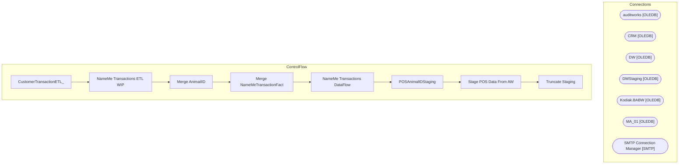

# SSIS Package: CustomerTransactionETL_

**Project:** CustomerTransactionETL_  
**Folder:** CRM  
**Server:** STL-SSIS-P-01  

## Architecture Diagram

## Connection Managers

| Name | Type |
|---|---|
| auditworks | OLEDB |
| CRM | OLEDB |
| DW | OLEDB |
| DWStaging | OLEDB |
| Kodiak.BABW | OLEDB |
| MA_01 | OLEDB |
| SMTP Connection Manager | SMTP |

## Control Flow Tasks

| Task | Type |
|---|---|
| CustomerTransactionETL_ | Microsoft.Package |
| NameMe Transactions ETL WIP | STOCK:SEQUENCE |
| Merge AnimailID | Microsoft.ExecuteSQLTask |
| Merge NameMeTransactionFact | Microsoft.ExecuteSQLTask |
| NameMe Transactions DataFlow | Microsoft.Pipeline |
| POSAnimalIDStaging | Microsoft.ExecuteSQLTask |
| Stage POS Data From AW | Microsoft.Pipeline |
| Truncate Staging | Microsoft.ExecuteSQLTask |

## Data Flow: Sources

| Component | SQL Preview |
|---|---|
|  | select  	cast(l.location_code as varchar(4)) as location_code, 	cast(replace(j.jurisdiction_code, 'HOME', 'US') as varchar(2)) as jurisdiction_code from location l with (nolock) join jurisdiction j with (nolock) on l.jurisdiction_id = j.jurisdiction_id |
|  |  select  max(ID) as ID from tblcustomerrecipient with (nolock) where dRStartTime > '1/1/2003' and pull_storeid <> 0 and dREndTime between '12/31/2022' and '5/1/2025' group by Pull_StoreID, sRBarCodeNumber, dREndTime  |
|  |  select transaction_id, animal_id from POSAnimalID WITH (nolock) where TransactionDate between  '12/31/2022' and '5/1/2025' |
|  | select  	--cast(right(sku,6) as varchar(6)) as SKULookUp,  	cast(style_code as varchar(6)) as SKULookup, 	cast(jurisdiction_code as varchar(2)) as jurisdiction_code,  	product_key  from product_dim with (nolock) where concept = 'Bab Workshop' |
|  | select * from [dbo].[store_dim] |

## Data Flow: Destinations

| Component | Destination |
|---|---|
|  | [dbo].[NameMeTransactionFactNoMatchLocLookUp] |
|  | [dbo].[NameMeTransactionFactStage] |
|  | [dbo].[POSAnimalIDStaging] |
|  | [dbo].[vwDW_POSAnimalIDs_Av] |

