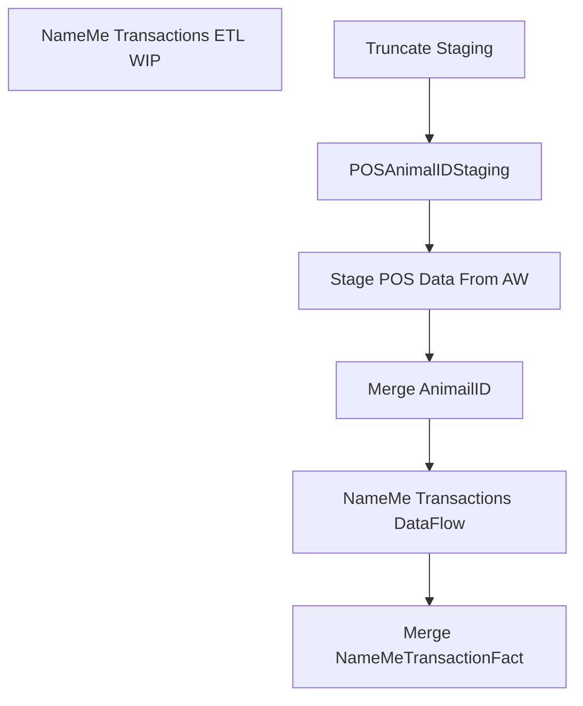

# SSIS Package: CustomerTransactionETL_

**Project:** CustomerTransactionETL_  
**Folder:** CRM  
**Server:** STL-SSIS-P-01  

## Connection Managers

| Name | Type | Server | Catalog | Connection (sanitized) |
|---|---|---|---|---|
| CRM | OLEDB | STL-CRMDB-P-01 | crm | Data Source=STL-CRMDB-P-01; Initial Catalog=crm; Provider=SQLNCLI11.1; Integrated Security=SSPI; Auto Translate=False |
| DW | OLEDB | papamart | dw | Data Source=papamart; Initial Catalog=dw; Provider=SQLNCLI11.1; Integrated Security=SSPI; Auto Translate=False |
| DWStaging | OLEDB | papamart | DWStaging | Data Source=papamart; Initial Catalog=DWStaging; Provider=SQLNCLI11.1; Integrated Security=SSPI; Auto Translate=False |
| Kodiak.BABW | OLEDB | KODIAK | babw | Data Source=KODIAK; Initial Catalog=babw; Provider=SQLNCLI11.1; Integrated Security=SSPI; Auto Translate=False |
| MA_01 | OLEDB | bedrockdb02 | ma_01 | Data Source=bedrockdb02; Initial Catalog=ma_01; Provider=SQLNCLI11.1; Integrated Security=SSPI; Auto Translate=False |
| SMTP Connection Manager | SMTP |  |  |  |
| auditworks | OLEDB | BEDROCKDB01 | auditworks | Data Source=BEDROCKDB01; Initial Catalog=auditworks; Provider=SQLNCLI11.1; Integrated Security=SSPI; Auto Translate=False |

## Control Flow Tasks

| Task | Type |
|---|---|
| CustomerTransactionETL_ | Package |
| NameMe Transactions ETL WIP | SEQUENCE |
| Merge AnimailID | ExecuteSQLTask |
| Merge NameMeTransactionFact | ExecuteSQLTask |
| NameMe Transactions DataFlow | Pipeline |
| POSAnimalIDStaging | ExecuteSQLTask |
| Stage POS Data From AW | Pipeline |
| Truncate Staging | ExecuteSQLTask |

## Control Flow Outline

```text
- NameMe Transactions ETL WIP [SEQUENCE]
  - Merge AnimailID [ExecuteSQLTask]
  - Merge NameMeTransactionFact [ExecuteSQLTask]
  - NameMe Transactions DataFlow [Pipeline]
  - POSAnimalIDStaging [ExecuteSQLTask]
  - Stage POS Data From AW [Pipeline]
  - Truncate Staging [ExecuteSQLTask]
```

## Architecture Diagram



## Variables

| Namespace | Name | Expression-bound |
|---|---|---|
| User | BatchRunDate | No |
| User | CRMTransactionsTemp | No |
| User | Count_CRMTransactionFactMergeInsert | No |
| User | Count_CRMTransactionFactMergeUpdate | No |
| User | Count_CRMTransactionFactStage | No |
| User | Count_CustomerDimMergeInsert | No |
| User | Count_CustomerDimMergeUpdate | No |
| User | Count_CustomerDimStage | No |
| User | Count_NameMeTransactionFactMergeInsert | No |
| User | Count_NameMeTransactionFactMergeUpdate | No |
| User | Count_NameMeTransactionFactStage | No |
| User | CustFile | No |
| User | DeleteCount | No |
| User | DisableEventHandlerPostExecute | No |
| User | EndDate | Yes |
| User | ErrorCount | No |
| User | ErrorEmailActive | No |
| User | ErrorEmailMsg | No |
| User | ErrorEmailMsgAdditional | No |
| User | ErrorEmailMsgFooter | No |
| User | ErrorEmailMsgHeader | Yes |
| User | ErrorEmailMsgLog | No |
| User | ErrorEmailMsgLogQuery | Yes |
| User | ErrorEmailMsgValidation | No |
| User | ErrorEmailRecipientList | No |
| User | ErrorEmailSubject | Yes |
| User | GetDate | Yes |
| User | InsertCount | No |
| User | LogID | No |
| User | ParentLogID | No |
| User | RowCount | No |
| User | SQL_NameMeAnimalIDLookup | Yes |
| User | SQL_NameMeTransLookup | Yes |
| User | SQL_ValidationLog | Yes |
| User | SQL_vwDW_CRMTransactionFact | Yes |
| User | SQL_vwDW_CustomerDim | Yes |
| User | SQL_vwDW_CustomerDimWIP | Yes |
| User | SQL_vwDW_CustomerDimWIP2 | Yes |
| User | SQL_vwDW_NameMeTransactionFact | Yes |
| User | SQL_vwDW_NameMeTransactionFact_WIP | Yes |
| User | StartDate | Yes |
| User | UnprocessedCount | No |
| User | UpdateCount | No |
| User | ValidationStatus_CRMCustomerDimMerge | No |
| User | ValidationStatus_CRMTransactionFactMerge | No |
| User | ValidationStatus_NameMeTransactionFactMerge | No |

### Expression-bound variable values

#### User::EndDate

**Expression:**

```sql
dateadd("dd", @[$Package::DaysToInclude], @[User::StartDate])
```

**Evaluated value:**

```sql
5/1/2025
```

#### User::ErrorEmailMsgHeader

**Expression:**

```sql
"Machine:  " + @[System::MachineName] + " Package:  " + @[System::PackageName] + " Date:   " + (DT_STR, 30, 1252)  GETDATE() + " LogID:  " + (DT_STR, 30, 1252)@[User::ParentLogID]
```

**Evaluated value:**

```sql
Machine:  STL-BIDEV-D-05 Package:  CustomerTransactionETL_ Date:   2025-05-01 15:18:01.313000000 LogID:  435135
```

#### User::ErrorEmailMsgLogQuery

**Expression:**

```sql
"
select 'Source: ' + source + ' Error: ' + message as Message 
from ssistemplates.dbo.sysssislog with (nolock) 
where executionid = '" +  @[System::ExecutionInstanceGUID] + "' and event = 'OnError'"
```

**Evaluated value:**

```sql

select 'Source: ' + source + ' Error: ' + message as Message 
from ssistemplates.dbo.sysssislog with (nolock) 
where executionid = '{66EAEC74-2B47-48E8-A45C-F2BB5960DBFF}' and event = 'OnError'
```

#### User::ErrorEmailSubject

**Expression:**

```sql
"Error: " + @[System::PackageName] + " On " + @[System::MachineName] 
```

**Evaluated value:**

```sql
Error: CustomerTransactionETL_ On STL-BIDEV-D-05
```

#### User::GetDate

**Expression:**

```sql
(DT_DATE)DATEDIFF("Day", (DT_DATE) 0, GETDATE())
```

**Evaluated value:**

```sql
5/1/2025
```

#### User::SQL_NameMeAnimalIDLookup

**Expression:**

```sql
"
select transaction_id, animal_id from POSAnimalID WITH (nolock) where TransactionDate between  '" + (DT_STR, 10, 1252)@[User::StartDate] + "' and '" + (DT_STR, 10, 1252)@[User::EndDate] + "'"
```

**Evaluated value:**

```sql

select transaction_id, animal_id from POSAnimalID WITH (nolock) where TransactionDate between  '12/31/2022' and '5/1/2025'
```

#### User::SQL_NameMeTransLookup

**Expression:**

```sql
"
select 
max(ID) as ID
from tblcustomerrecipient with (nolock)
where dRStartTime > '1/1/2003'
and pull_storeid <> 0
and dREndTime between '" + (DT_STR, 10, 1252)@[User::StartDate] + "' and '" + (DT_STR, 10, 1252)@[User::EndDate] +
"' group by Pull_StoreID, sRBarCodeNumber, dREndTime
"
```

**Evaluated value:**

```sql

select 
max(ID) as ID
from tblcustomerrecipient with (nolock)
where dRStartTime > '1/1/2003'
and pull_storeid <> 0
and dREndTime between '12/31/2022' and '5/1/2025' group by Pull_StoreID, sRBarCodeNumber, dREndTime

```

#### User::SQL_ValidationLog

**Expression:**

```sql
"exec spCustomerTransactionETLLog '" + 
(DT_STR, 25, 1252) @[System::StartTime] + "'"
+
", " +
(DT_STR, 25, 1252) @[User::Count_CustomerDimStage] + ","  +
(DT_STR, 25, 1252) @[User::Count_CustomerDimMergeInsert] + ","  +
(DT_STR, 25, 1252) @[User::Count_CustomerDimMergeUpdate] + ","  +
(DT_STR, 25, 1252) @[User::Count_CRMTransactionFactStage] + ","  +
(DT_STR, 25, 1252) @[User::Count_CRMTransactionFactMergeInsert] + ","  +
(DT_STR, 25, 1252) @[User::Count_CRMTransactionFactMergeUpdate] + ","  +
(DT_STR, 25, 1252) @[User::Count_NameMeTransactionFactStage] + ","  +
(DT_STR, 25, 1252) @[User::Count_NameMeTransactionFactMergeInsert] + ","  +
(DT_STR, 25, 1252) @[User::Count_NameMeTransactionFactMergeUpdate] + ","  +
 (DT_STR, 25, 1252)  @[User::LogID]  + ","
 +  (DT_STR, 25, 1252) @[User::ValidationStatus_CRMCustomerDimMerge] + "," +  (DT_STR, 25, 1252) @[User::ValidationStatus_CRMTransactionFactMerge] + "," +  (DT_STR, 25, 1252) @[User::ValidationStatus_NameMeTransactionFactMerge] + ""
```

**Evaluated value:**

```sql
exec spCustomerTransactionETLLog '5/1/2025 3:18:00 PM', 0,0,0,0,0,0,0,0,0,1,0,0,0
```

#### User::SQL_vwDW_CRMTransactionFact

**Expression:**

```sql
"SELECT 
CRMTransactionID,
StoreNo,
TransactionDate,
TransactionPostedDate,
CRMTransactionType,
POSTransactionNumber,
POSRegisterNumber,
CustomerNumber,
PointsEarned, TransactionIDTF
 FROM vwDW_CRMTransactionFactPreStage 
WHERE
 TransactionPostedDate between '" + (DT_STR, 10, 1252)@[User::StartDate] + "' and '" + (DT_STR, 10, 1252)@[User::EndDate] + "'"
```

**Evaluated value:**

```sql
SELECT 
CRMTransactionID,
StoreNo,
TransactionDate,
TransactionPostedDate,
CRMTransactionType,
POSTransactionNumber,
POSRegisterNumber,
CustomerNumber,
PointsEarned, TransactionIDTF
 FROM vwDW_CRMTransactionFactPreStage 
WHERE
 TransactionPostedDate between '12/31/2022' and '5/1/2025'
```

#### User::SQL_vwDW_CustomerDim

**Expression:**

```sql
"SELECT
 
CustomerID,
 
CustomerNumber,
 
MembershipDate,
 
Gender,
 
BirthDate,
	 
LanguageCode,
 
 CRMUpdateDate,
 
StoreNo, 
CountryCode,
 
PostalCode,
 
PointsEligible,
 
MembershipType, Emailable, SubscriberKey, DirectMailOptIn, HasPhoneNumber  
FROM vwDW_CustomerDim WHERE 
cast(MembershipDate as date)  between '" + (DT_STR, 10, 1252)@[User::StartDate] + "' and '" + (DT_STR, 10, 1252)@[User::EndDate] +"' 

or cast(CRMUpdateDate as date)  between '" + (DT_STR, 10, 1252)@[User::StartDate] + "' and '" + (DT_STR, 10, 1252)@[User::EndDate] + "'"
```

**Evaluated value:**

```sql
SELECT
 
CustomerID,
 
CustomerNumber,
 
MembershipDate,
 
Gender,
 
BirthDate,
	 
LanguageCode,
 
 CRMUpdateDate,
 
StoreNo, 
CountryCode,
 
PostalCode,
 
PointsEligible,
 
MembershipType, Emailable, SubscriberKey, DirectMailOptIn, HasPhoneNumber  
FROM vwDW_CustomerDim WHERE 
cast(MembershipDate as date)  between '12/31/2022' and '5/1/2025' 

or cast(CRMUpdateDate as date)  between '12/31/2022' and '5/1/2025'
```

#### User::SQL_vwDW_CustomerDimWIP

**Expression:**

```sql
"SELECT 
	d.CustomerID,
	d.CustomerNumber,
	d.MembershipDate,
	d.Gender,
	d.BirthDate,
	d.LanguageCode,
	d.CreateDate,
	d.CRMUpdateDate,
	d.StoreNo,
	d.CountryCode,
	d.PostalCode,
	d.PointsEligible,
	d.MembershipType,
	d.MembershipPlan,
 d.Emailable,
	d.SubscriberKey,
	d.DirectMailOptIn,
	d.HasPhoneNumber,
	d.telephone_no,
	d.locale,
	d.text_opt_in_flag,
	d.EmailOptInDate,
	d.EmailAddress,
	d.ClubStatus,
	d.CurrentRewardPoints,
	d.LifetimeTotalPointsEarned,
	d.SignUpSource,
	d.address_1,
	d.address_2,
	d.address_3,
	d.address_4,
	d.hasOnlineAccount,
	/*case 
		when d.ClubStatus = 'active' and 
		d.MembershipType in ('BASI','SFS','CLUB','PREF') 
			then 1 
		else 0 
	end as isBonusClubMember*/
	d.PointsEligible as isBonusClubMember,
	d.first_name,
	d.last_name
FROM vwDW_CustomerDimWIP d
 WHERE cast(MembershipDate as date)  between cast('" + (DT_STR, 10, 1252)@[User::StartDate] + "' as date) and cast('" + (DT_STR, 10, 1252)@[User::EndDate] +"' as date) 
or cast(CRMUpdateDate as date)  between cast('" + (DT_STR, 10, 1252)@[User::StartDate] + "' as date) and cast('" + (DT_STR, 10, 1252)@[User::EndDate] + "' as date) 
or exists (select p.CustomerNumber from tmpPointsEarned p where p.CustomerNumber=d.CustomerNumber and isUpdatedRecently=1)"
```

**Evaluated value:**

```sql
SELECT 
	d.CustomerID,
	d.CustomerNumber,
	d.MembershipDate,
	d.Gender,
	d.BirthDate,
	d.LanguageCode,
	d.CreateDate,
	d.CRMUpdateDate,
	d.StoreNo,
	d.CountryCode,
	d.PostalCode,
	d.PointsEligible,
	d.MembershipType,
	d.MembershipPlan,
 d.Emailable,
	d.SubscriberKey,
	d.DirectMailOptIn,
	d.HasPhoneNumber,
	d.telephone_no,
	d.locale,
	d.text_opt_in_flag,
	d.EmailOptInDate,
	d.EmailAddress,
	d.ClubStatus,
	d.CurrentRewardPoints,
	d.LifetimeTotalPointsEarned,
	d.SignUpSource,
	d.address_1,
	d.address_2,
	d.address_3,
	d.address_4,
	d.hasOnlineAccount,
	/*case 
		when d.ClubStatus = 'active' and 
		d.MembershipType in ('BASI','SFS','CLUB','PREF') 
			then 1 
		else 0 
	end as isBonusClubMember*/
	d.PointsEligible as isBonusClubMember,
	d.first_name,
	d.last_name
FROM vwDW_CustomerDimWIP d
 WHERE cast(MembershipDate as date)  between cast('12/31/2022' as date) and cast('5/1/2025' as date) 
or cast(CRMUpdateDate as date)  between cast('12/31/2022' as date) and cast('5/1/2025' as date) 
or exists (select p.CustomerNumber from tmpPointsEarned p where p.CustomerNumber=d.CustomerNumber and isUpdatedRecently=1)
```

#### User::SQL_vwDW_CustomerDimWIP2

**Expression:**

```sql
"SELECT 
	d.CustomerID,
	d.CustomerNumber,
	d.MembershipDate,
	d.OriginDate, d.Gender,
	d.BirthDate,
	d.LanguageCode,
	d.CreateDate,
	d.CRMUpdateDate,
	d.StoreNo,
	d.CountryCode,
	d.PostalCode,
	d.PointsEligible,
	d.MembershipType,
	d.MembershipPlan,
 d.Emailable,
	d.SubscriberKey,
	d.DirectMailOptIn,
	d.HasPhoneNumber,
	d.telephone_no,
	d.locale,
	d.text_opt_in_flag,
	d.EmailOptInDate,
	d.EmailAddress,
	d.ClubStatus,
	d.CurrentRewardPoints,
	d.LifetimeTotalPointsEarned,
	d.SignUpSource,
	d.address_1,
	d.address_2,
	d.address_3,
	d.address_4,
	d.hasOnlineAccount,
	/*case 
		when d.ClubStatus = 'active' and 
		d.MembershipType in ('BASI','SFS','CLUB','PREF') 
			then 1 
		else 0 
	end as isBonusClubMember*/
	d.PointsEligible as isBonusClubMember,
	d.first_name,
	d.last_name
FROM vwDW_CustomerDimWIP2 d
 WHERE cast(MembershipDate as date)  between cast('" + (DT_STR, 10, 1252)@[User::StartDate] + "' as date) and cast('" + (DT_STR, 10, 1252)@[User::EndDate] +"' as date) 
or cast(CRMUpdateDate as date)  between cast('" + (DT_STR, 10, 1252)@[User::StartDate] + "' as date) and cast('" + (DT_STR, 10, 1252)@[User::EndDate] + "' as date) 
or exists (select p.CustomerNumber from tmpPointsEarned p where p.CustomerNumber=d.CustomerNumber and isUpdatedRecently=1)"
```

**Evaluated value:**

```sql
SELECT 
	d.CustomerID,
	d.CustomerNumber,
	d.MembershipDate,
	d.OriginDate, d.Gender,
	d.BirthDate,
	d.LanguageCode,
	d.CreateDate,
	d.CRMUpdateDate,
	d.StoreNo,
	d.CountryCode,
	d.PostalCode,
	d.PointsEligible,
	d.MembershipType,
	d.MembershipPlan,
 d.Emailable,
	d.SubscriberKey,
	d.DirectMailOptIn,
	d.HasPhoneNumber,
	d.telephone_no,
	d.locale,
	d.text_opt_in_flag,
	d.EmailOptInDate,
	d.EmailAddress,
	d.ClubStatus,
	d.CurrentRewardPoints,
	d.LifetimeTotalPointsEarned,
	d.SignUpSource,
	d.address_1,
	d.address_2,
	d.address_3,
	d.address_4,
	d.hasOnlineAccount,
	/*case 
		when d.ClubStatus = 'active' and 
		d.MembershipType in ('BASI','SFS','CLUB','PREF') 
			then 1 
		else 0 
	end as isBonusClubMember*/
	d.PointsEligible as isBonusClubMember,
	d.first_name,
	d.last_name
FROM vwDW_CustomerDimWIP2 d
 WHERE cast(MembershipDate as date)  between cast('12/31/2022' as date) and cast('5/1/2025' as date) 
or cast(CRMUpdateDate as date)  between cast('12/31/2022' as date) and cast('5/1/2025' as date) 
or exists (select p.CustomerNumber from tmpPointsEarned p where p.CustomerNumber=d.CustomerNumber and isUpdatedRecently=1)
```

#### User::SQL_vwDW_NameMeTransactionFact

**Expression:**

```sql
"SELECT
	Pull_StoreID,
	LocationCode, SKULookUp,
	NameMeTransactionNumber,
	AnimalBarcode,
	AnimalName,
	AnimalBirthDate,
	TransactionStartDate,
	TransactionEndDate,
	Gift,
	FirstVisit,
	RecipBirthDate
,TransactionSource, Gender FROM vwDW_NameMeTransactionFact
WHERE 
cast(TransactionStartDate as date)  between '" + (DT_STR, 10, 1252)@[User::StartDate] + "' and '" + (DT_STR, 10, 1252)@[User::EndDate] + "'"
```

**Evaluated value:**

```sql
SELECT
	Pull_StoreID,
	LocationCode, SKULookUp,
	NameMeTransactionNumber,
	AnimalBarcode,
	AnimalName,
	AnimalBirthDate,
	TransactionStartDate,
	TransactionEndDate,
	Gift,
	FirstVisit,
	RecipBirthDate
,TransactionSource, Gender FROM vwDW_NameMeTransactionFact
WHERE 
cast(TransactionStartDate as date)  between '12/31/2022' and '5/1/2025'
```

#### User::SQL_vwDW_NameMeTransactionFact_WIP

**Expression:**

```sql
"SELECT
	Pull_StoreID,
	LocationCode, SKULookUp,
	NameMeTransactionNumber,
	AnimalBarcode,
	AnimalName,
	AnimalBirthDate,
	TransactionStartDate,
	TransactionEndDate,
	Gift,
	FirstVisit,
	RecipBirthDate
,TransactionSource, Gender FROM vwDW_NameMeTransactionFact_WIP WHERE LocationCode > '0499' and LocationCode < '0999' and 
cast(TransactionStartDate as date)  between '" + (DT_STR, 10, 1252)@[User::StartDate] + "' and '" + (DT_STR, 10, 1252)@[User::EndDate] + "'"
```

**Evaluated value:**

```sql
SELECT
	Pull_StoreID,
	LocationCode, SKULookUp,
	NameMeTransactionNumber,
	AnimalBarcode,
	AnimalName,
	AnimalBirthDate,
	TransactionStartDate,
	TransactionEndDate,
	Gift,
	FirstVisit,
	RecipBirthDate
,TransactionSource, Gender FROM vwDW_NameMeTransactionFact_WIP WHERE LocationCode > '0499' and LocationCode < '0999' and 
cast(TransactionStartDate as date)  between '12/31/2022' and '5/1/2025'
```

#### User::StartDate

**Expression:**

```sql
dateadd("dd", -@[$Package::DaysToGoBack] , @[User::GetDate] )
```

**Evaluated value:**

```sql
12/31/2022
```

## Execute SQL Tasks

### Merge AnimailID

**Path:** `Package\NameMe Transactions ETL WIP\Merge AnimailID`  
**Connection:** DWStaging (papamart/DWStaging)  

```sql
exec spMergeAnimalID
```

### Merge NameMeTransactionFact

**Path:** `Package\NameMe Transactions ETL WIP\Merge NameMeTransactionFact`  
**Connection:** DWStaging (papamart/DWStaging)  

```sql
exec dwstaging.dbo.spNameMeTransactionFactMerge
```

### POSAnimalIDStaging

**Path:** `Package\NameMe Transactions ETL WIP\POSAnimalIDStaging`  
**Connection:** DWStaging (papamart/DWStaging)  

```sql
truncate table POSAnimalIDStaging
```

### Truncate Staging

**Path:** `Package\NameMe Transactions ETL WIP\Truncate Staging`  
**Connection:** DWStaging (papamart/DWStaging)  

```sql
TRUNCATE TABLE NameMeTransactionFactStage 
TRUNCATE TABLE POSAnimalIDStaging

```

## Data Flow: Sources

| Component | Source Object | Type | Data Flow Task | Connection | SQL Kind |
|---|---|---|---|---|---|
| vwDW_NameMeTransactionFact |  | OLEDBSource | NameMe Transactions DataFlow | Kodiak.BABW |  |
| vwDW_POSAnimalIDs |  | OLEDBSource | Stage POS Data From AW | auditworks |  |

## Data Flow: Destinations

| Component | Target Table | Type | Data Flow Task | Connection | SQL Kind |
|---|---|---|---|---|---|
| NameMeTransactionFactNoMatchLocLookUp |  | OLEDBDestination | NameMe Transactions DataFlow | DWStaging |  |
| NameMeTransactionFactStage |  | OLEDBDestination | NameMe Transactions DataFlow | DWStaging |  |
| POSAnimalIDStaging |  | OLEDBDestination | Stage POS Data From AW | DWStaging |  |
