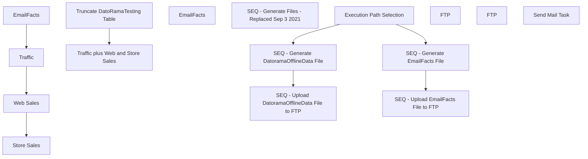

# SSIS Package: DatoRamaETL

**Project:** DatoRamaETL  
**Folder:** CRM  
**Server:** STL-SSIS-P-01  

## Connection Managers

| Name | Type | Server | Catalog | Connection (sanitized) |
|---|---|---|---|---|
| Azure | ADO.NET:System.Data.OleDb.OleDbConnection, System.Data, Version=4.0.0.0, Culture=neutral, PublicKeyToken=b77a5c561934e089 | asazure://northcentralus.asazure.windows.net/azasp01 | BABW-DW | Data Source=asazure://northcentralus.asazure.windows.net/azasp01; Initial Catalog=BABW-DW; Provider=MSOLAP.7 |
| DW | OLEDB | papamart | dw | Data Source=papamart; Initial Catalog=dw; Provider=SQLNCLI11.1; Integrated Security=SSPI; Auto Translate=False |
| DatoRamaMergedCSV | FLATFILE |  |  |  |
| EmailFacts | FLATFILE |  |  |  |
| IntegrationStaging | OLEDB | STL-SSIS-P-01 | IntegrationStaging | Data Source=STL-SSIS-P-01; Initial Catalog=IntegrationStaging; Provider=SQLNCLI11.1; Integrated Security=SSPI; Auto Translate=False |
| SMTP | SMTP |  |  |  |
| StoreSalesCSV | FLATFILE |  |  |  |
| TrafficCSV | FLATFILE |  |  |  |
| WebSalesCSV | FLATFILE |  |  |  |

## Control Flow Tasks

| Task | Type |
|---|---|
| DatoRamaETL | Package |
| Execution Path Selection | ExecuteSQLTask |
| SEQ - Generate DatoramaOfflineData File | SEQUENCE |
| Traffic plus Web and Store Sales | Pipeline |
| Truncate DatoRamaTesting Table | ExecuteSQLTask |
| SEQ - Generate EmailFacts File | SEQUENCE |
| EmailFacts | Pipeline |
| SEQ - Generate Files - Replaced Sep 3 2021 | SEQUENCE |
| EmailFacts | Pipeline |
| Store Sales | Pipeline |
| Traffic | Pipeline |
| Web Sales | Pipeline |
| SEQ - Upload DatoramaOfflineData File to FTP | SEQUENCE |
| FTP | ExecuteSQLTask |
| SEQ - Upload EmailFacts File to FTP | SEQUENCE |
| FTP | ExecuteSQLTask |
| Send Mail Task | SendMailTask |

## Control Flow Outline

```text
- Send Mail Task [SendMailTask]
- Execution Path Selection [ExecuteSQLTask]
- SEQ - Generate DatoramaOfflineData File [SEQUENCE]
  - Traffic plus Web and Store Sales [Pipeline]
  - Truncate DatoRamaTesting Table [ExecuteSQLTask]
- SEQ - Generate EmailFacts File [SEQUENCE]
  - EmailFacts [Pipeline]
- SEQ - Generate Files - Replaced Sep 3 2021 [SEQUENCE]
  - EmailFacts [Pipeline]
  - Store Sales [Pipeline]
  - Traffic [Pipeline]
  - Web Sales [Pipeline]
- SEQ - Upload DatoramaOfflineData File to FTP [SEQUENCE]
  - FTP [ExecuteSQLTask]
- SEQ - Upload EmailFacts File to FTP [SEQUENCE]
  - FTP [ExecuteSQLTask]
```

## Architecture Diagram



## Variables

| Namespace | Name | Expression-bound |
|---|---|---|
| System | Propagate | No |
| User | DateTimeStamp | Yes |
| User | EndDate | Yes |
| User | EndDateAsDATE | Yes |
| User | ExecutionPathResult | No |
| User | FilePathEmailFact | Yes |
| User | FilePathMergedFile | Yes |
| User | FilePathStoreSales | Yes |
| User | FilePathTraffic | Yes |
| User | FilePathWebSales | Yes |
| User | GetDate | Yes |
| User | GetDateAsDATE | Yes |
| User | StartDate | Yes |
| User | StartDateAsDATE | Yes |

### Expression-bound variable values

#### User::DateTimeStamp

**Expression:**

```sql
(DT_WSTR,4)DATEPART("yyyy",GetDate()) 
+ (DT_WSTR,4)DATEPART("mm",GetDate()) 
+ (DT_WSTR,4)DATEPART("dd",GetDate()) 
+ (DT_WSTR,4)DATEPART("hh",GetDate()) 
+ (DT_WSTR,4)DATEPART("mi",GetDate()) 
+ (DT_WSTR,4)DATEPART("ss",GetDate()) 
+ (DT_WSTR,4)DATEPART("ms",GetDate())
```

**Evaluated value:**

```sql
20219211055817
```

#### User::EndDate

**Expression:**

```sql
dateadd("dd", @[$Package::DaysToInclude], @[User::StartDate])
```

**Evaluated value:**

```sql
9/20/2021
```

#### User::EndDateAsDATE

**Expression:**

```sql
(DT_WSTR, 4) datepart("year", @[User::EndDate])  + "-" +
right("0"+ (DT_WSTR, 2) datepart("mm", @[User::EndDate]),2)  + "-" +
right("0" +(DT_WSTR, 2) datepart("dd",  @[User::EndDate]),2)
```

**Evaluated value:**

```sql
2021-09-20
```

#### User::FilePathEmailFact

**Expression:**

```sql
@[$Package::DatoRamaFileStagePath] + "EmailFact.csv"
```

**Evaluated value:**

```sql
\\stl-ssis-p-01\IntegrationStaging\DatoRama\EmailFact.csv
```

#### User::FilePathMergedFile

**Expression:**

```sql
@[$Package::DatoRamaFileStagePath] +"DatoramaOfflineData.csv"
```

**Evaluated value:**

```sql
\\stl-ssis-p-01\IntegrationStaging\DatoRama\DatoramaOfflineData.csv
```

#### User::FilePathStoreSales

**Expression:**

```sql
@[$Package::DatoRamaFileStagePath] + "StoreSales.csv"
```

**Evaluated value:**

```sql
\\stl-ssis-p-01\IntegrationStaging\DatoRama\StoreSales.csv
```

#### User::FilePathTraffic

**Expression:**

```sql
@[$Package::DatoRamaFileStagePath] + "Traffic.csv"
```

**Evaluated value:**

```sql
\\stl-ssis-p-01\IntegrationStaging\DatoRama\Traffic.csv
```

#### User::FilePathWebSales

**Expression:**

```sql
@[$Package::DatoRamaFileStagePath] + "WebSales.csv"
```

**Evaluated value:**

```sql
\\stl-ssis-p-01\IntegrationStaging\DatoRama\WebSales.csv
```

#### User::GetDate

**Expression:**

```sql
(DT_DATE)DATEDIFF("Day", (DT_DATE) 0, GETDATE())
```

**Evaluated value:**

```sql
9/21/2021
```

#### User::GetDateAsDATE

**Expression:**

```sql
(DT_WSTR, 4) datepart("year", @[User::GetDate])  + "-" +
right("0"+ (DT_WSTR, 2) datepart("mm", @[User::GetDate]),2)  + "-" +
right("0" +(DT_WSTR, 2) datepart("dd",  @[User::GetDate]),2)
```

**Evaluated value:**

```sql
2021-09-21
```

#### User::StartDate

**Expression:**

```sql
dateadd("dd", -@[$Package::DaysToGoBack] , @[User::GetDate] )
```

**Evaluated value:**

```sql
8/21/2021
```

#### User::StartDateAsDATE

**Expression:**

```sql
(DT_WSTR, 4) datepart("year", @[User::StartDate])  + "-" +
right("0"+ (DT_WSTR, 2) datepart("mm", @[User::StartDate]),2)  + "-" +
right("0" +(DT_WSTR, 2) datepart("dd",  @[User::StartDate]),2)
```

**Evaluated value:**

```sql
2021-08-21
```

## Execute SQL Tasks

### Execution Path Selection

**Path:** `Package\Execution Path Selection`  
**Connection:** IntegrationStaging (STL-SSIS-P-01/IntegrationStaging)  

> ⚠️ `SqlStatementSource` is overridden at runtime by a property expression (shown below); the static SQL may not be what executes.

**Static SqlStatementSource:**

```sql
select 'DatoramaOfflineData' as Result
```

**Property expression (runtime override):**

```sql
"select "+"'"+ @[$Package::ExecutionPath]+"'"+" as Result"
```

### Truncate DatoRamaTesting Table

**Path:** `Package\SEQ - Generate DatoramaOfflineData File\Truncate DatoRamaTesting Table`  
**Connection:** IntegrationStaging (STL-SSIS-P-01/IntegrationStaging)  

```sql
truncate table DatoRamaTesting
```

### FTP

**Path:** `Package\SEQ - Upload DatoramaOfflineData File to FTP\FTP`  
**Connection:** IntegrationStaging (STL-SSIS-P-01/IntegrationStaging)  

```sql
declare 
	@winSCP varchar(1000),
	@script varchar(1000),
	@log varchar(1000),
	@FTP varchar(4000)

select
	@winSCP = '"\\stl-ssis-p-01\C$\Program Files (x86)\WinSCP\WinSCP.exe"',
	@script = ' /script=\\stl-ssis-p-01\IntegrationStaging\DatoRama\FTP\DatoRamaFTP.txt',
	@log = ' /log=\\stl-ssis-p-01\IntegrationStaging\DatoRama\FTP\Upload.log',
	@FTP = (@winSCP + @script + @log)
			
			
exec master..xp_cmdshell @FTP
```

### FTP

**Path:** `Package\SEQ - Upload EmailFacts File to FTP\FTP`  
**Connection:** IntegrationStaging (STL-SSIS-P-01/IntegrationStaging)  

```sql
declare 
 @winSCP varchar(1000),
 @script varchar(1000),
 @log varchar(1000),
 @FTP varchar(4000)

select
 @winSCP = '"\\stl-ssis-p-01\C$\Program Files (x86)\WinSCP\WinSCP.exe"',
 @script = ' /script=\\stl-ssis-p-01\IntegrationStaging\DatoRama\FTP\DatoRamaFTP_EmailFacts.txt',
 @log = ' /log=\\stl-ssis-p-01\IntegrationStaging\DatoRama\FTP\Upload.log',
 @FTP = (@winSCP + @script + @log)
   
   
exec master..xp_cmdshell @FTP
```

## Data Flow: Sources

| Component | Source Object | Type | Data Flow Task | Connection | SQL Kind |
|---|---|---|---|---|---|
| EmailFacts |  | OLEDBSource | EmailFacts | DW | SqlCommand |
| EmailFacts |  | OLEDBSource | EmailFacts | DW | SqlCommand |

#### EmailFacts — SqlCommand

```sql
select 
	cast(SendDate as date) as SendDate,
	AudienceSeg,		
	LastPurchaseChan,
	sum(case when ClickDate is null then 0 else 1 end) as ClickCount,
	sum(case when OpenDate is null then 0 else 1 end) as OpenCount,
	sum(case when BounceDate is null then 0 else 1 end) as BounceCount,
	sum(case when UnSubDate is null then 0 else 1 end) as UnSubCount,
	PreferredStory,
	sum(retRev1) RetailSalesDayOne,
	sum(webRev1) WebSalesDayOne,
	sum(retRev2) RetailSalesDayTwo,
	sum(webRev2) WebSalesDayTwo,
	sum(retRev3) RetailSalesDayThree,
	sum(webRev3) WebSalesDayThree,
	sum(FrequencyCount1m) FrequencyCount1m,	
	sum(FrequencyCount3m) FrequencyCount3m,	
	sum(FrequencyCount6m) FrequencyCount6m,	
	sum(FrequencyCount12m) FrequencyCount12m,	
	sum(FrequencyCount18m) FrequencyCount18m,	
	sum(FrequencyCount24m) FrequencyCount24m,	
	sum(FrequencyCountTtl) FrequencyCountTtl,	
	sum(RecencyCount1m) RecencyCount1m,	
	sum(RecencyCount3m) RecencyCount3m,	
	sum(RecencyCount6m) RecencyCount6m,	
	sum(RecencyCount12m) RecencyCount12m,	
	sum(RecencyCount24m) RecencyCount24m,	
	sum(RecencyCountTtl) RecencyCountTtl,	
	sum(MonetarySum1m) MonetarySum1m,	
	sum(MonetarySum3m) MonetarySum3m,	
	sum(MonetarySum6m) MonetarySum6m,	
	sum(MonetarySum12m) MonetarySum12m,	
	sum(MonetarySum18m) MonetarySum18m,	
	sum(MonetarySum24m) MonetarySum24m,	
	sum(MonetarySumTtl)	MonetarySumTtl
from EmailFact2021
group by 
	cast(SendDate as date),
	AudienceSeg,		
	LastPurchaseChan,
	PreferredStory
```

## Data Flow: Destinations

| Component | Target Table | Type | Data Flow Task | Connection | SQL Kind |
|---|---|---|---|---|---|
| DatoRamaMergedCSV |  | FlatFileDestination | Traffic plus Web and Store Sales | DatoRamaMergedCSV |  |
| OLE DB Destination - Testing for now |  | OLEDBDestination | Traffic plus Web and Store Sales | IntegrationStaging |  |
| EmailFactsCSV |  | FlatFileDestination | EmailFacts | EmailFacts |  |
| EmailFactsCSV |  | FlatFileDestination | EmailFacts | EmailFacts |  |
| StoreSalesCSV |  | FlatFileDestination | Store Sales | StoreSalesCSV |  |
| TrafficCSV |  | FlatFileDestination | Traffic | TrafficCSV |  |
| WebSalesCSV |  | FlatFileDestination | Web Sales | WebSalesCSV |  |
