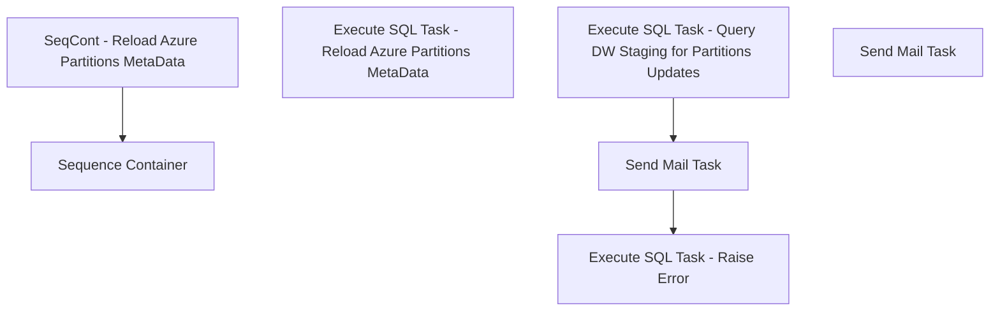

# SSIS Package: DatoRamaETL_PreFlightCheck

**Project:** DatoRamaETL_PreFlightCheck  
**Folder:** CRM  
**Server:** STL-SSIS-P-01  

## Connection Managers

| Name | Type | Server | Catalog | Connection (sanitized) |
|---|---|---|---|---|
| DWStaging | OLEDB | PAPAMART | DWStaging | Data Source=PAPAMART; Initial Catalog=DWStaging; Provider=SQLNCLI11.1; Integrated Security=SSPI; Auto Translate=False |
| IntegrationStaging | OLEDB | STL-SSIS-P-01 | IntegrationStaging | Data Source=STL-SSIS-P-01; Initial Catalog=IntegrationStaging; Provider=SQLNCLI11.1; Integrated Security=SSPI; Auto Translate=False |
| SMTP | SMTP |  |  |  |

## Control Flow Tasks

| Task | Type |
|---|---|
| DatoRamaETL_PreFlightCheck | Package |
| SeqCont - Reload Azure Partitions MetaData | SEQUENCE |
| Execute SQL Task - Reload Azure Partitions MetaData | ExecuteSQLTask |
| Sequence Container | SEQUENCE |
| Execute SQL Task - Query DW Staging for Partitions Updates | ExecuteSQLTask |
| Execute SQL Task - Raise Error | ExecuteSQLTask |
| Send Mail Task | SendMailTask |
| Send Mail Task | SendMailTask |

## Control Flow Outline

```text
- Send Mail Task [SendMailTask]
- SeqCont - Reload Azure Partitions MetaData [SEQUENCE]
  - Execute SQL Task - Reload Azure Partitions MetaData [ExecuteSQLTask]
- Sequence Container [SEQUENCE]
  - Execute SQL Task - Query DW Staging for Partitions Updates [ExecuteSQLTask]
  - Execute SQL Task - Raise Error [ExecuteSQLTask]
  - Send Mail Task [SendMailTask]
```

## Architecture Diagram



## Variables

| Namespace | Name | Expression-bound |
|---|---|---|
| System | Propagate | No |
| User | CountPartitionsUpdatedVar | No |
| User | DateTimeStamp | Yes |
| User | EndDate | Yes |
| User | EndDateAsDATE | Yes |
| User | GetDate | Yes |
| User | GetDateAsDATE | Yes |
| User | StartDate | Yes |
| User | StartDateAsDATE | Yes |

### Expression-bound variable values

#### User::DateTimeStamp

**Expression:**

```sql
(DT_WSTR,4)DATEPART("yyyy",GetDate()) 
+ (DT_WSTR,4)DATEPART("mm",GetDate()) 
+ (DT_WSTR,4)DATEPART("dd",GetDate()) 
+ (DT_WSTR,4)DATEPART("hh",GetDate()) 
+ (DT_WSTR,4)DATEPART("mi",GetDate()) 
+ (DT_WSTR,4)DATEPART("ss",GetDate()) 
+ (DT_WSTR,4)DATEPART("ms",GetDate())
```

**Evaluated value:**

```sql
2021101116352830
```

#### User::EndDate

**Expression:**

```sql
dateadd("dd", @[$Package::DaysToInclude], @[User::StartDate])
```

**Evaluated value:**

```sql
10/11/2021
```

#### User::EndDateAsDATE

**Expression:**

```sql
(DT_WSTR, 4) datepart("year", @[User::EndDate])  + "-" +
right("0"+ (DT_WSTR, 2) datepart("mm", @[User::EndDate]),2)  + "-" +
right("0" +(DT_WSTR, 2) datepart("dd",  @[User::EndDate]),2)
```

**Evaluated value:**

```sql
2021-10-11
```

#### User::GetDate

**Expression:**

```sql
(DT_DATE)DATEDIFF("Day", (DT_DATE) 0, GETDATE())
```

**Evaluated value:**

```sql
10/11/2021
```

#### User::GetDateAsDATE

**Expression:**

```sql
(DT_WSTR, 4) datepart("year", @[User::GetDate])  + "-" +
right("0"+ (DT_WSTR, 2) datepart("mm", @[User::GetDate]),2)  + "-" +
right("0" +(DT_WSTR, 2) datepart("dd",  @[User::GetDate]),2)
```

**Evaluated value:**

```sql
2021-10-11
```

#### User::StartDate

**Expression:**

```sql
dateadd("dd", -@[$Package::DaysToGoBack] , @[User::GetDate] )
```

**Evaluated value:**

```sql
10/10/2021
```

#### User::StartDateAsDATE

**Expression:**

```sql
(DT_WSTR, 4) datepart("year", @[User::StartDate])  + "-" +
right("0"+ (DT_WSTR, 2) datepart("mm", @[User::StartDate]),2)  + "-" +
right("0" +(DT_WSTR, 2) datepart("dd",  @[User::StartDate]),2)
```

**Evaluated value:**

```sql
2021-10-10
```

## Execute SQL Tasks

### Execute SQL Task - Reload Azure Partitions MetaData

**Path:** `Package\SeqCont - Reload Azure Partitions MetaData\Execute SQL Task - Reload Azure Partitions MetaData`  
**Connection:** IntegrationStaging (STL-SSIS-P-01/IntegrationStaging)  

```sql
EXEC [stl-ssis-p-01].msdb.dbo.sp_start_job @job_name='AzurePartitionMetaDownload'
waitfor delay '00:02:00'

```

### Execute SQL Task - Query DW Staging for Partitions Updates

**Path:** `Package\Sequence Container\Execute SQL Task - Query DW Staging for Partitions Updates`  
**Connection:** DWStaging (PAPAMART/DWStaging)  

```sql
with PartitionStatus as (

select
TableType,
TableName,
case when datediff(dd, PartitionRefreshedtime, getdate())=0 then 'YES' else 'NO' end as ProcessedToday,
case when PartitionedTable = 1 then 'YES' else 'NO' end as PartitionedTable,
PartitionName,
PartitionRefreshedtime
from tmpAzurePartitionGroups (nolock) 
where CurrentPartition=1
and TableName in ('TransactionFact','TransactionDetailFact','CRMTransactionFact')
--and case when datediff(dd, PartitionRefreshedtime, getdate())=0 then 'YES' else 'NO' end <> 'YES'
group by
TableType,
TableName,
PartitionedTable,
PartitionName,
PartitionRefreshedtime
--order by TableType, TableName
) 

select count (*) as CountPartitionsUpdated
--select *
from PartitionStatus
where ProcessedToday = 'YES'
--order by TableType, TableName
```

### Execute SQL Task - Raise Error

**Path:** `Package\Sequence Container\Execute SQL Task - Raise Error`  
**Connection:** DWStaging (PAPAMART/DWStaging)  

```sql
RAISERROR ('One or more partitions have not yet been refreshed that DatoramaETL load requires.',16,1)
```

## Data Flow: Sources

_None detected._

## Data Flow: Destinations

_None detected._
