# SSIS Package: DatoRamaETL_PreFlightCheck

**Project:** DatoRamaETL_PreFlightCheck  
**Folder:** CRM  
**Server:** STL-SSIS-P-01  

## Architecture Diagram

```mermaid
flowchart TD
    subgraph Connections
        DWStaging_conn(["DWStaging [OLEDB]"])
        IntegrationStaging_conn(["IntegrationStaging [OLEDB]"])
        SMTP_conn(["SMTP [SMTP]"])
    end
    subgraph ControlFlow
        DatoRamaETL_PreFlightCheck_task["DatoRamaETL_PreFlightCheck"]
        SeqCont___Reload_Azure_Partitions_MetaData_task["SeqCont - Reload Azure Partitions MetaData"]
        DatoRamaETL_PreFlightCheck_task --> SeqCont___Reload_Azure_Partitions_MetaData_task
        Execute_SQL_Task___Reload_Azure_Partitions_MetaData_task["Execute SQL Task - Reload Azure Partitions MetaData"]
        SeqCont___Reload_Azure_Partitions_MetaData_task --> Execute_SQL_Task___Reload_Azure_Partitions_MetaData_task
        Sequence_Container_task["Sequence Container"]
        Execute_SQL_Task___Reload_Azure_Partitions_MetaData_task --> Sequence_Container_task
        Execute_SQL_Task___Query_DW_Staging_for_Partitions_Updates_task["Execute SQL Task - Query DW Staging for Partitions Updates"]
        Sequence_Container_task --> Execute_SQL_Task___Query_DW_Staging_for_Partitions_Updates_task
        Execute_SQL_Task___Raise_Error_task["Execute SQL Task - Raise Error"]
        Execute_SQL_Task___Query_DW_Staging_for_Partitions_Updates_task --> Execute_SQL_Task___Raise_Error_task
        Send_Mail_Task_task["Send Mail Task"]
        Execute_SQL_Task___Raise_Error_task --> Send_Mail_Task_task
        Send_Mail_Task_task["Send Mail Task"]
        Send_Mail_Task_task --> Send_Mail_Task_task
    end
```

## Connection Managers

| Name | Type |
|---|---|
| DWStaging | OLEDB |
| IntegrationStaging | OLEDB |
| SMTP | SMTP |

## Control Flow Tasks

| Task | Type |
|---|---|
| DatoRamaETL_PreFlightCheck | Microsoft.Package |
| SeqCont - Reload Azure Partitions MetaData | STOCK:SEQUENCE |
| Execute SQL Task - Reload Azure Partitions MetaData | Microsoft.ExecuteSQLTask |
| Sequence Container | STOCK:SEQUENCE |
| Execute SQL Task - Query DW Staging for Partitions Updates | Microsoft.ExecuteSQLTask |
| Execute SQL Task - Raise Error | Microsoft.ExecuteSQLTask |
| Send Mail Task | Microsoft.SendMailTask |
| Send Mail Task | Microsoft.SendMailTask |

## Data Flow: Sources

_None detected._

## Data Flow: Destinations

_None detected._

