# SSIS Package: DatoRamaKeyStoryETL

**Project:** DatoRamaKeyStoryETL  
**Folder:** CRM  
**Server:** STL-SSIS-P-01  

## Architecture Diagram

```mermaid
flowchart TD
    subgraph Connections
        BundleKeyStoryFile_conn(["BundleKeyStoryFile [FLATFILE]"])
        DatoRamaKeyStoryOutput_conn(["DatoRamaKeyStoryOutput [FLATFILE]"])
        dw_conn(["dw [OLEDB]"])
        DWStaging_conn(["DWStaging [OLEDB]"])
        IntegrationStaging_conn(["IntegrationStaging [OLEDB]"])
        SMTP_conn(["SMTP [SMTP]"])
    end
    subgraph ControlFlow
        DatoRamaKeyStoryETL_task["DatoRamaKeyStoryETL"]
        SeqCont___Generate_KeyStoryFile___New_task["SeqCont - Generate KeyStoryFile - New"]
        DatoRamaKeyStoryETL_task --> SeqCont___Generate_KeyStoryFile___New_task
        Data_Flow_Task_task["Data Flow Task"]
        SeqCont___Generate_KeyStoryFile___New_task --> Data_Flow_Task_task
        Execute_SQL_Task___Load_tmp_Table_tmpDatoRamaKeyStoryStoreChannel_task["Execute SQL Task - Load tmp Table tmpDatoRamaKeyStoryStoreChannel"]
        Data_Flow_Task_task --> Execute_SQL_Task___Load_tmp_Table_tmpDatoRamaKeyStoryStoreChannel_task
        Execute_SQL_Task___Load_tmp_Table_tmpDatoRamaKeyStoryWebChannel_task["Execute SQL Task - Load tmp Table tmpDatoRamaKeyStoryWebChannel"]
        Execute_SQL_Task___Load_tmp_Table_tmpDatoRamaKeyStoryStoreChannel_task --> Execute_SQL_Task___Load_tmp_Table_tmpDatoRamaKeyStoryWebChannel_task
        Execute_SQL_Task___Truncate_Tmp_Table_task["Execute SQL Task - Truncate Tmp Table"]
        Execute_SQL_Task___Load_tmp_Table_tmpDatoRamaKeyStoryWebChannel_task --> Execute_SQL_Task___Truncate_Tmp_Table_task
        Sequence_Container___FTP_File_task["Sequence Container - FTP File"]
        Execute_SQL_Task___Truncate_Tmp_Table_task --> Sequence_Container___FTP_File_task
        FTP_task["FTP"]
        Sequence_Container___FTP_File_task --> FTP_task
        Sequence_Container___Generate__KeyStory_File_task["Sequence Container - Generate  KeyStory File"]
        FTP_task --> Sequence_Container___Generate__KeyStory_File_task
        Data_Flow_Task_task["Data Flow Task"]
        Sequence_Container___Generate__KeyStory_File_task --> Data_Flow_Task_task
        Execute_SQL_Task___Truncate_Tmp_Table_task["Execute SQL Task - Truncate Tmp Table"]
        Data_Flow_Task_task --> Execute_SQL_Task___Truncate_Tmp_Table_task
        Send_Mail_Task_task["Send Mail Task"]
        Execute_SQL_Task___Truncate_Tmp_Table_task --> Send_Mail_Task_task
    end
```

## Connection Managers

| Name | Type |
|---|---|
| BundleKeyStoryFile | FLATFILE |
| DatoRamaKeyStoryOutput | FLATFILE |
| dw | OLEDB |
| DWStaging | OLEDB |
| IntegrationStaging | OLEDB |
| SMTP | SMTP |

## Control Flow Tasks

| Task | Type |
|---|---|
| DatoRamaKeyStoryETL | Microsoft.Package |
| SeqCont - Generate KeyStoryFile - New | STOCK:SEQUENCE |
| Data Flow Task | Microsoft.Pipeline |
| Execute SQL Task - Load tmp Table tmpDatoRamaKeyStoryStoreChannel | Microsoft.ExecuteSQLTask |
| Execute SQL Task - Load tmp Table tmpDatoRamaKeyStoryWebChannel | Microsoft.ExecuteSQLTask |
| Execute SQL Task - Truncate Tmp Table | Microsoft.ExecuteSQLTask |
| Sequence Container - FTP File | STOCK:SEQUENCE |
| FTP | Microsoft.ExecuteSQLTask |
| Sequence Container - Generate  KeyStory File | STOCK:SEQUENCE |
| Data Flow Task | Microsoft.Pipeline |
| Execute SQL Task - Truncate Tmp Table | Microsoft.ExecuteSQLTask |
| Send Mail Task | Microsoft.SendMailTask |

## Data Flow: Sources

| Component | SQL Preview |
|---|---|
|  | select * from tmpDatoRamaKeyStoryStoreChannel (nolock) |
|  | select * from tmpDatoRamaKeyStoryWebChannel |
|  | with StyleKeyStory as ( select ap.Style, ap.JurisdictionCode, ap.KeyStory,  ap.DeptCode from [Azure].[vwProducts] ap ) ,   EsTransExclude as  ( select store_key,  transaction_id from tmpESRef (nolock)  group by store_key,  transaction_id   ) ,  TransactionData as (  select cast(dd.actual_date as date) as TransactionDate, cast(pd.style_code as varchar(6)) as SKU, --right((cast('0000' as varchar) +  |
|  | with StyleKeyStory as ( select ap.Style, ap.JurisdictionCode, ap.KeyStory, ap.altKeyStory, ap.DeptCode from [Azure].[vwProducts] ap ) ,  UKVatExempt as  ( 	select distinct cast (sku as varchar) as sku 	from product_dim 	where (department_code in ('R-B-U-46','R-B-U-80') and jurisdiction_code = 'UK') ),   BundleKeyStoryCTE as ( -- Our Understanding only Web sells bundles and the Sales Audit transact |

## Data Flow: Destinations

| Component | Destination |
|---|---|
|  | [dbo].[tmpDatoRamaKeyStoryTesting] |
|  | [dbo].[tmpDatoRamaKeyStoryTesting] |

