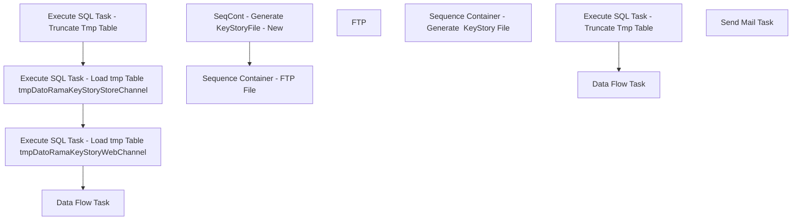

# SSIS Package: DatoRamaKeyStoryETL

**Project:** DatoRamaKeyStoryETL  
**Folder:** CRM  
**Server:** STL-SSIS-P-01  

## Connection Managers

| Name | Type | Server | Catalog | Connection (sanitized) |
|---|---|---|---|---|
| BundleKeyStoryFile | FLATFILE |  |  |  |
| DWStaging | OLEDB | papamart | DWStaging | Data Source=papamart; Initial Catalog=DWStaging; Provider=SQLNCLI11.1; Integrated Security=SSPI; Auto Translate=False |
| DatoRamaKeyStoryOutput | FLATFILE |  |  |  |
| IntegrationStaging | OLEDB | stl-ssis-p-01 | IntegrationStaging | Data Source=stl-ssis-p-01; Initial Catalog=IntegrationStaging; Provider=SQLNCLI11.1; Integrated Security=SSPI; Auto Translate=False |
| SMTP | SMTP |  |  |  |
| dw | OLEDB | papamart | dw | Data Source=papamart; Initial Catalog=dw; Provider=SQLNCLI11.1; Integrated Security=SSPI; Auto Translate=False |

## Control Flow Tasks

| Task | Type |
|---|---|
| DatoRamaKeyStoryETL | Package |
| SeqCont - Generate KeyStoryFile - New | SEQUENCE |
| Data Flow Task | Pipeline |
| Execute SQL Task - Load tmp Table tmpDatoRamaKeyStoryStoreChannel | ExecuteSQLTask |
| Execute SQL Task - Load tmp Table tmpDatoRamaKeyStoryWebChannel | ExecuteSQLTask |
| Execute SQL Task - Truncate Tmp Table | ExecuteSQLTask |
| Sequence Container - FTP File | SEQUENCE |
| FTP | ExecuteSQLTask |
| Sequence Container - Generate  KeyStory File | SEQUENCE |
| Data Flow Task | Pipeline |
| Execute SQL Task - Truncate Tmp Table | ExecuteSQLTask |
| Send Mail Task | SendMailTask |

## Control Flow Outline

```text
- Send Mail Task [SendMailTask]
- SeqCont - Generate KeyStoryFile - New [SEQUENCE]
  - Data Flow Task [Pipeline]
  - Execute SQL Task - Load tmp Table tmpDatoRamaKeyStoryStoreChannel [ExecuteSQLTask]
  - Execute SQL Task - Load tmp Table tmpDatoRamaKeyStoryWebChannel [ExecuteSQLTask]
  - Execute SQL Task - Truncate Tmp Table [ExecuteSQLTask]
- Sequence Container - FTP File [SEQUENCE]
  - FTP [ExecuteSQLTask]
- Sequence Container - Generate  KeyStory File [SEQUENCE]
  - Data Flow Task [Pipeline]
  - Execute SQL Task - Truncate Tmp Table [ExecuteSQLTask]
```

## Architecture Diagram



## Variables

| Namespace | Name | Expression-bound |
|---|---|---|
| System | Propagate | No |
| User | DateTimeStamp | Yes |
| User | EndDate | Yes |
| User | EndDateAsDATE | Yes |
| User | GetDate | Yes |
| User | GetDateAsDATE | Yes |
| User | SqlStringStoreChannel | Yes |
| User | SqlStringStoreChannelV2 | Yes |
| User | SqlStringStoreChannelV3 | Yes |
| User | SqlStringWebChannel | Yes |
| User | SqlStringWebChannelV2 | Yes |
| User | SqlStringWebChannelV3 | Yes |
| User | StartDate | Yes |
| User | StartDateAsDATE | Yes |

### Expression-bound variable values

#### User::DateTimeStamp

**Expression:**

```sql
(DT_WSTR,4)DATEPART("yyyy",GetDate()) 
+ (DT_WSTR,4)DATEPART("mm",GetDate()) 
+ (DT_WSTR,4)DATEPART("dd",GetDate()) 
+ (DT_WSTR,4)DATEPART("hh",GetDate()) 
+ (DT_WSTR,4)DATEPART("mi",GetDate()) 
+ (DT_WSTR,4)DATEPART("ss",GetDate()) 
+ (DT_WSTR,4)DATEPART("ms",GetDate())
```

**Evaluated value:**

```sql
2023427125634900
```

#### User::EndDate

**Expression:**

```sql
dateadd("dd", @[$Package::DaysToInclude], @[User::StartDate])
```

**Evaluated value:**

```sql
4/26/2023
```

#### User::EndDateAsDATE

**Expression:**

```sql
(DT_WSTR, 4) datepart("year", @[User::EndDate])  + "-" +
right("0"+ (DT_WSTR, 2) datepart("mm", @[User::EndDate]),2)  + "-" +
right("0" +(DT_WSTR, 2) datepart("dd",  @[User::EndDate]),2)
```

**Evaluated value:**

```sql
2023-04-26
```

#### User::GetDate

**Expression:**

```sql
(DT_DATE)DATEDIFF("Day", (DT_DATE) 0, GETDATE())
```

**Evaluated value:**

```sql
4/27/2023
```

#### User::GetDateAsDATE

**Expression:**

```sql
(DT_WSTR, 4) datepart("year", @[User::GetDate])  + "-" +
right("0"+ (DT_WSTR, 2) datepart("mm", @[User::GetDate]),2)  + "-" +
right("0" +(DT_WSTR, 2) datepart("dd",  @[User::GetDate]),2)
```

**Evaluated value:**

```sql
2023-04-27
```

#### User::SqlStringStoreChannel

**Expression:**

```sql
"with StyleKeyStory as (
select ap.Style, ap.JurisdictionCode, ap.KeyStory,  ap.DeptCode
from [Azure].[vwProducts] ap
) , 

TransactionData as (

select cast(dd.actual_date as date) as TransactionDate,
cast(pd.style_code as varchar(6)) as SKU,
--right((cast('0000' as varchar) + cast(sd.store_id as varchar)),4) as StockLocationID,
sum(cast(tdf.units as int)) as ExternalUnitsSold,                
sd.country as Country, 
sum (tdf.unit_gross_amount-tdf.unit_disc_amount) as Amount, -- This is the sales amount without VAT in local currency 
cd.currency_code as CurrencyCode, 
tdf.transaction_id, 
crm.CustomerNumber
from vwDW_Transactions_Cube_V3 tf 
join store_dim sd with (nolock) on tf.store_key=sd.store_key
join date_dim dd with (nolock) on tf.date_key=dd.date_key
join transaction_detail_facts tdf with (nolock) on tf.transaction_id=tdf.transaction_id
join product_dim pd with (nolock) on tdf.product_key=pd.product_key
join currency_dim cd with (nolock)  on cd.currency_key=tdf.currency_key
left join CRMTransactionFact crm with (nolock) on crm.TransactionID=tdf.transaction_id
where cast(dd.actual_date as date) = cast(getdate()-"+ (DT_WSTR, 3) @[$Package::DaysToGoBack]+"as date)


and isShipFromStore=0
and isPickupFromStore=0
and isCurbside=0
and isSameDayShipt=0
and sd.store_id not in (13,2013)
and pd.style_code is not null 
group by 
dd.actual_date,
cast(pd.style_code as varchar(6)),
--right((cast('0000' as varchar) + cast(sd.store_id as varchar)),4),
cast(dd.actual_date as date),
sd.country, 
cd.currency_code, 
tdf.transaction_id, 
crm.CustomerNumber

), 

Summary1 as (

select s.KeyStory, 
s.DeptCode, 
td.*
from TransactionData td
left join StyleKeyStory s on s.Style=td.SKU

) , 

Summary2 as (
select TransactionDate, 
KeyStory as KeyStoryCode, 
'Store' as Channel, 
Sum(Amount) as KeyStorySales, -- Does this need currency conversion to USD? 
sum(s.ExternalUnitsSold) as KeyStoryUnitSales, 
count (distinct s.transaction_id) as TransactionCount, 
s.DeptCode, 
s.CustomerNumber, 
s.Country as FulfillmentCountry
from Summary1 s
group by TransactionDate, 
s.KeyStory, 
s.DeptCode, 
s.CustomerNumber, 
s.Country
) , 

Summary3 as (

select s2.TransactionDate, 
s2.KeyStoryCode, 
s2.Channel, 
sum(s2.KeyStorySales) as KeyStorySales,
sum (s2.KeyStoryUnitSales) as KeyStoryUnitSales,
sum (s2.TransactionCount) as TransactionCount, 
case when right(s2.deptcode,2) = '02' then sum(TransactionCount) else 0 end as KeyStoryTransactionCount, 
case when s2.CustomerNumber is  not  NULL then sum(s2.KeyStorySales) else 0 end as KeyStoryBCSales, 
case when s2.CustomerNumber is  not  NULL then sum(s2.KeyStoryUnitSales) else 0 end as KeyStoryBCUnitSales, 
case when s2.CustomerNumber is  not  NULL and right(s2.deptcode,2) = '02' then sum (s2.TransactionCount) else 0 end as KeyStoryBCTransactionCount, 
s2.FulfillmentCountry

from Summary2 s2 
group by s2.TransactionDate, 
s2.KeyStoryCode, 
s2.Channel, 
s2.deptcode, 
s2.CustomerNumber,
s2.FulfillmentCountry
), 

Summary4 as (

select TransactionDate, 
KeyStoryCode, 
Channel, 
sum(KeyStorySales) as KeyStorySales, 
sum(KeyStoryUnitSales) as KeyStoryUnitSales, 
sum(TransactionCount) as TransactionCount, 
sum(KeyStoryTransactionCount) as KeyStoryTransactionCount, 
sum(KeyStoryBCSales) as KeyStoryBCSales, 
sum(KeyStoryBCUnitSales) as KeyStoryBCUnitSales, 
sum(KeyStoryBCTransactionCount) as KeyStoryBCTransactionCount, 
FulfillmentCountry

from Summary3
group by TransactionDate, 
KeyStoryCode, 
Channel, 
FulfillmentCountry
) 

select TransactionDate, 
KeyStoryCode, 
Channel, 
isnull(KeyStorySales,0)as KeyStorySales,
isnull(KeyStoryUnitSales,0)as KeyStoryUnitSales,
isnull(KeyStoryTransactionCount,0)as KeyStoryTransactionCount,
isnull(TransactionCount,0)as TransactionCount,
isnull(KeyStoryBCSales,0)as KeyStoryBcSales,
isnull(KeyStoryBcUnitSales,0)as KeyStoryBcUnitSales,
isnull(KeyStoryBCTransactionCount,0)as KeyStoryBcTransactionCount,
FulfillmentCountry
from Summary4
Where KeyStoryCode is not null
"
```

**Evaluated value:**

```sql
with StyleKeyStory as (
select ap.Style, ap.JurisdictionCode, ap.KeyStory,  ap.DeptCode
from [Azure].[vwProducts] ap
) , 

TransactionData as (

select cast(dd.actual_date as date) as TransactionDate,
cast(pd.style_code as varchar(6)) as SKU,
--right((cast('0000' as varchar) + cast(sd.store_id as varchar)),4) as StockLocationID,
sum(cast(tdf.units as int)) as ExternalUnitsSold,                
sd.country as Country, 
sum (tdf.unit_gross_amount-tdf.unit_disc_amount) as Amount, -- This is the sales amount without VAT in local currency 
cd.currency_code as CurrencyCode, 
tdf.transaction_id, 
crm.CustomerNumber
from vwDW_Transactions_Cube_V3 tf 
join store_dim sd with (nolock) on tf.store_key=sd.store_key
join date_dim dd with (nolock) on tf.date_key=dd.date_key
join transaction_detail_facts tdf with (nolock) on tf.transaction_id=tdf.transaction_id
join product_dim pd with (nolock) on tdf.product_key=pd.product_key
join currency_dim cd with (nolock)  on cd.currency_key=tdf.currency_key
left join CRMTransactionFact crm with (nolock) on crm.TransactionID=tdf.transaction_id
where cast(dd.actual_date as date) = cast(getdate()-31as date)


and isShipFromStore=0
and isPickupFromStore=0
and isCurbside=0
and isSameDayShipt=0
and sd.store_id not in (13,2013)
and pd.style_code is not null 
group by 
dd.actual_date,
cast(pd.style_code as varchar(6)),
--right((cast('0000' as varchar) + cast(sd.store_id as varchar)),4),
cast(dd.actual_date as date),
sd.country, 
cd.currency_code, 
tdf.transaction_id, 
crm.CustomerNumber

), 

Summary1 as (

select s.KeyStory, 
s.DeptCode, 
td.*
from TransactionData td
left join StyleKeyStory s on s.Style=td.SKU

) , 

Summary2 as (
select TransactionDate, 
KeyStory as KeyStoryCode, 
'Store' as Channel, 
Sum(Amount) as KeyStorySales, -- Does this need currency conversion to USD? 
sum(s.ExternalUnitsSold) as KeyStoryUnitSales, 
count (distinct s.transaction_id) as TransactionCount, 
s.DeptCode, 
s.CustomerNumber, 
s.Country as FulfillmentCountry
from Summary1 s
group by TransactionDate, 
s.KeyStory, 
s.DeptCode, 
s.CustomerNumber, 
s.Country
) , 

Summary3 as (

select s2.TransactionDate, 
s2.KeyStoryCode, 
s2.Channel, 
sum(s2.KeyStorySales) as KeyStorySales,
sum (s2.KeyStoryUnitSales) as KeyStoryUnitSales,
sum (s2.TransactionCount) as TransactionCount, 
case when right(s2.deptcode,2) = '02' then sum(TransactionCount) else 0 end as KeyStoryTransactionCount, 
case when s2.CustomerNumber is  not  NULL then sum(s2.KeyStorySales) else 0 end as KeyStoryBCSales, 
case when s2.CustomerNumber is  not  NULL then sum(s2.KeyStoryUnitSales) else 0 end as KeyStoryBCUnitSales, 
case when s2.CustomerNumber is  not  NULL and right(s2.deptcode,2) = '02' then sum (s2.TransactionCount) else 0 end as KeyStoryBCTransactionCount, 
s2.FulfillmentCountry

from Summary2 s2 
group by s2.TransactionDate, 
s2.KeyStoryCode, 
s2.Channel, 
s2.deptcode, 
s2.CustomerNumber,
s2.FulfillmentCountry
), 

Summary4 as (

select TransactionDate, 
KeyStoryCode, 
Channel, 
sum(KeyStorySales) as KeyStorySales, 
sum(KeyStoryUnitSales) as KeyStoryUnitSales, 
sum(TransactionCount) as TransactionCount, 
sum(KeyStoryTransactionCount) as KeyStoryTransactionCount, 
sum(KeyStoryBCSales) as KeyStoryBCSales, 
sum(KeyStoryBCUnitSales) as KeyStoryBCUnitSales, 
sum(KeyStoryBCTransactionCount) as KeyStoryBCTransactionCount, 
FulfillmentCountry

from Summary3
group by TransactionDate, 
KeyStoryCode, 
Channel, 
FulfillmentCountry
) 

select TransactionDate, 
KeyStoryCode, 
Channel, 
isnull(KeyStorySales,0)as KeyStorySales,
isnull(KeyStoryUnitSales,0)as KeyStoryUnitSales,
isnull(KeyStoryTransactionCount,0)as KeyStoryTransactionCount,
isnull(TransactionCount,0)as TransactionCount,
isnull(KeyStoryBCSales,0)as KeyStoryBcSales,
isnull(KeyStoryBcUnitSales,0)as KeyStoryBcUnitSales,
isnull(KeyStoryBCTransactionCount,0)as KeyStoryBcTransactionCount,
FulfillmentCountry
from Summary4
Where KeyStoryCode is not null

```

#### User::SqlStringStoreChannelV2

**Expression:**

```sql
"
with StyleKeyStory as (
select ap.Style, ap.JurisdictionCode, ap.KeyStory,  ap.DeptCode
from [Azure].[vwProducts] ap
) , 

EsTransExclude as 
(
select store_key, 
transaction_id
from tmpESRef (nolock) 
group by store_key, 
transaction_id


)
,

TransactionData as (

select cast(dd.actual_date as date) as TransactionDate,
cast(pd.style_code as varchar(6)) as SKU,
--right((cast('0000' as varchar) + cast(sd.store_id as varchar)),4) as StockLocationID,
sum(cast(tdf.units as int)) as ExternalUnitsSold,                
sd.country as Country, 
sum (tdf.unit_gross_amount-tdf.unit_disc_amount) as Amount, -- This is the sales amount without VAT in local currency 
cd.currency_code as CurrencyCode, 
tdf.transaction_id, 
crm.CustomerNumber
from Transaction_Facts tf with (nolock)
join store_dim sd with (nolock) on tf.store_key=sd.store_key
join date_dim dd with (nolock) on tf.date_key=dd.date_key
join transaction_detail_facts tdf with (nolock) on tf.transaction_id=tdf.transaction_id
join product_dim pd with (nolock) on tdf.product_key=pd.product_key
join currency_dim cd with (nolock)  on cd.currency_key=tdf.currency_key
left join CRMTransactionFact crm with (nolock) on crm.TransactionID=tdf.transaction_id
left join EsTransExclude ete (nolock) on ete.transaction_id=tf.transaction_id --and ete.store_key=tf.store_key
where dd.actual_date between "+"'"+@[User::StartDateAsDATE]+"'"+ " and "+"'"+@[User::EndDateAsDATE]+"'" +"
and isnull(isShipFromStore,0)=0
and isnull(isPickupFromStore,0)=0
and isnull(isCurbside,0)=0
and isnull(isSameDayShipt,0)=0
and sd.store_id not in (13,2013)
and pd.style_code is not null 
and ete.transaction_id is null -- This Excludes ES Orders
group by 
dd.actual_date,
cast(pd.style_code as varchar(6)),
--right((cast('0000' as varchar) + cast(sd.store_id as varchar)),4),
cast(dd.actual_date as date),
sd.country, 
cd.currency_code, 
tdf.transaction_id, 
crm.CustomerNumber

), 

Summary1 as (

select s.KeyStory, 
s.DeptCode, 
td.*
from TransactionData td
left join StyleKeyStory s on s.Style=td.SKU

) , 

Summary2 as (
select TransactionDate, 
KeyStory as KeyStoryCode, 
'Store' as Channel, 
Sum(Amount) as KeyStorySales, -- Does this need currency conversion to USD? 
sum(s.ExternalUnitsSold) as KeyStoryUnitSales, 
count (distinct s.transaction_id) as TransactionCount, 
s.DeptCode, 
s.CustomerNumber, 
s.Country as FulfillmentCountry
from Summary1 s
group by TransactionDate, 
s.KeyStory, 
s.DeptCode, 
s.CustomerNumber, 
s.Country
) , 

Summary3 as (

select s2.TransactionDate, 
s2.KeyStoryCode, 
s2.Channel, 
sum(s2.KeyStorySales) as KeyStorySales,
sum (s2.KeyStoryUnitSales) as KeyStoryUnitSales,
sum (s2.TransactionCount) as TransactionCount, 
case when right(s2.deptcode,2) = '02' then sum(TransactionCount) else 0 end as KeyStoryTransactionCount, 
case when s2.CustomerNumber is  not  NULL then sum(s2.KeyStorySales) else 0 end as KeyStoryBCSales, 
case when s2.CustomerNumber is  not  NULL then sum(s2.KeyStoryUnitSales) else 0 end as KeyStoryBCUnitSales, 
case when s2.CustomerNumber is  not  NULL and right(s2.deptcode,2) = '02' then sum (s2.TransactionCount) else 0 end as KeyStoryBCTransactionCount, 
s2.FulfillmentCountry

from Summary2 s2 
group by s2.TransactionDate, 
s2.KeyStoryCode, 
s2.Channel, 
s2.deptcode, 
s2.CustomerNumber,
s2.FulfillmentCountry
), 

Summary4 as (

select TransactionDate, 
KeyStoryCode, 
Channel, 
sum(KeyStorySales) as KeyStorySales, 
sum(KeyStoryUnitSales) as KeyStoryUnitSales, 
sum(TransactionCount) as TransactionCount, 
sum(KeyStoryTransactionCount) as KeyStoryTransactionCount, 
sum(KeyStoryBCSales) as KeyStoryBCSales, 
sum(KeyStoryBCUnitSales) as KeyStoryBCUnitSales, 
sum(KeyStoryBCTransactionCount) as KeyStoryBCTransactionCount, 
FulfillmentCountry

from Summary3
group by TransactionDate, 
KeyStoryCode, 
Channel, 
FulfillmentCountry
) 

select TransactionDate, 
KeyStoryCode, 
Channel, 
isnull(KeyStorySales,0)as KeyStorySales,
isnull(KeyStoryUnitSales,0)as KeyStoryUnitSales,
isnull(KeyStoryTransactionCount,0)as KeyStoryTransactionCount,
isnull(TransactionCount,0)as TransactionCount,
isnull(KeyStoryBCSales,0)as KeyStoryBcSales,
isnull(KeyStoryBcUnitSales,0)as KeyStoryBcUnitSales,
isnull(KeyStoryBCTransactionCount,0)as KeyStoryBcTransactionCount,
FulfillmentCountry
from Summary4
--Where KeyStoryCode is not null
"
```

**Evaluated value:**

```sql

with StyleKeyStory as (
select ap.Style, ap.JurisdictionCode, ap.KeyStory,  ap.DeptCode
from [Azure].[vwProducts] ap
) , 

EsTransExclude as 
(
select store_key, 
transaction_id
from tmpESRef (nolock) 
group by store_key, 
transaction_id


)
,

TransactionData as (

select cast(dd.actual_date as date) as TransactionDate,
cast(pd.style_code as varchar(6)) as SKU,
--right((cast('0000' as varchar) + cast(sd.store_id as varchar)),4) as StockLocationID,
sum(cast(tdf.units as int)) as ExternalUnitsSold,                
sd.country as Country, 
sum (tdf.unit_gross_amount-tdf.unit_disc_amount) as Amount, -- This is the sales amount without VAT in local currency 
cd.currency_code as CurrencyCode, 
tdf.transaction_id, 
crm.CustomerNumber
from Transaction_Facts tf with (nolock)
join store_dim sd with (nolock) on tf.store_key=sd.store_key
join date_dim dd with (nolock) on tf.date_key=dd.date_key
join transaction_detail_facts tdf with (nolock) on tf.transaction_id=tdf.transaction_id
join product_dim pd with (nolock) on tdf.product_key=pd.product_key
join currency_dim cd with (nolock)  on cd.currency_key=tdf.currency_key
left join CRMTransactionFact crm with (nolock) on crm.TransactionID=tdf.transaction_id
left join EsTransExclude ete (nolock) on ete.transaction_id=tf.transaction_id --and ete.store_key=tf.store_key
where dd.actual_date between '2023-03-27' and '2023-04-26'
and isnull(isShipFromStore,0)=0
and isnull(isPickupFromStore,0)=0
and isnull(isCurbside,0)=0
and isnull(isSameDayShipt,0)=0
and sd.store_id not in (13,2013)
and pd.style_code is not null 
and ete.transaction_id is null -- This Excludes ES Orders
group by 
dd.actual_date,
cast(pd.style_code as varchar(6)),
--right((cast('0000' as varchar) + cast(sd.store_id as varchar)),4),
cast(dd.actual_date as date),
sd.country, 
cd.currency_code, 
tdf.transaction_id, 
crm.CustomerNumber

), 

Summary1 as (

select s.KeyStory, 
s.DeptCode, 
td.*
from TransactionData td
left join StyleKeyStory s on s.Style=td.SKU

) , 

Summary2 as (
select TransactionDate, 
KeyStory as KeyStoryCode, 
'Store' as Channel, 
Sum(Amount) as KeyStorySales, -- Does this need currency conversion to USD? 
sum(s.ExternalUnitsSold) as KeyStoryUnitSales, 
count (distinct s.transaction_id) as TransactionCount, 
s.DeptCode, 
s.CustomerNumber, 
s.Country as FulfillmentCountry
from Summary1 s
group by TransactionDate, 
s.KeyStory, 
s.DeptCode, 
s.CustomerNumber, 
s.Country
) , 

Summary3 as (

select s2.TransactionDate, 
s2.KeyStoryCode, 
s2.Channel, 
sum(s2.KeyStorySales) as KeyStorySales,
sum (s2.KeyStoryUnitSales) as KeyStoryUnitSales,
sum (s2.TransactionCount) as TransactionCount, 
case when right(s2.deptcode,2) = '02' then sum(TransactionCount) else 0 end as KeyStoryTransactionCount, 
case when s2.CustomerNumber is  not  NULL then sum(s2.KeyStorySales) else 0 end as KeyStoryBCSales, 
case when s2.CustomerNumber is  not  NULL then sum(s2.KeyStoryUnitSales) else 0 end as KeyStoryBCUnitSales, 
case when s2.CustomerNumber is  not  NULL and right(s2.deptcode,2) = '02' then sum (s2.TransactionCount) else 0 end as KeyStoryBCTransactionCount, 
s2.FulfillmentCountry

from Summary2 s2 
group by s2.TransactionDate, 
s2.KeyStoryCode, 
s2.Channel, 
s2.deptcode, 
s2.CustomerNumber,
s2.FulfillmentCountry
), 

Summary4 as (

select TransactionDate, 
KeyStoryCode, 
Channel, 
sum(KeyStorySales) as KeyStorySales, 
sum(KeyStoryUnitSales) as KeyStoryUnitSales, 
sum(TransactionCount) as TransactionCount, 
sum(KeyStoryTransactionCount) as KeyStoryTransactionCount, 
sum(KeyStoryBCSales) as KeyStoryBCSales, 
sum(KeyStoryBCUnitSales) as KeyStoryBCUnitSales, 
sum(KeyStoryBCTransactionCount) as KeyStoryBCTransactionCount, 
FulfillmentCountry

from Summary3
group by TransactionDate, 
KeyStoryCode, 
Channel, 
FulfillmentCountry
) 

select TransactionDate, 
KeyStoryCode, 
Channel, 
isnull(KeyStorySales,0)as KeyStorySales,
isnull(KeyStoryUnitSales,0)as KeyStoryUnitSales,
isnull(KeyStoryTransactionCount,0)as KeyStoryTransactionCount,
isnull(TransactionCount,0)as TransactionCount,
isnull(KeyStoryBCSales,0)as KeyStoryBcSales,
isnull(KeyStoryBcUnitSales,0)as KeyStoryBcUnitSales,
isnull(KeyStoryBCTransactionCount,0)as KeyStoryBcTransactionCount,
FulfillmentCountry
from Summary4
--Where KeyStoryCode is not null

```

#### User::SqlStringStoreChannelV3

**Expression:**

```sql
"

truncate table tmpDatoRamaKeyStoryStoreChannel

IF OBJECT_ID(N'tempdb..#EsTransExclude') IS NOT NULL
Drop Table #EsTransExclude
select store_key, 
transaction_id
into #EsTransExclude
from tmpESRef (nolock) 
group by store_key, 
transaction_id


IF OBJECT_ID(N'tempdb..#TransactionData') IS NOT NULL
Drop Table #TransactionData
select cast(dd.actual_date as date) as TransactionDate,
cast(pd.style_code as varchar(6)) as SKU,
--right((cast('0000' as varchar) + cast(sd.store_id as varchar)),4) as StockLocationID,
sum(cast(tdf.units as int)) as ExternalUnitsSold,                
sd.country as Country, 
sum (tdf.unit_gross_amount-tdf.unit_disc_amount) as Amount, -- This is the sales amount without VAT in local currency 
cd.currency_code as CurrencyCode, 
tdf.transaction_id, 
crm.CustomerNumber
into #TransactionData
from Transaction_Facts tf with (nolock)
join store_dim sd with (nolock) on tf.store_key=sd.store_key
join date_dim dd with (nolock) on tf.date_key=dd.date_key
join transaction_detail_facts tdf with (nolock) on tf.transaction_id=tdf.transaction_id
join product_dim pd with (nolock) on tdf.product_key=pd.product_key
join currency_dim cd with (nolock)  on cd.currency_key=tdf.currency_key
left join CRMTransactionFact crm with (nolock) on crm.TransactionID=tdf.transaction_id
left join #EsTransExclude ete (nolock) on ete.transaction_id=tf.transaction_id --and ete.store_key=tf.store_key
where dd.actual_date between "+"'"+@[User::StartDateAsDATE]+"'"+ " and "+"'"+@[User::EndDateAsDATE]+"'" +"
and isnull(isShipFromStore,0)=0
and isnull(isPickupFromStore,0)=0
and isnull(isCurbside,0)=0
and isnull(isSameDayShipt,0)=0
and sd.store_id not in (13,2013)
and pd.style_code is not null 
and ete.transaction_id is null -- This Excludes ES Orders
group by 
dd.actual_date,
cast(pd.style_code as varchar(6)),
--right((cast('0000' as varchar) + cast(sd.store_id as varchar)),4),
cast(dd.actual_date as date),
sd.country, 
cd.currency_code, 
tdf.transaction_id, 
crm.CustomerNumber


IF OBJECT_ID(N'tempdb..#Summary1') IS NOT NULL
Drop Table #Summary1
select s.KeyStory, 
s.DeptCode, 
td.*
into #Summary1
from #TransactionData td
--left join #StyleKeyStory s on s.Style=td.SKU
left join [Azure].[vwProductsKeyStoryOnlyDatoRama] s  (nolock) on s.Style=td.SKU


IF OBJECT_ID(N'tempdb..#Summary2') IS NOT NULL
Drop Table #Summary2
select TransactionDate, 
KeyStory as KeyStoryCode, 
'Store' as Channel, 
Sum(Amount) as KeyStorySales, -- Does this need currency conversion to USD? 
sum(s.ExternalUnitsSold) as KeyStoryUnitSales, 
count (distinct s.transaction_id) as TransactionCount, 
s.DeptCode, 
s.CustomerNumber, 
s.Country as FulfillmentCountry
into #Summary2
from #Summary1 s
group by TransactionDate, 
s.KeyStory, 
s.DeptCode, 
s.CustomerNumber, 
s.Country


IF OBJECT_ID(N'tempdb..#Summary3') IS NOT NULL
Drop Table #Summary3
select s2.TransactionDate, 
s2.KeyStoryCode, 
s2.Channel, 
sum(s2.KeyStorySales) as KeyStorySales,
sum (s2.KeyStoryUnitSales) as KeyStoryUnitSales,
sum (s2.TransactionCount) as TransactionCount, 
case when right(s2.deptcode,2) = '02' then sum(TransactionCount) else 0 end as KeyStoryTransactionCount, 
case when s2.CustomerNumber is  not  NULL then sum(s2.KeyStorySales) else 0 end as KeyStoryBCSales, 
case when s2.CustomerNumber is  not  NULL then sum(s2.KeyStoryUnitSales) else 0 end as KeyStoryBCUnitSales, 
case when s2.CustomerNumber is  not  NULL and right(s2.deptcode,2) = '02' then sum (s2.TransactionCount) else 0 end as KeyStoryBCTransactionCount, 
s2.FulfillmentCountry
into #Summary3
from #Summary2 s2 
group by s2.TransactionDate, 
s2.KeyStoryCode, 
s2.Channel, 
s2.deptcode, 
s2.CustomerNumber,
s2.FulfillmentCountry


IF OBJECT_ID(N'tempdb..#Summary4') IS NOT NULL
Drop Table #Summary4

select TransactionDate, 
KeyStoryCode, 
Channel, 
sum(KeyStorySales) as KeyStorySales, 
sum(KeyStoryUnitSales) as KeyStoryUnitSales, 
sum(TransactionCount) as TransactionCount, 
sum(KeyStoryTransactionCount) as KeyStoryTransactionCount, 
sum(KeyStoryBCSales) as KeyStoryBCSales, 
sum(KeyStoryBCUnitSales) as KeyStoryBCUnitSales, 
sum(KeyStoryBCTransactionCount) as KeyStoryBCTransactionCount, 
FulfillmentCountry
into #Summary4
from #Summary3
group by TransactionDate, 
KeyStoryCode, 
Channel, 
FulfillmentCountry

-- Final Query and Load to tmpDatoRamaKeyStoryStoreChannel
Insert into tmpDatoRamaKeyStoryStoreChannel
select TransactionDate, 
KeyStoryCode, 
Channel, 
isnull(KeyStorySales,0)as KeyStorySales,
isnull(KeyStoryUnitSales,0)as KeyStoryUnitSales,
isnull(KeyStoryTransactionCount,0)as KeyStoryTransactionCount,
isnull(TransactionCount,0)as TransactionCount,
isnull(KeyStoryBCSales,0)as KeyStoryBcSales,
isnull(KeyStoryBcUnitSales,0)as KeyStoryBcUnitSales,
isnull(KeyStoryBCTransactionCount,0)as KeyStoryBcTransactionCount,
FulfillmentCountry
from #Summary4
--Where KeyStoryCode is not null

"
```

**Evaluated value:**

```sql


truncate table tmpDatoRamaKeyStoryStoreChannel

IF OBJECT_ID(N'tempdb..#EsTransExclude') IS NOT NULL
Drop Table #EsTransExclude
select store_key, 
transaction_id
into #EsTransExclude
from tmpESRef (nolock) 
group by store_key, 
transaction_id


IF OBJECT_ID(N'tempdb..#TransactionData') IS NOT NULL
Drop Table #TransactionData
select cast(dd.actual_date as date) as TransactionDate,
cast(pd.style_code as varchar(6)) as SKU,
--right((cast('0000' as varchar) + cast(sd.store_id as varchar)),4) as StockLocationID,
sum(cast(tdf.units as int)) as ExternalUnitsSold,                
sd.country as Country, 
sum (tdf.unit_gross_amount-tdf.unit_disc_amount) as Amount, -- This is the sales amount without VAT in local currency 
cd.currency_code as CurrencyCode, 
tdf.transaction_id, 
crm.CustomerNumber
into #TransactionData
from Transaction_Facts tf with (nolock)
join store_dim sd with (nolock) on tf.store_key=sd.store_key
join date_dim dd with (nolock) on tf.date_key=dd.date_key
join transaction_detail_facts tdf with (nolock) on tf.transaction_id=tdf.transaction_id
join product_dim pd with (nolock) on tdf.product_key=pd.product_key
join currency_dim cd with (nolock)  on cd.currency_key=tdf.currency_key
left join CRMTransactionFact crm with (nolock) on crm.TransactionID=tdf.transaction_id
left join #EsTransExclude ete (nolock) on ete.transaction_id=tf.transaction_id --and ete.store_key=tf.store_key
where dd.actual_date between '2023-03-27' and '2023-04-26'
and isnull(isShipFromStore,0)=0
and isnull(isPickupFromStore,0)=0
and isnull(isCurbside,0)=0
and isnull(isSameDayShipt,0)=0
and sd.store_id not in (13,2013)
and pd.style_code is not null 
and ete.transaction_id is null -- This Excludes ES Orders
group by 
dd.actual_date,
cast(pd.style_code as varchar(6)),
--right((cast('0000' as varchar) + cast(sd.store_id as varchar)),4),
cast(dd.actual_date as date),
sd.country, 
cd.currency_code, 
tdf.transaction_id, 
crm.CustomerNumber


IF OBJECT_ID(N'tempdb..#Summary1') IS NOT NULL
Drop Table #Summary1
select s.KeyStory, 
s.DeptCode, 
td.*
into #Summary1
from #TransactionData td
--left join #StyleKeyStory s on s.Style=td.SKU
left join [Azure].[vwProductsKeyStoryOnlyDatoRama] s  (nolock) on s.Style=td.SKU


IF OBJECT_ID(N'tempdb..#Summary2') IS NOT NULL
Drop Table #Summary2
select TransactionDate, 
KeyStory as KeyStoryCode, 
'Store' as Channel, 
Sum(Amount) as KeyStorySales, -- Does this need currency conversion to USD? 
sum(s.ExternalUnitsSold) as KeyStoryUnitSales, 
count (distinct s.transaction_id) as TransactionCount, 
s.DeptCode, 
s.CustomerNumber, 
s.Country as FulfillmentCountry
into #Summary2
from #Summary1 s
group by TransactionDate, 
s.KeyStory, 
s.DeptCode, 
s.CustomerNumber, 
s.Country


IF OBJECT_ID(N'tempdb..#Summary3') IS NOT NULL
Drop Table #Summary3
select s2.TransactionDate, 
s2.KeyStoryCode, 
s2.Channel, 
sum(s2.KeyStorySales) as KeyStorySales,
sum (s2.KeyStoryUnitSales) as KeyStoryUnitSales,
sum (s2.TransactionCount) as TransactionCount, 
case when right(s2.deptcode,2) = '02' then sum(TransactionCount) else 0 end as KeyStoryTransactionCount, 
case when s2.CustomerNumber is  not  NULL then sum(s2.KeyStorySales) else 0 end as KeyStoryBCSales, 
case when s2.CustomerNumber is  not  NULL then sum(s2.KeyStoryUnitSales) else 0 end as KeyStoryBCUnitSales, 
case when s2.CustomerNumber is  not  NULL and right(s2.deptcode,2) = '02' then sum (s2.TransactionCount) else 0 end as KeyStoryBCTransactionCount, 
s2.FulfillmentCountry
into #Summary3
from #Summary2 s2 
group by s2.TransactionDate, 
s2.KeyStoryCode, 
s2.Channel, 
s2.deptcode, 
s2.CustomerNumber,
s2.FulfillmentCountry


IF OBJECT_ID(N'tempdb..#Summary4') IS NOT NULL
Drop Table #Summary4

select TransactionDate, 
KeyStoryCode, 
Channel, 
sum(KeyStorySales) as KeyStorySales, 
sum(KeyStoryUnitSales) as KeyStoryUnitSales, 
sum(TransactionCount) as TransactionCount, 
sum(KeyStoryTransactionCount) as KeyStoryTransactionCount, 
sum(KeyStoryBCSales) as KeyStoryBCSales, 
sum(KeyStoryBCUnitSales) as KeyStoryBCUnitSales, 
sum(KeyStoryBCTransactionCount) as KeyStoryBCTransactionCount, 
FulfillmentCountry
into #Summary4
from #Summary3
group by TransactionDate, 
KeyStoryCode, 
Channel, 
FulfillmentCountry

-- Final Query and Load to tmpDatoRamaKeyStoryStoreChannel
Insert into tmpDatoRamaKeyStoryStoreChannel
select TransactionDate, 
KeyStoryCode, 
Channel, 
isnull(KeyStorySales,0)as KeyStorySales,
isnull(KeyStoryUnitSales,0)as KeyStoryUnitSales,
isnull(KeyStoryTransactionCount,0)as KeyStoryTransactionCount,
isnull(TransactionCount,0)as TransactionCount,
isnull(KeyStoryBCSales,0)as KeyStoryBcSales,
isnull(KeyStoryBcUnitSales,0)as KeyStoryBcUnitSales,
isnull(KeyStoryBCTransactionCount,0)as KeyStoryBcTransactionCount,
FulfillmentCountry
from #Summary4
--Where KeyStoryCode is not null


```

#### User::SqlStringWebChannel

**Expression:**

```sql
"with StyleKeyStory as (
select ap.Style, ap.JurisdictionCode, ap.KeyStory, ap.altKeyStory, ap.DeptCode
from [Azure].[vwProducts] ap
) , 
UKVatExempt as 
(
	select distinct cast (sku as varchar) as sku
	from product_dim
	where (department_code in ('R-B-U-46','R-B-U-80') and jurisdiction_code = 'UK')
), 

BundleKeyStoryCTE as (
-- Our Understanding only Web sells bundles and the Sales Audit transaction data reflects that 

select Bundle as BundleSku, KeyStory, Country
from  [BundleKeyStoryDim]
where bundle like '%[_]%' -- There were some items that were a single sku (no underscores) leaving those out for now 
group by Bundle, KeyStory, Country


),

Summary1 as (
select f.OrderDate as TransactionDate, 
case when bks.BundleSKU is not null then bks.KeyStory
	else s.KeyStory  end as KeyStoryCode, 
case when isUS = 1 then cast(sum(F.NetProductSales) as decimal (9,2)) 
	when isUK  = 1 and uve.sku is null then cast (sum(NetProductSales/1.2) as decimal(9,2)) --20% VAT if not VAT Exempt 
	when isUK  = 1 and uve.sku is not null then cast (sum(f.NetProductSales) as decimal (9,2))  -- Vat Exempt
	end as KeyStorySales, 
cast (sum(case when isBundleMaster = 1 then 1 else OrderUnits end ) as int) KeyStoryUnitSales,
s.DeptCode, 
count (distinct f.OrderNumber) as TransactionCount, 
case when cd.customernumber is not null then count (distinct f.OrderNumber) end as TransactionCountBC, 
case when cd.CustomerNumber is not null and isUS = 1 then cast(sum(F.NetProductSales) as decimal (9,2)) 
	when cd.CustomerNumber is not null and isUK  = 1 and uve.sku is null then cast (sum(NetProductSales/1.2) as decimal(9,2)) --20% VAT if not VAT Exempt 
	when cd.CustomerNumber is not null and isUK  = 1 and uve.sku is not null then cast (sum(f.NetProductSales) as decimal (9,2))  -- Vat Exempt
	end as KeyStoryBCSales,
case when cd.CustomerNumber is not null then sum(OrderUnits) end as KeyStoryBcUnitSales,
case when f.isUS =1  then 'US'
	when f.isuk = 1 then 'UK'
	end as FulfillmentCountry
	--, cd.CustomerNumber
from WebOrderInboundDemandTrackingFacts F
left join StyleKeyStory s on f.DeckSku=s.style 
left join UKVatExempt UVE on uve.sku=f.DeckSku
left join [bearcluster01.sql.buildabear.com].WebOrderProcessing.wm.Orders o on f.OrderNumber=o.OrderNum
left join CRMCustomerDim cd on o.BillToEmail=cd.EmailAddress and cd.ClubStatus= 'Active'
left join BundleKeyStoryCTE BKS on bks.BundleSKU = f.DeckSku
			and case when f.isUS = 1 then 'US' when f.isuk = 1 then 'UK' end = bks.Country
where f.NetProductSales <> 0.00 -- Sub Skus that make up bundles come over as 0.00
--and DATEDIFF(d,cast(getdate ()-31 as date),f.OrderDate) > 0
and f.OrderDate between "+"'"+@[User::StartDateAsDATE]+"'"+ " and "+"'"+@[User::EndDateAsDATE]+"'" +"

group by f.OrderDate, 
s.KeyStory, 
f.isUS, 
f.isuk,
uve.sku, 
s.DeptCode, 
cd.CustomerNumber, 
bks.BundleSKU,
bks.KeyStory

), 

Summary2 as (
select TransactionDate, 
KeyStoryCode, 
'Web' as Channel,
sum (KeyStorySales) as KeyStorySales, 
sum (KeyStoryUnitSales) as KeyStoryUnitSales, 
case when right(DeptCode,2) = '02' and KeyStoryCode is not null 
	then sum (s1.TransactionCount) else 0 
	end as KeyStoryTransactionCount , 
sum(TransactionCount) as TransactionCount, 
sum (KeyStoryBCSales) as KeyStoryBCSales, 
case when right(DeptCode,2) = '02' then sum (s1.TransactionCountBC) else 0 end as KeyStoryBCTransactionCount,
sum (KeyStoryBcUnitSales) as KeyStoryBCUnitSales, 
FulfillmentCountry
from Summary1 s1
group by TransactionDate, 
KeyStoryCode, 
DeptCode, 
FulfillmentCountry

), 

Summary3 as (
select TransactionDate, 
KeyStoryCode, 
Channel, 
sum (KeyStorySales) as KeyStorySales, 
sum (KeyStoryUnitSales) as KeyStoryUnitSales, 
sum (KeyStoryTransactionCount) as KeyStoryTransactionCount, 
sum (TransactionCount) as TransactionCount, 
sum (KeyStoryBCSales) as KeyStoryBCSales, 
sum (KeyStoryBCTransactionCount) as KeyStoryBCTransactionCount, 
sum (KeyStoryBcUnitSales) as KeyStoryBcUnitSales, 
FulfillmentCountry
from Summary2
group by 
TransactionDate, 
KeyStoryCode, 
Channel, 
FulfillmentCountry

)

select 
TransactionDate, 
KeyStoryCode, 
Channel, 
isnull(KeyStorySales,0)as KeyStorySales,
isnull(KeyStoryUnitSales,0)as KeyStoryUnitSales,
isnull(KeyStoryTransactionCount,0)as KeyStoryTransactionCount,
isnull(TransactionCount,0)as TransactionCount, -- Reference Field Only 
isnull(KeyStoryBCSales,0)as KeyStoryBcSales,
isnull(KeyStoryBcUnitSales,0)as KeyStoryBcUnitSales, 
isnull(KeyStoryBCTransactionCount,0)as KeyStoryBcTransactionCount,
FulfillmentCountry

from Summary3
 --Where KeyStoryCode is not null"
```

**Evaluated value:**

```sql
with StyleKeyStory as (
select ap.Style, ap.JurisdictionCode, ap.KeyStory, ap.altKeyStory, ap.DeptCode
from [Azure].[vwProducts] ap
) , 
UKVatExempt as 
(
	select distinct cast (sku as varchar) as sku
	from product_dim
	where (department_code in ('R-B-U-46','R-B-U-80') and jurisdiction_code = 'UK')
), 

BundleKeyStoryCTE as (
-- Our Understanding only Web sells bundles and the Sales Audit transaction data reflects that 

select Bundle as BundleSku, KeyStory, Country
from  [BundleKeyStoryDim]
where bundle like '%[_]%' -- There were some items that were a single sku (no underscores) leaving those out for now 
group by Bundle, KeyStory, Country


),

Summary1 as (
select f.OrderDate as TransactionDate, 
case when bks.BundleSKU is not null then bks.KeyStory
	else s.KeyStory  end as KeyStoryCode, 
case when isUS = 1 then cast(sum(F.NetProductSales) as decimal (9,2)) 
	when isUK  = 1 and uve.sku is null then cast (sum(NetProductSales/1.2) as decimal(9,2)) --20% VAT if not VAT Exempt 
	when isUK  = 1 and uve.sku is not null then cast (sum(f.NetProductSales) as decimal (9,2))  -- Vat Exempt
	end as KeyStorySales, 
cast (sum(case when isBundleMaster = 1 then 1 else OrderUnits end ) as int) KeyStoryUnitSales,
s.DeptCode, 
count (distinct f.OrderNumber) as TransactionCount, 
case when cd.customernumber is not null then count (distinct f.OrderNumber) end as TransactionCountBC, 
case when cd.CustomerNumber is not null and isUS = 1 then cast(sum(F.NetProductSales) as decimal (9,2)) 
	when cd.CustomerNumber is not null and isUK  = 1 and uve.sku is null then cast (sum(NetProductSales/1.2) as decimal(9,2)) --20% VAT if not VAT Exempt 
	when cd.CustomerNumber is not null and isUK  = 1 and uve.sku is not null then cast (sum(f.NetProductSales) as decimal (9,2))  -- Vat Exempt
	end as KeyStoryBCSales,
case when cd.CustomerNumber is not null then sum(OrderUnits) end as KeyStoryBcUnitSales,
case when f.isUS =1  then 'US'
	when f.isuk = 1 then 'UK'
	end as FulfillmentCountry
	--, cd.CustomerNumber
from WebOrderInboundDemandTrackingFacts F
left join StyleKeyStory s on f.DeckSku=s.style 
left join UKVatExempt UVE on uve.sku=f.DeckSku
left join [bearcluster01.sql.buildabear.com].WebOrderProcessing.wm.Orders o on f.OrderNumber=o.OrderNum
left join CRMCustomerDim cd on o.BillToEmail=cd.EmailAddress and cd.ClubStatus= 'Active'
left join BundleKeyStoryCTE BKS on bks.BundleSKU = f.DeckSku
			and case when f.isUS = 1 then 'US' when f.isuk = 1 then 'UK' end = bks.Country
where f.NetProductSales <> 0.00 -- Sub Skus that make up bundles come over as 0.00
--and DATEDIFF(d,cast(getdate ()-31 as date),f.OrderDate) > 0
and f.OrderDate between '2023-03-27' and '2023-04-26'

group by f.OrderDate, 
s.KeyStory, 
f.isUS, 
f.isuk,
uve.sku, 
s.DeptCode, 
cd.CustomerNumber, 
bks.BundleSKU,
bks.KeyStory

), 

Summary2 as (
select TransactionDate, 
KeyStoryCode, 
'Web' as Channel,
sum (KeyStorySales) as KeyStorySales, 
sum (KeyStoryUnitSales) as KeyStoryUnitSales, 
case when right(DeptCode,2) = '02' and KeyStoryCode is not null 
	then sum (s1.TransactionCount) else 0 
	end as KeyStoryTransactionCount , 
sum(TransactionCount) as TransactionCount, 
sum (KeyStoryBCSales) as KeyStoryBCSales, 
case when right(DeptCode,2) = '02' then sum (s1.TransactionCountBC) else 0 end as KeyStoryBCTransactionCount,
sum (KeyStoryBcUnitSales) as KeyStoryBCUnitSales, 
FulfillmentCountry
from Summary1 s1
group by TransactionDate, 
KeyStoryCode, 
DeptCode, 
FulfillmentCountry

), 

Summary3 as (
select TransactionDate, 
KeyStoryCode, 
Channel, 
sum (KeyStorySales) as KeyStorySales, 
sum (KeyStoryUnitSales) as KeyStoryUnitSales, 
sum (KeyStoryTransactionCount) as KeyStoryTransactionCount, 
sum (TransactionCount) as TransactionCount, 
sum (KeyStoryBCSales) as KeyStoryBCSales, 
sum (KeyStoryBCTransactionCount) as KeyStoryBCTransactionCount, 
sum (KeyStoryBcUnitSales) as KeyStoryBcUnitSales, 
FulfillmentCountry
from Summary2
group by 
TransactionDate, 
KeyStoryCode, 
Channel, 
FulfillmentCountry

)

select 
TransactionDate, 
KeyStoryCode, 
Channel, 
isnull(KeyStorySales,0)as KeyStorySales,
isnull(KeyStoryUnitSales,0)as KeyStoryUnitSales,
isnull(KeyStoryTransactionCount,0)as KeyStoryTransactionCount,
isnull(TransactionCount,0)as TransactionCount, -- Reference Field Only 
isnull(KeyStoryBCSales,0)as KeyStoryBcSales,
isnull(KeyStoryBcUnitSales,0)as KeyStoryBcUnitSales, 
isnull(KeyStoryBCTransactionCount,0)as KeyStoryBcTransactionCount,
FulfillmentCountry

from Summary3
 --Where KeyStoryCode is not null
```

#### User::SqlStringWebChannelV2

**Expression:**

```sql
"
with UKVatExempt as 
(
	select distinct cast (sku as varchar) as sku
	from product_dim
	where (department_code in ('R-B-U-46','R-B-U-80') and jurisdiction_code = 'UK')
), 

BundleKeyStoryCTE as (
-- Our Understanding only Web sells bundles and the Sales Audit transaction data reflects that 

select Bundle as BundleSku, KeyStory, Country
from  [BundleKeyStoryDim]
where bundle like '%[_]%' -- There were some items that were a single sku (no underscores) leaving those out for now 
group by Bundle, KeyStory, Country


),

Summary1 as (
select f.OrderDate as TransactionDate, 
case when bks.BundleSKU is not null then bks.KeyStory
	else s.KeyStory  end as KeyStoryCode, 
case when isUS = 1 then cast(sum(F.NetProductSales) as decimal (9,2)) 
	when isUK  = 1 and uve.sku is null then cast (sum(NetProductSales/1.2) as decimal(9,2)) --20% VAT if not VAT Exempt 
	when isUK  = 1 and uve.sku is not null then cast (sum(f.NetProductSales) as decimal (9,2))  -- Vat Exempt
	end as KeyStorySales, 
cast (sum(case when isBundleMaster = 1 then 1 else OrderUnits end ) as int) KeyStoryUnitSales,
s.DeptCode, 
count (distinct f.OrderNumber) as TransactionCount, 
case when cd.customernumber is not null then count (distinct f.OrderNumber) end as TransactionCountBC, 
case when cd.CustomerNumber is not null and isUS = 1 then cast(sum(F.NetProductSales) as decimal (9,2)) 
	when cd.CustomerNumber is not null and isUK  = 1 and uve.sku is null then cast (sum(NetProductSales/1.2) as decimal(9,2)) --20% VAT if not VAT Exempt 
	when cd.CustomerNumber is not null and isUK  = 1 and uve.sku is not null then cast (sum(f.NetProductSales) as decimal (9,2))  -- Vat Exempt
	end as KeyStoryBCSales,
case when cd.CustomerNumber is not null then sum(OrderUnits) end as KeyStoryBcUnitSales,
case when f.isUS =1  then 'US'
	when f.isuk = 1 then 'UK'
	end as FulfillmentCountry
	--, cd.CustomerNumber
from WebOrderInboundDemandTrackingFactsV2 F
left join [Azure].[vwProductsKeyStoryOnlyDatoRama] s on f.DeckSku=s.style 
left join UKVatExempt UVE on uve.sku=f.DeckSku
left join [bearcluster01.sql.buildabear.com].WebOrderProcessing.wm.Orders o on f.OrderNumber=o.OrderNum
left join CRMCustomerDim cd on o.BillToEmail=cd.EmailAddress and cd.ClubStatus= 'Active'
left join BundleKeyStoryCTE BKS on bks.BundleSKU = f.DeckSku
			and case when f.isUS = 1 then 'US' when f.isuk = 1 then 'UK' end = bks.Country
where f.NetProductSales <> 0.00 -- Sub Skus that make up bundles come over as 0.00
--and DATEDIFF(d,cast(getdate ()-31 as date),f.OrderDate) > 0
and f.OrderDate between "+"'"+@[User::StartDateAsDATE]+"'"+ " and "+"'"+@[User::EndDateAsDATE]+"'" +"

group by f.OrderDate, 
s.KeyStory, 
f.isUS, 
f.isuk,
uve.sku, 
s.DeptCode, 
cd.CustomerNumber, 
bks.BundleSKU,
bks.KeyStory

), 

Summary2 as (
select TransactionDate, 
KeyStoryCode, 
'Web' as Channel,
sum (KeyStorySales) as KeyStorySales, 
sum (KeyStoryUnitSales) as KeyStoryUnitSales, 
case when right(DeptCode,2) = '02' and KeyStoryCode is not null 
	then sum (s1.TransactionCount) else 0 
	end as KeyStoryTransactionCount , 
sum(TransactionCount) as TransactionCount, 
sum (KeyStoryBCSales) as KeyStoryBCSales, 
case when right(DeptCode,2) = '02' then sum (s1.TransactionCountBC) else 0 end as KeyStoryBCTransactionCount,
sum (KeyStoryBcUnitSales) as KeyStoryBCUnitSales, 
FulfillmentCountry
from Summary1 s1
group by TransactionDate, 
KeyStoryCode, 
DeptCode, 
FulfillmentCountry

), 

Summary3 as (
select TransactionDate, 
KeyStoryCode, 
Channel, 
sum (KeyStorySales) as KeyStorySales, 
sum (KeyStoryUnitSales) as KeyStoryUnitSales, 
sum (KeyStoryTransactionCount) as KeyStoryTransactionCount, 
sum (TransactionCount) as TransactionCount, 
sum (KeyStoryBCSales) as KeyStoryBCSales, 
sum (KeyStoryBCTransactionCount) as KeyStoryBCTransactionCount, 
sum (KeyStoryBcUnitSales) as KeyStoryBcUnitSales, 
FulfillmentCountry
from Summary2
group by 
TransactionDate, 
KeyStoryCode, 
Channel, 
FulfillmentCountry

)

select 
TransactionDate, 
KeyStoryCode, 
Channel, 
isnull(KeyStorySales,0)as KeyStorySales,
isnull(KeyStoryUnitSales,0)as KeyStoryUnitSales,
isnull(KeyStoryTransactionCount,0)as KeyStoryTransactionCount,
isnull(TransactionCount,0)as TransactionCount, -- Reference Field Only 
isnull(KeyStoryBCSales,0)as KeyStoryBcSales,
isnull(KeyStoryBcUnitSales,0)as KeyStoryBcUnitSales, 
isnull(KeyStoryBCTransactionCount,0)as KeyStoryBcTransactionCount,
FulfillmentCountry

from Summary3
 --Where KeyStoryCode is not null"
```

**Evaluated value:**

```sql

with UKVatExempt as 
(
	select distinct cast (sku as varchar) as sku
	from product_dim
	where (department_code in ('R-B-U-46','R-B-U-80') and jurisdiction_code = 'UK')
), 

BundleKeyStoryCTE as (
-- Our Understanding only Web sells bundles and the Sales Audit transaction data reflects that 

select Bundle as BundleSku, KeyStory, Country
from  [BundleKeyStoryDim]
where bundle like '%[_]%' -- There were some items that were a single sku (no underscores) leaving those out for now 
group by Bundle, KeyStory, Country


),

Summary1 as (
select f.OrderDate as TransactionDate, 
case when bks.BundleSKU is not null then bks.KeyStory
	else s.KeyStory  end as KeyStoryCode, 
case when isUS = 1 then cast(sum(F.NetProductSales) as decimal (9,2)) 
	when isUK  = 1 and uve.sku is null then cast (sum(NetProductSales/1.2) as decimal(9,2)) --20% VAT if not VAT Exempt 
	when isUK  = 1 and uve.sku is not null then cast (sum(f.NetProductSales) as decimal (9,2))  -- Vat Exempt
	end as KeyStorySales, 
cast (sum(case when isBundleMaster = 1 then 1 else OrderUnits end ) as int) KeyStoryUnitSales,
s.DeptCode, 
count (distinct f.OrderNumber) as TransactionCount, 
case when cd.customernumber is not null then count (distinct f.OrderNumber) end as TransactionCountBC, 
case when cd.CustomerNumber is not null and isUS = 1 then cast(sum(F.NetProductSales) as decimal (9,2)) 
	when cd.CustomerNumber is not null and isUK  = 1 and uve.sku is null then cast (sum(NetProductSales/1.2) as decimal(9,2)) --20% VAT if not VAT Exempt 
	when cd.CustomerNumber is not null and isUK  = 1 and uve.sku is not null then cast (sum(f.NetProductSales) as decimal (9,2))  -- Vat Exempt
	end as KeyStoryBCSales,
case when cd.CustomerNumber is not null then sum(OrderUnits) end as KeyStoryBcUnitSales,
case when f.isUS =1  then 'US'
	when f.isuk = 1 then 'UK'
	end as FulfillmentCountry
	--, cd.CustomerNumber
from WebOrderInboundDemandTrackingFactsV2 F
left join [Azure].[vwProductsKeyStoryOnlyDatoRama] s on f.DeckSku=s.style 
left join UKVatExempt UVE on uve.sku=f.DeckSku
left join [bearcluster01.sql.buildabear.com].WebOrderProcessing.wm.Orders o on f.OrderNumber=o.OrderNum
left join CRMCustomerDim cd on o.BillToEmail=cd.EmailAddress and cd.ClubStatus= 'Active'
left join BundleKeyStoryCTE BKS on bks.BundleSKU = f.DeckSku
			and case when f.isUS = 1 then 'US' when f.isuk = 1 then 'UK' end = bks.Country
where f.NetProductSales <> 0.00 -- Sub Skus that make up bundles come over as 0.00
--and DATEDIFF(d,cast(getdate ()-31 as date),f.OrderDate) > 0
and f.OrderDate between '2023-03-27' and '2023-04-26'

group by f.OrderDate, 
s.KeyStory, 
f.isUS, 
f.isuk,
uve.sku, 
s.DeptCode, 
cd.CustomerNumber, 
bks.BundleSKU,
bks.KeyStory

), 

Summary2 as (
select TransactionDate, 
KeyStoryCode, 
'Web' as Channel,
sum (KeyStorySales) as KeyStorySales, 
sum (KeyStoryUnitSales) as KeyStoryUnitSales, 
case when right(DeptCode,2) = '02' and KeyStoryCode is not null 
	then sum (s1.TransactionCount) else 0 
	end as KeyStoryTransactionCount , 
sum(TransactionCount) as TransactionCount, 
sum (KeyStoryBCSales) as KeyStoryBCSales, 
case when right(DeptCode,2) = '02' then sum (s1.TransactionCountBC) else 0 end as KeyStoryBCTransactionCount,
sum (KeyStoryBcUnitSales) as KeyStoryBCUnitSales, 
FulfillmentCountry
from Summary1 s1
group by TransactionDate, 
KeyStoryCode, 
DeptCode, 
FulfillmentCountry

), 

Summary3 as (
select TransactionDate, 
KeyStoryCode, 
Channel, 
sum (KeyStorySales) as KeyStorySales, 
sum (KeyStoryUnitSales) as KeyStoryUnitSales, 
sum (KeyStoryTransactionCount) as KeyStoryTransactionCount, 
sum (TransactionCount) as TransactionCount, 
sum (KeyStoryBCSales) as KeyStoryBCSales, 
sum (KeyStoryBCTransactionCount) as KeyStoryBCTransactionCount, 
sum (KeyStoryBcUnitSales) as KeyStoryBcUnitSales, 
FulfillmentCountry
from Summary2
group by 
TransactionDate, 
KeyStoryCode, 
Channel, 
FulfillmentCountry

)

select 
TransactionDate, 
KeyStoryCode, 
Channel, 
isnull(KeyStorySales,0)as KeyStorySales,
isnull(KeyStoryUnitSales,0)as KeyStoryUnitSales,
isnull(KeyStoryTransactionCount,0)as KeyStoryTransactionCount,
isnull(TransactionCount,0)as TransactionCount, -- Reference Field Only 
isnull(KeyStoryBCSales,0)as KeyStoryBcSales,
isnull(KeyStoryBcUnitSales,0)as KeyStoryBcUnitSales, 
isnull(KeyStoryBCTransactionCount,0)as KeyStoryBcTransactionCount,
FulfillmentCountry

from Summary3
 --Where KeyStoryCode is not null
```

#### User::SqlStringWebChannelV3

**Expression:**

```sql
"
truncate table tmpDatoRamaKeyStoryWebChannel

IF OBJECT_ID(N'tempdb..#UKVatExempt') IS NOT NULL
Drop Table #UKVatExempt
select distinct cast (sku as varchar) as sku
into #UKVatExempt
from product_dim
where (department_code in ('R-B-U-46','R-B-U-80') and jurisdiction_code = 'UK')

-- Our Understanding only Web sells bundles and the Sales Audit transaction data reflects that 
IF OBJECT_ID(N'tempdb..#BundleKeyStoryCTE') IS NOT NULL
Drop Table #BundleKeyStoryCTE
select Bundle as BundleSku, KeyStory, Country
into #BundleKeyStoryCTE
from  [BundleKeyStoryDim]
where bundle like '%[_]%' -- There were some items that were a single sku (no underscores) leaving those out for now 
group by Bundle, KeyStory, Country


IF OBJECT_ID(N'tempdb..#Summary1') IS NOT NULL
Drop Table #Summary1
select f.OrderDate as TransactionDate, 
case when bks.BundleSKU is not null then bks.KeyStory
	else s.KeyStory  end as KeyStoryCode, 
case when isUS = 1 then cast(sum(F.NetProductSales) as decimal (9,2)) 
	when isUK  = 1 and uve.sku is null then cast (sum(NetProductSales/1.2) as decimal(9,2)) --20% VAT if not VAT Exempt 
	when isUK  = 1 and uve.sku is not null then cast (sum(f.NetProductSales) as decimal (9,2))  -- Vat Exempt
	end as KeyStorySales, 
cast (sum(case when isBundleMaster = 1 then 1 else OrderUnits end ) as int) KeyStoryUnitSales,
s.DeptCode, 
count (distinct f.OrderNumber) as TransactionCount, 
case when cd.customernumber is not null then count (distinct f.OrderNumber) end as TransactionCountBC, 
case when cd.CustomerNumber is not null and isUS = 1 then cast(sum(F.NetProductSales) as decimal (9,2)) 
	when cd.CustomerNumber is not null and isUK  = 1 and uve.sku is null then cast (sum(NetProductSales/1.2) as decimal(9,2)) --20% VAT if not VAT Exempt 
	when cd.CustomerNumber is not null and isUK  = 1 and uve.sku is not null then cast (sum(f.NetProductSales) as decimal (9,2))  -- Vat Exempt
	end as KeyStoryBCSales,
case when cd.CustomerNumber is not null then sum(OrderUnits) end as KeyStoryBcUnitSales,
case when f.isUS =1  then 'US'
	when f.isuk = 1 then 'UK'
	end as FulfillmentCountry
	--, cd.CustomerNumber
into #Summary1
from WebOrderInboundDemandTrackingFactsV2 F
left join [Azure].[vwProductsKeyStoryOnlyDatoRama] s on f.DeckSku=s.style 
left join #UKVatExempt UVE on uve.sku=f.DeckSku
left join [bearcluster01.sql.buildabear.com].WebOrderProcessing.wm.Orders o on f.OrderNumber=o.OrderNum
left join CRMCustomerDim cd on o.BillToEmail=cd.EmailAddress and cd.ClubStatus= 'Active'
left join #BundleKeyStoryCTE BKS on bks.BundleSKU = f.DeckSku
			and case when f.isUS = 1 then 'US' when f.isuk = 1 then 'UK' end = bks.Country
where  1=1 
and f.NetProductSales <> 0.00 -- Sub Skus that make up bundles come over as 0.00
and f.OrderDate between "+"'"+@[User::StartDateAsDATE]+"'"+ " and "+"'"+@[User::EndDateAsDATE]+"'" +"
group by f.OrderDate, 
s.KeyStory, 
f.isUS, 
f.isuk,
uve.sku, 
s.DeptCode, 
cd.CustomerNumber, 
bks.BundleSKU,
bks.KeyStory

IF OBJECT_ID(N'tempdb..#Summary2') IS NOT NULL
Drop Table #Summary2
select TransactionDate, 
KeyStoryCode, 
'Web' as Channel,
sum (KeyStorySales) as KeyStorySales, 
sum (KeyStoryUnitSales) as KeyStoryUnitSales, 
case when right(DeptCode,2) = '02' and KeyStoryCode is not null 
	then sum (s1.TransactionCount) else 0 
	end as KeyStoryTransactionCount , 
sum(TransactionCount) as TransactionCount, 
sum (KeyStoryBCSales) as KeyStoryBCSales, 
case when right(DeptCode,2) = '02' then sum (s1.TransactionCountBC) else 0 end as KeyStoryBCTransactionCount,
sum (KeyStoryBcUnitSales) as KeyStoryBCUnitSales, 
FulfillmentCountry
into #Summary2
from #Summary1 s1
group by TransactionDate, 
KeyStoryCode, 
DeptCode, 
FulfillmentCountry

IF OBJECT_ID(N'tempdb..#Summary3') IS NOT NULL
Drop Table #Summary3

select TransactionDate, 
KeyStoryCode, 
Channel, 
sum (KeyStorySales) as KeyStorySales, 
sum (KeyStoryUnitSales) as KeyStoryUnitSales, 
sum (KeyStoryTransactionCount) as KeyStoryTransactionCount, 
sum (TransactionCount) as TransactionCount, 
sum (KeyStoryBCSales) as KeyStoryBCSales, 
sum (KeyStoryBCTransactionCount) as KeyStoryBCTransactionCount, 
sum (KeyStoryBcUnitSales) as KeyStoryBcUnitSales, 
FulfillmentCountry
into #Summary3
from #Summary2
group by 
TransactionDate, 
KeyStoryCode, 
Channel, 
FulfillmentCountry


insert into tmpDatoRamaKeyStoryWebChannel
select 
TransactionDate, 
KeyStoryCode, 
Channel, 
isnull(KeyStorySales,0)as KeyStorySales,
isnull(KeyStoryUnitSales,0)as KeyStoryUnitSales,
isnull(KeyStoryTransactionCount,0)as KeyStoryTransactionCount,
isnull(TransactionCount,0)as TransactionCount, -- Reference Field Only 
isnull(KeyStoryBCSales,0)as KeyStoryBcSales,
isnull(KeyStoryBcUnitSales,0)as KeyStoryBcUnitSales, 
isnull(KeyStoryBCTransactionCount,0)as KeyStoryBcTransactionCount,
FulfillmentCountry
from #Summary3
 --Where KeyStoryCode is not null
 "
```

**Evaluated value:**

```sql

truncate table tmpDatoRamaKeyStoryWebChannel

IF OBJECT_ID(N'tempdb..#UKVatExempt') IS NOT NULL
Drop Table #UKVatExempt
select distinct cast (sku as varchar) as sku
into #UKVatExempt
from product_dim
where (department_code in ('R-B-U-46','R-B-U-80') and jurisdiction_code = 'UK')

-- Our Understanding only Web sells bundles and the Sales Audit transaction data reflects that 
IF OBJECT_ID(N'tempdb..#BundleKeyStoryCTE') IS NOT NULL
Drop Table #BundleKeyStoryCTE
select Bundle as BundleSku, KeyStory, Country
into #BundleKeyStoryCTE
from  [BundleKeyStoryDim]
where bundle like '%[_]%' -- There were some items that were a single sku (no underscores) leaving those out for now 
group by Bundle, KeyStory, Country


IF OBJECT_ID(N'tempdb..#Summary1') IS NOT NULL
Drop Table #Summary1
select f.OrderDate as TransactionDate, 
case when bks.BundleSKU is not null then bks.KeyStory
	else s.KeyStory  end as KeyStoryCode, 
case when isUS = 1 then cast(sum(F.NetProductSales) as decimal (9,2)) 
	when isUK  = 1 and uve.sku is null then cast (sum(NetProductSales/1.2) as decimal(9,2)) --20% VAT if not VAT Exempt 
	when isUK  = 1 and uve.sku is not null then cast (sum(f.NetProductSales) as decimal (9,2))  -- Vat Exempt
	end as KeyStorySales, 
cast (sum(case when isBundleMaster = 1 then 1 else OrderUnits end ) as int) KeyStoryUnitSales,
s.DeptCode, 
count (distinct f.OrderNumber) as TransactionCount, 
case when cd.customernumber is not null then count (distinct f.OrderNumber) end as TransactionCountBC, 
case when cd.CustomerNumber is not null and isUS = 1 then cast(sum(F.NetProductSales) as decimal (9,2)) 
	when cd.CustomerNumber is not null and isUK  = 1 and uve.sku is null then cast (sum(NetProductSales/1.2) as decimal(9,2)) --20% VAT if not VAT Exempt 
	when cd.CustomerNumber is not null and isUK  = 1 and uve.sku is not null then cast (sum(f.NetProductSales) as decimal (9,2))  -- Vat Exempt
	end as KeyStoryBCSales,
case when cd.CustomerNumber is not null then sum(OrderUnits) end as KeyStoryBcUnitSales,
case when f.isUS =1  then 'US'
	when f.isuk = 1 then 'UK'
	end as FulfillmentCountry
	--, cd.CustomerNumber
into #Summary1
from WebOrderInboundDemandTrackingFactsV2 F
left join [Azure].[vwProductsKeyStoryOnlyDatoRama] s on f.DeckSku=s.style 
left join #UKVatExempt UVE on uve.sku=f.DeckSku
left join [bearcluster01.sql.buildabear.com].WebOrderProcessing.wm.Orders o on f.OrderNumber=o.OrderNum
left join CRMCustomerDim cd on o.BillToEmail=cd.EmailAddress and cd.ClubStatus= 'Active'
left join #BundleKeyStoryCTE BKS on bks.BundleSKU = f.DeckSku
			and case when f.isUS = 1 then 'US' when f.isuk = 1 then 'UK' end = bks.Country
where  1=1 
and f.NetProductSales <> 0.00 -- Sub Skus that make up bundles come over as 0.00
and f.OrderDate between '2023-03-27' and '2023-04-26'
group by f.OrderDate, 
s.KeyStory, 
f.isUS, 
f.isuk,
uve.sku, 
s.DeptCode, 
cd.CustomerNumber, 
bks.BundleSKU,
bks.KeyStory

IF OBJECT_ID(N'tempdb..#Summary2') IS NOT NULL
Drop Table #Summary2
select TransactionDate, 
KeyStoryCode, 
'Web' as Channel,
sum (KeyStorySales) as KeyStorySales, 
sum (KeyStoryUnitSales) as KeyStoryUnitSales, 
case when right(DeptCode,2) = '02' and KeyStoryCode is not null 
	then sum (s1.TransactionCount) else 0 
	end as KeyStoryTransactionCount , 
sum(TransactionCount) as TransactionCount, 
sum (KeyStoryBCSales) as KeyStoryBCSales, 
case when right(DeptCode,2) = '02' then sum (s1.TransactionCountBC) else 0 end as KeyStoryBCTransactionCount,
sum (KeyStoryBcUnitSales) as KeyStoryBCUnitSales, 
FulfillmentCountry
into #Summary2
from #Summary1 s1
group by TransactionDate, 
KeyStoryCode, 
DeptCode, 
FulfillmentCountry

IF OBJECT_ID(N'tempdb..#Summary3') IS NOT NULL
Drop Table #Summary3

select TransactionDate, 
KeyStoryCode, 
Channel, 
sum (KeyStorySales) as KeyStorySales, 
sum (KeyStoryUnitSales) as KeyStoryUnitSales, 
sum (KeyStoryTransactionCount) as KeyStoryTransactionCount, 
sum (TransactionCount) as TransactionCount, 
sum (KeyStoryBCSales) as KeyStoryBCSales, 
sum (KeyStoryBCTransactionCount) as KeyStoryBCTransactionCount, 
sum (KeyStoryBcUnitSales) as KeyStoryBcUnitSales, 
FulfillmentCountry
into #Summary3
from #Summary2
group by 
TransactionDate, 
KeyStoryCode, 
Channel, 
FulfillmentCountry


insert into tmpDatoRamaKeyStoryWebChannel
select 
TransactionDate, 
KeyStoryCode, 
Channel, 
isnull(KeyStorySales,0)as KeyStorySales,
isnull(KeyStoryUnitSales,0)as KeyStoryUnitSales,
isnull(KeyStoryTransactionCount,0)as KeyStoryTransactionCount,
isnull(TransactionCount,0)as TransactionCount, -- Reference Field Only 
isnull(KeyStoryBCSales,0)as KeyStoryBcSales,
isnull(KeyStoryBcUnitSales,0)as KeyStoryBcUnitSales, 
isnull(KeyStoryBCTransactionCount,0)as KeyStoryBcTransactionCount,
FulfillmentCountry
from #Summary3
 --Where KeyStoryCode is not null
 
```

#### User::StartDate

**Expression:**

```sql
dateadd("dd", -@[$Package::DaysToGoBack] , @[User::GetDate] )
```

**Evaluated value:**

```sql
3/27/2023
```

#### User::StartDateAsDATE

**Expression:**

```sql
(DT_WSTR, 4) datepart("year", @[User::StartDate])  + "-" +
right("0"+ (DT_WSTR, 2) datepart("mm", @[User::StartDate]),2)  + "-" +
right("0" +(DT_WSTR, 2) datepart("dd",  @[User::StartDate]),2)
```

**Evaluated value:**

```sql
2023-03-27
```

## Execute SQL Tasks

### Execute SQL Task - Load tmp Table tmpDatoRamaKeyStoryStoreChannel

**Path:** `Package\SeqCont - Generate KeyStoryFile - New\Execute SQL Task - Load tmp Table tmpDatoRamaKeyStoryStoreChannel`  
**Connection:** dw (papamart/dw)  

```sql
User::SqlStringStoreChannelV3
```

### Execute SQL Task - Load tmp Table tmpDatoRamaKeyStoryWebChannel

**Path:** `Package\SeqCont - Generate KeyStoryFile - New\Execute SQL Task - Load tmp Table tmpDatoRamaKeyStoryWebChannel`  
**Connection:** dw (papamart/dw)  

```sql
User::SqlStringWebChannelV3
```

### Execute SQL Task - Truncate Tmp Table

**Path:** `Package\SeqCont - Generate KeyStoryFile - New\Execute SQL Task - Truncate Tmp Table`  
**Connection:** dw (papamart/dw)  

```sql
truncate table tmpDatoRamaKeyStoryTesting
```

### FTP

**Path:** `Package\Sequence Container - FTP File\FTP`  
**Connection:** IntegrationStaging (stl-ssis-p-01/IntegrationStaging)  

```sql
declare 
 @winSCP varchar(1000),
 @script varchar(1000),
 @log varchar(1000),
 @FTP varchar(4000)

select
 @winSCP = '"\\stl-ssis-p-01\C$\Program Files (x86)\WinSCP\WinSCP.exe"',
 @script = ' /script=\\stl-ssis-p-01\IntegrationStaging\DatoRama\FTP\DatoRamaFTP_KeyStory.txt',
 @log = ' /log=\\stl-ssis-p-01\IntegrationStaging\DatoRama\FTP\Upload.log',
 @FTP = (@winSCP + @script + @log)
   
   
exec master..xp_cmdshell @FTP
```

### Execute SQL Task - Truncate Tmp Table

**Path:** `Package\Sequence Container - Generate  KeyStory File\Execute SQL Task - Truncate Tmp Table`  
**Connection:** dw (papamart/dw)  

```sql
truncate table tmpDatoRamaKeyStoryTesting
```

## Data Flow: Sources

| Component | Source Object | Type | Data Flow Task | Connection | SQL Kind |
|---|---|---|---|---|---|
| OLE DB Source - Store Channel |  | OLEDBSource | Data Flow Task | dw | SqlCommand |
| OLE DB Source - Web Channel |  | OLEDBSource | Data Flow Task | dw | SqlCommand |
| OLE DB Source - Store Channel |  | OLEDBSource | Data Flow Task | dw | SqlCommand |
| OLE DB Source - Web Channel |  | OLEDBSource | Data Flow Task | dw | SqlCommand |

#### OLE DB Source - Store Channel — SqlCommand

```sql
select *
from tmpDatoRamaKeyStoryStoreChannel (nolock)
```

#### OLE DB Source - Web Channel — SqlCommand

```sql
select *
from tmpDatoRamaKeyStoryWebChannel
```

#### OLE DB Source - Store Channel — SqlCommand

```sql
with StyleKeyStory as (
select ap.Style, ap.JurisdictionCode, ap.KeyStory,  ap.DeptCode
from [Azure].[vwProducts] ap
) , 

EsTransExclude as 
(
select store_key, 
transaction_id
from tmpESRef (nolock) 
group by store_key, 
transaction_id


)
,

TransactionData as (

select cast(dd.actual_date as date) as TransactionDate,
cast(pd.style_code as varchar(6)) as SKU,
--right((cast('0000' as varchar) + cast(sd.store_id as varchar)),4) as StockLocationID,
sum(cast(tdf.units as int)) as ExternalUnitsSold,                
sd.country as Country, 
sum (tdf.unit_gross_amount-tdf.unit_disc_amount) as Amount, -- This is the sales amount without VAT in local currency 
cd.currency_code as CurrencyCode, 
tdf.transaction_id, 
crm.CustomerNumber
from vwDW_Transactions_Cube_V3 tf 
join store_dim sd with (nolock) on tf.store_key=sd.store_key
join date_dim dd with (nolock) on tf.date_key=dd.date_key
join transaction_detail_facts tdf with (nolock) on tf.transaction_id=tdf.transaction_id
join product_dim pd with (nolock) on tdf.product_key=pd.product_key
join currency_dim cd with (nolock)  on cd.currency_key=tdf.currency_key
left join CRMTransactionFact crm with (nolock) on crm.TransactionID=tdf.transaction_id
left join EsTransExclude ete (nolock) on ete.transaction_id=tf.transaction_id and ete.store_key=tf.store_key
where cast(dd.actual_date as date) = cast(getdate()-2 as date)
and isShipFromStore=0
and isPickupFromStore=0
and isCurbside=0
and isSameDayShipt=0
and sd.store_id not in (13,2013)
and pd.style_code is not null 
and ete.transaction_id is null -- This Excludes ES Orders
group by 
dd.actual_date,
cast(pd.style_code as varchar(6)),
--right((cast('0000' as varchar) + cast(sd.store_id as varchar)),4),
cast(dd.actual_date as date),
sd.country, 
cd.currency_code, 
tdf.transaction_id, 
crm.CustomerNumber

), 

Summary1 as (

select s.KeyStory, 
s.DeptCode, 
td.*
from TransactionData td
left join StyleKeyStory s on s.Style=td.SKU

) , 

Summary2 as (
select TransactionDate, 
KeyStory as KeyStoryCode, 
'Store' as Channel, 
Sum(Amount) as KeyStorySales, -- Does this need currency conversion to USD? 
sum(s.ExternalUnitsSold) as KeyStoryUnitSales, 
count (distinct s.transaction_id) as TransactionCount, 
s.DeptCode, 
s.CustomerNumber, 
s.Country as FulfillmentCountry
from Summary1 s
group by TransactionDate, 
s.KeyStory, 
s.DeptCode, 
s.CustomerNumber, 
s.Country
) , 

Summary3 as (

select s2.TransactionDate, 
s2.KeyStoryCode, 
s2.Channel, 
sum(s2.KeyStorySales) as KeyStorySales,
sum (s2.KeyStoryUnitSales) as KeyStoryUnitSales,
sum (s2.TransactionCount) as TransactionCount, 
case when right(s2.deptcode,2) = '02' then sum(TransactionCount) else 0 end as KeyStoryTransactionCount, 
case when s2.CustomerNumber is  not  NULL then sum(s2.KeyStorySales) else 0 end as KeyStoryBCSales, 
case when s2.CustomerNumber is  not  NULL then sum(s2.KeyStoryUnitSales) else 0 end as KeyStoryBCUnitSales, 
case when s2.CustomerNumber is  not  NULL and right(s2.deptcode,2) = '02' then sum (s2.TransactionCount) else 0 end as KeyStoryBCTransactionCount, 
s2.FulfillmentCountry

from Summary2 s2 
group by s2.TransactionDate, 
s2.KeyStoryCode, 
s2.Channel, 
s2.deptcode, 
s2.CustomerNumber,
s2.FulfillmentCountry
), 

Summary4 as (

select TransactionDate, 
KeyStoryCode, 
Channel, 
sum(KeyStorySales) as KeyStorySales, 
sum(KeyStoryUnitSales) as KeyStoryUnitSales, 
sum(TransactionCount) as TransactionCount, 
sum(KeyStoryTransactionCount) as KeyStoryTransactionCount, 
sum(KeyStoryBCSales) as KeyStoryBCSales, 
sum(KeyStoryBCUnitSales) as KeyStoryBCUnitSales, 
sum(KeyStoryBCTransactionCount) as KeyStoryBCTransactionCount, 
FulfillmentCountry

from Summary3
group by TransactionDate, 
KeyStoryCode, 
Channel, 
FulfillmentCountry
) 

select TransactionDate, 
KeyStoryCode, 
Channel, 
isnull(KeyStorySales,0)as KeyStorySales,
isnull(KeyStoryUnitSales,0)as KeyStoryUnitSales,
isnull(KeyStoryTransactionCount,0)as KeyStoryTransactionCount,
isnull(TransactionCount,0)as TransactionCount,
isnull(KeyStoryBCSales,0)as KeyStoryBcSales,
isnull(KeyStoryBcUnitSales,0)as KeyStoryBcUnitSales,
isnull(KeyStoryBCTransactionCount,0)as KeyStoryBcTransactionCount,
FulfillmentCountry
from Summary4
--Where KeyStoryCode is not null
```

#### OLE DB Source - Web Channel — SqlCommand

```sql
with StyleKeyStory as (
select ap.Style, ap.JurisdictionCode, ap.KeyStory, ap.altKeyStory, ap.DeptCode
from [Azure].[vwProducts] ap
) , 
UKVatExempt as 
(
	select distinct cast (sku as varchar) as sku
	from product_dim
	where (department_code in ('R-B-U-46','R-B-U-80') and jurisdiction_code = 'UK')
), 

BundleKeyStoryCTE as (
-- Our Understanding only Web sells bundles and the Sales Audit transaction data reflects that 

select Bundle as BundleSku, KeyStory, Country
from  [BundleKeyStoryDim]
where bundle like '%[_]%' -- There were some items that were a single sku (no underscores) leaving those out for now 
group by Bundle, KeyStory, Country


),

Summary1 as (
select f.OrderDate as TransactionDate, 
case when bks.BundleSKU is not null then bks.KeyStory
	else s.KeyStory  end as KeyStoryCode, 
case when isUS = 1 then cast(sum(F.NetProductSales) as decimal (9,2)) 
	when isUK  = 1 and uve.sku is null then cast (sum(NetProductSales/1.2) as decimal(9,2)) --20% VAT if not VAT Exempt 
	when isUK  = 1 and uve.sku is not null then cast (sum(f.NetProductSales) as decimal (9,2))  -- Vat Exempt
	end as KeyStorySales, 
cast (sum(case when isBundleMaster = 1 then 1 else OrderUnits end ) as int) KeyStoryUnitSales,
s.DeptCode, 
count (distinct f.OrderNumber) as TransactionCount, 
case when cd.customernumber is not null then count (distinct f.OrderNumber) end as TransactionCountBC, 
case when cd.CustomerNumber is not null and isUS = 1 then cast(sum(F.NetProductSales) as decimal (9,2)) 
	when cd.CustomerNumber is not null and isUK  = 1 and uve.sku is null then cast (sum(NetProductSales/1.2) as decimal(9,2)) --20% VAT if not VAT Exempt 
	when cd.CustomerNumber is not null and isUK  = 1 and uve.sku is not null then cast (sum(f.NetProductSales) as decimal (9,2))  -- Vat Exempt
	end as KeyStoryBCSales,
case when cd.CustomerNumber is not null then sum(OrderUnits) end as KeyStoryBcUnitSales,
case when f.isUS =1  then 'US'
	when f.isuk = 1 then 'UK'
	end as FulfillmentCountry
	--, cd.CustomerNumber
from WebOrderInboundDemandTrackingFacts F
left join StyleKeyStory s on f.DeckSku=s.style 
left join UKVatExempt UVE on uve.sku=f.DeckSku
left join [bearcluster01.sql.buildabear.com].WebOrderProcessing.wm.Orders o on f.OrderNumber=o.OrderNum
left join CRMCustomerDim cd on o.BillToEmail=cd.EmailAddress and cd.ClubStatus= 'Active'
left join BundleKeyStoryCTE BKS on bks.BundleSKU = f.DeckSku
			and case when f.isUS = 1 then 'US' when f.isuk = 1 then 'UK' end = bks.Country
where f.NetProductSales <> 0.00 -- "Sub Skus" that make up bundles come over as 0.00
and DATEDIFF(d,cast(getdate ()-2 as date),f.OrderDate) = 0
--and f.OrderNumber = 'U1429040' -- Just for testing 
--and f.DeckSku like '%[_]%' -- Just for testing\analyzing skus are missing from the bundle\key  story file form the web team 
group by f.OrderDate, 
s.KeyStory, 
f.isUS, 
f.isuk,
uve.sku, 
s.DeptCode, 
cd.CustomerNumber, 
bks.BundleSKU,
bks.KeyStory

), 

Summary2 as (
select TransactionDate, 
KeyStoryCode, 
'Web' as Channel,
sum (KeyStorySales) as KeyStorySales, 
sum (KeyStoryUnitSales) as KeyStoryUnitSales, 
case when right(DeptCode,2) = '02' and KeyStoryCode is not null 
	then sum (s1.TransactionCount) else 0 
	end as KeyStoryTransactionCount , 
sum(TransactionCount) as TransactionCount, 
sum (KeyStoryBCSales) as KeyStoryBCSales, 
case when right(DeptCode,2) = '02' then sum (s1.TransactionCountBC) else 0 end as KeyStoryBCTransactionCount,
sum (KeyStoryBcUnitSales) as KeyStoryBCUnitSales, 
FulfillmentCountry
from Summary1 s1
group by TransactionDate, 
KeyStoryCode, 
DeptCode, 
FulfillmentCountry

), 

Summary3 as (
select TransactionDate, 
KeyStoryCode, 
Channel, 
sum (KeyStorySales) as KeyStorySales, 
sum (KeyStoryUnitSales) as KeyStoryUnitSales, 
sum (KeyStoryTransactionCount) as KeyStoryTransactionCount, 
sum (TransactionCount) as TransactionCount, 
sum (KeyStoryBCSales) as KeyStoryBCSales, 
sum (KeyStoryBCTransactionCount) as KeyStoryBCTransactionCount, 
sum (KeyStoryBcUnitSales) as KeyStoryBcUnitSales, 
FulfillmentCountry
from Summary2
group by 
TransactionDate, 
KeyStoryCode, 
Channel, 
FulfillmentCountry

)

select 
TransactionDate, 
KeyStoryCode, 
Channel, 
isnull(KeyStorySales,0)as KeyStorySales,
isnull(KeyStoryUnitSales,0)as KeyStoryUnitSales,
isnull(KeyStoryTransactionCount,0)as KeyStoryTransactionCount,
isnull(TransactionCount,0)as TransactionCount, -- Reference Field Only 
isnull(KeyStoryBCSales,0)as KeyStoryBcSales,
isnull(KeyStoryBcUnitSales,0)as KeyStoryBcUnitSales, 
isnull(KeyStoryBCTransactionCount,0)as KeyStoryBcTransactionCount,
FulfillmentCountry

from Summary3
--Where KeyStoryCode is not null
```

## Data Flow: Destinations

| Component | Target Table | Type | Data Flow Task | Connection | SQL Kind |
|---|---|---|---|---|---|
| Flat File Destination - DatoRamaKeyStoryOutput |  | FlatFileDestination | Data Flow Task | DatoRamaKeyStoryOutput |  |
| OLE DB Destination - tmpDatoRamaKeyStoryTesting |  | OLEDBDestination | Data Flow Task | dw |  |
| Flat File Destination - DatoRamaKeyStoryOutput |  | FlatFileDestination | Data Flow Task | DatoRamaKeyStoryOutput |  |
| OLE DB Destination - tmpDatoRamaKeyStoryTesting |  | OLEDBDestination | Data Flow Task | dw |  |
