# SSIS Package: EmailFactRevCalc_runOnce

**Project:** EmailFactRevCalc_runOnce  
**Folder:** CRM  
**Server:** STL-SSIS-P-01  

## Connection Managers

| Name | Type | Server | Catalog | Connection (sanitized) |
|---|---|---|---|---|
| DW | OLEDB | papamart | dw | Data Source=papamart; Initial Catalog=dw; Provider=SQLNCLI11.1; Integrated Security=SSPI; Auto Translate=False |
| Dynamics AX Connection Manager | DynamicsAX |  |  |  |
| SMTP | SMTP |  |  |  |
| papamart.DWStaging | OLEDB | papamart | DWStaging | Data Source=papamart; Initial Catalog=DWStaging; Provider=SQLNCLI11.1; Integrated Security=SSPI; Auto Translate=False |

## Control Flow Tasks

| Task | Type |
|---|---|
| EmailFactRevCalc_runOnce | Package |
| looping update container for multiple week updates | FORLOOP |
| main | SEQUENCE |
| retail updates | SEQUENCE |
| subcontainer 1 | SEQUENCE |
| StartDate3_StartDate3 | Pipeline |
| update EmailFact retRev1 | ExecuteSQLTask |
| subcontainer 2 | SEQUENCE |
| StartDate3_StartDate2 | Pipeline |
| update EmailFact retRev2 | ExecuteSQLTask |
| subcontainer 3 | SEQUENCE |
| StartDate3_StartDate1 | Pipeline |
| update EmailFact retRev3 | ExecuteSQLTask |
| subcontainer 4 | SEQUENCE |
| StartDate2_StartDate2 | Pipeline |
| update EmailFact retRev1 | ExecuteSQLTask |
| subcontainer 5 | SEQUENCE |
| StartDate2_StartDate1 | Pipeline |
| update EmailFact retRev2 | ExecuteSQLTask |
| subcontainer 6 | SEQUENCE |
| StartDate1_StartDate1 | Pipeline |
| update EmailFact retRev1 | ExecuteSQLTask |
| web updates | SEQUENCE |
| subcontainer 10 | SEQUENCE |
| StartDate2_StartDate2 | Pipeline |
| update EmailFact webRev1 | ExecuteSQLTask |
| subcontainer 11 | SEQUENCE |
| StartDate2_StartDate1 | Pipeline |
| update EmailFact webRev1 | ExecuteSQLTask |
| subcontainer 12 | SEQUENCE |
| StartDate1_StartDate1 | Pipeline |
| update EmailFact webRev1 | ExecuteSQLTask |
| subcontainer 7 | SEQUENCE |
| StartDate3_StartDate3 | Pipeline |
| update EmailFact webRev1 | ExecuteSQLTask |
| subcontainer 8 | SEQUENCE |
| StartDate3_StartDate2 | Pipeline |
| update EmailFact webRev2 | ExecuteSQLTask |
| subcontainer 9 | SEQUENCE |
| StartDate3_StartDate1 | Pipeline |
| update EmailFact webRev2 | ExecuteSQLTask |
| Script Task | ScriptTask |
| Send Mail Task | SendMailTask |
| truncate stage | ExecuteSQLTask |
| Send Mail Task | SendMailTask |

## Control Flow Outline

```text
- Send Mail Task [SendMailTask]
- looping update container for multiple week updates [FORLOOP]
  - Script Task [ScriptTask]
  - Send Mail Task [SendMailTask]
  - main [SEQUENCE]
    - retail updates [SEQUENCE]
      - subcontainer 1 [SEQUENCE]
        - StartDate3_StartDate3 [Pipeline]
        - update EmailFact retRev1 [ExecuteSQLTask]
      - subcontainer 2 [SEQUENCE]
        - StartDate3_StartDate2 [Pipeline]
        - update EmailFact retRev2 [ExecuteSQLTask]
      - subcontainer 3 [SEQUENCE]
        - StartDate3_StartDate1 [Pipeline]
        - update EmailFact retRev3 [ExecuteSQLTask]
      - subcontainer 4 [SEQUENCE]
        - StartDate2_StartDate2 [Pipeline]
        - update EmailFact retRev1 [ExecuteSQLTask]
      - subcontainer 5 [SEQUENCE]
        - StartDate2_StartDate1 [Pipeline]
        - update EmailFact retRev2 [ExecuteSQLTask]
      - subcontainer 6 [SEQUENCE]
        - StartDate1_StartDate1 [Pipeline]
        - update EmailFact retRev1 [ExecuteSQLTask]
    - web updates [SEQUENCE]
      - subcontainer 10 [SEQUENCE]
        - StartDate2_StartDate2 [Pipeline]
        - update EmailFact webRev1 [ExecuteSQLTask]
      - subcontainer 11 [SEQUENCE]
        - StartDate2_StartDate1 [Pipeline]
        - update EmailFact webRev1 [ExecuteSQLTask]
      - subcontainer 12 [SEQUENCE]
        - StartDate1_StartDate1 [Pipeline]
        - update EmailFact webRev1 [ExecuteSQLTask]
      - subcontainer 7 [SEQUENCE]
        - StartDate3_StartDate3 [Pipeline]
        - update EmailFact webRev1 [ExecuteSQLTask]
      - subcontainer 8 [SEQUENCE]
        - StartDate3_StartDate2 [Pipeline]
        - update EmailFact webRev2 [ExecuteSQLTask]
      - subcontainer 9 [SEQUENCE]
        - StartDate3_StartDate1 [Pipeline]
        - update EmailFact webRev2 [ExecuteSQLTask]
  - truncate stage [ExecuteSQLTask]
```

## Architecture Diagram

```mermaid
flowchart TD
    n_Package_looping_update_container_for_multiple_week_updates["looping update container for multiple week updates"]
    n_Package_looping_update_container_for_multiple_week_updates_main["main"]
    n_Package_looping_update_container_for_multiple_week_updates_main_retail_updates["retail updates"]
    n_Package_looping_update_container_for_multiple_week_updates_main_retail_updates_subcontainer_1["subcontainer 1"]
    n_Package_looping_update_container_for_multiple_week_updates_main_retail_updates_subcontainer_1_StartDate3_StartDate3["StartDate3_StartDate3"]
    n_Package_looping_update_container_for_multiple_week_updates_main_retail_updates_subcontainer_1_update_EmailFact_retRev1["update EmailFact retRev1"]
    n_Package_looping_update_container_for_multiple_week_updates_main_retail_updates_subcontainer_2["subcontainer 2"]
    n_Package_looping_update_container_for_multiple_week_updates_main_retail_updates_subcontainer_2_StartDate3_StartDate2["StartDate3_StartDate2"]
    n_Package_looping_update_container_for_multiple_week_updates_main_retail_updates_subcontainer_2_update_EmailFact_retRev2["update EmailFact retRev2"]
    n_Package_looping_update_container_for_multiple_week_updates_main_retail_updates_subcontainer_3["subcontainer 3"]
    n_Package_looping_update_container_for_multiple_week_updates_main_retail_updates_subcontainer_3_StartDate3_StartDate1["StartDate3_StartDate1"]
    n_Package_looping_update_container_for_multiple_week_updates_main_retail_updates_subcontainer_3_update_EmailFact_retRev3["update EmailFact retRev3"]
    n_Package_looping_update_container_for_multiple_week_updates_main_retail_updates_subcontainer_4["subcontainer 4"]
    n_Package_looping_update_container_for_multiple_week_updates_main_retail_updates_subcontainer_4_StartDate2_StartDate2["StartDate2_StartDate2"]
    n_Package_looping_update_container_for_multiple_week_updates_main_retail_updates_subcontainer_4_update_EmailFact_retRev1["update EmailFact retRev1"]
    n_Package_looping_update_container_for_multiple_week_updates_main_retail_updates_subcontainer_5["subcontainer 5"]
    n_Package_looping_update_container_for_multiple_week_updates_main_retail_updates_subcontainer_5_StartDate2_StartDate1["StartDate2_StartDate1"]
    n_Package_looping_update_container_for_multiple_week_updates_main_retail_updates_subcontainer_5_update_EmailFact_retRev2["update EmailFact retRev2"]
    n_Package_looping_update_container_for_multiple_week_updates_main_retail_updates_subcontainer_6["subcontainer 6"]
    n_Package_looping_update_container_for_multiple_week_updates_main_retail_updates_subcontainer_6_StartDate1_StartDate1["StartDate1_StartDate1"]
    n_Package_looping_update_container_for_multiple_week_updates_main_retail_updates_subcontainer_6_update_EmailFact_retRev1["update EmailFact retRev1"]
    n_Package_looping_update_container_for_multiple_week_updates_main_web_updates["web updates"]
    n_Package_looping_update_container_for_multiple_week_updates_main_web_updates_subcontainer_10["subcontainer 10"]
    n_Package_looping_update_container_for_multiple_week_updates_main_web_updates_subcontainer_10_StartDate2_StartDate2["StartDate2_StartDate2"]
    n_Package_looping_update_container_for_multiple_week_updates_main_web_updates_subcontainer_10_update_EmailFact_webRev1["update EmailFact webRev1"]
    n_Package_looping_update_container_for_multiple_week_updates_main_web_updates_subcontainer_11["subcontainer 11"]
    n_Package_looping_update_container_for_multiple_week_updates_main_web_updates_subcontainer_11_StartDate2_StartDate1["StartDate2_StartDate1"]
    n_Package_looping_update_container_for_multiple_week_updates_main_web_updates_subcontainer_11_update_EmailFact_webRev1["update EmailFact webRev1"]
    n_Package_looping_update_container_for_multiple_week_updates_main_web_updates_subcontainer_12["subcontainer 12"]
    n_Package_looping_update_container_for_multiple_week_updates_main_web_updates_subcontainer_12_StartDate1_StartDate1["StartDate1_StartDate1"]
    n_Package_looping_update_container_for_multiple_week_updates_main_web_updates_subcontainer_12_update_EmailFact_webRev1["update EmailFact webRev1"]
    n_Package_looping_update_container_for_multiple_week_updates_main_web_updates_subcontainer_7["subcontainer 7"]
    n_Package_looping_update_container_for_multiple_week_updates_main_web_updates_subcontainer_7_StartDate3_StartDate3["StartDate3_StartDate3"]
    n_Package_looping_update_container_for_multiple_week_updates_main_web_updates_subcontainer_7_update_EmailFact_webRev1["update EmailFact webRev1"]
    n_Package_looping_update_container_for_multiple_week_updates_main_web_updates_subcontainer_8["subcontainer 8"]
    n_Package_looping_update_container_for_multiple_week_updates_main_web_updates_subcontainer_8_StartDate3_StartDate2["StartDate3_StartDate2"]
    n_Package_looping_update_container_for_multiple_week_updates_main_web_updates_subcontainer_8_update_EmailFact_webRev2["update EmailFact webRev2"]
    n_Package_looping_update_container_for_multiple_week_updates_main_web_updates_subcontainer_9["subcontainer 9"]
    n_Package_looping_update_container_for_multiple_week_updates_main_web_updates_subcontainer_9_StartDate3_StartDate1["StartDate3_StartDate1"]
    n_Package_looping_update_container_for_multiple_week_updates_main_web_updates_subcontainer_9_update_EmailFact_webRev2["update EmailFact webRev2"]
    n_Package_looping_update_container_for_multiple_week_updates_Script_Task["Script Task"]
    n_Package_looping_update_container_for_multiple_week_updates_Send_Mail_Task["Send Mail Task"]
    n_Package_looping_update_container_for_multiple_week_updates_truncate_stage["truncate stage"]
    n_Package_EventHandlers_OnError__Send_Mail_Task["Send Mail Task"]
    n_Package_looping_update_container_for_multiple_week_updates_main_retail_updates_subcontainer_1_StartDate3_StartDate3 --> n_Package_looping_update_container_for_multiple_week_updates_main_retail_updates_subcontainer_1_update_EmailFact_retRev1
    n_Package_looping_update_container_for_multiple_week_updates_main_retail_updates_subcontainer_2_StartDate3_StartDate2 --> n_Package_looping_update_container_for_multiple_week_updates_main_retail_updates_subcontainer_2_update_EmailFact_retRev2
    n_Package_looping_update_container_for_multiple_week_updates_main_retail_updates_subcontainer_3_StartDate3_StartDate1 --> n_Package_looping_update_container_for_multiple_week_updates_main_retail_updates_subcontainer_3_update_EmailFact_retRev3
    n_Package_looping_update_container_for_multiple_week_updates_main_retail_updates_subcontainer_4_StartDate2_StartDate2 --> n_Package_looping_update_container_for_multiple_week_updates_main_retail_updates_subcontainer_4_update_EmailFact_retRev1
    n_Package_looping_update_container_for_multiple_week_updates_main_retail_updates_subcontainer_5_StartDate2_StartDate1 --> n_Package_looping_update_container_for_multiple_week_updates_main_retail_updates_subcontainer_5_update_EmailFact_retRev2
    n_Package_looping_update_container_for_multiple_week_updates_main_retail_updates_subcontainer_6_StartDate1_StartDate1 --> n_Package_looping_update_container_for_multiple_week_updates_main_retail_updates_subcontainer_6_update_EmailFact_retRev1
    n_Package_looping_update_container_for_multiple_week_updates_main_retail_updates_subcontainer_1 --> n_Package_looping_update_container_for_multiple_week_updates_main_retail_updates_subcontainer_2
    n_Package_looping_update_container_for_multiple_week_updates_main_retail_updates_subcontainer_2 --> n_Package_looping_update_container_for_multiple_week_updates_main_retail_updates_subcontainer_3
    n_Package_looping_update_container_for_multiple_week_updates_main_retail_updates_subcontainer_3 --> n_Package_looping_update_container_for_multiple_week_updates_main_retail_updates_subcontainer_4
    n_Package_looping_update_container_for_multiple_week_updates_main_retail_updates_subcontainer_4 --> n_Package_looping_update_container_for_multiple_week_updates_main_retail_updates_subcontainer_5
    n_Package_looping_update_container_for_multiple_week_updates_main_retail_updates_subcontainer_5 --> n_Package_looping_update_container_for_multiple_week_updates_main_retail_updates_subcontainer_6
    n_Package_looping_update_container_for_multiple_week_updates_main_web_updates_subcontainer_10_StartDate2_StartDate2 --> n_Package_looping_update_container_for_multiple_week_updates_main_web_updates_subcontainer_10_update_EmailFact_webRev1
    n_Package_looping_update_container_for_multiple_week_updates_main_web_updates_subcontainer_11_StartDate2_StartDate1 --> n_Package_looping_update_container_for_multiple_week_updates_main_web_updates_subcontainer_11_update_EmailFact_webRev1
    n_Package_looping_update_container_for_multiple_week_updates_main_web_updates_subcontainer_12_StartDate1_StartDate1 --> n_Package_looping_update_container_for_multiple_week_updates_main_web_updates_subcontainer_12_update_EmailFact_webRev1
    n_Package_looping_update_container_for_multiple_week_updates_main_web_updates_subcontainer_7_StartDate3_StartDate3 --> n_Package_looping_update_container_for_multiple_week_updates_main_web_updates_subcontainer_7_update_EmailFact_webRev1
    n_Package_looping_update_container_for_multiple_week_updates_main_web_updates_subcontainer_8_StartDate3_StartDate2 --> n_Package_looping_update_container_for_multiple_week_updates_main_web_updates_subcontainer_8_update_EmailFact_webRev2
    n_Package_looping_update_container_for_multiple_week_updates_main_web_updates_subcontainer_9_StartDate3_StartDate1 --> n_Package_looping_update_container_for_multiple_week_updates_main_web_updates_subcontainer_9_update_EmailFact_webRev2
    n_Package_looping_update_container_for_multiple_week_updates_main_web_updates_subcontainer_11 --> n_Package_looping_update_container_for_multiple_week_updates_main_web_updates_subcontainer_12
    n_Package_looping_update_container_for_multiple_week_updates_main_web_updates_subcontainer_7 --> n_Package_looping_update_container_for_multiple_week_updates_main_web_updates_subcontainer_8
    n_Package_looping_update_container_for_multiple_week_updates_main_web_updates_subcontainer_8 --> n_Package_looping_update_container_for_multiple_week_updates_main_web_updates_subcontainer_9
    n_Package_looping_update_container_for_multiple_week_updates_main_web_updates_subcontainer_9 --> n_Package_looping_update_container_for_multiple_week_updates_main_web_updates_subcontainer_10
    n_Package_looping_update_container_for_multiple_week_updates_main_web_updates_subcontainer_10 --> n_Package_looping_update_container_for_multiple_week_updates_main_web_updates_subcontainer_11
    n_Package_looping_update_container_for_multiple_week_updates_main_retail_updates --> n_Package_looping_update_container_for_multiple_week_updates_main_web_updates
    n_Package_looping_update_container_for_multiple_week_updates_truncate_stage --> n_Package_looping_update_container_for_multiple_week_updates_main
    n_Package_looping_update_container_for_multiple_week_updates_main --> n_Package_looping_update_container_for_multiple_week_updates_Send_Mail_Task
```



## Variables

| Namespace | Name | Expression-bound |
|---|---|---|
| System | Propagate | No |
| User | DateTimeStamp | Yes |
| User | EndDate | Yes |
| User | EndDateAsDATE | Yes |
| User | GetDate | Yes |
| User | GetDateAsDATE | Yes |
| User | StartDate1String | Yes |
| User | StartDate2String | Yes |
| User | StartDate3String | Yes |
| User | StartDateAsDATE | Yes |
| User | calendarDaysToGoBack | No |
| User | yesterday | No |

### Expression-bound variable values

#### User::DateTimeStamp

**Expression:**

```sql
(DT_WSTR,4)DATEPART("yyyy",GetDate()) 
+ (DT_WSTR,4)DATEPART("mm",GetDate()) 
+ (DT_WSTR,4)DATEPART("dd",GetDate()) 
+ (DT_WSTR,4)DATEPART("hh",GetDate()) 
+ (DT_WSTR,4)DATEPART("mi",GetDate()) 
+ (DT_WSTR,4)DATEPART("ss",GetDate()) 
+ (DT_WSTR,4)DATEPART("ms",GetDate())
```

**Evaluated value:**

```sql
202391418120310
```

#### User::EndDate

**Expression:**

```sql
dateadd("dd", @[$Package::DaysToInclude], @[User::StartDate])
```

**Evaluated value:**

```sql
12/20/2019
```

#### User::EndDateAsDATE

**Expression:**

```sql
(DT_WSTR, 4) datepart("year", @[User::EndDate])  + "-" + 
(DT_WSTR, 2) datepart("mm", @[User::EndDate])  + "-" + 
(DT_WSTR, 2) datepart("dd",  @[User::EndDate])
```

**Evaluated value:**

```sql
2019-12-20
```

#### User::GetDate

**Expression:**

```sql
(DT_DATE)DATEDIFF("Day", (DT_DATE) 0, GETDATE())
```

**Evaluated value:**

```sql
9/14/2023
```

#### User::GetDateAsDATE

**Expression:**

```sql
(DT_WSTR, 4) datepart("year", @[User::GetDate])  + "-" + 
(DT_WSTR, 2) datepart("mm", @[User::GetDate])  + "-" + 
(DT_WSTR, 2) datepart("dd",  @[User::GetDate])
```

**Evaluated value:**

```sql
2023-9-14
```

#### User::StartDate1String

**Expression:**

```sql
RIGHT("0" + (DT_WSTR, 2) DATEPART("MM", DATEADD("day", -@[User::calendarDaysToGoBack] , GETDATE())),2) + "/" +
RIGHT("0" + (DT_WSTR, 2) DATEPART("DD", DATEADD("day", -@[User::calendarDaysToGoBack] , GETDATE())),2) + "/" + 
(DT_WSTR, 4) YEAR(DATEADD("day", -@[User::calendarDaysToGoBack] ,GETDATE()))
```

**Evaluated value:**

```sql
09/07/2023
```

#### User::StartDate2String

**Expression:**

```sql
RIGHT("0" + (DT_WSTR, 2) DATEPART("MM", DATEADD("day", -@[User::calendarDaysToGoBack]-1 , GETDATE())),2) + "/" +
RIGHT("0" + (DT_WSTR, 2) DATEPART("DD", DATEADD("day", -@[User::calendarDaysToGoBack]-1 , GETDATE())),2) + "/" + 
(DT_WSTR, 4) YEAR(DATEADD("day", -@[User::calendarDaysToGoBack]-1 ,GETDATE()))
```

**Evaluated value:**

```sql
09/06/2023
```

#### User::StartDate3String

**Expression:**

```sql
RIGHT("0" + (DT_WSTR, 2) DATEPART("MM", DATEADD("day", -@[User::calendarDaysToGoBack]-2 , GETDATE())),2) + "/" +
RIGHT("0" + (DT_WSTR, 2) DATEPART("DD", DATEADD("day", -@[User::calendarDaysToGoBack]-2 , GETDATE())),2) + "/" + 
(DT_WSTR, 4) YEAR(DATEADD("day", -@[User::calendarDaysToGoBack]-2 ,GETDATE()))
```

**Evaluated value:**

```sql
09/05/2023
```

#### User::StartDateAsDATE

**Expression:**

```sql
(DT_WSTR, 4) datepart("year", @[User::StartDate])  + "-" + 
(DT_WSTR, 2) datepart("mm", @[User::StartDate])  + "-" + 
(DT_WSTR, 2) datepart("dd",  @[User::StartDate])
```

**Evaluated value:**

```sql
2019-12-19
```

## Execute SQL Tasks

### update EmailFact retRev1

**Path:** `Package\looping update container for multiple week updates\main\retail updates\subcontainer 1\update EmailFact retRev1`  
**Connection:** DW (papamart/dw)  

```sql
UPDATE [dbo].[EmailFact2023] 
   SET [retRev1] = [tmpEmailFactRetRev1].rev
    FROM [DWStaging].[dbo].[tmpEmailFactRetRev1]
 WHERE [EmailFact2023].[EmailAddress] = [tmpEmailFactRetRev1].[EmailAddress]
 and convert(varchar, [EmailFact2023].[OpenDate], 101) = convert(varchar, [tmpEmailFactRetRev1].[OpenDate], 101)
```

### update EmailFact retRev2

**Path:** `Package\looping update container for multiple week updates\main\retail updates\subcontainer 2\update EmailFact retRev2`  
**Connection:** DW (papamart/dw)  

```sql
UPDATE [dbo].[EmailFact2023] 
   SET [retRev2] = [tmpEmailFactRetRev2].rev
    FROM [DWStaging].[dbo].[tmpEmailFactRetRev2]
 WHERE [EmailFact2023].[EmailAddress] = [tmpEmailFactRetRev2].[EmailAddress]
 and convert(varchar, [EmailFact2023].[OpenDate], 101) = convert(varchar, [tmpEmailFactRetRev2].[OpenDate], 101)
```

### update EmailFact retRev3

**Path:** `Package\looping update container for multiple week updates\main\retail updates\subcontainer 3\update EmailFact retRev3`  
**Connection:** DW (papamart/dw)  

```sql
UPDATE [dbo].[EmailFact2023] 
   SET [retRev3] = [tmpEmailFactRetRev3].rev
    FROM [DWStaging].[dbo].[tmpEmailFactRetRev3]
 WHERE [EmailFact2023].[EmailAddress] = [tmpEmailFactRetRev3].[EmailAddress]
 and convert(varchar, [EmailFact2023].[OpenDate], 101) = convert(varchar, [tmpEmailFactRetRev3].[OpenDate], 101)
```

### update EmailFact retRev1

**Path:** `Package\looping update container for multiple week updates\main\retail updates\subcontainer 4\update EmailFact retRev1`  
**Connection:** DW (papamart/dw)  

```sql
UPDATE [dbo].[EmailFact2020] 
   SET [retRev1] = [tmpEmailretRev1a].rev
    FROM [DWStaging].[dbo].[tmpEmailretRev1a]
 WHERE [EmailFact2020].[EmailAddress] = [tmpEmailretRev1a].[EmailAddress]
 and convert(varchar, [EmailFact2020].[OpenDate], 101) = convert(varchar, [tmpEmailretRev1a].[OpenDate], 101)
```

### update EmailFact retRev2

**Path:** `Package\looping update container for multiple week updates\main\retail updates\subcontainer 5\update EmailFact retRev2`  
**Connection:** DW (papamart/dw)  

```sql
UPDATE [dbo].[EmailFact2020] 
   SET [retRev2] = [tmpEmailretRev2a].rev
    FROM [DWStaging].[dbo].[tmpEmailretRev2a]
 WHERE [EmailFact2020].[EmailAddress] = [tmpEmailretRev2a].[EmailAddress]
 and convert(varchar, [EmailFact2020].[OpenDate], 101) = convert(varchar, [tmpEmailretRev2a].[OpenDate], 101)
```

### update EmailFact retRev1

**Path:** `Package\looping update container for multiple week updates\main\retail updates\subcontainer 6\update EmailFact retRev1`  
**Connection:** DW (papamart/dw)  

```sql
UPDATE [dbo].[EmailFact2020] 
   SET [retRev1] = [tmpEmailretRev1b].rev
    FROM [DWStaging].[dbo].[tmpEmailretRev1b]
 WHERE [EmailFact2020].[EmailAddress] = [tmpEmailretRev1b].[EmailAddress]
 and convert(varchar, [EmailFact2020].[OpenDate], 101) = convert(varchar, [tmpEmailretRev1b].[OpenDate], 101)
```

### update EmailFact webRev1

**Path:** `Package\looping update container for multiple week updates\main\web updates\subcontainer 10\update EmailFact webRev1`  
**Connection:** DW (papamart/dw)  

```sql
UPDATE [dbo].[EmailFact2020] 
   SET [webRev1] = [tmpEmailwebRev1a].rev
    FROM [DWStaging].[dbo].[tmpEmailwebRev1a]
 WHERE [EmailFact2020].[EmailAddress] = [tmpEmailwebRev1a].[EmailAddress]
 and convert(varchar, [EmailFact2020].[OpenDate], 101) = convert(varchar, [tmpEmailwebRev1a].[OpenDate], 101)


```

### update EmailFact webRev1

**Path:** `Package\looping update container for multiple week updates\main\web updates\subcontainer 11\update EmailFact webRev1`  
**Connection:** DW (papamart/dw)  

```sql
UPDATE [dbo].[EmailFact2020] 
   SET [webRev2] = [tmpEmailwebRev2a].rev
    FROM [DWStaging].[dbo].[tmpEmailwebRev2a]
 WHERE [EmailFact2020].[EmailAddress] = [tmpEmailwebRev2a].[EmailAddress]
 and convert(varchar, [EmailFact2020].[OpenDate], 101) = convert(varchar, [tmpEmailwebRev2a].[OpenDate], 101)


```

### update EmailFact webRev1

**Path:** `Package\looping update container for multiple week updates\main\web updates\subcontainer 12\update EmailFact webRev1`  
**Connection:** DW (papamart/dw)  

```sql
UPDATE [dbo].[EmailFact2020] 
   SET [webRev1] = [tmpEmailwebRev1b].rev
    FROM [DWStaging].[dbo].[tmpEmailwebRev1b]
 WHERE [EmailFact2020].[EmailAddress] = [tmpEmailwebRev1b].[EmailAddress]
 and convert(varchar, [EmailFact2020].[OpenDate], 101) = convert(varchar, [tmpEmailwebRev1b].[OpenDate], 101)


```

### update EmailFact webRev1

**Path:** `Package\looping update container for multiple week updates\main\web updates\subcontainer 7\update EmailFact webRev1`  
**Connection:** DW (papamart/dw)  

```sql
UPDATE [dbo].[EmailFact2023] 
   SET [webRev1] = [tmpEmailFactwebRev1].rev
    FROM [DWStaging].[dbo].[tmpEmailFactwebRev1]
 WHERE [EmailFact2023].[EmailAddress] = [tmpEmailFactwebRev1].[EmailAddress]
 and convert(varchar, [EmailFact2023].[OpenDate], 101) = convert(varchar, [tmpEmailFactwebRev1].[OpenDate], 101)
```

### update EmailFact webRev2

**Path:** `Package\looping update container for multiple week updates\main\web updates\subcontainer 8\update EmailFact webRev2`  
**Connection:** DW (papamart/dw)  

```sql
UPDATE [dbo].[EmailFact2023] 
   SET [webRev2] = [tmpEmailFactwebRev2].rev
    FROM [DWStaging].[dbo].[tmpEmailFactwebRev2]
 WHERE [EmailFact2023].[EmailAddress] = [tmpEmailFactwebRev2].[EmailAddress]
 and convert(varchar, [EmailFact2023].[OpenDate], 101) = convert(varchar, [tmpEmailFactwebRev2].[OpenDate], 101)
```

### update EmailFact webRev2

**Path:** `Package\looping update container for multiple week updates\main\web updates\subcontainer 9\update EmailFact webRev2`  
**Connection:** DW (papamart/dw)  

```sql
UPDATE [dbo].[EmailFact2023] 
   SET [webRev3] = [tmpEmailFactwebRev3].rev
    FROM [DWStaging].[dbo].[tmpEmailFactwebRev3]
 WHERE [EmailFact2023].[EmailAddress] = [tmpEmailFactwebRev3].[EmailAddress]
 and convert(varchar, [EmailFact2023].[OpenDate], 101) = convert(varchar, [tmpEmailFactwebRev3].[OpenDate], 101)


```

### truncate stage

**Path:** `Package\looping update container for multiple week updates\truncate stage`  
**Connection:** papamart.DWStaging (papamart/DWStaging)  

```sql
truncate table [dbo].[tmpEmailFactRetRev1]
truncate table [dbo].[tmpEmailFactRetRev2]
truncate table [dbo].[tmpEmailFactRetRev3]
truncate table [dbo].[tmpEmailFactRetRev1a]
truncate table [dbo].[tmpEmailFactRetRev2a]
truncate table [dbo].[tmpEmailFactRetRev1b]
truncate table [dbo].[tmpEmailFactwebRev1]
truncate table [dbo].[tmpEmailFactwebRev2]
truncate table [dbo].[tmpEmailFactwebRev3]
truncate table [dbo].[tmpEmailFactwebRev1a]
truncate table [dbo].[tmpEmailFactwebRev2a]
truncate table [dbo].[tmpEmailFactwebRev1b]
```

## Data Flow: Sources

| Component | Source Object | Type | Data Flow Task | Connection | SQL Kind |
|---|---|---|---|---|---|
| OLE DB Source |  | OLEDBSource | StartDate3_StartDate3 | DW | SqlCommand |
| OLE DB Source |  | OLEDBSource | StartDate3_StartDate2 | DW | SqlCommand |
| OLE DB Source |  | OLEDBSource | StartDate3_StartDate1 | DW | SqlCommand |
| OLE DB Source |  | OLEDBSource | StartDate2_StartDate2 | DW | SqlCommand |
| OLE DB Source |  | OLEDBSource | StartDate2_StartDate1 | DW | SqlCommand |
| OLE DB Source |  | OLEDBSource | StartDate1_StartDate1 | DW | SqlCommand |
| OLE DB Source |  | OLEDBSource | StartDate2_StartDate2 | DW | SqlCommand |
| OLE DB Source |  | OLEDBSource | StartDate2_StartDate1 | DW | SqlCommand |
| OLE DB Source |  | OLEDBSource | StartDate1_StartDate1 | DW | SqlCommand |
| OLE DB Source |  | OLEDBSource | StartDate3_StartDate3 | DW | SqlCommand |
| OLE DB Source |  | OLEDBSource | StartDate3_StartDate2 | DW | SqlCommand |
| OLE DB Source |  | OLEDBSource | StartDate3_StartDate1 | DW | SqlCommand |

#### OLE DB Source — SqlCommand

```sql
with
emailOpen
as
(
select eF.OpenDate,   eF.EmailAddress  from [DW].[dbo].[EmailFact2023] eF
where convert(varchar, eF.OpenDate, 101) = ? 
),
transDay
as
(
select t.CustomerNumber, m.EmailAddress, sum(t.purchaseRevenue) as 'retRev' from [dw].[dbo].[CRMde3] t
join [dw].[dbo].[CRMde1] m on t.customerNumber = m.customerNumber
where t.purchaseDate = ?
and t.purchaseStoreNumber not in  ('0013','2013')
group by t.CustomerNumber, m.EmailAddress
)
select distinct convert(varchar, o.OpenDate, 101) as 'openDate', o.EmailAddress, t1.retRev
from emailOpen o
join transDay t1 on o.EmailAddress = t1.EmailAddress
```

#### OLE DB Source — SqlCommand

```sql
with
emailOpen
as
(
select eF.OpenDate,   eF.EmailAddress  from [DW].[dbo].[EmailFact2020] eF
where convert(varchar, eF.OpenDate, 101) = ? 
),
transDay
as
(
select t.CustomerNumber, m.EmailAddress, sum(t.purchaseRevenue) as 'retRev' from [dw].[dbo].[CRMde3] t
join [dw].[dbo].[CRMde1] m on t.customerNumber = m.customerNumber
where t.purchaseDate = ?
and t.purchaseStoreNumber not in  ('0013','2013')
group by t.CustomerNumber, m.EmailAddress
)
select distinct convert(varchar, o.OpenDate, 101) as 'openDate', o.EmailAddress, t1.retRev
from emailOpen o
join transDay t1 on o.EmailAddress = t1.EmailAddress
```

#### OLE DB Source — SqlCommand

```sql
with
emailOpen
as
(
select eF.OpenDate,   eF.EmailAddress  from [DW].[dbo].[EmailFact2020] eF
where convert(varchar, eF.OpenDate, 101) = ? 
),
transDay
as
(
select t.CustomerNumber, m.EmailAddress, sum(t.purchaseRevenue) as 'webRev' from [dw].[dbo].[CRMde3] t
join [dw].[dbo].[CRMde1] m on t.customerNumber = m.customerNumber
where t.purchaseDate = ?
and t.purchaseStoreNumber in  ('0013','2013')
group by t.CustomerNumber, m.EmailAddress
)
select distinct convert(varchar, o.OpenDate, 101) as 'openDate', o.EmailAddress, t1.webRev
from emailOpen o
join transDay t1 on o.EmailAddress = t1.EmailAddress
```

#### OLE DB Source — SqlCommand

```sql
with
emailOpen
as
(
select eF.OpenDate,   eF.EmailAddress  from [DW].[dbo].[EmailFact2023] eF
where convert(varchar, eF.OpenDate, 101) = ? 
),
transDay
as
(
select t.CustomerNumber, m.EmailAddress, sum(t.purchaseRevenue) as 'webRev' from [dw].[dbo].[CRMde3] t
join [dw].[dbo].[CRMde1] m on t.customerNumber = m.customerNumber
where t.purchaseDate = ?
and t.purchaseStoreNumber in  ('0013','2013')
group by t.CustomerNumber, m.EmailAddress
)
select distinct convert(varchar, o.OpenDate, 101) as 'openDate', o.EmailAddress, t1.webRev
from emailOpen o
join transDay t1 on o.EmailAddress = t1.EmailAddress
```

## Data Flow: Destinations

| Component | Target Table | Type | Data Flow Task | Connection | SQL Kind |
|---|---|---|---|---|---|
| OLE DB Destination |  | OLEDBDestination | StartDate3_StartDate3 | papamart.DWStaging |  |
| OLE DB Destination |  | OLEDBDestination | StartDate3_StartDate2 | papamart.DWStaging |  |
| OLE DB Destination |  | OLEDBDestination | StartDate3_StartDate1 | papamart.DWStaging |  |
| OLE DB Destination |  | OLEDBDestination | StartDate2_StartDate2 | papamart.DWStaging |  |
| OLE DB Destination |  | OLEDBDestination | StartDate2_StartDate1 | papamart.DWStaging |  |
| OLE DB Destination |  | OLEDBDestination | StartDate1_StartDate1 | papamart.DWStaging |  |
| OLE DB Destination |  | OLEDBDestination | StartDate2_StartDate2 | papamart.DWStaging |  |
| OLE DB Destination |  | OLEDBDestination | StartDate2_StartDate1 | papamart.DWStaging |  |
| OLE DB Destination |  | OLEDBDestination | StartDate1_StartDate1 | papamart.DWStaging |  |
| OLE DB Destination |  | OLEDBDestination | StartDate3_StartDate3 | papamart.DWStaging |  |
| OLE DB Destination |  | OLEDBDestination | StartDate3_StartDate2 | papamart.DWStaging |  |
| OLE DB Destination |  | OLEDBDestination | StartDate3_StartDate1 | papamart.DWStaging |  |
