# SSIS Package: EmailFactsETL

**Project:** EmailFactsETL  
**Folder:** CRM  
**Server:** STL-SSIS-P-01  

## Connection Managers

| Name | Type | Server | Catalog | Connection (sanitized) |
|---|---|---|---|---|
| DW | OLEDB | papamart | dw | Data Source=papamart; Initial Catalog=dw; Provider=SQLNCLI11.1; Integrated Security=SSPI; Auto Translate=False |
| DWStaging | OLEDB | papamart | DWStaging | Data Source=papamart; Initial Catalog=DWStaging; Provider=SQLNCLI11.1; Integrated Security=SSPI; Auto Translate=False |
| ESPStaging | OLEDB | stl-sql-p-04 | ESPStaging | Data Source=stl-sql-p-04; Initial Catalog=ESPStaging; Provider=SQLNCLI11.1; Integrated Security=SSPI; Auto Translate=False |
| EmailEventFacts | FLATFILE |  |  |  |
| EmailRevenue | FLATFILE |  |  |  |
| EmailRevenue (extra columns) | FLATFILE |  |  |  |
| IntegrationStaging | OLEDB | STL-SSIS-P-01 | IntegrationStaging | Data Source=STL-SSIS-P-01; Initial Catalog=IntegrationStaging; Provider=SQLNCLI11.1; Integrated Security=SSPI; Auto Translate=False |
| SMTP_EMAIL | SMTP |  |  |  |
| SilverDeltaLake | OLEDB | azsynapsewkstt3osb-ondemand.sql.azuresynapse.net | SilverDeltaLake | Data Source=azsynapsewkstt3osb-ondemand.sql.azuresynapse.net; Initial Catalog=SilverDeltaLake; Provider=SQLNCLI11.1; Auto Translate=False |
| ffcm | FLATFILE |  |  |  |
| stl-sql-p-04.ExactTarget | OLEDB | stl-sql-p-04 | ExactTarget | Data Source=stl-sql-p-04; Initial Catalog=ExactTarget; Provider=SQLNCLI11.1; Integrated Security=SSPI; Auto Translate=False |

## Control Flow Tasks

| Task | Type |
|---|---|
| EmailFactsETL | Package |
| blank file alert | SendMailTask |
| Email Data Sequence | SEQUENCE |
| EmailBounceStage | Pipeline |
| EmailClickStage | Pipeline |
| EmailOpenStage | Pipeline |
| EmailRevStage | ExecuteSQLTask |
| EmailSendJobs | Pipeline |
| EmailSentStage | Pipeline |
| EmailSentStage (backup) | Pipeline |
| EmailUnSubStage | Pipeline |
| Merge EmailEventFact | ExecuteSQLTask |
| Truncate Stage | ExecuteSQLTask |
| EmailRevenueNew | FOREACHLOOP |
| Data Flow Task | Pipeline |
| File System Task | FileSystemTask |
| Merge EmailRevenueNew | ExecuteSQLTask |
| remove blank rows | ExecuteSQLTask |
| Truncate Stage | ExecuteSQLTask |
| Merge Sequence | SEQUENCE |
| DataFlow - EmailFactRollupStage | Pipeline |
| EmailFactStage | Pipeline |
| Merge EmailFact2024 | ExecuteSQLTask |
| MergeEmailFactRollup | ExecuteSQLTask |
| no file alert | SendMailTask |
| Send Mail Task | SendMailTask |
| Sequence Container | SEQUENCE |
| DeDupe | ExecuteSQLTask |
| Distinct Week Numbers | ExecuteSQLTask |
| Foreach Loop Container | FOREACHLOOP |
| Data Flow Task | Pipeline |
| Foreach Loop Container | FOREACHLOOP |
| Foreach Loop Container | FOREACHLOOP |
| Delete | FileSystemTask |
| FTP | ExecuteSQLTask |
| Rename | FileSystemTask |
| StageForFTP | FileSystemTask |
| Stage Customer | Pipeline |
| Truncate Stage | ExecuteSQLTask |
| Send Email onError | SendMailTask |

## Control Flow Outline

```text
- Send Email onError [SendMailTask]
- Email Data Sequence [SEQUENCE]
  - EmailBounceStage [Pipeline]
  - EmailClickStage [Pipeline]
  - EmailOpenStage [Pipeline]
  - EmailRevStage [ExecuteSQLTask]
  - EmailSendJobs [Pipeline]
  - EmailSentStage [Pipeline]
  - EmailSentStage (backup) [Pipeline]
  - EmailUnSubStage [Pipeline]
  - Merge EmailEventFact [ExecuteSQLTask]
  - Truncate Stage [ExecuteSQLTask]
- EmailRevenueNew [FOREACHLOOP]
  - Data Flow Task [Pipeline]
  - File System Task [FileSystemTask]
  - Merge EmailRevenueNew [ExecuteSQLTask]
  - Truncate Stage [ExecuteSQLTask]
  - remove blank rows [ExecuteSQLTask]
- Merge Sequence [SEQUENCE]
  - DataFlow - EmailFactRollupStage [Pipeline]
  - EmailFactStage [Pipeline]
  - Merge EmailFact2024 [ExecuteSQLTask]
  - MergeEmailFactRollup [ExecuteSQLTask]
- Send Mail Task [SendMailTask]
- Sequence Container [SEQUENCE]
  - DeDupe [ExecuteSQLTask]
  - Distinct Week Numbers [ExecuteSQLTask]
  - Foreach Loop Container [FOREACHLOOP]
    - Data Flow Task [Pipeline]
    - Foreach Loop Container [FOREACHLOOP]
      - FTP [ExecuteSQLTask]
      - Foreach Loop Container [FOREACHLOOP]
        - Delete [FileSystemTask]
      - Rename [FileSystemTask]
      - StageForFTP [FileSystemTask]
  - Stage Customer [Pipeline]
  - Truncate Stage [ExecuteSQLTask]
- blank file alert [SendMailTask]
- no file alert [SendMailTask]
```

## Architecture Diagram

```mermaid
flowchart TD
    n_Package_blank_file_alert["blank file alert"]
    n_Package_Email_Data_Sequence["Email Data Sequence"]
    n_Package_Email_Data_Sequence_EmailBounceStage["EmailBounceStage"]
    n_Package_Email_Data_Sequence_EmailClickStage["EmailClickStage"]
    n_Package_Email_Data_Sequence_EmailOpenStage["EmailOpenStage"]
    n_Package_Email_Data_Sequence_EmailRevStage["EmailRevStage"]
    n_Package_Email_Data_Sequence_EmailSendJobs["EmailSendJobs"]
    n_Package_Email_Data_Sequence_EmailSentStage["EmailSentStage"]
    n_Package_Email_Data_Sequence_EmailSentStage__backup_["EmailSentStage (backup)"]
    n_Package_Email_Data_Sequence_EmailUnSubStage["EmailUnSubStage"]
    n_Package_Email_Data_Sequence_Merge_EmailEventFact["Merge EmailEventFact"]
    n_Package_Email_Data_Sequence_Truncate_Stage["Truncate Stage"]
    n_Package_EmailRevenueNew["EmailRevenueNew"]
    n_Package_EmailRevenueNew_Data_Flow_Task["Data Flow Task"]
    n_Package_EmailRevenueNew_File_System_Task["File System Task"]
    n_Package_EmailRevenueNew_Merge_EmailRevenueNew["Merge EmailRevenueNew"]
    n_Package_EmailRevenueNew_remove_blank_rows["remove blank rows"]
    n_Package_EmailRevenueNew_Truncate_Stage["Truncate Stage"]
    n_Package_Merge_Sequence["Merge Sequence"]
    n_Package_Merge_Sequence_DataFlow___EmailFactRollupStage["DataFlow - EmailFactRollupStage"]
    n_Package_Merge_Sequence_EmailFactStage["EmailFactStage"]
    n_Package_Merge_Sequence_Merge_EmailFact2024["Merge EmailFact2024"]
    n_Package_Merge_Sequence_MergeEmailFactRollup["MergeEmailFactRollup"]
    n_Package_no_file_alert["no file alert"]
    n_Package_Send_Mail_Task["Send Mail Task"]
    n_Package_Sequence_Container["Sequence Container"]
    n_Package_Sequence_Container_DeDupe["DeDupe"]
    n_Package_Sequence_Container_Distinct_Week_Numbers["Distinct Week Numbers"]
    n_Package_Sequence_Container_Foreach_Loop_Container["Foreach Loop Container"]
    n_Package_Sequence_Container_Foreach_Loop_Container_Data_Flow_Task["Data Flow Task"]
    n_Package_Sequence_Container_Foreach_Loop_Container_Foreach_Loop_Container["Foreach Loop Container"]
    n_Package_Sequence_Container_Foreach_Loop_Container_Foreach_Loop_Container_Foreach_Loop_Container["Foreach Loop Container"]
    n_Package_Sequence_Container_Foreach_Loop_Container_Foreach_Loop_Container_Foreach_Loop_Container_Delete["Delete"]
    n_Package_Sequence_Container_Foreach_Loop_Container_Foreach_Loop_Container_FTP["FTP"]
    n_Package_Sequence_Container_Foreach_Loop_Container_Foreach_Loop_Container_Rename["Rename"]
    n_Package_Sequence_Container_Foreach_Loop_Container_Foreach_Loop_Container_StageForFTP["StageForFTP"]
    n_Package_Sequence_Container_Stage_Customer["Stage Customer"]
    n_Package_Sequence_Container_Truncate_Stage["Truncate Stage"]
    n_Package_EventHandlers_OnError__Send_Email_onError["Send Email onError"]
    n_Package_Email_Data_Sequence_EmailSendJobs --> n_Package_Email_Data_Sequence_EmailRevStage
    n_Package_Email_Data_Sequence_EmailSentStage --> n_Package_Email_Data_Sequence_EmailBounceStage
    n_Package_Email_Data_Sequence_EmailBounceStage --> n_Package_Email_Data_Sequence_EmailUnSubStage
    n_Package_Email_Data_Sequence_EmailUnSubStage --> n_Package_Email_Data_Sequence_EmailClickStage
    n_Package_Email_Data_Sequence_EmailClickStage --> n_Package_Email_Data_Sequence_EmailOpenStage
    n_Package_Email_Data_Sequence_Truncate_Stage --> n_Package_Email_Data_Sequence_EmailSendJobs
    n_Package_Email_Data_Sequence_EmailRevStage --> n_Package_Email_Data_Sequence_EmailSentStage
    n_Package_Email_Data_Sequence_EmailSendJobs --> n_Package_Email_Data_Sequence_Merge_EmailEventFact
    n_Package_EmailRevenueNew_Truncate_Stage --> n_Package_EmailRevenueNew_Data_Flow_Task
    n_Package_EmailRevenueNew_Data_Flow_Task --> n_Package_EmailRevenueNew_remove_blank_rows
    n_Package_EmailRevenueNew_File_System_Task --> n_Package_EmailRevenueNew_Merge_EmailRevenueNew
    n_Package_EmailRevenueNew_remove_blank_rows --> n_Package_EmailRevenueNew_File_System_Task
    n_Package_Merge_Sequence_Merge_EmailFact2024 --> n_Package_Merge_Sequence_DataFlow___EmailFactRollupStage
    n_Package_Merge_Sequence_DataFlow___EmailFactRollupStage --> n_Package_Merge_Sequence_MergeEmailFactRollup
    n_Package_Merge_Sequence_EmailFactStage --> n_Package_Merge_Sequence_Merge_EmailFact2024
    n_Package_Sequence_Container_Foreach_Loop_Container_Foreach_Loop_Container_Rename --> n_Package_Sequence_Container_Foreach_Loop_Container_Foreach_Loop_Container_StageForFTP
    n_Package_Sequence_Container_Foreach_Loop_Container_Foreach_Loop_Container_StageForFTP --> n_Package_Sequence_Container_Foreach_Loop_Container_Foreach_Loop_Container_FTP
    n_Package_Sequence_Container_Foreach_Loop_Container_Foreach_Loop_Container_FTP --> n_Package_Sequence_Container_Foreach_Loop_Container_Foreach_Loop_Container_Foreach_Loop_Container
    n_Package_Sequence_Container_Foreach_Loop_Container_Data_Flow_Task --> n_Package_Sequence_Container_Foreach_Loop_Container_Foreach_Loop_Container
    n_Package_Sequence_Container_Stage_Customer --> n_Package_Sequence_Container_DeDupe
    n_Package_Sequence_Container_Truncate_Stage --> n_Package_Sequence_Container_Stage_Customer
    n_Package_Sequence_Container_DeDupe --> n_Package_Sequence_Container_Distinct_Week_Numbers
    n_Package_Sequence_Container_Distinct_Week_Numbers --> n_Package_Sequence_Container_Foreach_Loop_Container
    n_Package_EmailRevenueNew --> n_Package_no_file_alert
    n_Package_EmailRevenueNew --> n_Package_Email_Data_Sequence
    n_Package_Email_Data_Sequence --> n_Package_Merge_Sequence
    n_Package_Merge_Sequence --> n_Package_Send_Mail_Task
    n_Package_Send_Mail_Task --> n_Package_blank_file_alert
    n_Package_Merge_Sequence --> n_Package_Sequence_Container
```



## Variables

| Namespace | Name | Expression-bound |
|---|---|---|
| System | Propagate | No |
| System | Propagate | No |
| User | DateTimeStamp | Yes |
| User | EmailEventFactsFileNameForLoop | No |
| User | EmailEventFactsMove | Yes |
| User | EmailEventFactsRename | Yes |
| User | EmailRevenueArchive | No |
| User | EmailRevenueFileInLoop | No |
| User | EmailRevenueNewArchive | No |
| User | EndDate | Yes |
| User | EndDateAsDATE | Yes |
| User | FiscalWeek | No |
| User | FiscalWeek1 | No |
| User | GetDate | Yes |
| User | GetDateAsDATE | Yes |
| User | StartDate | Yes |
| User | StartDateAsDATE | Yes |
| User | varBounceDate | No |
| User | varClickDate | No |
| User | varClientID | No |
| User | varEmailAddress | No |
| User | varFileExists | No |
| User | varOpenDate | No |
| User | varRecordCount | No |
| User | varSendDate | No |
| User | varSendID | No |
| User | varSubScriberKey | No |
| User | varUnSubDate | No |

### Expression-bound variable values

#### User::DateTimeStamp

**Expression:**

```sql
(DT_WSTR,4)DATEPART("yyyy",GetDate()) 
+ (DT_WSTR,4)DATEPART("mm",GetDate()) 
+ (DT_WSTR,4)DATEPART("dd",GetDate()) 
+ (DT_WSTR,4)DATEPART("hh",GetDate()) 
+ (DT_WSTR,4)DATEPART("mi",GetDate()) 
+ (DT_WSTR,4)DATEPART("ss",GetDate()) 
+ (DT_WSTR,4)DATEPART("ms",GetDate())
```

**Evaluated value:**

```sql
20241210143142447
```

#### User::EmailEventFactsMove

**Expression:**

```sql
"\\\\stl-sql-p-04\\FileRepository\\ExactTarget\\Upload"
```

**Evaluated value:**

```sql
\\stl-sql-p-04\FileRepository\ExactTarget\Upload
```

#### User::EmailEventFactsRename

**Expression:**

```sql
"\\\\stl-ssis-p-01\\IntegrationStaging\\ExactTarget\\EmailEventFacts\\EmailEventFacts_" + @[User::FiscalWeek1]  + ".csv"
```

**Evaluated value:**

```sql
\\stl-ssis-p-01\IntegrationStaging\ExactTarget\EmailEventFacts\EmailEventFacts_bla.csv
```

#### User::EndDate

**Expression:**

```sql
dateadd("dd", @[$Package::DaysToInclude], @[User::StartDate])
```

**Evaluated value:**

```sql
12/10/2024
```

#### User::EndDateAsDATE

**Expression:**

```sql
(DT_WSTR, 4) datepart("year", @[User::EndDate])  + "-" + 
(DT_WSTR, 2) datepart("mm", @[User::EndDate])  + "-" + 
(DT_WSTR, 2) datepart("dd",  @[User::EndDate])
```

**Evaluated value:**

```sql
2024-12-10
```

#### User::GetDate

**Expression:**

```sql
(DT_DATE)DATEDIFF("Day", (DT_DATE) 0, GETDATE())
```

**Evaluated value:**

```sql
12/10/2024
```

#### User::GetDateAsDATE

**Expression:**

```sql
(DT_WSTR, 4) datepart("year", @[User::GetDate])  + "-" + 
(DT_WSTR, 2) datepart("mm", @[User::GetDate])  + "-" + 
(DT_WSTR, 2) datepart("dd",  @[User::GetDate])
```

**Evaluated value:**

```sql
2024-12-10
```

#### User::StartDate

**Expression:**

```sql
dateadd("dd", -@[$Package::DaysToGoBack] , @[User::GetDate] )
```

**Evaluated value:**

```sql
12/3/2024
```

#### User::StartDateAsDATE

**Expression:**

```sql
(DT_WSTR, 4) datepart("year", @[User::StartDate])  + "-" + 
(DT_WSTR, 2) datepart("mm", @[User::StartDate])  + "-" + 
(DT_WSTR, 2) datepart("dd",  @[User::StartDate])
```

**Evaluated value:**

```sql
2024-12-3
```

## Execute SQL Tasks

### EmailRevStage

**Path:** `Package\Email Data Sequence\EmailRevStage`  
**Connection:** DW (papamart/dw)  

```sql
IF OBJECT_ID('dwstaging.dbo.EmlRevStage') IS NOT NULL DROP TABLE dwstaging.dbo.EmlRevStage
select 
	cast(right(JobID, 7) as int) as SendID, 
	EmailAddress,
	case when FrequencyCount1m = '' then 0 else cast(FrequencyCount1m as int) end as FrequencyCount1m,	
	case when FrequencyCount3m = '' then 0 else cast(FrequencyCount3m as int) end as FrequencyCount3m,
	case when FrequencyCount6m = '' then 0 else cast(FrequencyCount6m as int) end as FrequencyCount6m,	
	case when FrequencyCount12m = '' then 0 else cast(FrequencyCount12m as int) end as FrequencyCount12m,	
	case when FrequencyCount18m = '' then 0 else cast(FrequencyCount18m as int) end as FrequencyCount18m,	
	case when FrequencyCountTTL = '' then 0 else cast(FrequencyCountTTL as int) end as FrequencyCountTTL,	
	case when RecencyCount1m = '' then 0 else cast(RecencyCount1m as int) end as RecencyCount1m,	
	case when RecencyCount3m = '' then 0 else cast(RecencyCount3m as int) end as RecencyCount3m,	
	case when RecencyCount6m = '' then 0 else cast(RecencyCount6m as int) end as RecencyCount6m,	
	case when RecencyCount12m = '' then 0 else cast(RecencyCount12m as int) end as RecencyCount12m,	
	case when RecencyCountTTL = '' then 0 else cast(RecencyCountTTL as int) end as RecencyCountTTL,	
	case when MonetarySum1m = '' then 0 else cast(MonetarySum1m as numeric) end as MonetarySum1m,	
	case when MonetarySum6m = '' then 0 else cast(MonetarySum6m as numeric) end as MonetarySum6m,	
	case when MonetarySumTTL = '' then 0 else cast(MonetarySumTTL as numeric) end as MonetarySumTTL,	
	nullif(LastTransactionDate,'') as LastTransactionDate,	
	LastTransactionStore
into dwstaging.dbo.EmlRevStage
from EmailRevenueNew2023 
where datediff(dd, nullif(LastTransactionDate,''), getdate())<=150
```

### Merge EmailEventFact

**Path:** `Package\Email Data Sequence\Merge EmailEventFact`  
**Connection:** DWStaging (papamart/DWStaging)  

```sql
exec spMergeEmailEventFact
```

### Truncate Stage

**Path:** `Package\Email Data Sequence\Truncate Stage`  
**Connection:** DWStaging (papamart/DWStaging)  

```sql
TRUNCATE TABLE EmailSendJobs
TRUNCATE TABLE EmailSentStage

TRUNCATE TABLE EmailBounceStage
TRUNCATE TABLE EmailUnSubStage
TRUNCATE TABLE EmailClickStage
TRUNCATE TABLE EmailOpenStage

TRUNCATE TABLE EmailFactStage
TRUNCATE TABLE EmailFactRollupStage


```

### Merge EmailRevenueNew

**Path:** `Package\EmailRevenueNew\Merge EmailRevenueNew`  
**Connection:** DWStaging (papamart/DWStaging)  

```sql
exec spMergeEmailRevenueNew
```

### Truncate Stage

**Path:** `Package\EmailRevenueNew\Truncate Stage`  
**Connection:** DWStaging (papamart/DWStaging)  

```sql
TRUNCATE TABLE EmailRevenueNewStage
```

### remove blank rows

**Path:** `Package\EmailRevenueNew\remove blank rows`  
**Connection:** DWStaging (papamart/DWStaging)  

```sql
delete from [dbo].[EmailRevenueNewStage] where ["EventType"] = ''
delete from [dbo].[EmailRevenueNewStage] where  ["FrequencyCount1m"] = ''
delete from [dbo].[EmailRevenueNewStage] where ["FrequencyCount3m"] = '' 
delete from [dbo].[EmailRevenueNewStage] where  ["FrequencyCount6m"] = '' 
delete from [dbo].[EmailRevenueNewStage] where  ["FrequencyCount12m"] = '' 	
delete from [dbo].[EmailRevenueNewStage] where  ["FrequencyCount18m"] = '' 	
delete from [dbo].[EmailRevenueNewStage] where  ["FrequencyCountTTL"] = '' 	
delete from [dbo].[EmailRevenueNewStage] where  ["RecencyCount1m"] = '' 	
delete from [dbo].[EmailRevenueNewStage] where  ["RecencyCount3m"] = '' 	
delete from [dbo].[EmailRevenueNewStage] where  ["RecencyCount6m"] = '' 	
delete from [dbo].[EmailRevenueNewStage] where  ["RecencyCount12m"] = '' 	
delete from [dbo].[EmailRevenueNewStage] where  ["RecencyCountTTL"] = '' 	
delete from [dbo].[EmailRevenueNewStage] where  ["MonetarySum1m"] = '' 	
delete from [dbo].[EmailRevenueNewStage] where  ["MonetarySum6m"] = '' 	
delete from [dbo].[EmailRevenueNewStage] where  ["MonetarySumTTL"] = '' 


```

### Merge EmailFact2024

**Path:** `Package\Merge Sequence\Merge EmailFact2024`  
**Connection:** DW (papamart/dw)  

```sql
exec spMergeEmailFacts2024
```

### MergeEmailFactRollup

**Path:** `Package\Merge Sequence\MergeEmailFactRollup`  
**Connection:** DWStaging (papamart/DWStaging)  

```sql
exec spMergeEmailFactRollup
```

### DeDupe

**Path:** `Package\Sequence Container\DeDupe`  
**Connection:** DW (papamart/dw)  

```sql
select EmailAddress 
into #Dupes
from dwstaging.dbo.SilverDeltaCustomerStage
group by EmailAddress 
having count(*) > 1
	
delete dd
from dwstaging.dbo.SilverDeltaCustomerStage dd
join #Dupes d on dd.EmailAddress=d.EmailAddress

```

### Distinct Week Numbers

**Path:** `Package\Sequence Container\Distinct Week Numbers`  
**Connection:** DW (papamart/dw)  

```sql
declare @ThisWeek int

select @ThisWeek=  max(week_id) from date_dim where cast(actual_date as date) = cast(getdate() as date)

select
	max(cast(dd.week_id as varchar(10))) as WeekID
from EmailEventFact eef with (nolock)
join date_dim dd on cast(eef.EventDate as date)=cast(dd.actual_date as date)
where cast(dd.actual_date as date) < cast(getdate() as date)
and dd.week_id = @ThisWeek-1
order by 1


	select 
		week_id, 
		cast(min(actual_date) as date) MinDate,
		cast(max(actual_date) as date) MaxDate
	from date_dim 
	where 
		   cast(actual_date as date) between '2024-7-7'   and '2024-7-13' 
		or cast(actual_date as date) between '2024-7-14'  and '2024-7-20'
		or cast(actual_date as date) between '2024-8-18'  and '2024-8-24'
		or cast(actual_date as date) between '2024-8-25'  and '2024-8-31'
		or cast(actual_date as date) between '2024-9-8'   and '2024-9-14' 
		or cast(actual_date as date) between '2024-9-29'  and '2024-10-5'
		or cast(actual_date as date) between '2024-10-6'  and '2024-10-12'
		or cast(actual_date as date) between '2024-10-13' and '2024-10-19'
		or cast(actual_date as date) between '2024-10-20' and '2024-10-26'
	group by week_id
	order by 1


--select cast('1442' as varchar(10))


```

### FTP

**Path:** `Package\Sequence Container\Foreach Loop Container\Foreach Loop Container\FTP`  
**Connection:** stl-sql-p-04.ExactTarget (stl-sql-p-04/ExactTarget)  

```sql
exec spExactTargetSFTPUpload_EmailEventFactsUpload
```

### Truncate Stage

**Path:** `Package\Sequence Container\Truncate Stage`  
**Connection:** DWStaging (papamart/DWStaging)  

```sql
TRUNCATE TABLE SilverDeltaCustomerStage
```

## Data Flow: Sources

| Component | Source Object | Type | Data Flow Task | Connection | SQL Kind |
|---|---|---|---|---|---|
| ET_Bounce |  | OLEDBSource | EmailBounceStage | ESPStaging | SqlCommand |
| ET_Clicks |  | OLEDBSource | EmailClickStage | ESPStaging | SqlCommand |
| ET_Open |  | OLEDBSource | EmailOpenStage | ESPStaging | SqlCommand |
| ET_SendJobs |  | OLEDBSource | EmailSendJobs | ESPStaging | SqlCommand |
| ET_Sent |  | OLEDBSource | EmailSentStage | ESPStaging | SqlCommand |
| ET_Sent |  | OLEDBSource | EmailSentStage (backup) | ESPStaging | SqlCommand |
| ET_Unsub |  | OLEDBSource | EmailUnSubStage | ESPStaging | SqlCommand |
| Flat File Source |  | FlatFileSource | Data Flow Task | ffcm |  |
| EmailFact2024 |  | OLEDBSource | DataFlow - EmailFactRollupStage | DW | SqlCommand |
| vwEmailFact |  | OLEDBSource | EmailFactStage | DWStaging | SqlCommand |
| EmailEventFacts |  | OLEDBSource | Data Flow Task | DW | SqlCommand |
| SilverDeltaLake |  | OLEDBSource | Stage Customer | SilverDeltaLake | SqlCommand |

#### ET_Bounce — SqlCommand

```sql
select 
	ClientID,
	SendID,
--SubscriberKey,
lower(upper(EmailAddress)) as EmailAddress,
min(EventDate) as BounceDate
from ET_Bounce_2024 s with (nolock)
where cast(EventDate as date) >= ? 
group by ClientID,
	SendID,
--SubscriberKey,
	lower(upper(EmailAddress))
```

#### ET_Clicks — SqlCommand

```sql
select 
	ClientID,
	SendID,
	--SubscriberKey,
	lower(upper(EmailAddress)) as EmailAddress,
count(*) as clickCount,
min(EventDate) as ClickDate
from ET_Clicks_2024 with (nolock)
where cast(EventDate as date) >= ?
group by ClientID,
	SendID,
	--SubscriberKey,
	lower(upper(EmailAddress))
```

#### ET_Open — SqlCommand

```sql
select 
	ClientID,
	SendID,
	--SubscriberKey,
	lower(upper(EmailAddress)) as EmailAddress,
min(EventDate) OpenDate
from ET_Opens_2024 with (nolock)
where cast(EventDate as date) >= ?
group by  
	ClientID,
	SendID,
	--SubscriberKey,
	lower(upper(EmailAddress))
```

#### ET_SendJobs — SqlCommand

```sql
select  
	ClientID,
	SendID,
	Subject,
	EmailName,
	min(SentTime) EventDate
from ET_SendJobs_2024 with (nolock)
where cast(SentTime as date) between ? and ?
group by ClientID,
	SendID,
	Subject,
	EmailName
```

#### ET_Sent — SqlCommand

```sql
select  
	ClientID,
	SendID,
	SubscriberID,
	--SubscriberKey,
	lower(upper(EmailAddress)) as EmailAddress,
	min(s.EventDate) SendDate
from ET_Sent_2024 s with (nolock)
where cast(EventDate as date) between ? and ?
--where cast(EventDate as date) between '02/17/2022' and '02/19/2022'
--and EmailAddress = 'gweniek@icloud.com'
group by 
	ClientID,
	SendID,
	SubscriberID,
	--SubscriberKey,
	lower(upper(EmailAddress))
```

#### ET_Sent — SqlCommand

```sql
select  
	ClientID,
	SendID,
	SubscriberID,
	--SubscriberKey,
	lower(upper(EmailAddress)) as EmailAddress,
	min(s.EventDate) SendDate
from ET_Sent s with (nolock)
where cast(EventDate as date) between ? and ?
group by 
	ClientID,
	SendID,
	SubscriberID,
	--SubscriberKey,
	lower(upper(EmailAddress))
```

#### ET_Unsub — SqlCommand

```sql
select 
	ClientID,
	SendID,
	--SubscriberKey,
	lower(upper(EmailAddress)) as EmailAddress,
min(EventDate) as UnSubDate
from ET_Unsubs_2024 with (nolock)
where cast(EventDate as date) >= ? 
group by ClientID,
	SendID,
	--SubscriberKey,
	lower(upper(EmailAddress))
```

#### EmailFact2024 — SqlCommand

```sql
with Rollups 
as 
	(	
		select 
			EmailAddress,
			max(SendDate) LastSendDate,
			max(ClickDate) LastClickDate,
			max(OpenDate) LastOpenDate,
			max(BounceDate) LastBounceDate,
			max(UnSubDate) LastUnSubscribeDate
		from EmailFact2024
		group by EmailAddress
		UNION
		select 
			EmailAddress,
			max(SendDate) LastSendDate,
			max(ClickDate) LastClickDate,
			max(OpenDate) LastOpenDate,
			max(BounceDate) LastBounceDate,
			max(UnSubDate) LastUnSubscribeDate
		from EmailFact2023 
		group by EmailAddress
		UNION
		select 
			EmailAddress,
			LastSendDate,
			LastClickDate,
			LastOpenDate,
			LastBounceDate,
			LastUnSubscribeDate
		from EmailFactRollupPre2023
	) 
select 
	EmailAddress,
	max(LastSendDate) LastSendDate,
	max(LastClickDate) LastClickDate,
	max(LastOpenDate) LastOpenDate,
	max(LastBounceDate)	LastBounceDate,
	max(LastUnSubscribeDate) LastUnSubscribeDate 
from Rollups
group by EmailAddress
```

#### vwEmailFact — SqlCommand

```sql
select * 
from vwEmailFact with (nolock)
```

#### EmailEventFacts — SqlCommand

```sql
select 
	eef.EmailName,
	sld.CustomerNumber,
	sld.SalesforceID,
	cast(ef.EmailAddress as nvarchar(100)) EmailAddress,
	ef.SendDate, 
	ef.BounceDate, 
	ef.ClickDate, 
	ef.UnsubDate, 
	ef.OpenDate
from EmailEventFact eef with (nolock)
join EmailFact2024 ef with (nolock)
 on eef.ClientID=ef.ClientID
and eef.SendID=ef.SendID
join date_dim dd on cast(eef.EventDate as date)=cast(dd.actual_date as date)
join dwstaging.dbo.SilverDeltaCustomerStage sld on ef.EmailAddress=sld.EmailAddress
where dd.week_id=?
```

#### SilverDeltaLake — SqlCommand

```sql
with 
MaxCustomer as
	(
		select 
			EmailAddress,
			max(LastModifiedDate) LastModifiedDate
		from customermasterde 
		where isnull(EmailAddress,'')<>''
		and isnull(CustomerNumber,'')<>''
		and isnull(SalesforceID,'')<>'' 
		and isDeleted=0
		group by 
			EmailAddress
	)
select 
	cast(c.EmailAddress as nvarchar(100)) EmailAddress, 
	cast(c.CustomerNumber as varchar(20)) as CustomerNumber, 
	cast(c.SalesforceID as varchar(50)) as SalesforceID
from customermasterde c
join MaxCustomer mc on 
	c.EmailAddress=mc.EmailAddress
	and c.LastModifiedDate=mc.LastModifiedDate
where 
	isnull(c.EmailAddress,'')<>''
	and isnull(c.CustomerNumber,'')<>''
	and isnull(c.SalesforceID,'')<>'' 
	and c.isDeleted=0
group by 
	c.EmailAddress, 
	c.CustomerNumber, 
	c.SalesforceID
```

## Data Flow: Destinations

| Component | Target Table | Type | Data Flow Task | Connection | SQL Kind |
|---|---|---|---|---|---|
| EmailBounceStage |  | OLEDBDestination | EmailBounceStage | DWStaging |  |
| EmailClickStage |  | OLEDBDestination | EmailClickStage | DWStaging |  |
| EmailOpenStage |  | OLEDBDestination | EmailOpenStage | DWStaging |  |
| EmailSendJobs |  | OLEDBDestination | EmailSendJobs | DWStaging |  |
| EmailSentStage |  | OLEDBDestination | EmailSentStage | DWStaging |  |
| EmailSentStage |  | OLEDBDestination | EmailSentStage (backup) | DWStaging |  |
| EmailUnSub |  | OLEDBDestination | EmailUnSubStage | DWStaging |  |
| OLE DB Destination |  | OLEDBDestination | Data Flow Task | DWStaging |  |
| EmailFactRollupStage |  | OLEDBDestination | DataFlow - EmailFactRollupStage | DWStaging |  |
| EmailFactStage |  | OLEDBDestination | EmailFactStage | DWStaging |  |
| Flat File Destination |  | FlatFileDestination | Data Flow Task | EmailEventFacts |  |
| SilverDeltaCustomerStage |  | OLEDBDestination | Stage Customer | DWStaging |  |
