# SSIS Package: EmailFactsETL

**Project:** EmailFactsETL_once  
**Folder:** CRM  
**Server:** STL-SSIS-P-01  

## Connection Managers

| Name | Type | Server | Catalog | Connection (sanitized) |
|---|---|---|---|---|
| DW | OLEDB | papamart | dw | Data Source=papamart; Initial Catalog=dw; Provider=SQLNCLI11.1; Integrated Security=SSPI; Auto Translate=False |
| DWStaging | OLEDB | papamart | DWStaging | Data Source=papamart; Initial Catalog=DWStaging; Provider=SQLNCLI11.1; Integrated Security=SSPI; Auto Translate=False |
| ESPStaging | OLEDB | stl-sql-p-04 | ESPStaging | Data Source=stl-sql-p-04; Initial Catalog=ESPStaging; Provider=SQLNCLI11.1; Integrated Security=SSPI; Auto Translate=False |
| EmailRevenue | FLATFILE |  |  |  |
| EmailRevenue (extra columns) | FLATFILE |  |  |  |
| IntegrationStaging | OLEDB | STL-SSIS-P-01 | IntegrationStaging | Data Source=STL-SSIS-P-01; Initial Catalog=IntegrationStaging; Provider=SQLNCLI11.1; Integrated Security=SSPI; Auto Translate=False |
| SMTP_EMAIL | SMTP |  |  |  |
| ffcm | FLATFILE |  |  |  |

## Control Flow Tasks

| Task | Type |
|---|---|
| EmailFactsETL | Package |
| blank file alert | SendMailTask |
| Email Data Sequence | SEQUENCE |
| EmailBounceStage | Pipeline |
| EmailClickStage | Pipeline |
| EmailOpenStage | Pipeline |
| EmailSendJobs | Pipeline |
| EmailSentStage | Pipeline |
| EmailSentStage (backup) | Pipeline |
| EmailUnSubStage | Pipeline |
| Merge EmailEventFact | ExecuteSQLTask |
| Truncate Stage | ExecuteSQLTask |
| EmailRevenueNew | FOREACHLOOP |
| Data Flow | Pipeline |
| Data Flow WIP | Pipeline |
| File System Task | FileSystemTask |
| Merge EmailRevenueNew | ExecuteSQLTask |
| remove blank rows | ExecuteSQLTask |
| Truncate Stage | ExecuteSQLTask |
| Merge Sequence | SEQUENCE |
| DataFlow - EmailFactRollupStage | Pipeline |
| EmailFactStage | Pipeline |
| Merge EmailFact2022 | ExecuteSQLTask |
| MergeEmailFactRollup | ExecuteSQLTask |
| no file alert | SendMailTask |
| one time clickCount update | SEQUENCE |
| EmailClickStage | Pipeline |
| Truncate Stage | ExecuteSQLTask |
| update EmailFacts | ExecuteSQLTask |
| Send Mail Task | SendMailTask |
| Send Email onError | SendMailTask |

## Control Flow Outline

```text
- Send Email onError [SendMailTask]
- Email Data Sequence [SEQUENCE]
  - EmailBounceStage [Pipeline]
  - EmailClickStage [Pipeline]
  - EmailOpenStage [Pipeline]
  - EmailSendJobs [Pipeline]
  - EmailSentStage [Pipeline]
  - EmailSentStage (backup) [Pipeline]
  - EmailUnSubStage [Pipeline]
  - Merge EmailEventFact [ExecuteSQLTask]
  - Truncate Stage [ExecuteSQLTask]
- EmailRevenueNew [FOREACHLOOP]
  - Data Flow [Pipeline]
  - Data Flow WIP [Pipeline]
  - File System Task [FileSystemTask]
  - Merge EmailRevenueNew [ExecuteSQLTask]
  - Truncate Stage [ExecuteSQLTask]
  - remove blank rows [ExecuteSQLTask]
- Merge Sequence [SEQUENCE]
  - DataFlow - EmailFactRollupStage [Pipeline]
  - EmailFactStage [Pipeline]
  - Merge EmailFact2022 [ExecuteSQLTask]
  - MergeEmailFactRollup [ExecuteSQLTask]
- Send Mail Task [SendMailTask]
- blank file alert [SendMailTask]
- no file alert [SendMailTask]
- one time clickCount update [SEQUENCE]
  - EmailClickStage [Pipeline]
  - Truncate Stage [ExecuteSQLTask]
  - update EmailFacts [ExecuteSQLTask]
```

## Architecture Diagram

```mermaid
flowchart TD
    n_Package_blank_file_alert["blank file alert"]
    n_Package_Email_Data_Sequence["Email Data Sequence"]
    n_Package_Email_Data_Sequence_EmailBounceStage["EmailBounceStage"]
    n_Package_Email_Data_Sequence_EmailClickStage["EmailClickStage"]
    n_Package_Email_Data_Sequence_EmailOpenStage["EmailOpenStage"]
    n_Package_Email_Data_Sequence_EmailSendJobs["EmailSendJobs"]
    n_Package_Email_Data_Sequence_EmailSentStage["EmailSentStage"]
    n_Package_Email_Data_Sequence_EmailSentStage__backup_["EmailSentStage (backup)"]
    n_Package_Email_Data_Sequence_EmailUnSubStage["EmailUnSubStage"]
    n_Package_Email_Data_Sequence_Merge_EmailEventFact["Merge EmailEventFact"]
    n_Package_Email_Data_Sequence_Truncate_Stage["Truncate Stage"]
    n_Package_EmailRevenueNew["EmailRevenueNew"]
    n_Package_EmailRevenueNew_Data_Flow["Data Flow"]
    n_Package_EmailRevenueNew_Data_Flow_WIP["Data Flow WIP"]
    n_Package_EmailRevenueNew_File_System_Task["File System Task"]
    n_Package_EmailRevenueNew_Merge_EmailRevenueNew["Merge EmailRevenueNew"]
    n_Package_EmailRevenueNew_remove_blank_rows["remove blank rows"]
    n_Package_EmailRevenueNew_Truncate_Stage["Truncate Stage"]
    n_Package_Merge_Sequence["Merge Sequence"]
    n_Package_Merge_Sequence_DataFlow___EmailFactRollupStage["DataFlow - EmailFactRollupStage"]
    n_Package_Merge_Sequence_EmailFactStage["EmailFactStage"]
    n_Package_Merge_Sequence_Merge_EmailFact2022["Merge EmailFact2022"]
    n_Package_Merge_Sequence_MergeEmailFactRollup["MergeEmailFactRollup"]
    n_Package_no_file_alert["no file alert"]
    n_Package_one_time_clickCount_update["one time clickCount update"]
    n_Package_one_time_clickCount_update_EmailClickStage["EmailClickStage"]
    n_Package_one_time_clickCount_update_Truncate_Stage["Truncate Stage"]
    n_Package_one_time_clickCount_update_update_EmailFacts["update EmailFacts"]
    n_Package_Send_Mail_Task["Send Mail Task"]
    n_Package_EventHandlers_OnError__Send_Email_onError["Send Email onError"]
    n_Package_Email_Data_Sequence_EmailSendJobs --> n_Package_Email_Data_Sequence_EmailSentStage
    n_Package_Email_Data_Sequence_EmailSentStage --> n_Package_Email_Data_Sequence_EmailBounceStage
    n_Package_Email_Data_Sequence_EmailBounceStage --> n_Package_Email_Data_Sequence_EmailUnSubStage
    n_Package_Email_Data_Sequence_EmailUnSubStage --> n_Package_Email_Data_Sequence_EmailClickStage
    n_Package_Email_Data_Sequence_EmailClickStage --> n_Package_Email_Data_Sequence_EmailOpenStage
    n_Package_Email_Data_Sequence_Truncate_Stage --> n_Package_Email_Data_Sequence_EmailSendJobs
    n_Package_Email_Data_Sequence_EmailSendJobs --> n_Package_Email_Data_Sequence_Merge_EmailEventFact
    n_Package_EmailRevenueNew_Truncate_Stage --> n_Package_EmailRevenueNew_Data_Flow
    n_Package_EmailRevenueNew_Data_Flow --> n_Package_EmailRevenueNew_remove_blank_rows
    n_Package_EmailRevenueNew_File_System_Task --> n_Package_EmailRevenueNew_Merge_EmailRevenueNew
    n_Package_EmailRevenueNew_remove_blank_rows --> n_Package_EmailRevenueNew_File_System_Task
    n_Package_Merge_Sequence_Merge_EmailFact2022 --> n_Package_Merge_Sequence_DataFlow___EmailFactRollupStage
    n_Package_Merge_Sequence_DataFlow___EmailFactRollupStage --> n_Package_Merge_Sequence_MergeEmailFactRollup
    n_Package_Merge_Sequence_EmailFactStage --> n_Package_Merge_Sequence_Merge_EmailFact2022
    n_Package_one_time_clickCount_update_Truncate_Stage --> n_Package_one_time_clickCount_update_EmailClickStage
    n_Package_one_time_clickCount_update_EmailClickStage --> n_Package_one_time_clickCount_update_update_EmailFacts
    n_Package_EmailRevenueNew --> n_Package_no_file_alert
    n_Package_Email_Data_Sequence --> n_Package_Merge_Sequence
    n_Package_Merge_Sequence --> n_Package_Send_Mail_Task
    n_Package_Send_Mail_Task --> n_Package_blank_file_alert
```



## Variables

| Namespace | Name | Expression-bound |
|---|---|---|
| System | Propagate | No |
| System | Propagate | No |
| User | DateTimeStamp | Yes |
| User | EmailRevenueArchive | No |
| User | EmailRevenueFileInLoop | No |
| User | EmailRevenueNewArchive | No |
| User | EndDate | Yes |
| User | EndDateAsDATE | Yes |
| User | GetDate | Yes |
| User | GetDateAsDATE | Yes |
| User | StartDate | Yes |
| User | StartDateAsDATE | Yes |
| User | varBounceDate | No |
| User | varClickDate | No |
| User | varClientID | No |
| User | varEmailAddress | No |
| User | varFileExists | No |
| User | varOpenDate | No |
| User | varRecordCount | No |
| User | varSendDate | No |
| User | varSendID | No |
| User | varSubScriberKey | No |
| User | varUnSubDate | No |

### Expression-bound variable values

#### User::DateTimeStamp

**Expression:**

```sql
(DT_WSTR,4)DATEPART("yyyy",GetDate()) 
+ (DT_WSTR,4)DATEPART("mm",GetDate()) 
+ (DT_WSTR,4)DATEPART("dd",GetDate()) 
+ (DT_WSTR,4)DATEPART("hh",GetDate()) 
+ (DT_WSTR,4)DATEPART("mi",GetDate()) 
+ (DT_WSTR,4)DATEPART("ss",GetDate()) 
+ (DT_WSTR,4)DATEPART("ms",GetDate())
```

**Evaluated value:**

```sql
20221027171459597
```

#### User::EndDate

**Expression:**

```sql
dateadd("dd", @[$Package::DaysToInclude], @[User::StartDate])
```

**Evaluated value:**

```sql
10/27/2022
```

#### User::EndDateAsDATE

**Expression:**

```sql
(DT_WSTR, 4) datepart("year", @[User::EndDate])  + "-" + 
(DT_WSTR, 2) datepart("mm", @[User::EndDate])  + "-" + 
(DT_WSTR, 2) datepart("dd",  @[User::EndDate])
```

**Evaluated value:**

```sql
2022-10-27
```

#### User::GetDate

**Expression:**

```sql
(DT_DATE)DATEDIFF("Day", (DT_DATE) 0, GETDATE())
```

**Evaluated value:**

```sql
10/27/2022
```

#### User::GetDateAsDATE

**Expression:**

```sql
(DT_WSTR, 4) datepart("year", @[User::GetDate])  + "-" + 
(DT_WSTR, 2) datepart("mm", @[User::GetDate])  + "-" + 
(DT_WSTR, 2) datepart("dd",  @[User::GetDate])
```

**Evaluated value:**

```sql
2022-10-27
```

#### User::StartDate

**Expression:**

```sql
dateadd("dd", -@[$Package::DaysToGoBack] , @[User::GetDate] )
```

**Evaluated value:**

```sql
10/16/2022
```

#### User::StartDateAsDATE

**Expression:**

```sql
(DT_WSTR, 4) datepart("year", @[User::StartDate])  + "-" + 
(DT_WSTR, 2) datepart("mm", @[User::StartDate])  + "-" + 
(DT_WSTR, 2) datepart("dd",  @[User::StartDate])
```

**Evaluated value:**

```sql
2022-10-16
```

## Execute SQL Tasks

### Merge EmailEventFact

**Path:** `Package\Email Data Sequence\Merge EmailEventFact`  
**Connection:** DWStaging (papamart/DWStaging)  

```sql
exec spMergeEmailEventFact
```

### Truncate Stage

**Path:** `Package\Email Data Sequence\Truncate Stage`  
**Connection:** DWStaging (papamart/DWStaging)  

```sql
TRUNCATE TABLE EmailSendJobs
TRUNCATE TABLE EmailSentStage

TRUNCATE TABLE EmailBounceStage
TRUNCATE TABLE EmailUnSubStage
TRUNCATE TABLE EmailClickStage
TRUNCATE TABLE EmailOpenStage

TRUNCATE TABLE EmailFactStage
TRUNCATE TABLE EmailFactRollupStage


```

### Merge EmailRevenueNew

**Path:** `Package\EmailRevenueNew\Merge EmailRevenueNew`  
**Connection:** DWStaging (papamart/DWStaging)  

```sql
exec spMergeEmailRevenueNew
```

### Truncate Stage

**Path:** `Package\EmailRevenueNew\Truncate Stage`  
**Connection:** DWStaging (papamart/DWStaging)  

```sql
TRUNCATE TABLE EmailRevenueNewStage
```

### remove blank rows

**Path:** `Package\EmailRevenueNew\remove blank rows`  
**Connection:** DWStaging (papamart/DWStaging)  

```sql
delete from [dbo].[EmailRevenueNewStage] where ["EventType"] = ''
delete from [dbo].[EmailRevenueNewStage] where  ["FrequencyCount1m"] = ''
delete from [dbo].[EmailRevenueNewStage] where ["FrequencyCount3m"] = '' 
delete from [dbo].[EmailRevenueNewStage] where  ["FrequencyCount6m"] = '' 
delete from [dbo].[EmailRevenueNewStage] where  ["FrequencyCount12m"] = '' 	
delete from [dbo].[EmailRevenueNewStage] where  ["FrequencyCount18m"] = '' 	
delete from [dbo].[EmailRevenueNewStage] where  ["FrequencyCountTTL"] = '' 	
delete from [dbo].[EmailRevenueNewStage] where  ["RecencyCount1m"] = '' 	
delete from [dbo].[EmailRevenueNewStage] where  ["RecencyCount3m"] = '' 	
delete from [dbo].[EmailRevenueNewStage] where  ["RecencyCount6m"] = '' 	
delete from [dbo].[EmailRevenueNewStage] where  ["RecencyCount12m"] = '' 	
delete from [dbo].[EmailRevenueNewStage] where  ["RecencyCountTTL"] = '' 	
delete from [dbo].[EmailRevenueNewStage] where  ["MonetarySum1m"] = '' 	
delete from [dbo].[EmailRevenueNewStage] where  ["MonetarySum6m"] = '' 	
delete from [dbo].[EmailRevenueNewStage] where  ["MonetarySumTTL"] = '' 


```

### Merge EmailFact2022

**Path:** `Package\Merge Sequence\Merge EmailFact2022`  
**Connection:** DW (papamart/dw)  

```sql
exec spMergeEmailFacts2022
```

### MergeEmailFactRollup

**Path:** `Package\Merge Sequence\MergeEmailFactRollup`  
**Connection:** DWStaging (papamart/DWStaging)  

```sql
exec spMergeEmailFactRollup
```

### Truncate Stage

**Path:** `Package\one time clickCount update\Truncate Stage`  
**Connection:** DWStaging (papamart/DWStaging)  

```sql
TRUNCATE TABLE EmailClickStage


```

### update EmailFacts

**Path:** `Package\one time clickCount update\update EmailFacts`  
**Connection:** DW (papamart/dw)  

```sql
update ef 
set ef.clickCount = ec.clickCount
from papamart.dw.dbo.EmailFact2019 ef 
join papamart.dwstaging.dbo.EmailClickStage ec on ef.ClientID = ec.ClientID and ef.SendID = ec.SendID and ef.EmailAddress = ec.EmailAddress
```

## Data Flow: Sources

| Component | Source Object | Type | Data Flow Task | Connection | SQL Kind |
|---|---|---|---|---|---|
| ET_Bounce |  | OLEDBSource | EmailBounceStage | ESPStaging | SqlCommand |
| ET_Clicks |  | OLEDBSource | EmailClickStage | ESPStaging | SqlCommand |
| ET_Open |  | OLEDBSource | EmailOpenStage | ESPStaging | SqlCommand |
| ET_SendJobs |  | OLEDBSource | EmailSendJobs | ESPStaging | SqlCommand |
| ET_Sent |  | OLEDBSource | EmailSentStage | ESPStaging | SqlCommand |
| ET_Sent |  | OLEDBSource | EmailSentStage (backup) | ESPStaging | SqlCommand |
| ET_Unsub |  | OLEDBSource | EmailUnSubStage | ESPStaging | SqlCommand |
| Flat File Source |  | FlatFileSource | Data Flow | ffcm |  |
| Flat File Source |  | FlatFileSource | Data Flow WIP | ffcm |  |
| EmailFact2022 |  | OLEDBSource | DataFlow - EmailFactRollupStage | DW | SqlCommand |
| vwEmailFact |  | OLEDBSource | EmailFactStage | DWStaging | SqlCommand |
| ET_Clicks |  | OLEDBSource | EmailClickStage | ESPStaging | SqlCommand |

#### ET_Bounce — SqlCommand

```sql
select 
	ClientID,
	SendID,
--SubscriberKey,
lower(upper(EmailAddress)) as EmailAddress,
min(EventDate) as BounceDate
from ET_Bounce s with (nolock)
where cast(EventDate as date) >= ? 
group by ClientID,
	SendID,
--SubscriberKey,
	lower(upper(EmailAddress))
```

#### ET_Clicks — SqlCommand

```sql
select 
	ClientID,
	SendID,
	--SubscriberKey,
	lower(upper(EmailAddress)) as EmailAddress,
count(*) as clickCount,
min(EventDate) as ClickDate
from ET_Clicks with (nolock)
where cast(EventDate as date) >= ?
group by ClientID,
	SendID,
	--SubscriberKey,
	lower(upper(EmailAddress))
```

#### ET_Open — SqlCommand

```sql
select 
	ClientID,
	SendID,
	--SubscriberKey,
	lower(upper(EmailAddress)) as EmailAddress,
min(EventDate) OpenDate
from ET_Opens with (nolock)
where cast(EventDate as date) >= ?
group by  
	ClientID,
	SendID,
	--SubscriberKey,
	lower(upper(EmailAddress))
```

#### ET_SendJobs — SqlCommand

```sql
select  
	ClientID,
	SendID,
	Subject,
	EmailName,
	min(SentTime) EventDate
from ET_SendJobs with (nolock)
where cast(SentTime as date) between ? and ?
group by ClientID,
	SendID,
	Subject,
	EmailName
```

#### ET_Sent — SqlCommand

```sql
select  
	ClientID,
	SendID,
	SubscriberID,
	--SubscriberKey,
	lower(upper(EmailAddress)) as EmailAddress,
	min(s.EventDate) SendDate
from ET_Sent s with (nolock)
where cast(EventDate as date) between ? and ?
--where cast(EventDate as date) between '02/17/2022' and '02/19/2022'
--and EmailAddress = 'gweniek@icloud.com'
group by 
	ClientID,
	SendID,
	SubscriberID,
	--SubscriberKey,
	lower(upper(EmailAddress))
```

#### ET_Sent — SqlCommand

```sql
select  
	ClientID,
	SendID,
	SubscriberID,
	--SubscriberKey,
	lower(upper(EmailAddress)) as EmailAddress,
	min(s.EventDate) SendDate
from ET_Sent s with (nolock)
where cast(EventDate as date) between ? and ?
group by 
	ClientID,
	SendID,
	SubscriberID,
	--SubscriberKey,
	lower(upper(EmailAddress))
```

#### ET_Unsub — SqlCommand

```sql
select 
	ClientID,
	SendID,
	--SubscriberKey,
	lower(upper(EmailAddress)) as EmailAddress,
min(EventDate) as UnSubDate
from ET_Unsubs with (nolock)
where cast(EventDate as date) >= ? 
group by ClientID,
	SendID,
	--SubscriberKey,
	lower(upper(EmailAddress))
```

#### EmailFact2022 — SqlCommand

```sql
select 
	EmailAddress,
	max(SendDate) LastSendDate,
	max(ClickDate) LastClickDate,
	max(OpenDate) LastOpenDate,
	max(BounceDate) LastBounceDate,
	max(UnSubDate) LastUnSubscribeDate
from EmailFact2022 with (nolock)
group by 
	EmailAddress
```

#### vwEmailFact — SqlCommand

```sql
select * 
from vwEmailFact with (nolock)
```

#### ET_Clicks — SqlCommand

```sql
select 
	ClientID,
	SendID,
	--SubscriberKey,
	lower(upper(EmailAddress)) as EmailAddress,
count(*) as clickCount,
min(EventDate) as ClickDate
from ET_Clicks with (nolock)
where cast(EventDate as date) >= '2019-1-1'
and cast(EventDate as date) <= '2019-6-29'
group by ClientID,
	SendID,
	--SubscriberKey,
	lower(upper(EmailAddress))
```

## Data Flow: Destinations

| Component | Target Table | Type | Data Flow Task | Connection | SQL Kind |
|---|---|---|---|---|---|
| EmailBounceStage |  | OLEDBDestination | EmailBounceStage | DWStaging |  |
| EmailClickStage |  | OLEDBDestination | EmailClickStage | DWStaging |  |
| EmailOpenStage |  | OLEDBDestination | EmailOpenStage | DWStaging |  |
| EmailSendJobs |  | OLEDBDestination | EmailSendJobs | DWStaging |  |
| EmailSentStage |  | OLEDBDestination | EmailSentStage | DWStaging |  |
| EmailSentStage |  | OLEDBDestination | EmailSentStage (backup) | DWStaging |  |
| EmailUnSub |  | OLEDBDestination | EmailUnSubStage | DWStaging |  |
| OLE DB Destination |  | OLEDBDestination | Data Flow | DWStaging |  |
| OLE DB Destination |  | OLEDBDestination | Data Flow WIP | DWStaging |  |
| EmailFactRollupStage |  | OLEDBDestination | DataFlow - EmailFactRollupStage | DWStaging |  |
| EmailFactStage |  | OLEDBDestination | EmailFactStage | DWStaging |  |
| EmailClickStage |  | OLEDBDestination | EmailClickStage | DWStaging |  |
