# SSIS Package: ExactTargetDownloadAndProcess

**Project:** ExactTargetDownloadAndProcessETL  
**Folder:** CRM  
**Server:** STL-SSIS-P-01  

## Connection Managers

| Name | Type | Server | Catalog | Connection (sanitized) |
|---|---|---|---|---|
| Archive | FILE |  |  |  |
| CRM | OLEDB | STL-CRMDB-P-01 | crm | Data Source=STL-CRMDB-P-01; Initial Catalog=crm; Provider=SQLNCLI11.1; Integrated Security=SSPI; Auto Translate=False |
| DW | OLEDB | papamart | dw | Data Source=papamart; Initial Catalog=dw; Provider=SQLNCLI11.1; Integrated Security=SSPI; Auto Translate=False |
| DWStaging | OLEDB | papamart | DWStaging | Data Source=papamart; Initial Catalog=DWStaging; Provider=SQLNCLI11.1; Integrated Security=SSPI; Auto Translate=False |
| ExactTarget | OLEDB | stl-sql-p-04 | ExactTarget | Data Source=stl-sql-p-04; Initial Catalog=ExactTarget; Provider=SQLNCLI11.1; Integrated Security=SSPI; Auto Translate=False |
| IntegrationStaging | OLEDB | STL-SSIS-P-01 | IntegrationStaging | Data Source=STL-SSIS-P-01; Initial Catalog=IntegrationStaging; Provider=SQLNCLI11.1; Integrated Security=SSPI; Auto Translate=False |
| RejectedEmailsTxt | FLATFILE |  |  |  |
| SMTP | SMTP |  |  |  |

## Control Flow Tasks

| Task | Type |
|---|---|
| ExactTargetDownloadAndProcess | Package |
| Download and Process Sequence | SEQUENCE |
| SEQ - Archive Unneeded Files | SEQUENCE |
| Foreach Loop - Move Abandon Files | FOREACHLOOP |
| Archive Abandon File | FileSystemTask |
| Foreach Loop - Move CatalogResults | FOREACHLOOP |
| Archive CatalogResults File | FileSystemTask |
| SEQ - UpdateAllEmail | SEQUENCE |
| ForEachLoop - RejectedEmails | FOREACHLOOP |
| Archive File | FileSystemTask |
| DataFlow - RejectedEmails | Pipeline |
| ErrorFileMove | FileSystemTask |
| Process Bounces & Opt-Outs | ExecuteSQLTask |
| Truncate Stage RejectedEmails | ExecuteSQLTask |
| spEmail_ET_Download_Extract | ExecuteSQLTask |
| spExactTargetSFTPDownload | ExecuteSQLTask |
| Send Mail Task | SendMailTask |

## Control Flow Outline

```text
- Send Mail Task [SendMailTask]
- Download and Process Sequence [SEQUENCE]
  - SEQ - Archive Unneeded Files [SEQUENCE]
    - Foreach Loop - Move Abandon Files [FOREACHLOOP]
      - Archive Abandon File [FileSystemTask]
    - Foreach Loop - Move CatalogResults [FOREACHLOOP]
      - Archive CatalogResults File [FileSystemTask]
  - SEQ - UpdateAllEmail [SEQUENCE]
    - ForEachLoop - RejectedEmails [FOREACHLOOP]
      - Archive File [FileSystemTask]
      - DataFlow - RejectedEmails [Pipeline]
      - ErrorFileMove [FileSystemTask]
    - Process Bounces & Opt-Outs [ExecuteSQLTask]
    - Truncate Stage RejectedEmails [ExecuteSQLTask]
  - spEmail_ET_Download_Extract [ExecuteSQLTask]
  - spExactTargetSFTPDownload [ExecuteSQLTask]
```

## Architecture Diagram

```mermaid
flowchart TD
    n_Package_Download_and_Process_Sequence["Download and Process Sequence"]
    n_Package_Download_and_Process_Sequence_SEQ___Archive_Unneeded_Files["SEQ - Archive Unneeded Files"]
    n_Package_Download_and_Process_Sequence_SEQ___Archive_Unneeded_Files_Foreach_Loop___Move_Abandon_Files["Foreach Loop - Move Abandon Files"]
    n_Package_Download_and_Process_Sequence_SEQ___Archive_Unneeded_Files_Foreach_Loop___Move_Abandon_Files_Archive_Abandon_File["Archive Abandon File"]
    n_Package_Download_and_Process_Sequence_SEQ___Archive_Unneeded_Files_Foreach_Loop___Move_CatalogResults["Foreach Loop - Move CatalogResults"]
    n_Package_Download_and_Process_Sequence_SEQ___Archive_Unneeded_Files_Foreach_Loop___Move_CatalogResults_Archive_CatalogResults_File["Archive CatalogResults File"]
    n_Package_Download_and_Process_Sequence_SEQ___UpdateAllEmail["SEQ - UpdateAllEmail"]
    n_Package_Download_and_Process_Sequence_SEQ___UpdateAllEmail_ForEachLoop___RejectedEmails["ForEachLoop - RejectedEmails"]
    n_Package_Download_and_Process_Sequence_SEQ___UpdateAllEmail_ForEachLoop___RejectedEmails_Archive_File["Archive File"]
    n_Package_Download_and_Process_Sequence_SEQ___UpdateAllEmail_ForEachLoop___RejectedEmails_DataFlow___RejectedEmails["DataFlow - RejectedEmails"]
    n_Package_Download_and_Process_Sequence_SEQ___UpdateAllEmail_ForEachLoop___RejectedEmails_ErrorFileMove["ErrorFileMove"]
    n_Package_Download_and_Process_Sequence_SEQ___UpdateAllEmail_Process_Bounces___Opt_Outs["Process Bounces & Opt-Outs"]
    n_Package_Download_and_Process_Sequence_SEQ___UpdateAllEmail_Truncate_Stage_RejectedEmails["Truncate Stage RejectedEmails"]
    n_Package_Download_and_Process_Sequence_spEmail_ET_Download_Extract["spEmail_ET_Download_Extract"]
    n_Package_Download_and_Process_Sequence_spExactTargetSFTPDownload["spExactTargetSFTPDownload"]
    n_Package_EventHandlers_OnError__Send_Mail_Task["Send Mail Task"]
    n_Package_Download_and_Process_Sequence_SEQ___Archive_Unneeded_Files_Foreach_Loop___Move_Abandon_Files --> n_Package_Download_and_Process_Sequence_SEQ___Archive_Unneeded_Files_Foreach_Loop___Move_CatalogResults
    n_Package_Download_and_Process_Sequence_SEQ___UpdateAllEmail_ForEachLoop___RejectedEmails_DataFlow___RejectedEmails --> n_Package_Download_and_Process_Sequence_SEQ___UpdateAllEmail_ForEachLoop___RejectedEmails_Archive_File
    n_Package_Download_and_Process_Sequence_SEQ___UpdateAllEmail_ForEachLoop___RejectedEmails_DataFlow___RejectedEmails --> n_Package_Download_and_Process_Sequence_SEQ___UpdateAllEmail_ForEachLoop___RejectedEmails_ErrorFileMove
    n_Package_Download_and_Process_Sequence_SEQ___UpdateAllEmail_Process_Bounces___Opt_Outs --> n_Package_Download_and_Process_Sequence_SEQ___UpdateAllEmail_Truncate_Stage_RejectedEmails
    n_Package_Download_and_Process_Sequence_SEQ___UpdateAllEmail_Truncate_Stage_RejectedEmails --> n_Package_Download_and_Process_Sequence_SEQ___UpdateAllEmail_ForEachLoop___RejectedEmails
    n_Package_Download_and_Process_Sequence_spEmail_ET_Download_Extract --> n_Package_Download_and_Process_Sequence_SEQ___Archive_Unneeded_Files
    n_Package_Download_and_Process_Sequence_spExactTargetSFTPDownload --> n_Package_Download_and_Process_Sequence_spEmail_ET_Download_Extract
    n_Package_Download_and_Process_Sequence_SEQ___Archive_Unneeded_Files --> n_Package_Download_and_Process_Sequence_SEQ___UpdateAllEmail
```



## Variables

| Namespace | Name | Expression-bound |
|---|---|---|
| System | Propagate | No |
| User | AbandonFiles | No |
| User | BCPOut | No |
| User | CRMFileCheck | No |
| User | CatalogResultsStagedFile | No |
| User | DateTimeStamp | Yes |
| User | ETUploadArchivePath | Yes |
| User | EmailFactCheck | No |
| User | EndDate | Yes |
| User | EndDateAsDATE | Yes |
| User | ExactTarget_AbandonArchive | Yes |
| User | ExactTarget_CatalogResultsArchive | Yes |
| User | ExactTarget_DownloadFilePath | Yes |
| User | ExactTarget_RejectedEmailsArchivePath | Yes |
| User | ExactTarget_RejectedEmailsFilePath | Yes |
| User | ExactTarget_UploadFilePath | Yes |
| User | GetDate | Yes |
| User | GetDateAsDATE | Yes |
| User | RejectedEmailsErrorFilesPath | Yes |
| User | RejectedEmailsStagedFileName | No |
| User | StartDate | Yes |
| User | StartDateAsDATE | Yes |
| User | UploadFileName | No |

### Expression-bound variable values

#### User::DateTimeStamp

**Expression:**

```sql
(DT_WSTR,4)DATEPART("yyyy",GetDate()) 
+ (DT_WSTR,4)DATEPART("mm",GetDate()) 
+ (DT_WSTR,4)DATEPART("dd",GetDate()) 
+ (DT_WSTR,4)DATEPART("hh",GetDate()) 
+ (DT_WSTR,4)DATEPART("mi",GetDate()) 
+ (DT_WSTR,4)DATEPART("ss",GetDate()) 
+ (DT_WSTR,4)DATEPART("ms",GetDate())
```

**Evaluated value:**

```sql
202442133030707
```

#### User::ETUploadArchivePath

**Expression:**

```sql
@[User::ExactTarget_UploadFilePath] + "Archive\\"
```

**Evaluated value:**

```sql
\\STL-SQL-P-04\T$\FileRepository\ExactTargetArchive\
```

#### User::EndDate

**Expression:**

```sql
dateadd("dd", @[$Package::DaysToInclude], @[User::StartDate])
```

**Evaluated value:**

```sql
4/2/2024
```

#### User::EndDateAsDATE

**Expression:**

```sql
(DT_WSTR, 4) datepart("year", @[User::EndDate])  + "-" + 
(DT_WSTR, 2) datepart("mm", @[User::EndDate])  + "-" + 
(DT_WSTR, 2) datepart("dd",  @[User::EndDate])
```

**Evaluated value:**

```sql
2024-4-2
```

#### User::ExactTarget_AbandonArchive

**Expression:**

```sql
@[$Package::ExactTargetFilePath] + "\\Download\\Archive\\Abandon\\"
```

**Evaluated value:**

```sql
\\STL-SQL-P-04\T$\FileRepository\ExactTarget\Download\Archive\Abandon\
```

#### User::ExactTarget_CatalogResultsArchive

**Expression:**

```sql
@[$Package::ExactTargetFilePath] + "\\Download\\Archive\\Catalog\\"
```

**Evaluated value:**

```sql
\\STL-SQL-P-04\T$\FileRepository\ExactTarget\Download\Archive\Catalog\
```

#### User::ExactTarget_DownloadFilePath

**Expression:**

```sql
@[$Package::ExactTargetFilePath] + "Download\\"
```

**Evaluated value:**

```sql
\\STL-SQL-P-04\T$\FileRepository\ExactTargetDownload\
```

#### User::ExactTarget_RejectedEmailsArchivePath

**Expression:**

```sql
@[$Package::ExactTargetFilePath] + "\\Download\\Archive\\RejectedEmails\\"
```

**Evaluated value:**

```sql
\\STL-SQL-P-04\T$\FileRepository\ExactTarget\Download\Archive\RejectedEmails\
```

#### User::ExactTarget_RejectedEmailsFilePath

**Expression:**

```sql
@[$Package::ExactTargetFilePath] + "Download\\RejectedEmails\\"
```

**Evaluated value:**

```sql
\\STL-SQL-P-04\T$\FileRepository\ExactTargetDownload\RejectedEmails\
```

#### User::ExactTarget_UploadFilePath

**Expression:**

```sql
@[$Package::ExactTargetFilePath]
```

**Evaluated value:**

```sql
\\STL-SQL-P-04\T$\FileRepository\ExactTarget
```

#### User::GetDate

**Expression:**

```sql
(DT_DATE)DATEDIFF("Day", (DT_DATE) 0, GETDATE())
```

**Evaluated value:**

```sql
4/2/2024
```

#### User::GetDateAsDATE

**Expression:**

```sql
(DT_WSTR, 4) datepart("year", @[User::GetDate])  + "-" + 
(DT_WSTR, 2) datepart("mm", @[User::GetDate])  + "-" + 
(DT_WSTR, 2) datepart("dd",  @[User::GetDate])
```

**Evaluated value:**

```sql
2024-4-2
```

#### User::RejectedEmailsErrorFilesPath

**Expression:**

```sql
@[User::ExactTarget_RejectedEmailsArchivePath] + "ErrorFiles\\"
```

**Evaluated value:**

```sql
\\STL-SQL-P-04\T$\FileRepository\ExactTarget\Download\Archive\RejectedEmails\ErrorFiles\
```

#### User::StartDate

**Expression:**

```sql
dateadd("dd", -@[$Package::DaysToGoBack] , @[User::GetDate] )
```

**Evaluated value:**

```sql
4/1/2024
```

#### User::StartDateAsDATE

**Expression:**

```sql
(DT_WSTR, 4) datepart("year", @[User::StartDate])  + "-" + 
(DT_WSTR, 2) datepart("mm", @[User::StartDate])  + "-" + 
(DT_WSTR, 2) datepart("dd",  @[User::StartDate])
```

**Evaluated value:**

```sql
2024-4-1
```

## Execute SQL Tasks

### Process Bounces & Opt-Outs

**Path:** `Package\Download and Process Sequence\SEQ - UpdateAllEmail\Process Bounces & Opt-Outs`  
**Connection:** ExactTarget (stl-sql-p-04/ExactTarget)  

```sql
---------------------------------------------------------------------------------------
--			PROCESS BOUNCE BACKS
---------------------------------------------------------------------------------------
IF (Object_ID('dbo.tmp_ET_bounce_updates') IS NOT NULL) DROP TABLE tmp_ET_bounce_updates
SELECT emailaddress,
		SubscriberKey
INTO tmp_ET_bounce_updates
FROM ESPStaging.dbo.ET_Bounce
WHERE bouncecategory = 'Hard bounce'
and ProcessDate IS NULL

-- Set all the retreived records as processed
update espstaging.dbo.ET_Bounce
set processdate = getdate()
from dbo.tmp_ET_bounce_updates d
	join espstaging.dbo.ET_Bounce e on d.SubscriberKey = e.SubscriberKey
where e.processdate IS NULL

---------------------------------------------------------------------------------------
--			PROCESS OPT OUTS
---------------------------------------------------------------------------------------
IF (Object_ID('dbo.tmp_ET_optout_updates') IS NOT NULL) DROP TABLE tmp_ET_optout_updates
select
	emailaddress,
	SubscriberKey
into dbo.tmp_ET_optout_updates
from espstaging.dbo.ET_Unsubs
Where ProcessDate IS NULL
group by
	emailaddress,
	SubscriberKey

-- Set all the retreived records as processed
update espstaging.dbo.ET_Unsubs
set processdate = getdate()
from dbo.tmp_ET_optout_updates d
	join espstaging.dbo.ET_Unsubs e on d.emailaddress = e.emailaddress
where e.processdate IS NULL

```

### Truncate Stage RejectedEmails

**Path:** `Package\Download and Process Sequence\SEQ - UpdateAllEmail\Truncate Stage RejectedEmails`  
**Connection:** ExactTarget (stl-sql-p-04/ExactTarget)  

```sql
TRUNCATE TABLE ET_Processing_Rejected_Emails
```

### spEmail_ET_Download_Extract

**Path:** `Package\Download and Process Sequence\spEmail_ET_Download_Extract`  
**Connection:** ExactTarget (stl-sql-p-04/ExactTarget)  

> ⚠️ `SqlStatementSource` is overridden at runtime by a property expression (shown below); the static SQL may not be what executes.

**Static SqlStatementSource:**

```sql
exec dbo.spEmail_ET_Download_Extract_NEW2024
```

**Property expression (runtime override):**

```sql
"exec dbo.spEmail_ET_Download_Extract_NEW2024"
```

### spExactTargetSFTPDownload

**Path:** `Package\Download and Process Sequence\spExactTargetSFTPDownload`  
**Connection:** ExactTarget (stl-sql-p-04/ExactTarget)  

```sql
exec spExactTargetSFTPDownload
```

## Data Flow: Sources

| Component | Source Object | Type | Data Flow Task | Connection | SQL Kind |
|---|---|---|---|---|---|
| RejectedEmailsTxt |  | FlatFileSource | DataFlow - RejectedEmails | RejectedEmailsTxt |  |

## Data Flow: Destinations

| Component | Target Table | Type | Data Flow Task | Connection | SQL Kind |
|---|---|---|---|---|---|
| ET_Processing_Rejected_Emails |  | OLEDBDestination | DataFlow - RejectedEmails | ExactTarget |  |
