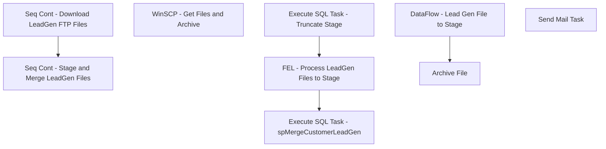

# SSIS Package: ExactTargetLeadGen

**Project:** ExactTargetLeadGen  
**Folder:** CRM  
**Server:** STL-SSIS-P-01  

## Connection Managers

| Name | Type | Server | Catalog | Connection (sanitized) |
|---|---|---|---|---|
| DWStaging | OLEDB | papamart | DWStaging | Data Source=papamart; Initial Catalog=DWStaging; Provider=SQLNCLI11.1; Integrated Security=SSPI; Auto Translate=False |
| LeadGenCsv | FLATFILE |  |  |  |
| SMTP | SMTP |  |  |  |
| dw | OLEDB | papamart | dw | Data Source=papamart; Initial Catalog=dw; Provider=SQLNCLI11.1; Integrated Security=SSPI; Auto Translate=False |

## Control Flow Tasks

| Task | Type |
|---|---|
| ExactTargetLeadGen | Package |
| Seq Cont - Download LeadGen FTP Files | SEQUENCE |
| WinSCP - Get Files and Archive | ExecuteProcess |
| Seq Cont - Stage and Merge LeadGen Files | SEQUENCE |
| Execute SQL Task - spMergeCustomerLeadGen | ExecuteSQLTask |
| Execute SQL Task - Truncate Stage | ExecuteSQLTask |
| FEL - Process LeadGen Files to Stage | FOREACHLOOP |
| Archive File | FileSystemTask |
| DataFlow - Lead Gen File to Stage | Pipeline |
| Send Mail Task | SendMailTask |

## Control Flow Outline

```text
- Send Mail Task [SendMailTask]
- Seq Cont - Download LeadGen FTP Files [SEQUENCE]
  - WinSCP - Get Files and Archive [ExecuteProcess]
- Seq Cont - Stage and Merge LeadGen Files [SEQUENCE]
  - Execute SQL Task - Truncate Stage [ExecuteSQLTask]
  - Execute SQL Task - spMergeCustomerLeadGen [ExecuteSQLTask]
  - FEL - Process LeadGen Files to Stage [FOREACHLOOP]
    - Archive File [FileSystemTask]
    - DataFlow - Lead Gen File to Stage [Pipeline]
```

## Architecture Diagram



## Variables

| Namespace | Name | Expression-bound |
|---|---|---|
| System | Propagate | No |
| User | DateTimeStamp | Yes |
| User | EndDate | Yes |
| User | EndDateAsDATE | Yes |
| User | FileDateString | Yes |
| User | FileNameString | Yes |
| User | GetDate | Yes |
| User | GetDateAsDATE | Yes |
| User | LeadGenFileArchivePath | No |
| User | LeadGenStagedFileName | No |
| User | StartDate | Yes |
| User | StartDateAsDATE | Yes |

### Expression-bound variable values

#### User::DateTimeStamp

**Expression:**

```sql
(DT_WSTR,4)DATEPART("yyyy",GetDate()) 
+ (DT_WSTR,4)DATEPART("mm",GetDate()) 
+ (DT_WSTR,4)DATEPART("dd",GetDate()) 
+ (DT_WSTR,4)DATEPART("hh",GetDate()) 
+ (DT_WSTR,4)DATEPART("mi",GetDate()) 
+ (DT_WSTR,4)DATEPART("ss",GetDate()) 
+ (DT_WSTR,4)DATEPART("ms",GetDate())
```

**Evaluated value:**

```sql
2021111715137867
```

#### User::EndDate

**Expression:**

```sql
dateadd("dd", @[$Package::DaysToInclude], @[User::StartDate])
```

**Evaluated value:**

```sql
11/17/2021
```

#### User::EndDateAsDATE

**Expression:**

```sql
(DT_WSTR, 4) datepart("year", @[User::EndDate])  + "-" +
right("0"+ (DT_WSTR, 2) datepart("mm", @[User::EndDate]),2)  + "-" +
right("0" +(DT_WSTR, 2) datepart("dd",  @[User::EndDate]),2)
```

**Evaluated value:**

```sql
2021-11-17
```

#### User::FileDateString

**Expression:**

```sql
RIGHT(
REPLACE( @[User::LeadGenStagedFileName] , ".csv", "" ),
8)
```

**Evaluated value:**

```sql
20211103
```

#### User::FileNameString

**Expression:**

```sql
RIGHT(@[User::LeadGenStagedFileName],44)
```

**Evaluated value:**

```sql
LeadReport_PII_TransactionStats_20211103.csv
```

#### User::GetDate

**Expression:**

```sql
(DT_DATE)DATEDIFF("Day", (DT_DATE) 0, GETDATE())
```

**Evaluated value:**

```sql
11/17/2021
```

#### User::GetDateAsDATE

**Expression:**

```sql
(DT_WSTR, 4) datepart("year", @[User::GetDate])  + "-" +
right("0"+ (DT_WSTR, 2) datepart("mm", @[User::GetDate]),2)  + "-" +
right("0" +(DT_WSTR, 2) datepart("dd",  @[User::GetDate]),2)
```

**Evaluated value:**

```sql
2021-11-17
```

#### User::StartDate

**Expression:**

```sql
dateadd("dd", -@[$Package::DaysToGoBack] , @[User::GetDate] )
```

**Evaluated value:**

```sql
11/16/2021
```

#### User::StartDateAsDATE

**Expression:**

```sql
(DT_WSTR, 4) datepart("year", @[User::StartDate])  + "-" +
right("0"+ (DT_WSTR, 2) datepart("mm", @[User::StartDate]),2)  + "-" +
right("0" +(DT_WSTR, 2) datepart("dd",  @[User::StartDate]),2)
```

**Evaluated value:**

```sql
2021-11-16
```

## Execute SQL Tasks

### Execute SQL Task - Truncate Stage

**Path:** `Package\Seq Cont - Stage and Merge LeadGen Files\Execute SQL Task - Truncate Stage`  
**Connection:** DWStaging (papamart/DWStaging)  

```sql
truncate table [CustomerLeadGenStage]
```

### Execute SQL Task - spMergeCustomerLeadGen

**Path:** `Package\Seq Cont - Stage and Merge LeadGen Files\Execute SQL Task - spMergeCustomerLeadGen`  
**Connection:** DWStaging (papamart/DWStaging)  

```sql
exec [dbo].[spMergeCustomerLeadGen] 

```

## Data Flow: Sources

| Component | Source Object | Type | Data Flow Task | Connection | SQL Kind |
|---|---|---|---|---|---|
| Flat File Source - LeadReport CSV |  | FlatFileSource | DataFlow - Lead Gen File to Stage | LeadGenCsv |  |

## Data Flow: Destinations

| Component | Target Table | Type | Data Flow Task | Connection | SQL Kind |
|---|---|---|---|---|---|
| OLE DB Destination - DWStaging - CustomerLeadGenStage |  | OLEDBDestination | DataFlow - Lead Gen File to Stage | DWStaging |  |
