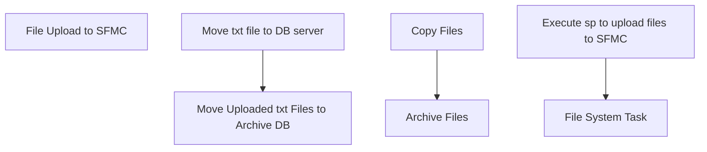

# SSIS Package: Package

**Project:** FileUploadSFMC  
**Folder:** CRM  
**Server:** STL-SSIS-P-01  

## Connection Managers

| Name | Type | Server | Catalog | Connection (sanitized) |
|---|---|---|---|---|
| Archive APP | FILE |  |  |  |
| Archive DB | FILE |  |  |  |
| FTP_SFMC APP | FILE |  |  |  |
| FTP_SFMC DB | FILE |  |  |  |
| STL-CRMDB-P-01.crm | OLEDB | STL-CRMDB-P-01 | crm | Data Source=STL-CRMDB-P-01; Initial Catalog=crm; Provider=SQLNCLI11.1; Integrated Security=SSPI; Auto Translate=False |

## Control Flow Tasks

| Task | Type |
|---|---|
| Package | Package |
| File Upload to SFMC | SEQUENCE |
| Move txt file to DB server | FOREACHLOOP |
| Archive Files | FileSystemTask |
| Copy Files | FileSystemTask |
| Move Uploaded txt Files to Archive DB | FOREACHLOOP |
| Execute sp to upload files to SFMC | ExecuteSQLTask |
| File System Task | FileSystemTask |

## Control Flow Outline

```text
- File Upload to SFMC [SEQUENCE]
  - Move Uploaded txt Files to Archive DB [FOREACHLOOP]
    - Execute sp to upload files to SFMC [ExecuteSQLTask]
    - File System Task [FileSystemTask]
  - Move txt file to DB server [FOREACHLOOP]
    - Archive Files [FileSystemTask]
    - Copy Files [FileSystemTask]
```

## Architecture Diagram



## Variables

| Namespace | Name | Expression-bound |
|---|---|---|
| User | FileCount | No |
| User | TextZipCommand | Yes |
| User | TxtFileNames | No |
| User | ZipDest | Yes |
| User | ZipFileNames | No |

### Expression-bound variable values

#### User::TextZipCommand

**Expression:**

```sql
"a -tzip \""+ @[User::ZipDest]  + "\"  \"" +  @[User::TxtFileNames] +"\" -sdel"
```

**Evaluated value:**

```sql
a -tzip "\\stl-crmapp-P-01\d$\HOSTDATA\DM\Export\FTP_SFMC\.zip"  "" -sdel
```

#### User::ZipDest

**Expression:**

```sql
"\\\\stl-crmapp-P-01\\d$\\HOSTDATA\\DM\\Export\\FTP_SFMC\\" + @[User::TxtFileNames]  + ".zip"
```

**Evaluated value:**

```sql
\\stl-crmapp-P-01\d$\HOSTDATA\DM\Export\FTP_SFMC\.zip
```

## Execute SQL Tasks

### Execute sp to upload files to SFMC

**Path:** `Package\File Upload to SFMC\Move Uploaded txt Files to Archive DB\Execute sp to upload files to SFMC`  
**Connection:** STL-CRMDB-P-01.crm (STL-CRMDB-P-01/crm)  

```sql
exec spExactTargetSFTPUpload
```

## Data Flow: Sources

_None detected._

## Data Flow: Destinations

_None detected._
