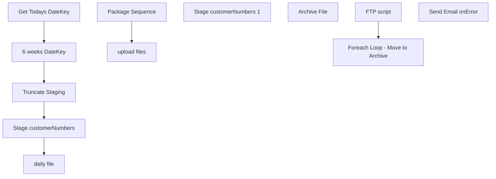

# SSIS Package: PartyDailyBirthdayExclusions

**Project:** PartyDailyBirthdayExclusions  
**Folder:** CRM  
**Server:** STL-SSIS-P-01  

## Connection Managers

| Name | Type | Server | Catalog | Connection (sanitized) |
|---|---|---|---|---|
| BABWPartyPlanner | OLEDB | bearcluster01.sql.buildabear.com | BABWPartyPlanner | Data Source=bearcluster01.sql.buildabear.com; Initial Catalog=BABWPartyPlanner; Provider=SQLNCLI11.1; Integrated Security=SSPI; Auto Translate=False |
| DWStaging | OLEDB | papamart | DWStaging | Data Source=papamart; Initial Catalog=DWStaging; Provider=SQLNCLI11.1; Integrated Security=SSPI; Auto Translate=False |
| PartyCustomers.csv | FLATFILE |  |  |  |
| PartyRequest | OLEDB | kodiak | PartyRequest | Data Source=kodiak; Initial Catalog=PartyRequest; Provider=SQLNCLI11.1; Integrated Security=SSPI; Auto Translate=False |
| SMTP_EMAIL | SMTP |  |  |  |
| dw | OLEDB | papamart | dw | Data Source=papamart; Initial Catalog=dw; Provider=SQLNCLI11.1; Integrated Security=SSPI; Auto Translate=False |

## Control Flow Tasks

| Task | Type |
|---|---|
| PartyDailyBirthdayExclusions | Package |
| Package Sequence | SEQUENCE |
| 6 weeks DateKey | ExecuteSQLTask |
| daily file | Pipeline |
| Get Todays DateKey | ExecuteSQLTask |
| Stage customerNumbers | Pipeline |
| Stage customerNumbers 1 | Pipeline |
| Truncate Staging | ExecuteSQLTask |
| upload files | SEQUENCE |
| Foreach Loop - Move to Archive | FOREACHLOOP |
| Archive File | FileSystemTask |
| FTP script | ExecuteSQLTask |
| Send Email onError | SendMailTask |

## Control Flow Outline

```text
- Send Email onError [SendMailTask]
- Package Sequence [SEQUENCE]
  - 6 weeks DateKey [ExecuteSQLTask]
  - Get Todays DateKey [ExecuteSQLTask]
  - Stage customerNumbers [Pipeline]
  - Stage customerNumbers 1 [Pipeline]
  - Truncate Staging [ExecuteSQLTask]
  - daily file [Pipeline]
- upload files [SEQUENCE]
  - FTP script [ExecuteSQLTask]
  - Foreach Loop - Move to Archive [FOREACHLOOP]
    - Archive File [FileSystemTask]
```

## Architecture Diagram



## Variables

| Namespace | Name | Expression-bound |
|---|---|---|
| System | Propagate | No |
| User | DateTimeStamp | Yes |
| User | SixWeeksDateKey | No |
| User | TodayDateKey | No |
| User | sqlPullIncompletedParties | Yes |
| User | varFileArchivePath | Yes |
| User | varFileToArchive | No |

### Expression-bound variable values

#### User::DateTimeStamp

**Expression:**

```sql
(DT_WSTR,4)DATEPART("yyyy",GetDate()) 
+ (DT_WSTR,4)DATEPART("mm",GetDate()) 
+ (DT_WSTR,4)DATEPART("dd",GetDate()) 
+ (DT_WSTR,4)DATEPART("hh",GetDate()) 
+ (DT_WSTR,4)DATEPART("mi",GetDate()) 
+ (DT_WSTR,4)DATEPART("ss",GetDate()) 
+ (DT_WSTR,4)DATEPART("ms",GetDate())
```

**Evaluated value:**

```sql
2022516145931547
```

#### User::sqlPullIncompletedParties

**Expression:**

```sql
"WITH ValidPMR AS (
	 SELECT MAX(PartyID) as PMRNumber, 
			CAST(CAST(EventID AS FLOAT) AS INT) AS EventID
	 FROM PartyRequest.dbo.Party
	 WHERE (ISNUMERIC(EventID) = 1) 
	 AND (EventID <> '1111111111111111111111111111111111')
	 GROUP BY CAST(CAST(EventID AS FLOAT) AS INT)
)


SELECT party.*,
	   pmr.PMRNumber
FROM BABWPartyPlanner.dbo.vwDWPartyFacts party
LEFT JOIN ValidPMR pmr
	ON party.PartyID = pmr.EventID
WHERE party.ExecuteDateKey > "  +  @[User::TodayDateKey]
```

**Evaluated value:**

```sql
WITH ValidPMR AS (
	 SELECT MAX(PartyID) as PMRNumber, 
			CAST(CAST(EventID AS FLOAT) AS INT) AS EventID
	 FROM PartyRequest.dbo.Party
	 WHERE (ISNUMERIC(EventID) = 1) 
	 AND (EventID <> '1111111111111111111111111111111111')
	 GROUP BY CAST(CAST(EventID AS FLOAT) AS INT)
)


SELECT party.*,
	   pmr.PMRNumber
FROM BABWPartyPlanner.dbo.vwDWPartyFacts party
LEFT JOIN ValidPMR pmr
	ON party.PartyID = pmr.EventID
WHERE party.ExecuteDateKey > 1234
```

#### User::varFileArchivePath

**Expression:**

```sql
"\\\\stl-ssis-p-01\\IntegrationStaging\\CRM\\PartyDaily\\Archive\\PartyCustomers_" +  @[User::DateTimeStamp] + ".csv"
```

**Evaluated value:**

```sql
\\stl-ssis-p-01\IntegrationStaging\CRM\PartyDaily\Archive\PartyCustomers_2022516145931547.csv
```

## Execute SQL Tasks

### 6 weeks DateKey

**Path:** `Package\Package Sequence\6 weeks DateKey`  
**Connection:** dw (papamart/dw)  

```sql
SELECT date_key FROM papamart.dw.dbo.date_dim WHERE actual_date = CAST(GETDATE()+42 as Date)
```

### Get Todays DateKey

**Path:** `Package\Package Sequence\Get Todays DateKey`  
**Connection:** dw (papamart/dw)  

```sql
SELECT date_key FROM papamart.dw.dbo.date_dim WHERE actual_date = CAST(GETDATE()-1 as Date)
```

### Truncate Staging

**Path:** `Package\Package Sequence\Truncate Staging`  
**Connection:** DWStaging (papamart/DWStaging)  

```sql
TRUNCATE TABLE [dbo].[PartyDailyBirthdayExclusions]
```

### FTP script

**Path:** `Package\upload files\FTP script`  
**Connection:** dw (papamart/dw)  

```sql
declare 
 @winSCP varchar(1000),
 @script varchar(1000),
 @log varchar(1000),
 @FTP varchar(4000),
 @Log_query varchar(1000),
 @Log_filename varchar(100),
 @Log_file_location varchar(100),
 @Log_bcp varchar(1000),
 @body varchar(4000)
select
 @winSCP = '"\\stl-ssis-p-01\C$\Program Files (x86)\WinSCP\WinSCP.exe"',
 @script = ' /script=\\stl-ssis-p-01\IntegrationStaging\CRM\FTP\sFTPuploadScript3.txt',
 @log = ' /log=\\stl-ssis-p-01\IntegrationStaging\CRM\FTP\upload.log',
 @FTP = (@winSCP + @script + @log)
   
   
exec master..xp_cmdshell @FTP
```

## Data Flow: Sources

| Component | Source Object | Type | Data Flow Task | Connection | SQL Kind |
|---|---|---|---|---|---|
| OLE DB Source |  | OLEDBSource | daily file | DWStaging | SqlCommand |
| future parties |  | OLEDBSource | Stage customerNumbers | BABWPartyPlanner | SqlCommand |
| past parties (30 days) |  | OLEDBSource | Stage customerNumbers | dw | SqlCommand |
| future parties |  | OLEDBSource | Stage customerNumbers 1 | BABWPartyPlanner | SqlCommand |
| past parties (30 days) |  | OLEDBSource | Stage customerNumbers 1 | dw | SqlCommand |

#### OLE DB Source — SqlCommand

```sql
SELECT [CustomerNumber], CONVERT(char(10), [partyDate], 101)  as partyDate FROM [dbo].[PartyDailyBirthdayExclusions] where [CustomerNumber] is not null
```

#### future parties — SqlCommand

```sql
;
with 
futurePartyCustID
as
(
select p.CustomerID, vp.ExecuteDateKey from Party p
join vwDWPartyFacts vp on p.PartyID = vp.PartyID
where p.PartyID in
(
select PartyID
from vwDWPartyFacts
where ExecuteDateKey between ? and ?
)
),
futurePartyEmailAddr
as
(select EmailAddress, CustomerID
from [dbo].[Customer]
where CUstomerID in 
(
select CustomerID from futurePartyCustID)
)
select e.EmailAddress, cast(d.actual_date as date) as 'partyDate'
,cD.customerNumber 
from futurePartyCustID c
join futurePartyEmailAddr e on c.CustomerID = e.CustomerID
join [papamart].[dw].[dbo].[date_dim] d on c.ExecuteDateKey = d.date_key
left join [papamart].[dw].[dbo].[CRMcustomerDim] cD on e.EmailAddress = cD.EmailAddress
order by actual_date asc
```

#### past parties (30 days) — SqlCommand

```sql
select ctf.CustomerNumber, cast(dd.actual_date as date) as 'partyDate'
from papamart.dw.dbo.CRMTransactionFact ctf
join papamart.dw.dbo.TransactionFact tf on ctf.TransactionID=tf.transaction_id
join papamart.dw.dbo.party_Facts pf on tf.party_key=pf.party_key
join papamart.dw.dbo.date_dim dd on pf.ExecuteDateKey = dd.date_key
where pf.OccasionName='Birthday Party'
and datediff(dd, ctf.TransactionDate, getdate())<=30
group by ctf.CustomerNumber, dd.actual_date
```

#### future parties — SqlCommand

```sql
;
with 
futurePartyCustID
as
(
select p.CustomerID, vp.ExecuteDateKey from Party p
join vwDWPartyFacts vp on p.PartyID = vp.PartyID
where p.PartyID in
(
select PartyID
from vwDWPartyFacts
where ExecuteDateKey >= ?
)
),
futurePartyEmailAddr
as
(select EmailAddress, CustomerID
from [dbo].[Customer]
where CUstomerID in 
(
select CustomerID from futurePartyCustID)
)
select e.EmailAddress, cast(d.actual_date as date) as 'partyDate'
,cD.customerNumber 
from futurePartyCustID c
join futurePartyEmailAddr e on c.CustomerID = e.CustomerID
join [papamart].[dw].[dbo].[date_dim] d on c.ExecuteDateKey = d.date_key
left join [papamart].[dw].[dbo].[CRMcustomerDim] cD on e.EmailAddress = cD.EmailAddress
order by actual_date asc
```

## Data Flow: Destinations

| Component | Target Table | Type | Data Flow Task | Connection | SQL Kind |
|---|---|---|---|---|---|
| Flat File Destination |  | FlatFileDestination | daily file | PartyCustomers.csv |  |
| Staging |  | OLEDBDestination | Stage customerNumbers | DWStaging |  |
| Staging |  | OLEDBDestination | Stage customerNumbers 1 | DWStaging |  |
