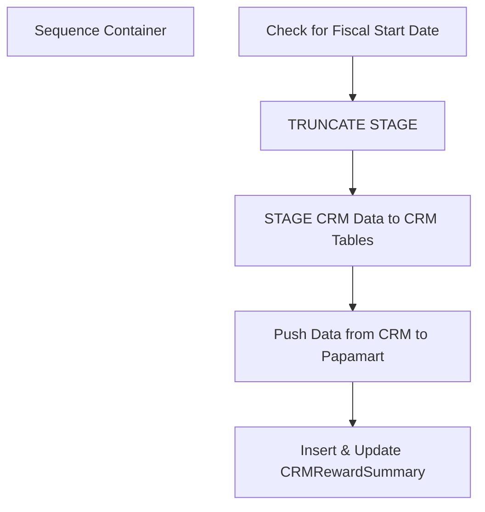

# SSIS Package: SOX_SFSCheckbook

**Project:** SOX_SFSCheckbook  
**Folder:** CRM  
**Server:** STL-SSIS-P-01  

## Connection Managers

| Name | Type | Server | Catalog | Connection (sanitized) |
|---|---|---|---|---|
| CRM | OLEDB | STL-CRMDB-P-01 | crm | Data Source=STL-CRMDB-P-01; Initial Catalog=crm; Provider=SQLNCLI11.1; Integrated Security=SSPI; Auto Translate=False |
| DW | OLEDB | papamart | dw | Data Source=papamart; Initial Catalog=dw; Provider=SQLNCLI11.1; Integrated Security=SSPI; Auto Translate=False |
| SOX | OLEDB | papamart | SOX | Data Source=papamart; Initial Catalog=SOX; Provider=SQLNCLI11.1; Integrated Security=SSPI; Auto Translate=False |

## Control Flow Tasks

| Task | Type |
|---|---|
| SOX_SFSCheckbook | Package |
| Sequence Container | SEQUENCE |
| Check for Fiscal Start Date | ExecuteSQLTask |
| Insert & Update CRMRewardSummary | ExecuteSQLTask |
| Push Data from CRM to Papamart | Pipeline |
| STAGE CRM Data to CRM Tables | ExecuteSQLTask |
| TRUNCATE STAGE | ExecuteSQLTask |

## Control Flow Outline

```text
- Sequence Container [SEQUENCE]
  - Check for Fiscal Start Date [ExecuteSQLTask]
  - Insert & Update CRMRewardSummary [ExecuteSQLTask]
  - Push Data from CRM to Papamart [Pipeline]
  - STAGE CRM Data to CRM Tables [ExecuteSQLTask]
  - TRUNCATE STAGE [ExecuteSQLTask]
```

## Architecture Diagram



## Variables

| Namespace | Name | Expression-bound |
|---|---|---|
| User | BatchRunDate | No |
| User | DeleteCount | No |
| User | DisableEventHandlerPostExecute | No |
| User | ErrorCount | No |
| User | ErrorEmailActive | No |
| User | ErrorEmailMsg | No |
| User | ErrorEmailMsgAdditional | No |
| User | ErrorEmailMsgFooter | No |
| User | ErrorEmailMsgHeader | Yes |
| User | ErrorEmailMsgLog | No |
| User | ErrorEmailMsgLogQuery | Yes |
| User | ErrorEmailMsgValidation | No |
| User | ErrorEmailRecipientList | No |
| User | ErrorEmailSubject | Yes |
| User | InsertCount | No |
| User | IsFiscalStart | No |
| User | LogID | No |
| User | ParentLogID | No |
| User | RowCount | No |
| User | UpdateCount | No |

### Expression-bound variable values

#### User::ErrorEmailMsgHeader

**Expression:**

```sql
"Machine:  " + @[System::MachineName] + " Package:  " + @[System::PackageName] + " Date:   " + (DT_STR, 30, 1252)  GETDATE() + " LogID:  " + (DT_STR, 30, 1252)@[User::ParentLogID]
```

**Evaluated value:**

```sql
Machine:  STL-SSIS-P-01 Package:  SOX_SFSCheckbook Date:   2019-02-12 11:44:06.261000000 LogID:  435135
```

#### User::ErrorEmailMsgLogQuery

**Expression:**

```sql
"
select 'Source: ' + source + 'Error: ' + message as Message 
from ssistemplates.dbo.sysssislog with (nolock) 
where executionid = '" +  @[System::ExecutionInstanceGUID] + "'"
```

**Evaluated value:**

```sql

select 'Source: ' + source + 'Error: ' + message as Message 
from ssistemplates.dbo.sysssislog with (nolock) 
where executionid = '{8F210034-2EA9-4DB1-9D3B-8C7A90F1A414}'
```

#### User::ErrorEmailSubject

**Expression:**

```sql
"Error: " + @[System::PackageName] + " On " + @[System::MachineName] 
```

**Evaluated value:**

```sql
Error: SOX_SFSCheckbook On STL-SSIS-P-01
```

## Execute SQL Tasks

### Check for Fiscal Start Date

**Path:** `Package\Sequence Container\Check for Fiscal Start Date`  
**Connection:** DW (papamart/dw)  

```sql
declare 
	@FiscalStartCheck int;

with FirstFiscalPeriodDateKeys as
	(
		select min(date_key) MinDateKey
		from papamart.dw.dbo.date_dim 
		group by fiscal_year, fiscal_period
	)
select @FiscalStartCheck = dd.date_key
from papamart.dw.dbo.date_dim dd
join FirstFiscalPeriodDateKeys dk on dd.date_key = dk.MinDateKey
where datediff(dd, dd.actual_date, getdate()) = 0

if @FiscalStartCheck is not NULL 
select 1 as StopGo
else 
select 0 as StopGo
```

### Insert & Update CRMRewardSummary

**Path:** `Package\Sequence Container\Insert & Update CRMRewardSummary`  
**Connection:** SOX (papamart/SOX)  

```sql
exec spSOX_CRMCheckbook
```

### STAGE CRM Data to CRM Tables

**Path:** `Package\Sequence Container\STAGE CRM Data to CRM Tables`  
**Connection:** CRM (STL-CRMDB-P-01/crm)  

```sql
EXEC spDW_StageCRMRewardTransaction
```

### TRUNCATE STAGE

**Path:** `Package\Sequence Container\TRUNCATE STAGE`  
**Connection:** SOX (papamart/SOX)  

```sql
truncate table sox.[Staging].[CRMRewardTransaction] 
truncate table sox.[Staging].[CRMPointExpiration]
```

## Data Flow: Sources

| Component | Source Object | Type | Data Flow Task | Connection | SQL Kind |
|---|---|---|---|---|---|
| CRMPointExpiration |  | OLEDBSource | Push Data from CRM to Papamart | CRM |  |
| CRMRewardTransaction |  | OLEDBSource | Push Data from CRM to Papamart | CRM |  |

## Data Flow: Destinations

| Component | Target Table | Type | Data Flow Task | Connection | SQL Kind |
|---|---|---|---|---|---|
| SOX Staging CRMPointExpiration |  | OLEDBDestination | Push Data from CRM to Papamart | SOX |  |
| SOX Staging CRMRewardTransaction |  | OLEDBDestination | Push Data from CRM to Papamart | SOX |  |
