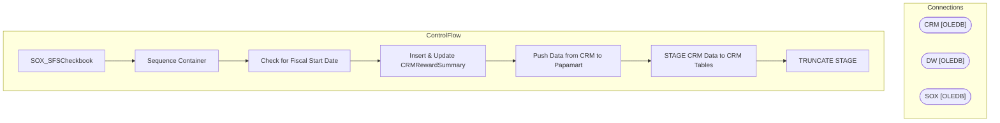

# SSIS Package: SOX_SFSCheckbook

**Project:** SOX_SFSCheckbook  
**Folder:** CRM  
**Server:** STL-SSIS-P-01  

## Architecture Diagram

## Connection Managers

| Name | Type |
|---|---|
| CRM | OLEDB |
| DW | OLEDB |
| SOX | OLEDB |

## Control Flow Tasks

| Task | Type |
|---|---|
| SOX_SFSCheckbook | Microsoft.Package |
| Sequence Container | STOCK:SEQUENCE |
| Check for Fiscal Start Date | Microsoft.ExecuteSQLTask |
| Insert & Update CRMRewardSummary | Microsoft.ExecuteSQLTask |
| Push Data from CRM to Papamart | Microsoft.Pipeline |
| STAGE CRM Data to CRM Tables | Microsoft.ExecuteSQLTask |
| TRUNCATE STAGE | Microsoft.ExecuteSQLTask |

## Data Flow: Sources

_None detected._

## Data Flow: Destinations

| Component | Destination |
|---|---|
|  | [dbo].[CRMPointExpiration] |
|  | [dbo].[CRMRewardTransaction] |
|  | [Staging].[CRMPointExpiration] |
|  | [Staging].[CRMRewardTransaction] |

