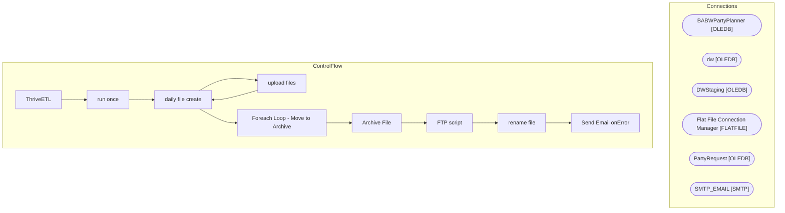

# SSIS Package: ThriveETL

**Project:** ThriveETL  
**Folder:** CRM  
**Server:** STL-SSIS-P-01  

## Architecture Diagram

## Connection Managers

| Name | Type |
|---|---|
| BABWPartyPlanner | OLEDB |
| dw | OLEDB |
| DWStaging | OLEDB |
| Flat File Connection Manager | FLATFILE |
| PartyRequest | OLEDB |
| SMTP_EMAIL | SMTP |

## Control Flow Tasks

| Task | Type |
|---|---|
| ThriveETL | Microsoft.Package |
| run once | STOCK:SEQUENCE |
| daily file create | Microsoft.Pipeline |
| upload files | STOCK:SEQUENCE |
| daily file create | Microsoft.Pipeline |
| Foreach Loop - Move to Archive | STOCK:FOREACHLOOP |
| Archive File | Microsoft.FileSystemTask |
| FTP script | Microsoft.ExecuteSQLTask |
| rename file | Microsoft.FileSystemTask |
| Send Email onError | Microsoft.SendMailTask |

## Data Flow: Sources

| Component | SQL Preview |
|---|---|
|  | ; with tra as ( SELECT DD.actual_date, SD.store_id, SD.store_name, SD.postal_code, SUM(STF.Exits) AS Traffic --INTO #tra FROM DBO.ShopperTrackFact STF WITH (NOLOCK) JOIN DBO.store_dim SD WITH (NOLOCK) ON STF.STOREKEY = SD.STORE_KEY JOIN DBO.date_dim DD WITH (NOLOCK) ON STF.DATEKEY = DD.DATE_KEY --WHERE DD.actual_date between '2019-02-03' and '2022-04-02' where cast(DD.actual_date as date) between  |
|  | ; with tra as ( SELECT DD.actual_date, SD.store_id, SD.store_name, SD.postal_code, SUM(STF.Exits) AS Traffic --INTO #tra FROM DBO.ShopperTrackFact STF WITH (NOLOCK) JOIN DBO.store_dim SD WITH (NOLOCK) ON STF.STOREKEY = SD.STORE_KEY JOIN DBO.date_dim DD WITH (NOLOCK) ON STF.DATEKEY = DD.DATE_KEY --WHERE DD.actual_date between '2019-02-03' and '2022-04-02' where cast(DD.actual_date as date) between  |

## Data Flow: Destinations

_None detected._

