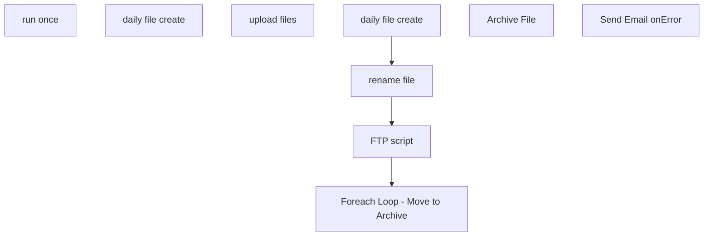

# SSIS Package: ThriveETL

**Project:** ThriveETL  
**Folder:** CRM  
**Server:** STL-SSIS-P-01  

## Connection Managers

| Name | Type | Server | Catalog | Connection (sanitized) |
|---|---|---|---|---|
| BABWPartyPlanner | OLEDB | bearcluster01.sql.buildabear.com | BABWPartyPlanner | Data Source=bearcluster01.sql.buildabear.com; Initial Catalog=BABWPartyPlanner; Provider=SQLNCLI11.1; Integrated Security=SSPI; Auto Translate=False |
| DWStaging | OLEDB | papamart | DWStaging | Data Source=papamart; Initial Catalog=DWStaging; Provider=SQLNCLI11.1; Integrated Security=SSPI; Auto Translate=False |
| Flat File Connection Manager | FLATFILE |  |  |  |
| PartyRequest | OLEDB | kodiak | PartyRequest | Data Source=kodiak; Initial Catalog=PartyRequest; Provider=SQLNCLI11.1; Integrated Security=SSPI; Auto Translate=False |
| SMTP_EMAIL | SMTP |  |  |  |
| dw | OLEDB | papamart | dw | Data Source=papamart; Initial Catalog=dw; Provider=SQLNCLI11.1; Integrated Security=SSPI; Auto Translate=False |

## Control Flow Tasks

| Task | Type |
|---|---|
| ThriveETL | Package |
| run once | SEQUENCE |
| daily file create | Pipeline |
| upload files | SEQUENCE |
| daily file create | Pipeline |
| Foreach Loop - Move to Archive | FOREACHLOOP |
| Archive File | FileSystemTask |
| FTP script | ExecuteSQLTask |
| rename file | FileSystemTask |
| Send Email onError | SendMailTask |

## Control Flow Outline

```text
- Send Email onError [SendMailTask]
- run once [SEQUENCE]
  - daily file create [Pipeline]
- upload files [SEQUENCE]
  - FTP script [ExecuteSQLTask]
  - Foreach Loop - Move to Archive [FOREACHLOOP]
    - Archive File [FileSystemTask]
  - daily file create [Pipeline]
  - rename file [FileSystemTask]
```

## Architecture Diagram



## Variables

| Namespace | Name | Expression-bound |
|---|---|---|
| System | Propagate | No |
| User | DateTimeStamp | Yes |
| User | EndDate | Yes |
| User | EndDateAsDATE | Yes |
| User | GetDate | Yes |
| User | GetDateAsDATE | Yes |
| User | StartDate | Yes |
| User | StartDateAsDATE | Yes |
| User | TodayDateKey | No |
| User | sqlPullIncompletedParties | Yes |
| User | varArchiveDirectory | Yes |
| User | varFileToArchive | No |
| User | varFileToRename | Yes |
| User | varFileWithDate | Yes |

### Expression-bound variable values

#### User::DateTimeStamp

**Expression:**

```sql
(DT_WSTR,4)DATEPART("yyyy",GetDate()) 
+ (DT_WSTR,4)DATEPART("mm",GetDate()) 
+ (DT_WSTR,4)DATEPART("dd",GetDate()) 
+ (DT_WSTR,4)DATEPART("hh",GetDate()) 
+ (DT_WSTR,4)DATEPART("mi",GetDate()) 
+ (DT_WSTR,4)DATEPART("ss",GetDate()) 
+ (DT_WSTR,4)DATEPART("ms",GetDate())
```

**Evaluated value:**

```sql
2025625101217440
```

#### User::EndDate

**Expression:**

```sql
dateadd("dd", @[$Package::DaysToInclude], @[User::StartDate])
```

**Evaluated value:**

```sql
6/25/2025
```

#### User::EndDateAsDATE

**Expression:**

```sql
(DT_WSTR, 4) datepart("year", @[User::EndDate])  + "-" +
right("0"+ (DT_WSTR, 2) datepart("mm", @[User::EndDate]),2)  + "-" +
right("0" +(DT_WSTR, 2) datepart("dd",  @[User::EndDate]),2)
```

**Evaluated value:**

```sql
2025-06-25
```

#### User::GetDate

**Expression:**

```sql
(DT_DATE)DATEDIFF("Day", (DT_DATE) 0, GETDATE())
```

**Evaluated value:**

```sql
6/25/2025
```

#### User::GetDateAsDATE

**Expression:**

```sql
(DT_WSTR, 4) datepart("year", @[User::GetDate])  + "-" +
right("0"+ (DT_WSTR, 2) datepart("mm", @[User::GetDate]),2)  + "-" +
right("0" +(DT_WSTR, 2) datepart("dd",  @[User::GetDate]),2)
```

**Evaluated value:**

```sql
2025-06-25
```

#### User::StartDate

**Expression:**

```sql
dateadd("dd", -@[$Package::DaysToGoBack] , @[User::GetDate] )
```

**Evaluated value:**

```sql
6/22/2025
```

#### User::StartDateAsDATE

**Expression:**

```sql
(DT_WSTR, 4) datepart("year", @[User::StartDate])  + "-" +
right("0"+ (DT_WSTR, 2) datepart("mm", @[User::StartDate]),2)  + "-" +
right("0" +(DT_WSTR, 2) datepart("dd",  @[User::StartDate]),2)
```

**Evaluated value:**

```sql
2025-06-22
```

#### User::sqlPullIncompletedParties

**Expression:**

```sql
"WITH ValidPMR AS (
	 SELECT MAX(PartyID) as PMRNumber, 
			CAST(CAST(EventID AS FLOAT) AS INT) AS EventID
	 FROM PartyRequest.dbo.Party
	 WHERE (ISNUMERIC(EventID) = 1) 
	 AND (EventID <> '1111111111111111111111111111111111')
	 GROUP BY CAST(CAST(EventID AS FLOAT) AS INT)
)


SELECT party.*,
	   pmr.PMRNumber
FROM BABWPartyPlanner.dbo.vwDWPartyFacts party
LEFT JOIN ValidPMR pmr
	ON party.PartyID = pmr.EventID
WHERE party.ExecuteDateKey > "  +  @[User::TodayDateKey]
```

**Evaluated value:**

```sql
WITH ValidPMR AS (
	 SELECT MAX(PartyID) as PMRNumber, 
			CAST(CAST(EventID AS FLOAT) AS INT) AS EventID
	 FROM PartyRequest.dbo.Party
	 WHERE (ISNUMERIC(EventID) = 1) 
	 AND (EventID <> '1111111111111111111111111111111111')
	 GROUP BY CAST(CAST(EventID AS FLOAT) AS INT)
)


SELECT party.*,
	   pmr.PMRNumber
FROM BABWPartyPlanner.dbo.vwDWPartyFacts party
LEFT JOIN ValidPMR pmr
	ON party.PartyID = pmr.EventID
WHERE party.ExecuteDateKey > 1234
```

#### User::varArchiveDirectory

**Expression:**

```sql
"\\\\stl-ssis-p-01\\IntegrationStaging\\Thrive\\Archive\\"
```

**Evaluated value:**

```sql
\\stl-ssis-p-01\IntegrationStaging\Thrive\Archive\
```

#### User::varFileToRename

**Expression:**

```sql
"\\\\stl-ssis-p-01\\IntegrationStaging\\Thrive\\thrive.csv"
```

**Evaluated value:**

```sql
\\stl-ssis-p-01\IntegrationStaging\Thrive\thrive.csv
```

#### User::varFileWithDate

**Expression:**

```sql
"\\\\stl-ssis-p-01\\IntegrationStaging\\Thrive\\thrive_" +  @[User::DateTimeStamp] + ".csv"
```

**Evaluated value:**

```sql
\\stl-ssis-p-01\IntegrationStaging\Thrive\thrive_2025625101217440.csv
```

## Execute SQL Tasks

### FTP script

**Path:** `Package\upload files\FTP script`  
**Connection:** dw (papamart/dw)  

```sql
declare 
 @winSCP varchar(1000),
 @script varchar(1000),
 @log varchar(1000),
 @FTP varchar(4000),
 @Log_query varchar(1000),
 @Log_filename varchar(100),
 @Log_file_location varchar(100),
 @Log_bcp varchar(1000),
 @body varchar(4000)
select
 @winSCP = '"\\stl-ssis-p-01\C$\Program Files (x86)\WinSCP\WinSCP.exe"',
 @script = ' /script=\\stl-ssis-p-01\IntegrationStaging\Thrive\FTP\sFTPuploadScript.txt',
 @log = ' /log=\\stl-ssis-p-01\IntegrationStaging\Thrive\FTP\upload.log',
 @FTP = (@winSCP + @script + @log)
   
   
exec master..xp_cmdshell @FTP
```

## Data Flow: Sources

| Component | Source Object | Type | Data Flow Task | Connection | SQL Kind |
|---|---|---|---|---|---|
| David Walsh query |  | OLEDBSource | daily file create | dw | SqlCommand |
| David Walsh query |  | OLEDBSource | daily file create | dw | SqlCommand |

#### David Walsh query — SqlCommand

```sql
;
with
tra as
(
SELECT
DD.actual_date, SD.store_id, SD.store_name, SD.postal_code, SUM(STF.Exits) AS Traffic
--INTO #tra
FROM DBO.ShopperTrackFact STF WITH (NOLOCK)
JOIN DBO.store_dim SD WITH (NOLOCK) ON STF.STOREKEY = SD.STORE_KEY
JOIN DBO.date_dim DD WITH (NOLOCK) ON STF.DATEKEY = DD.DATE_KEY
--WHERE DD.actual_date between '2019-02-03' and '2022-04-02'
where cast(DD.actual_date as date) between ? and ?
AND SD.country = 'US'
AND SD.store_id not in (0,470,990,991)
GROUP BY 
DD.actual_date, SD.store_id, SD.store_name, SD.postal_code
--ORDER BY 1,2
),
-- web temp table to get the transactions from DW --
--if object_id('tempdb..#wbl')is not null begin drop table #wbl end
wbl as
(
SELECT DISTINCT dd.fiscal_year, dd.fiscal_quarter, dd.fiscal_period, dd.fiscal_week, dd.actual_date, sd.store_id, sd.store_name, TF.TRANSACTION_ID, TF.GAAP_sales_amount
--INTO #wbl
FROM dbo.transaction_facts TF WITH (NOLOCK)
JOIN dbo.store_dim SD WITH (NOLOCK) ON TF.STORE_KEY = SD.STORE_KEY
JOIN dbo.date_dim DD WITH(NOLOCK) ON TF.DATE_KEY = DD.DATE_KEY
--WHERE DD.actual_date between '2019-02-03' and '2022-04-02'
--WHERE DD.actual_date between '2022-03-27' and '2022-04-02'
where cast(DD.actual_date as date) between ? and ?
AND (TF.isShipFromStore = 1  OR TF.isPickupFromStore = 1 OR TF.isCurbside = 1 OR TF.isSameDayShipt = 1 or SD.store_id = 13)
AND TF.GAAP_transaction_flag = 1
)
--store data pull -- 
select distinct 
DD.fiscal_year,
DD.fiscal_quarter,
DD.fiscal_period,
DD.fiscal_week,
DD.actual_date as 'Trans Date / Ship Date', 
SD.store_id, 
SD.store_name, 
substring(SD.postal_code,1,5) as Postal_Code, 
tra.Traffic, 
count(TF.transaction_id) as Trans, 
sum(TF.GAAP_sales_amount) as Sales
FROM dbo.Transaction_Facts TF WITH (NOLOCK)
JOIN DBO.store_dim SD WITH (NOLOCK) ON TF.STORE_KEY = SD.STORE_KEY
JOIN DBO.date_dim DD WITH (NOLOCK) ON TF.DATE_KEY = DD.DATE_KEY
LEFT JOIN tra TRA WITH (NOLOCK) ON SD.store_id = TRA.store_id AND DD.actual_date = TRA.actual_date
--WHERE DD.actual_date between '2019-02-03' and '2022-04-02'
where cast(DD.actual_date as date) between ? and ?
--WHERE DD.actual_date between '2022-03-27' and '2022-04-02'
AND SD.country = 'US'
AND SD.store_id not in (0,13,470,990,991)
AND TF.GAAP_transaction_flag = 1
AND (TF.isShipFromStore <> 1 or TF.isShipFromStore is null)
AND (TF.isPickupFromStore <> 1 or TF.isPickupFromStore is null)
AND (TF.isCurbside <> 1 or isCurbside is null)
AND (TF.isSameDayShipt <> 1 or isSameDayShipt is null)
GROUP BY DD.fiscal_year, DD.fiscal_quarter, DD.fiscal_period, DD.fiscal_week,
DD.actual_date, SD.store_id, SD.store_name, SD.postal_code, TRA.Traffic

UNION
--web data pull --

select
webt.fiscal_year,
webt.fiscal_quarter,
webt.fiscal_period,
webt.fiscal_week,
webt.actual_date as 'TransDate_ShipDate',
webt.store_id,
webt.store_name,
substring(webt.ShipToPostalCode,1,5) as Postal_Code,
webt.traffic,
count(webt.transaction_id) as trans,
sum(webt.gaap_sales_amount) as sales
from
(select distinct 
wbl.fiscal_year,
wbl.fiscal_quarter,
wbl.fiscal_period,
wbl.fiscal_week,
wbl.actual_date,
'13' as store_id,
'US Web Store' as store_name,
wo.ShipToPostalCode,
'0' as traffic,
wbl.transaction_id,
wbl.gaap_sales_amount
from dbo.WebShippingFacts wsf with (nolock)
join dbo.weborders wo with (nolock) on wsf.ordernumber = wo.ordernum
join wbl wbl with(nolock) on wsf.transaction_id = wbl.transaction_id
where wsf.shiptocountry = 'US'
) webt
group by
webt.fiscal_year,
webt.fiscal_quarter,
webt.fiscal_period,
webt.fiscal_week,
webt.actual_date,
webt.store_id,
webt.store_name,
webt.ShipToPostalCode,
webt.traffic
order by 1,2,3,4,5,6
```

#### David Walsh query — SqlCommand

```sql
;
with
tra as
(
SELECT
DD.actual_date, SD.store_id, SD.store_name, SD.postal_code, SUM(STF.Exits) AS Traffic
--INTO #tra
FROM DBO.ShopperTrackFact STF WITH (NOLOCK)
JOIN DBO.store_dim SD WITH (NOLOCK) ON STF.STOREKEY = SD.STORE_KEY
JOIN DBO.date_dim DD WITH (NOLOCK) ON STF.DATEKEY = DD.DATE_KEY
--WHERE DD.actual_date between '2019-02-03' and '2022-04-02'
where cast(DD.actual_date as date) between ? and ?
--where cast(DD.actual_date as date) between '06/22/2025' and '06/25/2025'
--AND SD.Country = 'US'
AND SD.country in ('US','CA','CAN')
AND SD.store_id not in (0,470,990,991)
GROUP BY 
DD.actual_date, SD.store_id, SD.store_name, SD.postal_code
--ORDER BY 1,2
),
-- web temp table to get the transactions from DW --
--if object_id('tempdb..#wbl')is not null begin drop table #wbl end
wbl as
(
SELECT DISTINCT dd.fiscal_year, dd.fiscal_quarter, dd.fiscal_period, dd.fiscal_week, dd.actual_date, sd.store_id, sd.store_name, TF.TRANSACTION_ID, TF.GAAP_sales_amount
--INTO #wbl
FROM dbo.transaction_facts TF WITH (NOLOCK)
JOIN dbo.store_dim SD WITH (NOLOCK) ON TF.STORE_KEY = SD.STORE_KEY
JOIN dbo.date_dim DD WITH(NOLOCK) ON TF.DATE_KEY = DD.DATE_KEY
--WHERE DD.actual_date between '2019-02-03' and '2022-04-02'
--WHERE DD.actual_date between '2022-03-27' and '2022-04-02'
where cast(DD.actual_date as date) between ? and ?
--where cast(DD.actual_date as date) between '06/22/2025' and '06/25/2025'
AND (TF.isShipFromStore = 1  OR TF.isPickupFromStore = 1 OR TF.isCurbside = 1 OR TF.isSameDayShipt = 1 or SD.store_id = 13)
AND TF.GAAP_transaction_flag = 1
)
--store data pull -- 
select distinct 
DD.fiscal_year,
DD.fiscal_quarter,
DD.fiscal_period,
DD.fiscal_week,
DD.actual_date as 'Trans Date / Ship Date', 
SD.store_id, 
SD.store_name, 
substring(SD.postal_code,1,5) as Postal_Code, 
tra.Traffic, 
count(TF.transaction_id) as Trans, 
sum(TF.GAAP_sales_amount) as Sales
FROM dbo.Transaction_Facts TF WITH (NOLOCK)
JOIN DBO.store_dim SD WITH (NOLOCK) ON TF.STORE_KEY = SD.STORE_KEY
JOIN DBO.date_dim DD WITH (NOLOCK) ON TF.DATE_KEY = DD.DATE_KEY
LEFT JOIN tra TRA WITH (NOLOCK) ON SD.store_id = TRA.store_id AND DD.actual_date = TRA.actual_date
--WHERE DD.actual_date between '2019-02-03' and '2022-04-02'
where cast(DD.actual_date as date) between ? and ?
--where cast(DD.actual_date as date) between '06/22/2025' and '06/25/2025'
--WHERE DD.actual_date between '2022-03-27' and '2022-04-02'
--AND SD.country = 'US'
AND SD.country  in ('US','CA','CAN')
--AND SD.country  in ('CA','CAN')
AND SD.store_id not in (0,13,470,990,991)
AND TF.GAAP_transaction_flag = 1
AND (TF.isShipFromStore <> 1 or TF.isShipFromStore is null)
AND (TF.isPickupFromStore <> 1 or TF.isPickupFromStore is null)
AND (TF.isCurbside <> 1 or isCurbside is null)
AND (TF.isSameDayShipt <> 1 or isSameDayShipt is null)
GROUP BY DD.fiscal_year, DD.fiscal_quarter, DD.fiscal_period, DD.fiscal_week,
DD.actual_date, SD.store_id, SD.store_name, SD.postal_code, TRA.Traffic

UNION
--web data pull --

select
webt.fiscal_year,
webt.fiscal_quarter,
webt.fiscal_period,
webt.fiscal_week,
webt.actual_date as 'TransDate_ShipDate',
webt.store_id,
webt.store_name,
substring(webt.ShipToPostalCode,1,5) as Postal_Code,
webt.traffic,
count(webt.transaction_id) as trans,
sum(webt.gaap_sales_amount) as sales
from
(select distinct 
wbl.fiscal_year,
wbl.fiscal_quarter,
wbl.fiscal_period,
wbl.fiscal_week,
wbl.actual_date,
'13' as store_id,
'US Web Store' as store_name,
wo.ShipToPostalCode,
'0' as traffic,
wbl.transaction_id,
wbl.gaap_sales_amount
from dbo.WebShippingFacts wsf with (nolock)
join dbo.weborders wo with (nolock) on wsf.ordernumber = wo.ordernum
join wbl wbl with(nolock) on wsf.transaction_id = wbl.transaction_id
where 1=1 
--AND wsf.shiptocountry = 'US'
AND wsf.shiptocountry in ('US','CA','CAN')
--AND wsf.shiptocountry in ('CA','CAN')
) webt
group by
webt.fiscal_year,
webt.fiscal_quarter,
webt.fiscal_period,
webt.fiscal_week,
webt.actual_date,
webt.store_id,
webt.store_name,
webt.ShipToPostalCode,
webt.traffic
order by 1,2,3,4,5,6
```

## Data Flow: Destinations

| Component | Target Table | Type | Data Flow Task | Connection | SQL Kind |
|---|---|---|---|---|---|
| Flat File Destination |  | FlatFileDestination | daily file create | Flat File Connection Manager |  |
| Flat File Destination |  | FlatFileDestination | daily file create | Flat File Connection Manager |  |
