# SSIS Package: ProcessCube

**Project:** ProcessCube  
**Folder:** Cube  
**Server:** STL-SSIS-P-01  

## Connection Managers

| Name | Type | Server | Catalog | Connection (sanitized) |
|---|---|---|---|---|
| Cube | MSOLAP100 | biapp01 | BAB DW | Data Source=biapp01; Initial Catalog=BAB DW; Provider=MSOLAP.8; Integrated Security=SSPI; Impersonation Level=Impersonate |
| DWStaging | OLEDB | papamart | DWStaging | Data Source=papamart; Initial Catalog=DWStaging; Provider=SQLNCLI11.1; Integrated Security=SSPI; Auto Translate=False |
| SMTP | SMTP |  |  |  |
| SSISTemplates | OLEDB | papamart | SSISTemplates | Data Source=papamart; Initial Catalog=SSISTemplates; Provider=SQLNCLI11.1; Integrated Security=SSPI; Auto Translate=False |
| SSRSJobServer | OLEDB | STL-SQL-P-04\SQL2008R2 | msdb | Data Source=STL-SQL-P-04\SQL2008R2; Initial Catalog=msdb; Provider=SQLNCLI11.1; Integrated Security=SSPI; Auto Translate=False |
| biapp01.BAB DW | OLEDB | biapp01 | BAB DW | Data Source=biapp01; Initial Catalog=BAB DW; Provider=MSOLAP.7; Integrated Security=SSPI; Extended Properties=Format=Tabular |
| dw | OLEDB | papamart | dw | Data Source=papamart; Initial Catalog=dw; Provider=SQLNCLI11.1; Integrated Security=SSPI; Auto Translate=False |

## Control Flow Tasks

| Task | Type |
|---|---|
| ProcessCube | Package |
| CRM Sequence | SEQUENCE |
| Foreach Loop Container | FOREACHLOOP |
| Analysis Services Processing Task | DTSProcessingTask |
| Select Cube Partitions | ExecuteSQLTask |
| Labor Measures Sequence | SEQUENCE |
| Foreach Loop Container | FOREACHLOOP |
| Analysis Services Processing Task | DTSProcessingTask |
| Run Cube Validation | ExecuteSQLTask |
| Select Cube Partitions | ExecuteSQLTask |
| Measures Sequence | SEQUENCE |
| Foreach Loop Container | FOREACHLOOP |
| Analysis Services Processing Task | DTSProcessingTask |
| Run Cube Validation | ExecuteSQLTask |
| Select Cube Partitions | ExecuteSQLTask |
| SeqCont - Validate | SEQUENCE |
| Capture Imbalance Count | ExecuteSQLTask |
| Capture MDX Date | ExecuteSQLTask |
| Data Flow Task | Pipeline |
| Raise Error | ExecuteSQLTask |
| Send Mail Task | SendMailTask |
| Truncate Stage | ExecuteSQLTask |
| Process Dimensions | DTSProcessingTask |
| Process Labor Dimensions | DTSProcessingTask |
| StoreComps Sequence | SEQUENCE |
| Foreach Loop Container | FOREACHLOOP |
| Analysis Services Processing Task | DTSProcessingTask |
| Select Cube Partitions | ExecuteSQLTask |
| WhichWayDoWeGo | ExecuteSQLTask |
| Send Mail Task | SendMailTask |

## Control Flow Outline

```text
- Send Mail Task [SendMailTask]
- CRM Sequence [SEQUENCE]
  - Foreach Loop Container [FOREACHLOOP]
    - Analysis Services Processing Task [DTSProcessingTask]
  - Select Cube Partitions [ExecuteSQLTask]
- Labor Measures Sequence [SEQUENCE]
  - Foreach Loop Container [FOREACHLOOP]
    - Analysis Services Processing Task [DTSProcessingTask]
  - Run Cube Validation [ExecuteSQLTask]
  - Select Cube Partitions [ExecuteSQLTask]
- Measures Sequence [SEQUENCE]
  - Foreach Loop Container [FOREACHLOOP]
    - Analysis Services Processing Task [DTSProcessingTask]
  - Run Cube Validation [ExecuteSQLTask]
  - Select Cube Partitions [ExecuteSQLTask]
  - SeqCont - Validate [SEQUENCE]
    - Capture Imbalance Count [ExecuteSQLTask]
    - Capture MDX Date [ExecuteSQLTask]
    - Data Flow Task [Pipeline]
    - Raise Error [ExecuteSQLTask]
    - Send Mail Task [SendMailTask]
    - Truncate Stage [ExecuteSQLTask]
- Process Dimensions [DTSProcessingTask]
- Process Labor Dimensions [DTSProcessingTask]
- StoreComps Sequence [SEQUENCE]
  - Foreach Loop Container [FOREACHLOOP]
    - Analysis Services Processing Task [DTSProcessingTask]
  - Select Cube Partitions [ExecuteSQLTask]
- WhichWayDoWeGo [ExecuteSQLTask]
```

## Architecture Diagram

```mermaid
flowchart TD
    n_Package_CRM_Sequence["CRM Sequence"]
    n_Package_CRM_Sequence_Foreach_Loop_Container["Foreach Loop Container"]
    n_Package_CRM_Sequence_Foreach_Loop_Container_Analysis_Services_Processing_Task["Analysis Services Processing Task"]
    n_Package_CRM_Sequence_Select_Cube_Partitions["Select Cube Partitions"]
    n_Package_Labor_Measures_Sequence["Labor Measures Sequence"]
    n_Package_Labor_Measures_Sequence_Foreach_Loop_Container["Foreach Loop Container"]
    n_Package_Labor_Measures_Sequence_Foreach_Loop_Container_Analysis_Services_Processing_Task["Analysis Services Processing Task"]
    n_Package_Labor_Measures_Sequence_Run_Cube_Validation["Run Cube Validation"]
    n_Package_Labor_Measures_Sequence_Select_Cube_Partitions["Select Cube Partitions"]
    n_Package_Measures_Sequence["Measures Sequence"]
    n_Package_Measures_Sequence_Foreach_Loop_Container["Foreach Loop Container"]
    n_Package_Measures_Sequence_Foreach_Loop_Container_Analysis_Services_Processing_Task["Analysis Services Processing Task"]
    n_Package_Measures_Sequence_Run_Cube_Validation["Run Cube Validation"]
    n_Package_Measures_Sequence_Select_Cube_Partitions["Select Cube Partitions"]
    n_Package_Measures_Sequence_SeqCont___Validate["SeqCont - Validate"]
    n_Package_Measures_Sequence_SeqCont___Validate_Capture_Imbalance_Count["Capture Imbalance Count"]
    n_Package_Measures_Sequence_SeqCont___Validate_Capture_MDX_Date["Capture MDX Date"]
    n_Package_Measures_Sequence_SeqCont___Validate_Data_Flow_Task["Data Flow Task"]
    n_Package_Measures_Sequence_SeqCont___Validate_Raise_Error["Raise Error"]
    n_Package_Measures_Sequence_SeqCont___Validate_Send_Mail_Task["Send Mail Task"]
    n_Package_Measures_Sequence_SeqCont___Validate_Truncate_Stage["Truncate Stage"]
    n_Package_Process_Dimensions["Process Dimensions"]
    n_Package_Process_Labor_Dimensions["Process Labor Dimensions"]
    n_Package_StoreComps_Sequence["StoreComps Sequence"]
    n_Package_StoreComps_Sequence_Foreach_Loop_Container["Foreach Loop Container"]
    n_Package_StoreComps_Sequence_Foreach_Loop_Container_Analysis_Services_Processing_Task["Analysis Services Processing Task"]
    n_Package_StoreComps_Sequence_Select_Cube_Partitions["Select Cube Partitions"]
    n_Package_WhichWayDoWeGo["WhichWayDoWeGo"]
    n_Package_EventHandlers_OnError__Send_Mail_Task["Send Mail Task"]
    n_Package_CRM_Sequence_Select_Cube_Partitions --> n_Package_CRM_Sequence_Foreach_Loop_Container
    n_Package_Labor_Measures_Sequence_Foreach_Loop_Container --> n_Package_Labor_Measures_Sequence_Run_Cube_Validation
    n_Package_Labor_Measures_Sequence_Select_Cube_Partitions --> n_Package_Labor_Measures_Sequence_Foreach_Loop_Container
    n_Package_Measures_Sequence_SeqCont___Validate_Capture_MDX_Date --> n_Package_Measures_Sequence_SeqCont___Validate_Data_Flow_Task
    n_Package_Measures_Sequence_SeqCont___Validate_Truncate_Stage --> n_Package_Measures_Sequence_SeqCont___Validate_Capture_MDX_Date
    n_Package_Measures_Sequence_SeqCont___Validate_Data_Flow_Task --> n_Package_Measures_Sequence_SeqCont___Validate_Capture_Imbalance_Count
    n_Package_Measures_Sequence_SeqCont___Validate_Capture_Imbalance_Count --> n_Package_Measures_Sequence_SeqCont___Validate_Send_Mail_Task
    n_Package_Measures_Sequence_SeqCont___Validate_Send_Mail_Task --> n_Package_Measures_Sequence_SeqCont___Validate_Raise_Error
    n_Package_Measures_Sequence_Foreach_Loop_Container --> n_Package_Measures_Sequence_Run_Cube_Validation
    n_Package_Measures_Sequence_Select_Cube_Partitions --> n_Package_Measures_Sequence_Foreach_Loop_Container
    n_Package_Measures_Sequence_Run_Cube_Validation --> n_Package_Measures_Sequence_SeqCont___Validate
    n_Package_StoreComps_Sequence_Select_Cube_Partitions --> n_Package_StoreComps_Sequence_Foreach_Loop_Container
    n_Package_WhichWayDoWeGo --> n_Package_Process_Dimensions
    n_Package_WhichWayDoWeGo --> n_Package_Measures_Sequence
    n_Package_WhichWayDoWeGo --> n_Package_CRM_Sequence
    n_Package_WhichWayDoWeGo --> n_Package_Process_Labor_Dimensions
    n_Package_Process_Labor_Dimensions --> n_Package_Labor_Measures_Sequence
    n_Package_WhichWayDoWeGo --> n_Package_StoreComps_Sequence
```



## Variables

| Namespace | Name | Expression-bound |
|---|---|---|
| System | Propagate | No |
| System | Propagate | No |
| User | CubeName | No |
| User | CubeName | No |
| User | CubeName | No |
| User | CubeName | No |
| User | CubePartitions | No |
| User | DatabaseName | No |
| User | DatabaseName | No |
| User | DatabaseName | No |
| User | DatabaseName | No |
| User | DateTimeStamp | Yes |
| User | EndDate | Yes |
| User | EndDateAsDATE | Yes |
| User | FromDateKey | No |
| User | GetDate | Yes |
| User | GetDateAsDATE | Yes |
| User | ImbalanceCount | No |
| User | MeasureGroupID | No |
| User | PartitionID | Yes |
| User | PartitionIDInt | No |
| User | PartitionName | No |
| User | RefreshDays | No |
| User | StartDate | Yes |
| User | StartDateAsDATE | Yes |
| User | ToDateKey | No |
| User | mdxDate | No |
| User | mdxQueryString | Yes |

### Expression-bound variable values

#### User::DateTimeStamp

**Expression:**

```sql
(DT_WSTR,4)DATEPART("yyyy",GetDate()) 
+ (DT_WSTR,4)DATEPART("mm",GetDate()) 
+ (DT_WSTR,4)DATEPART("dd",GetDate()) 
+ (DT_WSTR,4)DATEPART("hh",GetDate()) 
+ (DT_WSTR,4)DATEPART("mi",GetDate()) 
+ (DT_WSTR,4)DATEPART("ss",GetDate()) 
+ (DT_WSTR,4)DATEPART("ms",GetDate())
```

**Evaluated value:**

```sql
20245995454467
```

#### User::EndDate

**Expression:**

```sql
dateadd("dd", @[$Package::DaysToInclude], @[User::StartDate])
```

**Evaluated value:**

```sql
5/9/2024
```

#### User::EndDateAsDATE

**Expression:**

```sql
(DT_WSTR, 4) datepart("year", @[User::EndDate])  + "-" +
right("0"+ (DT_WSTR, 2) datepart("mm", @[User::EndDate]),2)  + "-" +
right("0" +(DT_WSTR, 2) datepart("dd",  @[User::EndDate]),2)
```

**Evaluated value:**

```sql
2024-05-09
```

#### User::GetDate

**Expression:**

```sql
(DT_DATE)DATEDIFF("Day", (DT_DATE) 0, GETDATE())
```

**Evaluated value:**

```sql
5/9/2024
```

#### User::GetDateAsDATE

**Expression:**

```sql
(DT_WSTR, 4) datepart("year", @[User::GetDate])  + "-" +
right("0"+ (DT_WSTR, 2) datepart("mm", @[User::GetDate]),2)  + "-" +
right("0" +(DT_WSTR, 2) datepart("dd",  @[User::GetDate]),2)
```

**Evaluated value:**

```sql
2024-05-09
```

#### User::PartitionID

**Expression:**

```sql
(DT_WSTR, 5) @[User::PartitionIDInt]
```

**Evaluated value:**

```sql
1887
```

#### User::StartDate

**Expression:**

```sql
dateadd("dd", -@[$Package::DaysToGoBack] , @[User::GetDate] )
```

**Evaluated value:**

```sql
5/8/2024
```

#### User::StartDateAsDATE

**Expression:**

```sql
(DT_WSTR, 4) datepart("year", @[User::StartDate])  + "-" +
right("0"+ (DT_WSTR, 2) datepart("mm", @[User::StartDate]),2)  + "-" +
right("0" +(DT_WSTR, 2) datepart("dd",  @[User::StartDate]),2)
```

**Evaluated value:**

```sql
2024-05-08
```

#### User::mdxQueryString

**Expression:**

```sql
"
with
set Corporate as [Store].[Corporate].[All].Children - [Store].[Corporate].[Company Level].&[Franchisees]
member [Unit Gross Amountx] as 
    sum([Corporate],[Measures].[Native Unit Gross Amount])
member [Native GAAP] as 
    sum([Corporate],[Measures].[Native GAAP Sales])

SELECT
	{ [Unit Gross Amountx], [Native GAAP]
} ON 0
FROM [Papa Mart]
WHERE "+ @[User::mdxDate]
```

**Evaluated value:**

```sql

with
set Corporate as [Store].[Corporate].[All].Children - [Store].[Corporate].[Company Level].&[Franchisees]
member [Unit Gross Amountx] as 
    sum([Corporate],[Measures].[Native Unit Gross Amount])
member [Native GAAP] as 
    sum([Corporate],[Measures].[Native GAAP Sales])

SELECT
	{ [Unit Gross Amountx], [Native GAAP]
} ON 0
FROM [Papa Mart]
WHERE [Date].[Fiscal].[Date].&[9740]
```

## Execute SQL Tasks

### Select Cube Partitions

**Path:** `Package\CRM Sequence\Select Cube Partitions`  
**Connection:** SSISTemplates (papamart/SSISTemplates)  

```sql
SELECT --FOR CRM WE ONLY WANT TO PROCESS THE CURRENT PARTITION.. THE OTHERS WILL BE PROCESSED WITH THE MEASURES RUN
	max(Partid) Partid,
	DatabaseName,
	SSASCubeID,
	ASMeasureGroupID,
	 max(SSASPartitionName) SSASPartitionName,
	 max(fromDate_Key) fromDate_Key,
	 max(thruDate_Key) thruDate_Key,
	 max(B.[numRefreshDays]) numRefreshDays
   
FROM ASCube A WITH (NOLOCK)
JOIN ASMeasureGroup B ON A.cubeID = B.cubeID
JOIN ASMeasureGroup_Job C ON B.mgID = C.mgID
JOIN ASPartition D ON B.mgID = D.mgID
LEFT JOIN ASRefreshJob E ON C.jobID = E.jobID
WHERE 1=1
and DatabaseName='BAB DW'
and SSASCubeID='Papa Mart'
and JobName in ('Morning CRM')
and b.descr<>'SFS Reward Points Facts'
AND thruDate_Key >= (
      SELECT date_key
      FROM
       dw.dbo.date_dim
      WHERE
       actual_date = dateadd(DAY, B.[numRefreshDays] * -1, dw.dbo.fnDateOnly(getdate())))
AND fromDate_Key <= (
      SELECT date_key
      FROM
       dw.dbo.date_dim
      WHERE
       actual_date = dw.dbo.fnDateOnly(getdate()))

group by 
	DatabaseName,
	SSASCubeID,
	ASMeasureGroupID
ORDER BY ASMeasureGroupID DESC, SSASPartitionName --TRYING TO PROCESS Vw DW Transactions Cube FIRST

```

### Run Cube Validation

**Path:** `Package\Labor Measures Sequence\Run Cube Validation`  
**Connection:** SSRSJobServer (STL-SQL-P-04\SQL2008R2/msdb)  

```sql
EXEC msdb.dbo.sp_start_job @job_name='0F1F06C8-5255-4A10-88D6-34B7FFAE3336'
```

### Select Cube Partitions

**Path:** `Package\Labor Measures Sequence\Select Cube Partitions`  
**Connection:** SSISTemplates (papamart/SSISTemplates)  

```sql
with 
Maxxes as
	(
		select
			ASMeasureGroupID,
			max(SSASPartitionName) MaxPartition
		FROM ASCube A WITH (NOLOCK)
		JOIN ASMeasureGroup B ON A.cubeID = B.cubeID
		JOIN ASMeasureGroup_Job C ON B.mgID = C.mgID
		JOIN ASPartition D ON B.mgID = D.mgID
		LEFT JOIN ASRefreshJob E ON C.jobID = E.jobID
		WHERE 1=1
		and DatabaseName='BAB DW'
		and SSASCubeID='Papa Mart' 
		and (JobName in ('Morning Labor') or SSASPartitionName='Vw DW Payroll')
		and b.descr<>'SFS Reward Points Facts'
		AND thruDate_Key >= (
			  SELECT date_key
			  FROM
			   dw.dbo.date_dim
			  WHERE
			   actual_date = dateadd(DAY, B.[numRefreshDays] * -1, dw.dbo.fnDateOnly(getdate())))
		AND fromDate_Key <= (
			  SELECT date_key
			  FROM
			   dw.dbo.date_dim
			  WHERE
			   actual_date = dw.dbo.fnDateOnly(getdate()))
				group by ASMeasureGroupID
			)


SELECT DISTINCT
 Partid,
 DatabaseName,
 SSASCubeID,
 ASMeasureGroupID,
 SSASPartitionName,
 fromDate_Key,
 thruDate_Key,
 B.[numRefreshDays]
   
FROM ASCube A WITH (NOLOCK)
JOIN ASMeasureGroup B ON A.cubeID = B.cubeID
JOIN ASMeasureGroup_Job C ON B.mgID = C.mgID
JOIN ASPartition D ON B.mgID = D.mgID
LEFT JOIN ASRefreshJob E ON C.jobID = E.jobID
WHERE 1=1
and DatabaseName='BAB DW'
and SSASCubeID='Papa Mart' 
and (JobName in ('Morning Labor') or SSASPartitionName='Vw DW Payroll')
and b.descr<>'SFS Reward Points Facts'
AND thruDate_Key >= (
      SELECT date_key
      FROM
       dw.dbo.date_dim
      WHERE
       actual_date = dateadd(DAY, B.[numRefreshDays] * -1, dw.dbo.fnDateOnly(getdate())))
AND fromDate_Key <= (
      SELECT date_key
      FROM
       dw.dbo.date_dim
      WHERE
       actual_date = dw.dbo.fnDateOnly(getdate()))

and (
		exists (select SSASPartitionName m from Maxxes m where ASMeasureGroupID=m.ASMeasureGroupID and SSASPartitionName=m.MaxPartition)
		OR 
		(select day_of_month from dw.dbo.date_dim where datediff(dd, actual_date, getdate())=0) < 10
	)
ORDER BY ASMeasureGroupID desc, SSASPartitionName

```

### Run Cube Validation

**Path:** `Package\Measures Sequence\Run Cube Validation`  
**Connection:** SSRSJobServer (STL-SQL-P-04\SQL2008R2/msdb)  

```sql
EXEC msdb.dbo.sp_start_job @job_name='0F1F06C8-5255-4A10-88D6-34B7FFAE3336'
```

### Select Cube Partitions

**Path:** `Package\Measures Sequence\Select Cube Partitions`  
**Connection:** SSISTemplates (papamart/SSISTemplates)  

```sql
with 
Maxxes as
	(
		select
			ASMeasureGroupID,
			max(SSASPartitionName) MaxPartition
		FROM ASCube A WITH (NOLOCK)
		JOIN ASMeasureGroup B ON A.cubeID = B.cubeID
		JOIN ASMeasureGroup_Job C ON B.mgID = C.mgID
		JOIN ASPartition D ON B.mgID = D.mgID
		LEFT JOIN ASRefreshJob E ON C.jobID = E.jobID
		WHERE 1=1
		and	DatabaseName='BAB DW'
		and SSASCubeID='Papa Mart'
		and JobName in ('Morning Transactions')
		and b.descr<>'SFS Reward Points Facts'
		and ASMeasureGroupID not in ('SFS Gsts W Email','Vw DW SFS Gsts') --these take longer to process and are less urgent for morning reporting...and they get process via the CRM run
		AND thruDate_Key >= (
								SELECT date_key
								FROM
									dw.dbo.date_dim
								WHERE
									actual_date = dateadd(DAY, B.[numRefreshDays] * -1, dw.dbo.fnDateOnly(getdate())))
		AND fromDate_Key <= (
								SELECT date_key
								FROM
									dw.dbo.date_dim
								WHERE
									actual_date = dw.dbo.fnDateOnly(getdate()))
		group by ASMeasureGroupID
	)


SELECT DISTINCT
	Partid,
	DatabaseName,
	SSASCubeID,
	ASMeasureGroupID,
	SSASPartitionName,
	fromDate_Key,
	thruDate_Key,
	B.[numRefreshDays],
	d.createdDt
FROM ASCube A WITH (NOLOCK)
JOIN ASMeasureGroup B ON A.cubeID = B.cubeID
JOIN ASMeasureGroup_Job C ON B.mgID = C.mgID
JOIN ASPartition D ON B.mgID = D.mgID
LEFT JOIN ASRefreshJob E ON C.jobID = E.jobID
WHERE 1=1
and	DatabaseName='BAB DW'
and SSASCubeID='Papa Mart'
and JobName in ('Morning Transactions')
and b.descr<>'SFS Reward Points Facts'
and ASMeasureGroupID not in ('SFS Gsts W Email','Vw DW SFS Gsts') --these take longer to process and are less urgent for morning reporting...and they get process via the CRM run
AND thruDate_Key >= (
						SELECT date_key
						FROM
							dw.dbo.date_dim
						WHERE
							actual_date = dateadd(DAY, B.[numRefreshDays] * -1, dw.dbo.fnDateOnly(getdate())))
AND fromDate_Key <= (
						SELECT date_key
						FROM
							dw.dbo.date_dim
						WHERE
							actual_date = dw.dbo.fnDateOnly(getdate()))
and (
		exists (select SSASPartitionName m from Maxxes m where ASMeasureGroupID=m.ASMeasureGroupID and SSASPartitionName=m.MaxPartition)
		OR 
		(select day_of_month from dw.dbo.date_dim where datediff(dd, actual_date, getdate())=0) < 10
	)
ORDER BY 4,5
```

### Capture Imbalance Count

**Path:** `Package\Measures Sequence\SeqCont - Validate\Capture Imbalance Count`  
**Connection:** dw (papamart/dw)  

```sql
select sum (CountImbalances) as CountImbalances  from vwDW_ProcessCubeValidation
```

### Capture MDX Date

**Path:** `Package\Measures Sequence\SeqCont - Validate\Capture MDX Date`  
**Connection:** dw (papamart/dw)  

```sql

SELECT '[Date].[Fiscal].[Date].&[' + cast(date_key as varchar) + ']' as mdxDate
FROM dbo.date_dim date WITH (NOLOCK)
WHERE actual_date = CONVERT(DATETIME, CONVERT(CHAR(10), GETDATE() - 1, 101))

```

### Raise Error

**Path:** `Package\Measures Sequence\SeqCont - Validate\Raise Error`  
**Connection:** dw (papamart/dw)  

```sql
RAISERROR ('An imbalance has been detected between DW and Cube. The ProcessCube job has failed.',16,1)
```

### Truncate Stage

**Path:** `Package\Measures Sequence\SeqCont - Validate\Truncate Stage`  
**Connection:** DWStaging (papamart/DWStaging)  

```sql
truncate table CubeDwBalanceCompareStage


```

### Select Cube Partitions

**Path:** `Package\StoreComps Sequence\Select Cube Partitions`  
**Connection:** SSISTemplates (papamart/SSISTemplates)  

```sql
SELECT DISTINCT
	Partid,
	DatabaseName,
	SSASCubeID,
	ASMeasureGroupID,
	SSASPartitionName,
	fromDate_Key,
	thruDate_Key,
	B.[numRefreshDays]
		 ,jobName
FROM ASCube A WITH (NOLOCK)
JOIN ASMeasureGroup B ON A.cubeID = B.cubeID
JOIN ASMeasureGroup_Job C ON B.mgID = C.mgID
JOIN ASPartition D ON B.mgID = D.mgID
LEFT JOIN ASRefreshJob E ON C.jobID = E.jobID
WHERE 1=1
and	DatabaseName='BAB DW'
and SSASCubeID='Papa Mart'
and JobName in ('Morning Transactions','Morning Labor','ShopperTrak')
--and b.descr in ('Transactions', 'Registrations', 'Registrations Count', 'ShopperTrak', 'Labor', 'Giftcards Activated')
AND thruDate_Key >= (
						SELECT date_key
						FROM
							dw.dbo.date_dim
						WHERE
							actual_date = dateadd(DAY, B.[numRefreshDays] * -1, dw.dbo.fnDateOnly(getdate())))
AND fromDate_Key <= (
						SELECT date_key
						FROM
							dw.dbo.date_dim
						WHERE
							actual_date = dw.dbo.fnDateOnly(getdate()))


ORDER BY ASMeasureGroupID, SSASPartitionName

```

### WhichWayDoWeGo

**Path:** `Package\WhichWayDoWeGo`  
**Connection:** SSISTemplates (papamart/SSISTemplates)  

```sql
--DO NOTHING - PLACEHOLDER FOR PATH
```

## Data Flow: Sources

| Component | Source Object | Type | Data Flow Task | Connection | SQL Kind |
|---|---|---|---|---|---|
| BIAPP01 |  | OLEDBSource | Data Flow Task | biapp01.BAB DW | SqlCommand |
| DW |  | OLEDBSource | Data Flow Task | dw | SqlCommand |

#### BIAPP01 — SqlCommand

```sql
with
set Corporate as [Store].[Corporate].[All].Children - [Store].[Corporate].[Company Level].&[Franchisees]
member [Unit Gross Amountx] as 
    sum([Corporate],[Measures].[Native Unit Gross Amount])
member [Native GAAP] as 
    sum([Corporate],[Measures].[Native GAAP Sales])

SELECT
	{ [Unit Gross Amountx], [Native GAAP]
} ON 0
FROM [Papa Mart]
WHERE [Date].[Fiscal].[Date].&[9745]
```

#### DW — SqlCommand

```sql
--Papamart Data
	SELECT
	sum(tf.unit_gross_amount) unit_gross_amount,
	sum(tf.GAAP_sales_amount) Gaap_sales_amount
FROM
	Transaction_Facts tf WITH (NOLOCK)
	INNER JOIN date_dim dd WITH (NOLOCK)
		ON tf.date_key = dd.date_key
where dd.actual_date = CONVERT(DATETIME, CONVERT(CHAR(10), GETDATE() - 1, 101))
```

## Data Flow: Destinations

| Component | Target Table | Type | Data Flow Task | Connection | SQL Kind |
|---|---|---|---|---|---|
| Dwstaging - CubeDwBalanceCompareStage |  | OLEDBDestination | Data Flow Task | DWStaging |  |
