# SSIS Package: ActualVsEarned

**Project:** ActualVsEarned  
**Folder:** DW  
**Server:** STL-SSIS-P-01  

## Connection Managers

| Name | Type | Server | Catalog | Connection (sanitized) |
|---|---|---|---|---|
| BAB DW | MSOLAP100 | biapp01 | BAB DW | Data Source=biapp01; Initial Catalog=BAB DW; Provider=MSOLAP.8; Integrated Security=SSPI; Impersonation Level=Impersonate |
| BABWMstrData | OLEDB | kodiak | BABWMstrData | Data Source=kodiak; Initial Catalog=BABWMstrData; Provider=SQLNCLI11.1; Integrated Security=SSPI; Auto Translate=False |
| DW | OLEDB | papamart | dw | Data Source=papamart; Initial Catalog=dw; Provider=SQLNCLI11.1; Integrated Security=SSPI; Auto Translate=False |
| DWStaging | OLEDB | papamart | DWStaging | Data Source=papamart; Initial Catalog=DWStaging; Provider=SQLNCLI11.1; Integrated Security=SSPI; Auto Translate=False |
| Flat File Connection Manager | FLATFILE |  |  |  |
| LaborCreditsCSV | FLATFILE |  |  |  |
| Payroll | OLEDB | papamart | payroll | Data Source=papamart; Initial Catalog=payroll; Provider=SQLNCLI11.1; Integrated Security=SSPI; Auto Translate=False |
| SMTP | SMTP |  |  |  |
| WorkbrainProd | OLEDB | LaborDB01 | workbrainProd | Data Source=LaborDB01; Initial Catalog=workbrainProd; Provider=SQLNCLI10.1; Integrated Security=SSPI; Application Name=SSIS-ActualVsEarned-{C5FB5AAC-3E1F-4F06-BB04-E83F8D94328B}LaborDB01.workbrainProd; Auto Translate=False |

## Control Flow Tasks

| Task | Type |
|---|---|
| ActualVsEarned | Package |
| Email - Success | SendMailTask |
| Import Labor Credits File | SEQUENCE |
| Foreach Loop LaborCredits | FOREACHLOOP |
| Archive File | FileSystemTask |
| LaborCredits Stage | Pipeline |
| Merge LaborCredits | ExecuteSQLTask |
| Truncate Stage | ExecuteSQLTask |
| Process Cube | DTSProcessingTask |
| Sequence - Stage Actual vs Earned | SEQUENCE |
| Actual vs Earned Hours | Pipeline |
| ActualHoursStage | ExecuteSQLTask |
| Get Min Sales from LaborGrid | ExecuteSQLTask |
| Stage CA HOO | ExecuteSQLTask |
| Truncate Stage | ExecuteSQLTask |
| Sequence Container | SEQUENCE |
| AdjWeeks - One Time Load For Now | Pipeline |
| LoadLaborGrid - One time load for now | Pipeline |
| Sequence Payroll Load | SEQUENCE |
| Load PayrollMonth | Pipeline |
| Load PayrollWeek | Pipeline |
| Merge PayrollMonthFacts | ExecuteSQLTask |
| Merge PayrollWeekFacts | ExecuteSQLTask |
| Truncate Stage | ExecuteSQLTask |
| Send Mail Task | SendMailTask |

## Control Flow Outline

```text
- Send Mail Task [SendMailTask]
- Email - Success [SendMailTask]
- Import Labor Credits File [SEQUENCE]
  - Foreach Loop LaborCredits [FOREACHLOOP]
    - Archive File [FileSystemTask]
    - LaborCredits Stage [Pipeline]
  - Merge LaborCredits [ExecuteSQLTask]
  - Truncate Stage [ExecuteSQLTask]
- Process Cube [DTSProcessingTask]
- Sequence - Stage Actual vs Earned [SEQUENCE]
  - Actual vs Earned Hours [Pipeline]
  - ActualHoursStage [ExecuteSQLTask]
  - Get Min Sales from LaborGrid [ExecuteSQLTask]
  - Stage CA HOO [ExecuteSQLTask]
  - Truncate Stage [ExecuteSQLTask]
- Sequence Container [SEQUENCE]
  - AdjWeeks - One Time Load For Now [Pipeline]
  - LoadLaborGrid - One time load for now [Pipeline]
- Sequence Payroll Load [SEQUENCE]
  - Load PayrollMonth [Pipeline]
  - Load PayrollWeek [Pipeline]
  - Merge PayrollMonthFacts [ExecuteSQLTask]
  - Merge PayrollWeekFacts [ExecuteSQLTask]
  - Truncate Stage [ExecuteSQLTask]
```

## Architecture Diagram

```mermaid
flowchart TD
    n_Package_Email___Success["Email - Success"]
    n_Package_Import_Labor_Credits_File["Import Labor Credits File"]
    n_Package_Import_Labor_Credits_File_Foreach_Loop_LaborCredits["Foreach Loop LaborCredits"]
    n_Package_Import_Labor_Credits_File_Foreach_Loop_LaborCredits_Archive_File["Archive File"]
    n_Package_Import_Labor_Credits_File_Foreach_Loop_LaborCredits_LaborCredits_Stage["LaborCredits Stage"]
    n_Package_Import_Labor_Credits_File_Merge_LaborCredits["Merge LaborCredits"]
    n_Package_Import_Labor_Credits_File_Truncate_Stage["Truncate Stage"]
    n_Package_Process_Cube["Process Cube"]
    n_Package_Sequence___Stage_Actual_vs_Earned["Sequence - Stage Actual vs Earned"]
    n_Package_Sequence___Stage_Actual_vs_Earned_Actual_vs_Earned_Hours["Actual vs Earned Hours"]
    n_Package_Sequence___Stage_Actual_vs_Earned_ActualHoursStage["ActualHoursStage"]
    n_Package_Sequence___Stage_Actual_vs_Earned_Get_Min_Sales_from_LaborGrid["Get Min Sales from LaborGrid"]
    n_Package_Sequence___Stage_Actual_vs_Earned_Stage_CA_HOO["Stage CA HOO"]
    n_Package_Sequence___Stage_Actual_vs_Earned_Truncate_Stage["Truncate Stage"]
    n_Package_Sequence_Container["Sequence Container"]
    n_Package_Sequence_Container_AdjWeeks___One_Time_Load_For_Now["AdjWeeks - One Time Load For Now"]
    n_Package_Sequence_Container_LoadLaborGrid___One_time_load_for_now["LoadLaborGrid - One time load for now"]
    n_Package_Sequence_Payroll_Load["Sequence Payroll Load"]
    n_Package_Sequence_Payroll_Load_Load_PayrollMonth["Load PayrollMonth"]
    n_Package_Sequence_Payroll_Load_Load_PayrollWeek["Load PayrollWeek"]
    n_Package_Sequence_Payroll_Load_Merge_PayrollMonthFacts["Merge PayrollMonthFacts"]
    n_Package_Sequence_Payroll_Load_Merge_PayrollWeekFacts["Merge PayrollWeekFacts"]
    n_Package_Sequence_Payroll_Load_Truncate_Stage["Truncate Stage"]
    n_Package_EventHandlers_OnError__Send_Mail_Task["Send Mail Task"]
    n_Package_Import_Labor_Credits_File_Foreach_Loop_LaborCredits_LaborCredits_Stage --> n_Package_Import_Labor_Credits_File_Foreach_Loop_LaborCredits_Archive_File
    n_Package_Import_Labor_Credits_File_Truncate_Stage --> n_Package_Import_Labor_Credits_File_Foreach_Loop_LaborCredits
    n_Package_Import_Labor_Credits_File_Foreach_Loop_LaborCredits --> n_Package_Import_Labor_Credits_File_Merge_LaborCredits
    n_Package_Sequence___Stage_Actual_vs_Earned_Truncate_Stage --> n_Package_Sequence___Stage_Actual_vs_Earned_ActualHoursStage
    n_Package_Sequence___Stage_Actual_vs_Earned_ActualHoursStage --> n_Package_Sequence___Stage_Actual_vs_Earned_Get_Min_Sales_from_LaborGrid
    n_Package_Sequence___Stage_Actual_vs_Earned_Get_Min_Sales_from_LaborGrid --> n_Package_Sequence___Stage_Actual_vs_Earned_Stage_CA_HOO
    n_Package_Sequence___Stage_Actual_vs_Earned_Stage_CA_HOO --> n_Package_Sequence___Stage_Actual_vs_Earned_Actual_vs_Earned_Hours
    n_Package_Sequence_Payroll_Load_Truncate_Stage --> n_Package_Sequence_Payroll_Load_Load_PayrollWeek
    n_Package_Sequence_Payroll_Load_Load_PayrollWeek --> n_Package_Sequence_Payroll_Load_Load_PayrollMonth
    n_Package_Sequence_Payroll_Load_Load_PayrollMonth --> n_Package_Sequence_Payroll_Load_Merge_PayrollWeekFacts
    n_Package_Sequence_Payroll_Load_Merge_PayrollWeekFacts --> n_Package_Sequence_Payroll_Load_Merge_PayrollMonthFacts
    n_Package_Import_Labor_Credits_File --> n_Package_Sequence___Stage_Actual_vs_Earned
    n_Package_Sequence___Stage_Actual_vs_Earned --> n_Package_Sequence_Payroll_Load
    n_Package_Process_Cube --> n_Package_Email___Success
    n_Package_Sequence_Payroll_Load --> n_Package_Process_Cube
```



## Variables

| Namespace | Name | Expression-bound |
|---|---|---|
| System | Propagate | No |
| User | DateTimeStamp | Yes |
| User | EndDate | Yes |
| User | EndDateAsDATE | Yes |
| User | GetDate | Yes |
| User | GetDateAsDATE | Yes |
| User | LaborCreditsFileName | No |
| User | LaborCreditsFileRename | Yes |
| User | MinSales | No |
| User | MinSalesCN | No |
| User | MinSalesUS | No |
| User | SQL_ActualHoursLookup | Yes |
| User | SQL_AdjustedWeeks | Yes |
| User | SQL_HOO_CA_STAGE | Yes |
| User | SQL_SalesLookup | Yes |
| User | SQL_US_HOO | Yes |
| User | StartDate | Yes |
| User | StartDateAsDATE | Yes |

### Expression-bound variable values

#### User::DateTimeStamp

**Expression:**

```sql
(DT_WSTR,4)DATEPART("yyyy",GetDate()) 
+ (DT_WSTR,4)DATEPART("mm",GetDate()) 
+ (DT_WSTR,4)DATEPART("dd",GetDate()) 
+ (DT_WSTR,4)DATEPART("hh",GetDate()) 
+ (DT_WSTR,4)DATEPART("mi",GetDate()) 
+ (DT_WSTR,4)DATEPART("ss",GetDate()) 
+ (DT_WSTR,4)DATEPART("ms",GetDate())
```

**Evaluated value:**

```sql
20201019134820387
```

#### User::EndDate

**Expression:**

```sql
dateadd("dd", @[$Package::DaysToInclude], @[User::StartDate])
```

**Evaluated value:**

```sql
10/19/2020
```

#### User::EndDateAsDATE

**Expression:**

```sql
(DT_WSTR, 4) datepart("year", @[User::EndDate])  + "-" + 
(DT_WSTR, 2) datepart("mm", @[User::EndDate])  + "-" + 
(DT_WSTR, 2) datepart("dd",  @[User::EndDate])
```

**Evaluated value:**

```sql
2020-10-19
```

#### User::GetDate

**Expression:**

```sql
(DT_DATE)DATEDIFF("Day", (DT_DATE) 0, GETDATE())
```

**Evaluated value:**

```sql
10/19/2020
```

#### User::GetDateAsDATE

**Expression:**

```sql
(DT_WSTR, 4) datepart("year", @[User::GetDate])  + "-" + 
(DT_WSTR, 2) datepart("mm", @[User::GetDate])  + "-" + 
(DT_WSTR, 2) datepart("dd",  @[User::GetDate])
```

**Evaluated value:**

```sql
2020-10-19
```

#### User::LaborCreditsFileRename

**Expression:**

```sql
"\\\\kermode\\FileRepository\\ActualVsEarned\\Archive\\DONE\\LaborCredits" 
+  @[User::DateTimeStamp] + ".csv"
```

**Evaluated value:**

```sql
\\kermode\FileRepository\ActualVsEarned\Archive\DONE\LaborCredits20201019134820387.csv
```

#### User::SQL_ActualHoursLookup

**Expression:**

```sql
"exec spActualvsEarnedStageActualHours '" +  @[User::StartDateAsDATE] + "', '" +  @[User::EndDateAsDATE] + "'"
```

**Evaluated value:**

```sql
exec spActualvsEarnedStageActualHours '2012-8-2', '2020-10-19'
```

#### User::SQL_AdjustedWeeks

**Expression:**

```sql
"select 
cast(store as int) as StoreID,
year as Year,
week as Week,
cast(startDate as datetime) as StartDate,
cast(dateadd(dd, +6, startDate) as datetime) as EndDate,
dpc,
law,
hoo,
eqv,
spp,
msc,
ffh
from ActualVEarnedAdjustedWeeks 
where startDate between '" + (DT_STR, 10, 1252)@[User::StartDateAsDATE] + "' and '" + (DT_STR, 10, 1252) @[User::EndDateAsDATE] + "'
order by 4,1"
```

**Evaluated value:**

```sql
select 
cast(store as int) as StoreID,
year as Year,
week as Week,
cast(startDate as datetime) as StartDate,
cast(dateadd(dd, +6, startDate) as datetime) as EndDate,
dpc,
law,
hoo,
eqv,
spp,
msc,
ffh
from ActualVEarnedAdjustedWeeks 
where startDate between '2012-8-2' and '2020-10-19'
order by 4,1
```

#### User::SQL_HOO_CA_STAGE

**Expression:**

```sql
"Select 
	cast(str_num as int) as StoreID,
	cast(substring(yearWeek,1,4) as int) as Year,
	cast(substring(yearWeek,5,2) as int) as Week,
	min(actual_date) as StartDate,
	max(actual_date) as EndDate,
	cast(0.00 as decimal(12,2)) as DPC,
	cast(0.00 as decimal(12,2)) as LAW,
	cast(sum(hoursSched) as decimal(12,2)) as HOO,
	cast(1.00 as decimal(12,2)) as EQV,
	cast(1.00 as decimal(12,2)) as SPP,
	cast(0.00 as decimal(12,2)) as MSC,
	'False' as FFH
from HOO_DW with (nolock)
where str_num in (select str_num from str_dim with (nolock) where cntry_id = 2)
group by 
	str_num,
	cast(substring(yearWeek,1,4) as int),
	cast(substring(yearWeek,5,2) as int)
having min(actual_date) between '" + (DT_STR, 10, 1252)@[User::StartDateAsDATE] + "' and '" + (DT_STR, 10, 1252) @[User::EndDateAsDATE] + "'
order by 4,1"
```

**Evaluated value:**

```sql
Select 
	cast(str_num as int) as StoreID,
	cast(substring(yearWeek,1,4) as int) as Year,
	cast(substring(yearWeek,5,2) as int) as Week,
	min(actual_date) as StartDate,
	max(actual_date) as EndDate,
	cast(0.00 as decimal(12,2)) as DPC,
	cast(0.00 as decimal(12,2)) as LAW,
	cast(sum(hoursSched) as decimal(12,2)) as HOO,
	cast(1.00 as decimal(12,2)) as EQV,
	cast(1.00 as decimal(12,2)) as SPP,
	cast(0.00 as decimal(12,2)) as MSC,
	'False' as FFH
from HOO_DW with (nolock)
where str_num in (select str_num from str_dim with (nolock) where cntry_id = 2)
group by 
	str_num,
	cast(substring(yearWeek,1,4) as int),
	cast(substring(yearWeek,5,2) as int)
having min(actual_date) between '2012-8-2' and '2020-10-19'
order by 4,1
```

#### User::SQL_SalesLookup

**Expression:**

```sql
"with 
StoreDate as
	(
		select 
			dd.fiscal_year as Year,
			dd.fiscal_week as  Week,
			min(cast(dd.actual_date as datetime)) as WeekStartDate
		from date_dim dd  with (nolock) 
		where cast(getdate() as date) > cast(dd.actual_date as date)
		and cast(dd.actual_date as date) between '" + (DT_STR, 10, 1252)@[User::StartDateAsDATE] + "' and '" + (DT_STR, 10, 1252) @[User::EndDateAsDATE] + "' 
		group by dd.fiscal_year,dd.fiscal_week
	)
select 
	cast(sd.store_id as int) StoreID,
	sd.store_key,
	dd.fiscal_year as Year,
	dd.fiscal_week as  Week,
	cast(ssd.WeekStartDate as datetime) as WeekStartDate,
	cast(sum(isnull(tf.store_sales_amount,0)) as int) as StoreSales
from transaction_facts tf with (nolock) 
join store_dim sd with (nolock) on tf.store_key = sd.store_key
join date_dim dd with (nolock) on tf.date_key = dd.date_key
join StoreDate ssd on ssd.year = dd.fiscal_year and ssd.week = dd.fiscal_week 
group by 
	sd.store_id,
	sd.store_key,
	dd.fiscal_year,
	dd.fiscal_week,
	ssd.WeekStartDate
"
```

**Evaluated value:**

```sql
with 
StoreDate as
	(
		select 
			dd.fiscal_year as Year,
			dd.fiscal_week as  Week,
			min(cast(dd.actual_date as datetime)) as WeekStartDate
		from date_dim dd  with (nolock) 
		where cast(getdate() as date) > cast(dd.actual_date as date)
		and cast(dd.actual_date as date) between '2012-8-2' and '2020-10-19' 
		group by dd.fiscal_year,dd.fiscal_week
	)
select 
	cast(sd.store_id as int) StoreID,
	sd.store_key,
	dd.fiscal_year as Year,
	dd.fiscal_week as  Week,
	cast(ssd.WeekStartDate as datetime) as WeekStartDate,
	cast(sum(isnull(tf.store_sales_amount,0)) as int) as StoreSales
from transaction_facts tf with (nolock) 
join store_dim sd with (nolock) on tf.store_key = sd.store_key
join date_dim dd with (nolock) on tf.date_key = dd.date_key
join StoreDate ssd on ssd.year = dd.fiscal_year and ssd.week = dd.fiscal_week 
group by 
	sd.store_id,
	sd.store_key,
	dd.fiscal_year,
	dd.fiscal_week,
	ssd.WeekStartDate

```

#### User::SQL_US_HOO

**Expression:**

```sql
"Select 
	cast(str_num as int) as StoreID,
	cast(substring(yearWeek,1,4) as int) as Year,
	cast(substring(yearWeek,5,2) as int) as Week,
	cast(sum(hoursSched) as decimal(12,2)) as HOO 
from HOO_DW with (nolock)
where str_num in (select str_num from str_dim with (nolock) where cntry_id = 1)
group by 
	str_num,
	cast(substring(yearWeek,1,4) as int),
	cast(substring(yearWeek,5,2) as int)
having min(actual_date) between '" + (DT_STR, 10, 1252)@[User::StartDateAsDATE] + "' and '" + (DT_STR, 10, 1252) @[User::EndDateAsDATE] + "' 
order by 4,1"
```

**Evaluated value:**

```sql
Select 
	cast(str_num as int) as StoreID,
	cast(substring(yearWeek,1,4) as int) as Year,
	cast(substring(yearWeek,5,2) as int) as Week,
	cast(sum(hoursSched) as decimal(12,2)) as HOO 
from HOO_DW with (nolock)
where str_num in (select str_num from str_dim with (nolock) where cntry_id = 1)
group by 
	str_num,
	cast(substring(yearWeek,1,4) as int),
	cast(substring(yearWeek,5,2) as int)
having min(actual_date) between '2012-8-2' and '2020-10-19' 
order by 4,1
```

#### User::StartDate

**Expression:**

```sql
dateadd("dd", -@[$Package::DaysToGoBack] , @[User::GetDate] )
```

**Evaluated value:**

```sql
8/2/2012
```

#### User::StartDateAsDATE

**Expression:**

```sql
(DT_WSTR, 4) datepart("year", @[User::StartDate])  + "-" + 
(DT_WSTR, 2) datepart("mm", @[User::StartDate])  + "-" + 
(DT_WSTR, 2) datepart("dd",  @[User::StartDate])
```

**Evaluated value:**

```sql
2012-8-2
```

## Execute SQL Tasks

### Merge LaborCredits

**Path:** `Package\Import Labor Credits File\Merge LaborCredits`  
**Connection:** DWStaging (papamart/DWStaging)  

```sql
exec spMergeLaborCredits
```

### Truncate Stage

**Path:** `Package\Import Labor Credits File\Truncate Stage`  
**Connection:** DWStaging (papamart/DWStaging)  

```sql
TRUNCATE TABLE LaborCreditsStage
```

### ActualHoursStage

**Path:** `Package\Sequence - Stage Actual vs Earned\ActualHoursStage`  
**Connection:** DW (papamart/dw)  

> ⚠️ `SqlStatementSource` is overridden at runtime by a property expression (shown below); the static SQL may not be what executes.

**Static SqlStatementSource:**

```sql
exec spActualvsEarnedStageActualHours '2012-8-2', '2020-10-19'
```

**Property expression (runtime override):**

```sql
"exec spActualvsEarnedStageActualHours '" +  @[User::StartDateAsDATE] + "', '" +  @[User::EndDateAsDATE] + "'"
```

### Get Min Sales from LaborGrid

**Path:** `Package\Sequence - Stage Actual vs Earned\Get Min Sales from LaborGrid`  
**Connection:** DW (papamart/dw)  

```sql
select min(USSales)  as MinUSSales, min(CNSales) as MinCNSales
from ActualVEarnedPayrollLaborGrid 
where USSales > 0
and CNSales > 0
```

### Stage CA HOO

**Path:** `Package\Sequence - Stage Actual vs Earned\Stage CA HOO`  
**Connection:** BABWMstrData (kodiak/BABWMstrData)  

```sql
TRUNCATE TABLE HOO_DW 

declare 
@StartDate date,
@DaysToInclude int

select @StartDate = getdate()-1000
select @DaysToInclude = datediff(dd, @StartDate, getdate())

insert HOO_DW 
exec spHoursOfOperation @StartDate, @DaysToInclude
```

### Truncate Stage

**Path:** `Package\Sequence - Stage Actual vs Earned\Truncate Stage`  
**Connection:** DWStaging (papamart/DWStaging)  

```sql
TRUNCATE TABLE ActualHoursStage
TRUNCATE TABLE ActualvsEarnedStage
TRUNCATE TABLE ActualvsEarnedTmpError

```

### Merge PayrollMonthFacts

**Path:** `Package\Sequence Payroll Load\Merge PayrollMonthFacts`  
**Connection:** Payroll (papamart/payroll)  

```sql
exec spMergePayrollMonthFacts
```

### Merge PayrollWeekFacts

**Path:** `Package\Sequence Payroll Load\Merge PayrollWeekFacts`  
**Connection:** Payroll (papamart/payroll)  

```sql
exec spMergePayrollWeekFacts
```

### Truncate Stage

**Path:** `Package\Sequence Payroll Load\Truncate Stage`  
**Connection:** Payroll (papamart/payroll)  

```sql
TRUNCATE TABLE PayrollMonthStage
TRUNCATE TABLE PayrollWeekStage
```

## Data Flow: Sources

| Component | Source Object | Type | Data Flow Task | Connection | SQL Kind |
|---|---|---|---|---|---|
| LaborCreditsCSV |  | FlatFileSource | LaborCredits Stage | LaborCreditsCSV |  |
| AdjustedWeeks |  | OLEDBSource | Actual vs Earned Hours | DW | SqlCommand |
| Staged CA HOO |  | OLEDBSource | Actual vs Earned Hours | BABWMstrData | SqlCommand |
| babw_adj_weeks |  | OLEDBSource | AdjWeeks - One Time Load For Now | WorkbrainProd |  |
| LaborGridCSV |  | FlatFileSource | LoadLaborGrid - One time load for now | Flat File Connection Manager |  |
| ActualvsEarnedStage |  | OLEDBSource | Load PayrollMonth | DWStaging | SqlCommand |
| ActualvsEarnedStage |  | OLEDBSource | Load PayrollWeek | DWStaging |  |

#### AdjustedWeeks — SqlCommand

```sql
select 
cast(store as int) as StoreID,
year as Year,
week as Week,
cast(startDate as datetime) as StartDate,
cast(dateadd(dd, +6, startDate) as datetime) as EndDate,
dpc,
law,
hoo,
eqv,
spp,
msc,
ffh
from babw_adj_weeks 
where startDate between ? and ? 
order by 4,1
```

#### Staged CA HOO — SqlCommand

```sql
Select 
	str_num as StoreID,
	cast(substring(yearWeek,1,4) as int) as Year,
	cast(substring(yearWeek,5,2) as int) as Week,
	min(actual_date) as StartDate,
	max(actual_date) as EndDate,
	0.00 as DPC,
	0.00 as LAW,
	sum(hoursSched) as HOO,
	1.00 as EQV,
	1.00 as SPP,
	0.00 as MSC,
	'False' as FFH
from HOO_DW 
group by 
	str_num,
	cast(substring(yearWeek,1,4) as int),
	cast(substring(yearWeek,5,2) as int)
```

#### ActualvsEarnedStage — SqlCommand

```sql
with 
MinDate as
(
	select 
		period_id,
		min(actual_date) MinDate
	from dw.dbo.date_dim with (nolock)
	group by period_id
)
select 
	s.StoreID,
	md.MinDate as MonthStartDate,
	sum(s.ActualHours) MonthlyAdjActual,
	sum(s.EarnedHours) MonthlyAdjEarned,
	sum(s.ActualHours) - sum(s.EarnedHours) as MonthActual,
	sum(s.ActualHours) / nullif(sum(s.EarnedHours),0) as MonthEarned,
	s.PeriodID,
	s.store_key  
from ActualVsEarnedStage s 
join MinDate md on s.PeriodID = md.period_id 
group by 
	s.StoreID,
	md.MinDate,
	s.PeriodID,
	s.store_key
```

## Data Flow: Destinations

| Component | Target Table | Type | Data Flow Task | Connection | SQL Kind |
|---|---|---|---|---|---|
| LaborCreditRejects |  | OLEDBDestination | LaborCredits Stage | DWStaging |  |
| LaborCreditsStage |  | OLEDBDestination | LaborCredits Stage | DWStaging |  |
| ActualvsEarnedStage |  | OLEDBDestination | Actual vs Earned Hours | DWStaging |  |
| ActualVsEarnedTmpError |  | OLEDBDestination | Actual vs Earned Hours | DWStaging |  |
| ActualVEarnedAdjustedWeeks |  | OLEDBDestination | AdjWeeks - One Time Load For Now | DW |  |
| ActualVEarnedPayrollLaborGrid |  | OLEDBDestination | LoadLaborGrid - One time load for now | DW |  |
| PayrollMonthStage |  | OLEDBDestination | Load PayrollMonth | Payroll |  |
| PayrollWeekStage |  | OLEDBDestination | Load PayrollWeek | Payroll |  |
