# SSIS Package: ActualVsEarned

**Project:** ActualVsEarned  
**Folder:** DW  
**Server:** STL-SSIS-P-01  

## Architecture Diagram

```mermaid
flowchart TD
    subgraph Connections
        BAB_DW_conn(["BAB DW [MSOLAP100]"])
        BABWMstrData_conn(["BABWMstrData [OLEDB]"])
        DW_conn(["DW [OLEDB]"])
        DWStaging_conn(["DWStaging [OLEDB]"])
        Flat_File_Connection_Manager_conn(["Flat File Connection Manager [FLATFILE]"])
        LaborCreditsCSV_conn(["LaborCreditsCSV [FLATFILE]"])
        Payroll_conn(["Payroll [OLEDB]"])
        SMTP_conn(["SMTP [SMTP]"])
        WorkbrainProd_conn(["WorkbrainProd [OLEDB]"])
    end
    subgraph ControlFlow
        ActualVsEarned_task["ActualVsEarned"]
        Email___Success_task["Email - Success"]
        ActualVsEarned_task --> Email___Success_task
        Import_Labor_Credits_File_task["Import Labor Credits File"]
        Email___Success_task --> Import_Labor_Credits_File_task
        Foreach_Loop_LaborCredits_task["Foreach Loop LaborCredits"]
        Import_Labor_Credits_File_task --> Foreach_Loop_LaborCredits_task
        Archive_File_task["Archive File"]
        Foreach_Loop_LaborCredits_task --> Archive_File_task
        LaborCredits_Stage_task["LaborCredits Stage"]
        Archive_File_task --> LaborCredits_Stage_task
        Merge_LaborCredits_task["Merge LaborCredits"]
        LaborCredits_Stage_task --> Merge_LaborCredits_task
        Truncate_Stage_task["Truncate Stage"]
        Merge_LaborCredits_task --> Truncate_Stage_task
        Process_Cube_task["Process Cube"]
        Truncate_Stage_task --> Process_Cube_task
        Sequence___Stage_Actual_vs_Earned_task["Sequence - Stage Actual vs Earned"]
        Process_Cube_task --> Sequence___Stage_Actual_vs_Earned_task
        Actual_vs_Earned_Hours_task["Actual vs Earned Hours"]
        Sequence___Stage_Actual_vs_Earned_task --> Actual_vs_Earned_Hours_task
        ActualHoursStage_task["ActualHoursStage"]
        Actual_vs_Earned_Hours_task --> ActualHoursStage_task
        Get_Min_Sales_from_LaborGrid_task["Get Min Sales from LaborGrid"]
        ActualHoursStage_task --> Get_Min_Sales_from_LaborGrid_task
        Stage_CA_HOO_task["Stage CA HOO"]
        Get_Min_Sales_from_LaborGrid_task --> Stage_CA_HOO_task
        Truncate_Stage_task["Truncate Stage"]
        Stage_CA_HOO_task --> Truncate_Stage_task
        Sequence_Container_task["Sequence Container"]
        Truncate_Stage_task --> Sequence_Container_task
        AdjWeeks___One_Time_Load_For_Now_task["AdjWeeks - One Time Load For Now"]
        Sequence_Container_task --> AdjWeeks___One_Time_Load_For_Now_task
        LoadLaborGrid___One_time_load_for_now_task["LoadLaborGrid - One time load for now"]
        AdjWeeks___One_Time_Load_For_Now_task --> LoadLaborGrid___One_time_load_for_now_task
        Sequence_Payroll_Load_task["Sequence Payroll Load"]
        LoadLaborGrid___One_time_load_for_now_task --> Sequence_Payroll_Load_task
        Load_PayrollMonth_task["Load PayrollMonth"]
        Sequence_Payroll_Load_task --> Load_PayrollMonth_task
        Load_PayrollWeek_task["Load PayrollWeek"]
        Load_PayrollMonth_task --> Load_PayrollWeek_task
        Merge_PayrollMonthFacts_task["Merge PayrollMonthFacts"]
        Load_PayrollWeek_task --> Merge_PayrollMonthFacts_task
        Merge_PayrollWeekFacts_task["Merge PayrollWeekFacts"]
        Merge_PayrollMonthFacts_task --> Merge_PayrollWeekFacts_task
        Truncate_Stage_task["Truncate Stage"]
        Merge_PayrollWeekFacts_task --> Truncate_Stage_task
        Send_Mail_Task_task["Send Mail Task"]
        Truncate_Stage_task --> Send_Mail_Task_task
    end
```

## Connection Managers

| Name | Type |
|---|---|
| BAB DW | MSOLAP100 |
| BABWMstrData | OLEDB |
| DW | OLEDB |
| DWStaging | OLEDB |
| Flat File Connection Manager | FLATFILE |
| LaborCreditsCSV | FLATFILE |
| Payroll | OLEDB |
| SMTP | SMTP |
| WorkbrainProd | OLEDB |

## Control Flow Tasks

| Task | Type |
|---|---|
| ActualVsEarned | Microsoft.Package |
| Email - Success | Microsoft.SendMailTask |
| Import Labor Credits File | STOCK:SEQUENCE |
| Foreach Loop LaborCredits | STOCK:FOREACHLOOP |
| Archive File | Microsoft.FileSystemTask |
| LaborCredits Stage | Microsoft.Pipeline |
| Merge LaborCredits | Microsoft.ExecuteSQLTask |
| Truncate Stage | Microsoft.ExecuteSQLTask |
| Process Cube | Microsoft.DTSProcessingTask |
| Sequence - Stage Actual vs Earned | STOCK:SEQUENCE |
| Actual vs Earned Hours | Microsoft.Pipeline |
| ActualHoursStage | Microsoft.ExecuteSQLTask |
| Get Min Sales from LaborGrid | Microsoft.ExecuteSQLTask |
| Stage CA HOO | Microsoft.ExecuteSQLTask |
| Truncate Stage | Microsoft.ExecuteSQLTask |
| Sequence Container | STOCK:SEQUENCE |
| AdjWeeks - One Time Load For Now | Microsoft.Pipeline |
| LoadLaborGrid - One time load for now | Microsoft.Pipeline |
| Sequence Payroll Load | STOCK:SEQUENCE |
| Load PayrollMonth | Microsoft.Pipeline |
| Load PayrollWeek | Microsoft.Pipeline |
| Merge PayrollMonthFacts | Microsoft.ExecuteSQLTask |
| Merge PayrollWeekFacts | Microsoft.ExecuteSQLTask |
| Truncate Stage | Microsoft.ExecuteSQLTask |
| Send Mail Task | Microsoft.SendMailTask |

## Data Flow: Sources

| Component | SQL Preview |
|---|---|
|  | select  cast(store as int) as StoreID, year as Year, week as Week, cast(startDate as datetime) as StartDate, cast(dateadd(dd, +6, startDate) as datetime) as EndDate, dpc, law, hoo, eqv, spp, msc, ffh from babw_adj_weeks  where startDate between ? and ?  order by 4,1 |
|  | select * from [dbo].[ActualHoursStage] |
|  | select cast(USSales as numeric(36,2)) as Sales, hours as BaseHours, 'US' as Country from ActualVEarnedPayrollLaborGrid union select cast(CNSales as numeric(36,2)) as Sales, hours as BaseHours, 'CN' as Country from ActualVEarnedPayrollLaborGrid order by Country, Sales |
|  | with WeekID as ( select week_id, min(actual_date) actual_date from date_dim with (nolock) group by week_id ) select w.week_id, w.actual_date, dd.date_key, dd.week_of_period, dd.period_id from date_dim dd with (nolock)  join WeekID w on cast(w.actual_date as date) = cast(dd.actual_date as date) |
|  | with  DateData as 	( 		select  			fiscal_year, 			fiscal_period, 			fiscal_week, 			week_of_period, 			min(cast(actual_date as date)) as WeekStartDate 		from date_dim  		group by  			fiscal_year, 			fiscal_period, 			fiscal_week, 			week_of_period 	) select   	cast(lc.StoreNumber as int) as StoreID, 	dd.fiscal_year, 	dd.WeekStartDate, 	dd.fiscal_week as LaborWeek, 	cast(sum(lc.Credit) as decimal(1 |
|  | select store_id, store_key, country from store_dim |
|  | with  StoreDate as 	( 		select  			dd.fiscal_year as Year, 			dd.fiscal_week as  Week, 			min(cast(dd.actual_date as datetime)) as WeekStartDate 		from date_dim dd  with (nolock)  		where cast(getdate() as date) > cast(dd.actual_date as date) 		and cast(dd.actual_date as date) between '2012-8-2' and '2020-10-19'  		group by dd.fiscal_year,dd.fiscal_week 	) select  	cast(sd.store_id as int) StoreID |
|  | Select  	cast(str_num as int) as StoreID, 	cast(substring(yearWeek,1,4) as int) as Year, 	cast(substring(yearWeek,5,2) as int) as Week, 	cast(sum(hoursSched) as decimal(12,2)) as HOO  from HOO_DW with (nolock) where str_num in (select str_num from str_dim with (nolock) where cntry_id = 1) group by  	str_num, 	cast(substring(yearWeek,1,4) as int), 	cast(substring(yearWeek,5,2) as int) having min(ac |
|  | Select  	str_num as StoreID, 	cast(substring(yearWeek,1,4) as int) as Year, 	cast(substring(yearWeek,5,2) as int) as Week, 	min(actual_date) as StartDate, 	max(actual_date) as EndDate, 	0.00 as DPC, 	0.00 as LAW, 	sum(hoursSched) as HOO, 	1.00 as EQV, 	1.00 as SPP, 	0.00 as MSC, 	'False' as FFH from HOO_DW  group by  	str_num, 	cast(substring(yearWeek,1,4) as int), 	cast(substring(yearWeek,5,2) as |
|  | with  MinDate as ( 	select  		period_id, 		min(actual_date) MinDate 	from dw.dbo.date_dim with (nolock) 	group by period_id ) select  	s.StoreID, 	md.MinDate as MonthStartDate, 	sum(s.ActualHours) MonthlyAdjActual, 	sum(s.EarnedHours) MonthlyAdjEarned, 	sum(s.ActualHours) - sum(s.EarnedHours) as MonthActual, 	sum(s.ActualHours) / nullif(sum(s.EarnedHours),0) as MonthEarned, 	s.PeriodID, 	s.store_k |

## Data Flow: Destinations

| Component | Destination |
|---|---|
|  | [LaborCreditRejects] |
|  | [dbo].[LaborCreditsStage] |
|  | [ActualvsEarnedStage] |
|  | [ActualVsEarnedTmpError] |
|  | [ActualVEarnedAdjustedWeeks] |
|  | [dbo].[BABW_ADJ_WEEKS] |
|  | [dbo].[ActualVEarnedPayrollLaborGrid] |
|  | [dbo].[PayrollMonthStage] |
|  | [dbo].[ActualvsEarnedStage] |
|  | [dbo].[PayrollWeekStage] |

