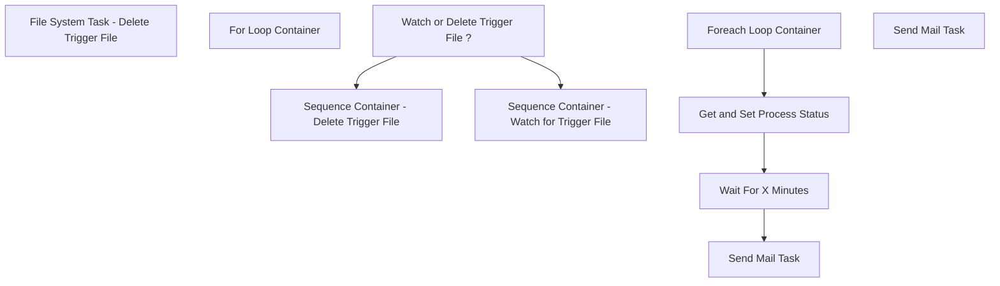

# SSIS Package: AuditworksToDWTriggerFile

**Project:** AuditworksToDWTriggerFile  
**Folder:** DW  
**Server:** STL-SSIS-P-01  

## Connection Managers

| Name | Type | Server | Catalog | Connection (sanitized) |
|---|---|---|---|---|
| IntegrationStaging | OLEDB | stl-ssis-p-01 | IntegrationStaging | Data Source=stl-ssis-p-01; Initial Catalog=IntegrationStaging; Provider=SQLNCLI11.1; Integrated Security=SSPI; Auto Translate=False |
| SMTP | SMTP |  |  |  |

## Control Flow Tasks

| Task | Type |
|---|---|
| AuditworksToDWTriggerFile | Package |
| Sequence Container - Delete Trigger File | SEQUENCE |
| File System Task - Delete Trigger File | FileSystemTask |
| Sequence Container - Watch for Trigger File | SEQUENCE |
| For Loop Container | FORLOOP |
| Foreach Loop Container | FOREACHLOOP |
| Get and Set Process Status | ExecuteSQLTask |
| Send Mail Task | SendMailTask |
| Wait For X Minutes | ExecuteSQLTask |
| Watch or Delete Trigger File ? | ExecuteSQLTask |
| Send Mail Task | SendMailTask |

## Control Flow Outline

```text
- Send Mail Task [SendMailTask]
- Sequence Container - Delete Trigger File [SEQUENCE]
  - File System Task - Delete Trigger File [FileSystemTask]
- Sequence Container - Watch for Trigger File [SEQUENCE]
  - For Loop Container [FORLOOP]
    - Foreach Loop Container [FOREACHLOOP]
    - Get and Set Process Status [ExecuteSQLTask]
    - Send Mail Task [SendMailTask]
    - Wait For X Minutes [ExecuteSQLTask]
- Watch or Delete Trigger File ? [ExecuteSQLTask]
```

## Architecture Diagram



## Variables

| Namespace | Name | Expression-bound |
|---|---|---|
| System | Propagate | No |
| User | CurrentFileName | No |
| User | ProcessStatus | No |
| User | TriggerFileFullPath | Yes |
| User | WatchDeleteResult | No |

### Expression-bound variable values

#### User::TriggerFileFullPath

**Expression:**

```sql
@[$Package::TriggerFileLocation]+ @[$Package::RequiredTriggerFileName]
```

**Evaluated value:**

```sql
\\saapp01\HostData\ProcessFlag\store_awCompResults.csv
```

## Execute SQL Tasks

### Get and Set Process Status

**Path:** `Package\Sequence Container - Watch for Trigger File\For Loop Container\Get and Set Process Status`  
**Connection:** IntegrationStaging (stl-ssis-p-01/IntegrationStaging)  

> ⚠️ `SqlStatementSource` is overridden at runtime by a property expression (shown below); the static SQL may not be what executes.

**Static SqlStatementSource:**

```sql
 
	Declare @FileNameCheck varchar (50), 
	@Results Int, 
	@RequiredTriggerFileName varchar (50),
	@BreakLoopHour Int
 set @FileNameCheck = 'X' set @RequiredTriggerFileName = 'store_awCompResults.csv'set @BreakLoopHour = '15'
select @Results = case 
						when @FileNameCheck = @RequiredTriggerFileName and datepart(HH,GETDATE()) < @BreakLoopHour
							then cast('1' as int) 
						when @FileNameCheck <> @RequiredTriggerFileName and datepart(HH,GETDATE()) < @BreakLoopHour
							then cast('0' as int) 
						when datepart(HH,GETDATE()) >= @BreakLoopHour
							then cast('2' as int) 
					end 

select @Results as ProcessStatusResult    if @Results = 2 RAISERROR ('Trigger File Not Found', 16,1)  


```

**Property expression (runtime override):**

```sql
" 
	Declare @FileNameCheck varchar (50), 
	@Results Int, 
	@RequiredTriggerFileName varchar (50),
	@BreakLoopHour Int
"
+ " set @FileNameCheck = "+ "'"+ @[User::CurrentFileName] +"'" 
+ " set @RequiredTriggerFileName = "+ "'"+ @[$Package::RequiredTriggerFileName]+ "'" 
+ "set @BreakLoopHour = " + "'"+ (DT_WSTR,2) @[$Package::BreakLoopHour]+ "'"
+ "
select @Results = case 
						when @FileNameCheck = @RequiredTriggerFileName and datepart(HH,GETDATE()) < @BreakLoopHour
							then cast('1' as int) 
						when @FileNameCheck <> @RequiredTriggerFileName and datepart(HH,GETDATE()) < @BreakLoopHour
							then cast('0' as int) 
						when datepart(HH,GETDATE()) >= @BreakLoopHour
							then cast('2' as int) 
					end 

select @Results as ProcessStatusResult    if @Results = 2 RAISERROR ('Trigger File Not Found', 16,1)  

"
```

### Wait For X Minutes

**Path:** `Package\Sequence Container - Watch for Trigger File\For Loop Container\Wait For X Minutes`  
**Connection:** IntegrationStaging (stl-ssis-p-01/IntegrationStaging)  

> ⚠️ `SqlStatementSource` is overridden at runtime by a property expression (shown below); the static SQL may not be what executes.

**Static SqlStatementSource:**

```sql
--WaitFor Delay '00:00:5'
WaitFor Delay '00:5:00'
```

**Property expression (runtime override):**

```sql
"--WaitFor Delay '00:00:"+@[$Package::WaitForDurationMinutes]+"'" + 
"
WaitFor Delay '00:"+@[$Package::WaitForDurationMinutes]+":00"+"'"
```

### Watch or Delete Trigger File ?

**Path:** `Package\Watch or Delete Trigger File ?`  
**Connection:** IntegrationStaging (stl-ssis-p-01/IntegrationStaging)  

> ⚠️ `SqlStatementSource` is overridden at runtime by a property expression (shown below); the static SQL may not be what executes.

**Static SqlStatementSource:**

```sql
select 'Watch' as Result
```

**Property expression (runtime override):**

```sql
"select "+"'"+ @[$Package::WatchOrDelete]+"'"+" as Result"
```

## Data Flow: Sources

_None detected._

## Data Flow: Destinations

_None detected._
