# SSIS Package: DW_FlashGaapSalesForAccounting

**Project:** DW_FlashGaapSalesForAccounting  
**Folder:** DW  
**Server:** STL-SSIS-P-01  

## Connection Managers

| Name | Type | Server | Catalog | Connection (sanitized) |
|---|---|---|---|---|
| AW Cache | CACHE |  |  |  |
| DW | OLEDB | papamart | dw | Data Source=papamart; Initial Catalog=dw; Provider=SQLNCLI11.1; Integrated Security=SSPI; Auto Translate=False |
| DW Cache | CACHE |  |  |  |
| DWStaging | OLEDB | papamart | DWStaging | Data Source=papamart; Initial Catalog=DWStaging; Provider=SQLNCLI11.1; Integrated Security=SSPI; Auto Translate=False |
| SMTP | SMTP |  |  |  |
| USICOAL1 | OLEDB | SW0000200001 | USICOAL | Data Source=SW0000200001; Initial Catalog=USICOAL; Provider=SQLNCLI11.1; Auto Translate=False |
| USICOAL2 | OLEDB | SW0000200001 | USICOAL | Data Source=SW0000200001; Initial Catalog=USICOAL; Provider=SQLNCLI11.1; Auto Translate=False |
| USICOAL3 | OLEDB | SW0000200001 | USICOAL | Data Source=SW0000200001; Initial Catalog=USICOAL; Provider=SQLNCLI11.1; Auto Translate=False |
| USICOAL4 | OLEDB | SW0000200001 | USICOAL | Data Source=SW0000200001; Initial Catalog=USICOAL; Provider=SQLNCLI11.1; Auto Translate=False |
| USICOAL5 | OLEDB | SW0000200001 | USICOAL | Data Source=SW0000200001; Initial Catalog=USICOAL; Provider=SQLNCLI11.1; Auto Translate=False |
| WebOrderProcessing | OLEDB | bearcluster01.sql.buildabear.com | WebOrderProcessing | Data Source=bearcluster01.sql.buildabear.com; Initial Catalog=WebOrderProcessing; Provider=SQLNCLI11.1; Integrated Security=SSPI; Auto Translate=False |
| auditworks | OLEDB | bedrockdb01 | auditworks | Data Source=bedrockdb01; Initial Catalog=auditworks; Provider=SQLNCLI11.1; Integrated Security=SSPI; Auto Translate=False |
| kodiak.BABWMstrData | OLEDB | kodiak | BABWMstrData | Data Source=kodiak; Initial Catalog=BABWMstrData; Provider=SQLNCLI11.1; Integrated Security=SSPI; Auto Translate=False |

## Control Flow Tasks

| Task | Type |
|---|---|
| DW_FlashGaapSalesForAccounting | Package |
| DataFlow - Load Web Data | Pipeline |
| DataFlow - Load Web Data 1 | Pipeline |
| DataFlow - Load Web Data 2 | Pipeline |
| SEQ - Store Sales 1 | SEQUENCE |
| JumpMind | Pipeline |
| Merge Transaction_RawSummaryFromStoreServer | ExecuteSQLTask |
| SEQ Store Groups | SEQUENCE |
| SEQ Group 1 | SEQUENCE |
| Foreach Loop Container | FOREACHLOOP |
| Failure To Connect | ExecuteSQLTask |
| Sequence Container | SEQUENCE |
| DataFlow - Load Store Data | Pipeline |
| Stage Store Data | ExecuteSQLTask |
| Get Store Groups | ExecuteSQLTask |
| SEQ Group 2 | SEQUENCE |
| Foreach Loop Container | FOREACHLOOP |
| Failure To Connect | ExecuteSQLTask |
| Sequence Container | SEQUENCE |
| DataFlow - Load Store Data | Pipeline |
| Stage Store Data | ExecuteSQLTask |
| Get Store Groups | ExecuteSQLTask |
| SEQ Group 3 | SEQUENCE |
| Foreach Loop Container | FOREACHLOOP |
| Failure To Connect | ExecuteSQLTask |
| Sequence Container | SEQUENCE |
| DataFlow - Load Store Data | Pipeline |
| Stage Store Data | ExecuteSQLTask |
| Get Store Groups | ExecuteSQLTask |
| SEQ Group 4 | SEQUENCE |
| Foreach Loop Container | FOREACHLOOP |
| Failure To Connect | ExecuteSQLTask |
| Sequence Container | SEQUENCE |
| DataFlow - Load Store Data | Pipeline |
| Stage Store Data | ExecuteSQLTask |
| Get Store Groups | ExecuteSQLTask |
| SEQ Group 5 | SEQUENCE |
| Foreach Loop Container | FOREACHLOOP |
| Failure To Connect | ExecuteSQLTask |
| Sequence Container | SEQUENCE |
| DataFlow - Load Store Data | Pipeline |
| Stage Store Data | ExecuteSQLTask |
| Get Store Groups | ExecuteSQLTask |
| Stage Store List | Pipeline |
| TRUNCATE STAGE | ExecuteSQLTask |
| SEQ - Web Sales | SEQUENCE |
| DataFlow - Load Web Data | Pipeline |
| DW Lookup | Pipeline |
| Merge Sales_GAAP_RawFromStoreServerFromWeb | ExecuteSQLTask |
| SA Lookup Task | Pipeline |
| TRUNCATE STAGE | ExecuteSQLTask |

## Control Flow Outline

```text
- DataFlow - Load Web Data [Pipeline]
- DataFlow - Load Web Data 1 [Pipeline]
- DataFlow - Load Web Data 2 [Pipeline]
- SEQ - Store Sales 1 [SEQUENCE]
  - JumpMind [Pipeline]
  - Merge Transaction_RawSummaryFromStoreServer [ExecuteSQLTask]
  - SEQ Store Groups [SEQUENCE]
    - SEQ Group 1 [SEQUENCE]
      - Foreach Loop Container [FOREACHLOOP]
        - Failure To Connect [ExecuteSQLTask]
        - Sequence Container [SEQUENCE]
          - DataFlow - Load Store Data [Pipeline]
          - Stage Store Data [ExecuteSQLTask]
      - Get Store Groups [ExecuteSQLTask]
    - SEQ Group 2 [SEQUENCE]
      - Foreach Loop Container [FOREACHLOOP]
        - Failure To Connect [ExecuteSQLTask]
        - Sequence Container [SEQUENCE]
          - DataFlow - Load Store Data [Pipeline]
          - Stage Store Data [ExecuteSQLTask]
      - Get Store Groups [ExecuteSQLTask]
    - SEQ Group 3 [SEQUENCE]
      - Foreach Loop Container [FOREACHLOOP]
        - Failure To Connect [ExecuteSQLTask]
        - Sequence Container [SEQUENCE]
          - DataFlow - Load Store Data [Pipeline]
          - Stage Store Data [ExecuteSQLTask]
      - Get Store Groups [ExecuteSQLTask]
    - SEQ Group 4 [SEQUENCE]
      - Foreach Loop Container [FOREACHLOOP]
        - Failure To Connect [ExecuteSQLTask]
        - Sequence Container [SEQUENCE]
          - DataFlow - Load Store Data [Pipeline]
          - Stage Store Data [ExecuteSQLTask]
      - Get Store Groups [ExecuteSQLTask]
    - SEQ Group 5 [SEQUENCE]
      - Foreach Loop Container [FOREACHLOOP]
        - Failure To Connect [ExecuteSQLTask]
        - Sequence Container [SEQUENCE]
          - DataFlow - Load Store Data [Pipeline]
          - Stage Store Data [ExecuteSQLTask]
      - Get Store Groups [ExecuteSQLTask]
  - Stage Store List [Pipeline]
  - TRUNCATE STAGE [ExecuteSQLTask]
- SEQ - Web Sales [SEQUENCE]
  - DW Lookup [Pipeline]
  - DataFlow - Load Web Data [Pipeline]
  - Merge Sales_GAAP_RawFromStoreServerFromWeb [ExecuteSQLTask]
  - SA Lookup Task [Pipeline]
  - TRUNCATE STAGE [ExecuteSQLTask]
```

## Architecture Diagram

```mermaid
flowchart TD
    n_Package_DataFlow___Load_Web_Data["DataFlow - Load Web Data"]
    n_Package_DataFlow___Load_Web_Data_1["DataFlow - Load Web Data 1"]
    n_Package_DataFlow___Load_Web_Data_2["DataFlow - Load Web Data 2"]
    n_Package_SEQ___Store_Sales_1["SEQ - Store Sales 1"]
    n_Package_SEQ___Store_Sales_1_JumpMind["JumpMind"]
    n_Package_SEQ___Store_Sales_1_Merge_Transaction_RawSummaryFromStoreServer["Merge Transaction_RawSummaryFromStoreServer"]
    n_Package_SEQ___Store_Sales_1_SEQ_Store_Groups["SEQ Store Groups"]
    n_Package_SEQ___Store_Sales_1_SEQ_Store_Groups_SEQ_Group_1["SEQ Group 1"]
    n_Package_SEQ___Store_Sales_1_SEQ_Store_Groups_SEQ_Group_1_Foreach_Loop_Container["Foreach Loop Container"]
    n_Package_SEQ___Store_Sales_1_SEQ_Store_Groups_SEQ_Group_1_Foreach_Loop_Container_Failure_To_Connect["Failure To Connect"]
    n_Package_SEQ___Store_Sales_1_SEQ_Store_Groups_SEQ_Group_1_Foreach_Loop_Container_Sequence_Container["Sequence Container"]
    n_Package_SEQ___Store_Sales_1_SEQ_Store_Groups_SEQ_Group_1_Foreach_Loop_Container_Sequence_Container_DataFlow___Load_Store_Data["DataFlow - Load Store Data"]
    n_Package_SEQ___Store_Sales_1_SEQ_Store_Groups_SEQ_Group_1_Foreach_Loop_Container_Sequence_Container_Stage_Store_Data["Stage Store Data"]
    n_Package_SEQ___Store_Sales_1_SEQ_Store_Groups_SEQ_Group_1_Get_Store_Groups["Get Store Groups"]
    n_Package_SEQ___Store_Sales_1_SEQ_Store_Groups_SEQ_Group_2["SEQ Group 2"]
    n_Package_SEQ___Store_Sales_1_SEQ_Store_Groups_SEQ_Group_2_Foreach_Loop_Container["Foreach Loop Container"]
    n_Package_SEQ___Store_Sales_1_SEQ_Store_Groups_SEQ_Group_2_Foreach_Loop_Container_Failure_To_Connect["Failure To Connect"]
    n_Package_SEQ___Store_Sales_1_SEQ_Store_Groups_SEQ_Group_2_Foreach_Loop_Container_Sequence_Container["Sequence Container"]
    n_Package_SEQ___Store_Sales_1_SEQ_Store_Groups_SEQ_Group_2_Foreach_Loop_Container_Sequence_Container_DataFlow___Load_Store_Data["DataFlow - Load Store Data"]
    n_Package_SEQ___Store_Sales_1_SEQ_Store_Groups_SEQ_Group_2_Foreach_Loop_Container_Sequence_Container_Stage_Store_Data["Stage Store Data"]
    n_Package_SEQ___Store_Sales_1_SEQ_Store_Groups_SEQ_Group_2_Get_Store_Groups["Get Store Groups"]
    n_Package_SEQ___Store_Sales_1_SEQ_Store_Groups_SEQ_Group_3["SEQ Group 3"]
    n_Package_SEQ___Store_Sales_1_SEQ_Store_Groups_SEQ_Group_3_Foreach_Loop_Container["Foreach Loop Container"]
    n_Package_SEQ___Store_Sales_1_SEQ_Store_Groups_SEQ_Group_3_Foreach_Loop_Container_Failure_To_Connect["Failure To Connect"]
    n_Package_SEQ___Store_Sales_1_SEQ_Store_Groups_SEQ_Group_3_Foreach_Loop_Container_Sequence_Container["Sequence Container"]
    n_Package_SEQ___Store_Sales_1_SEQ_Store_Groups_SEQ_Group_3_Foreach_Loop_Container_Sequence_Container_DataFlow___Load_Store_Data["DataFlow - Load Store Data"]
    n_Package_SEQ___Store_Sales_1_SEQ_Store_Groups_SEQ_Group_3_Foreach_Loop_Container_Sequence_Container_Stage_Store_Data["Stage Store Data"]
    n_Package_SEQ___Store_Sales_1_SEQ_Store_Groups_SEQ_Group_3_Get_Store_Groups["Get Store Groups"]
    n_Package_SEQ___Store_Sales_1_SEQ_Store_Groups_SEQ_Group_4["SEQ Group 4"]
    n_Package_SEQ___Store_Sales_1_SEQ_Store_Groups_SEQ_Group_4_Foreach_Loop_Container["Foreach Loop Container"]
    n_Package_SEQ___Store_Sales_1_SEQ_Store_Groups_SEQ_Group_4_Foreach_Loop_Container_Failure_To_Connect["Failure To Connect"]
    n_Package_SEQ___Store_Sales_1_SEQ_Store_Groups_SEQ_Group_4_Foreach_Loop_Container_Sequence_Container["Sequence Container"]
    n_Package_SEQ___Store_Sales_1_SEQ_Store_Groups_SEQ_Group_4_Foreach_Loop_Container_Sequence_Container_DataFlow___Load_Store_Data["DataFlow - Load Store Data"]
    n_Package_SEQ___Store_Sales_1_SEQ_Store_Groups_SEQ_Group_4_Foreach_Loop_Container_Sequence_Container_Stage_Store_Data["Stage Store Data"]
    n_Package_SEQ___Store_Sales_1_SEQ_Store_Groups_SEQ_Group_4_Get_Store_Groups["Get Store Groups"]
    n_Package_SEQ___Store_Sales_1_SEQ_Store_Groups_SEQ_Group_5["SEQ Group 5"]
    n_Package_SEQ___Store_Sales_1_SEQ_Store_Groups_SEQ_Group_5_Foreach_Loop_Container["Foreach Loop Container"]
    n_Package_SEQ___Store_Sales_1_SEQ_Store_Groups_SEQ_Group_5_Foreach_Loop_Container_Failure_To_Connect["Failure To Connect"]
    n_Package_SEQ___Store_Sales_1_SEQ_Store_Groups_SEQ_Group_5_Foreach_Loop_Container_Sequence_Container["Sequence Container"]
    n_Package_SEQ___Store_Sales_1_SEQ_Store_Groups_SEQ_Group_5_Foreach_Loop_Container_Sequence_Container_DataFlow___Load_Store_Data["DataFlow - Load Store Data"]
    n_Package_SEQ___Store_Sales_1_SEQ_Store_Groups_SEQ_Group_5_Foreach_Loop_Container_Sequence_Container_Stage_Store_Data["Stage Store Data"]
    n_Package_SEQ___Store_Sales_1_SEQ_Store_Groups_SEQ_Group_5_Get_Store_Groups["Get Store Groups"]
    n_Package_SEQ___Store_Sales_1_Stage_Store_List["Stage Store List"]
    n_Package_SEQ___Store_Sales_1_TRUNCATE_STAGE["TRUNCATE STAGE"]
    n_Package_SEQ___Web_Sales["SEQ - Web Sales"]
    n_Package_SEQ___Web_Sales_DataFlow___Load_Web_Data["DataFlow - Load Web Data"]
    n_Package_SEQ___Web_Sales_DW_Lookup["DW Lookup"]
    n_Package_SEQ___Web_Sales_Merge_Sales_GAAP_RawFromStoreServerFromWeb["Merge Sales_GAAP_RawFromStoreServerFromWeb"]
    n_Package_SEQ___Web_Sales_SA_Lookup_Task["SA Lookup Task"]
    n_Package_SEQ___Web_Sales_TRUNCATE_STAGE["TRUNCATE STAGE"]
    n_Package_SEQ___Store_Sales_1_SEQ_Store_Groups_SEQ_Group_1_Foreach_Loop_Container_Sequence_Container_Stage_Store_Data --> n_Package_SEQ___Store_Sales_1_SEQ_Store_Groups_SEQ_Group_1_Foreach_Loop_Container_Sequence_Container_DataFlow___Load_Store_Data
    n_Package_SEQ___Store_Sales_1_SEQ_Store_Groups_SEQ_Group_1_Foreach_Loop_Container_Sequence_Container --> n_Package_SEQ___Store_Sales_1_SEQ_Store_Groups_SEQ_Group_1_Foreach_Loop_Container_Failure_To_Connect
    n_Package_SEQ___Store_Sales_1_SEQ_Store_Groups_SEQ_Group_1_Get_Store_Groups --> n_Package_SEQ___Store_Sales_1_SEQ_Store_Groups_SEQ_Group_1_Foreach_Loop_Container
    n_Package_SEQ___Store_Sales_1_SEQ_Store_Groups_SEQ_Group_2_Foreach_Loop_Container_Sequence_Container_Stage_Store_Data --> n_Package_SEQ___Store_Sales_1_SEQ_Store_Groups_SEQ_Group_2_Foreach_Loop_Container_Sequence_Container_DataFlow___Load_Store_Data
    n_Package_SEQ___Store_Sales_1_SEQ_Store_Groups_SEQ_Group_2_Foreach_Loop_Container_Sequence_Container --> n_Package_SEQ___Store_Sales_1_SEQ_Store_Groups_SEQ_Group_2_Foreach_Loop_Container_Failure_To_Connect
    n_Package_SEQ___Store_Sales_1_SEQ_Store_Groups_SEQ_Group_2_Get_Store_Groups --> n_Package_SEQ___Store_Sales_1_SEQ_Store_Groups_SEQ_Group_2_Foreach_Loop_Container
    n_Package_SEQ___Store_Sales_1_SEQ_Store_Groups_SEQ_Group_3_Foreach_Loop_Container_Sequence_Container_Stage_Store_Data --> n_Package_SEQ___Store_Sales_1_SEQ_Store_Groups_SEQ_Group_3_Foreach_Loop_Container_Sequence_Container_DataFlow___Load_Store_Data
    n_Package_SEQ___Store_Sales_1_SEQ_Store_Groups_SEQ_Group_3_Foreach_Loop_Container_Sequence_Container --> n_Package_SEQ___Store_Sales_1_SEQ_Store_Groups_SEQ_Group_3_Foreach_Loop_Container_Failure_To_Connect
    n_Package_SEQ___Store_Sales_1_SEQ_Store_Groups_SEQ_Group_3_Get_Store_Groups --> n_Package_SEQ___Store_Sales_1_SEQ_Store_Groups_SEQ_Group_3_Foreach_Loop_Container
    n_Package_SEQ___Store_Sales_1_SEQ_Store_Groups_SEQ_Group_4_Foreach_Loop_Container_Sequence_Container_Stage_Store_Data --> n_Package_SEQ___Store_Sales_1_SEQ_Store_Groups_SEQ_Group_4_Foreach_Loop_Container_Sequence_Container_DataFlow___Load_Store_Data
    n_Package_SEQ___Store_Sales_1_SEQ_Store_Groups_SEQ_Group_4_Foreach_Loop_Container_Sequence_Container --> n_Package_SEQ___Store_Sales_1_SEQ_Store_Groups_SEQ_Group_4_Foreach_Loop_Container_Failure_To_Connect
    n_Package_SEQ___Store_Sales_1_SEQ_Store_Groups_SEQ_Group_4_Get_Store_Groups --> n_Package_SEQ___Store_Sales_1_SEQ_Store_Groups_SEQ_Group_4_Foreach_Loop_Container
    n_Package_SEQ___Store_Sales_1_SEQ_Store_Groups_SEQ_Group_5_Foreach_Loop_Container_Sequence_Container_Stage_Store_Data --> n_Package_SEQ___Store_Sales_1_SEQ_Store_Groups_SEQ_Group_5_Foreach_Loop_Container_Sequence_Container_DataFlow___Load_Store_Data
    n_Package_SEQ___Store_Sales_1_SEQ_Store_Groups_SEQ_Group_5_Foreach_Loop_Container_Sequence_Container --> n_Package_SEQ___Store_Sales_1_SEQ_Store_Groups_SEQ_Group_5_Foreach_Loop_Container_Failure_To_Connect
    n_Package_SEQ___Store_Sales_1_SEQ_Store_Groups_SEQ_Group_5_Get_Store_Groups --> n_Package_SEQ___Store_Sales_1_SEQ_Store_Groups_SEQ_Group_5_Foreach_Loop_Container
    n_Package_SEQ___Store_Sales_1_TRUNCATE_STAGE --> n_Package_SEQ___Store_Sales_1_Stage_Store_List
    n_Package_SEQ___Store_Sales_1_Stage_Store_List --> n_Package_SEQ___Store_Sales_1_SEQ_Store_Groups
    n_Package_SEQ___Store_Sales_1_SEQ_Store_Groups --> n_Package_SEQ___Store_Sales_1_JumpMind
    n_Package_SEQ___Store_Sales_1_JumpMind --> n_Package_SEQ___Store_Sales_1_Merge_Transaction_RawSummaryFromStoreServer
    n_Package_SEQ___Web_Sales_TRUNCATE_STAGE --> n_Package_SEQ___Web_Sales_DW_Lookup
    n_Package_SEQ___Web_Sales_DataFlow___Load_Web_Data --> n_Package_SEQ___Web_Sales_Merge_Sales_GAAP_RawFromStoreServerFromWeb
    n_Package_SEQ___Web_Sales_DW_Lookup --> n_Package_SEQ___Web_Sales_SA_Lookup_Task
    n_Package_SEQ___Web_Sales_SA_Lookup_Task --> n_Package_SEQ___Web_Sales_DataFlow___Load_Web_Data
    n_Package_SEQ___Web_Sales --> n_Package_SEQ___Store_Sales_1
```



## Variables

| Namespace | Name | Expression-bound |
|---|---|---|
| System | Propagate | No |
| User | DateTimeStamp | Yes |
| User | EndDate | Yes |
| User | EndDateAsDATE | Yes |
| User | GetDate | Yes |
| User | GetDateAsDATE | Yes |
| User | SQL_StoreServerQuery | Yes |
| User | SendStarterEmail | No |
| User | StartDate | Yes |
| User | StartDateAsDATE | Yes |
| User | StoreDataRowCount | No |
| User | StoreList | No |
| User | StoreList | No |
| User | StoreList | No |
| User | StoreList | No |
| User | StoreList | No |
| User | StoreNumber | No |
| User | StoreNumber | No |
| User | StoreNumber | No |
| User | StoreNumber | No |
| User | StoreNumber | No |
| User | StoreServerName1 | No |
| User | StoreServerName2 | No |
| User | StoreServerName3 | No |
| User | StoreServerName4 | No |
| User | StoreServerName5 | No |

### Expression-bound variable values

#### User::DateTimeStamp

**Expression:**

```sql
(DT_WSTR,4)DATEPART("yyyy",GetDate()) 
+ (DT_WSTR,4)DATEPART("mm",GetDate()) 
+ (DT_WSTR,4)DATEPART("dd",GetDate()) 
+ (DT_WSTR,4)DATEPART("hh",GetDate()) 
+ (DT_WSTR,4)DATEPART("mi",GetDate()) 
+ (DT_WSTR,4)DATEPART("ss",GetDate()) 
+ (DT_WSTR,4)DATEPART("ms",GetDate())
```

**Evaluated value:**

```sql
2024410155257337
```

#### User::EndDate

**Expression:**

```sql
dateadd("dd", @[$Package::DaysToInclude], @[User::StartDate])
```

**Evaluated value:**

```sql
4/10/2024
```

#### User::EndDateAsDATE

**Expression:**

```sql
(DT_WSTR, 4) datepart("year", @[User::EndDate])  + "-" +
right("0"+ (DT_WSTR, 2) datepart("mm", @[User::EndDate]),2)  + "-" +
right("0" +(DT_WSTR, 2) datepart("dd",  @[User::EndDate]),2)
```

**Evaluated value:**

```sql
2024-04-10
```

#### User::GetDate

**Expression:**

```sql
(DT_DATE)DATEDIFF("Day", (DT_DATE) 0, GETDATE())
```

**Evaluated value:**

```sql
4/10/2024
```

#### User::GetDateAsDATE

**Expression:**

```sql
(DT_WSTR, 4) datepart("year", @[User::GetDate])  + "-" +
right("0"+ (DT_WSTR, 2) datepart("mm", @[User::GetDate]),2)  + "-" +
right("0" +(DT_WSTR, 2) datepart("dd",  @[User::GetDate]),2)
```

**Evaluated value:**

```sql
2024-04-10
```

#### User::SQL_StoreServerQuery

**Expression:**

```sql
"
IF (Object_ID('usicoal..tmpGAAP') IS NOT NULL) DROP TABLE tmpGAAP
	create table tmpGAAP
	(RTL_TRN_ID int,
	TRANS_COUNT int,
	NET_UNITS decimal(18,4),
	NET_SALES money,
	BEAR_UNITS decimal(18,4),
	BEAR_SALES money,
	SHOE_UNITS decimal(18,4),
	SHOE_SALES money,
	SOUND_UNITS decimal(18,4),
	SOUND_SALES money, 
	GIFT_CARD_UNITS decimal(18,4),
	PARTY_UNITS decimal(18,4),
	END_DATETIME datetime,
	END_YEAR int,
	END_MONTH int,
	END_DAY int,
	END_HOUR int,
	REDEEMED_AMOUNT money,
	SHIFTID datetime,
	shiftDescription varchar(20),
	Start_Shift datetime,
	Excluded_Items int,
	Tran_Units int)

declare @current_date as varchar(50),
		@store varchar(4),
		@name varchar(52),
		@sql varchar(1000)

set @sql = 'insert into tmpGAAP exec USICOAL.dbo.BEAR_PAWS_RPT ''" + @[User::StartDateAsDATE] + "'', ''" + @[User::EndDateAsDATE]  + "'''
exec (@sql)

select top 1 @store = right(('0000' + convert(varchar, RT.STORE_NO)), 4) 
from tmpGAAP a
	INNER JOIN RETAIL_TRANSACTION RT WITH(NOLOCK)
		ON a.RTL_TRN_ID = RT.RTL_TRN_ID
	INNER JOIN (SELECT s.RTL_TRN_ID,
					s.STORE_NO,
					MIN(s.ITEM_NO) AS ITEM_NO,
					MAX(s.VOID_FLG) AS VOID_FLG
				FROM SALE_RTRN_LN_ITEM s WITH(NOLOCK)
				GROUP BY s.RTL_TRN_ID,
					s.STORE_NO
	) LI
		on (RT.RTL_TRN_ID = LI.RTL_TRN_ID)
		AND (RT.STORE_NO = LI.STORE_NO)

select @name = case when store_no = 3002 then 'Shanghai Disney' else address1 end
from store 
where store_no = @store

IF (Object_ID('usicoal..tmpGAAPStage') IS NOT NULL) DROP TABLE tmpGAAPStage
select	@store as location_code, 
		@name as location_name,
		RT.RTL_TRN_ID,
		RT.STORE_NO,
		RT.WORKSTATION_NO,
		RT.RTL_TRN_NO,
		RT.OPERATOR_NO,
		RT.RTL_TRN_TYPE_CODE,
		cast(LI.ITEM_NO as varchar(20)) as ITEM_NO,
		LI.VOID_FLG, 
		a.END_DATETIME as TransactionDatetime, 
		isnull((a.net_sales - a.redeemed_amount), 0) AS net_sales, 
		net_units,
		tran_units,
		a.END_DATETIME as EntryDatetime, 
		'Coalition' as source
into tmpGAAPStage
from tmpGAAP a
	INNER JOIN RETAIL_TRANSACTION RT WITH(NOLOCK)
		ON a.RTL_TRN_ID = RT.RTL_TRN_ID
	INNER JOIN (SELECT s.RTL_TRN_ID,
					s.STORE_NO,
					MIN(s.ITEM_NO) AS ITEM_NO,
					MAX(s.VOID_FLG) AS VOID_FLG,
					sum(QUANTITY) as QUANTITY
				FROM SALE_RTRN_LN_ITEM s WITH(NOLOCK)
				GROUP BY s.RTL_TRN_ID,
					s.STORE_NO
	) LI
		on (RT.RTL_TRN_ID = LI.RTL_TRN_ID)
		AND (RT.STORE_NO = LI.STORE_NO)
where net_sales <> 0
"
```

**Evaluated value:**

```sql

IF (Object_ID('usicoal..tmpGAAP') IS NOT NULL) DROP TABLE tmpGAAP
	create table tmpGAAP
	(RTL_TRN_ID int,
	TRANS_COUNT int,
	NET_UNITS decimal(18,4),
	NET_SALES money,
	BEAR_UNITS decimal(18,4),
	BEAR_SALES money,
	SHOE_UNITS decimal(18,4),
	SHOE_SALES money,
	SOUND_UNITS decimal(18,4),
	SOUND_SALES money, 
	GIFT_CARD_UNITS decimal(18,4),
	PARTY_UNITS decimal(18,4),
	END_DATETIME datetime,
	END_YEAR int,
	END_MONTH int,
	END_DAY int,
	END_HOUR int,
	REDEEMED_AMOUNT money,
	SHIFTID datetime,
	shiftDescription varchar(20),
	Start_Shift datetime,
	Excluded_Items int,
	Tran_Units int)

declare @current_date as varchar(50),
		@store varchar(4),
		@name varchar(52),
		@sql varchar(1000)

set @sql = 'insert into tmpGAAP exec USICOAL.dbo.BEAR_PAWS_RPT ''2024-04-07'', ''2024-04-10'''
exec (@sql)

select top 1 @store = right(('0000' + convert(varchar, RT.STORE_NO)), 4) 
from tmpGAAP a
	INNER JOIN RETAIL_TRANSACTION RT WITH(NOLOCK)
		ON a.RTL_TRN_ID = RT.RTL_TRN_ID
	INNER JOIN (SELECT s.RTL_TRN_ID,
					s.STORE_NO,
					MIN(s.ITEM_NO) AS ITEM_NO,
					MAX(s.VOID_FLG) AS VOID_FLG
				FROM SALE_RTRN_LN_ITEM s WITH(NOLOCK)
				GROUP BY s.RTL_TRN_ID,
					s.STORE_NO
	) LI
		on (RT.RTL_TRN_ID = LI.RTL_TRN_ID)
		AND (RT.STORE_NO = LI.STORE_NO)

select @name = case when store_no = 3002 then 'Shanghai Disney' else address1 end
from store 
where store_no = @store

IF (Object_ID('usicoal..tmpGAAPStage') IS NOT NULL) DROP TABLE tmpGAAPStage
select	@store as location_code, 
		@name as location_name,
		RT.RTL_TRN_ID,
		RT.STORE_NO,
		RT.WORKSTATION_NO,
		RT.RTL_TRN_NO,
		RT.OPERATOR_NO,
		RT.RTL_TRN_TYPE_CODE,
		cast(LI.ITEM_NO as varchar(20)) as ITEM_NO,
		LI.VOID_FLG, 
		a.END_DATETIME as TransactionDatetime, 
		isnull((a.net_sales - a.redeemed_amount), 0) AS net_sales, 
		net_units,
		tran_units,
		a.END_DATETIME as EntryDatetime, 
		'Coalition' as source
into tmpGAAPStage
from tmpGAAP a
	INNER JOIN RETAIL_TRANSACTION RT WITH(NOLOCK)
		ON a.RTL_TRN_ID = RT.RTL_TRN_ID
	INNER JOIN (SELECT s.RTL_TRN_ID,
					s.STORE_NO,
					MIN(s.ITEM_NO) AS ITEM_NO,
					MAX(s.VOID_FLG) AS VOID_FLG,
					sum(QUANTITY) as QUANTITY
				FROM SALE_RTRN_LN_ITEM s WITH(NOLOCK)
				GROUP BY s.RTL_TRN_ID,
					s.STORE_NO
	) LI
		on (RT.RTL_TRN_ID = LI.RTL_TRN_ID)
		AND (RT.STORE_NO = LI.STORE_NO)
where net_sales <> 0

```

#### User::StartDate

**Expression:**

```sql
dateadd("dd", -@[$Package::DaysToGoBack] , @[User::GetDate] )
```

**Evaluated value:**

```sql
4/7/2024
```

#### User::StartDateAsDATE

**Expression:**

```sql
(DT_WSTR, 4) datepart("year", @[User::StartDate])  + "-" +
right("0"+ (DT_WSTR, 2) datepart("mm", @[User::StartDate]),2)  + "-" +
right("0" +(DT_WSTR, 2) datepart("dd",  @[User::StartDate]),2)
```

**Evaluated value:**

```sql
2024-04-07
```

## Execute SQL Tasks

### Merge Transaction_RawSummaryFromStoreServer

**Path:** `Package\SEQ - Store Sales 1\Merge Transaction_RawSummaryFromStoreServer`  
**Connection:** DWStaging (papamart/DWStaging)  

```sql
EXEC Accounting.spMergeSales_GAAP_RawFromStoreServer
```

### Failure To Connect

**Path:** `Package\SEQ - Store Sales 1\SEQ Store Groups\SEQ Group 1\Foreach Loop Container\Failure To Connect`  
**Connection:** DWStaging (papamart/DWStaging)  

> ⚠️ `SqlStatementSource` is overridden at runtime by a property expression (shown below); the static SQL may not be what executes.

**Static SqlStatementSource:**

```sql
insert Accounting.Sales_GAAP_RawFromStoreServer_Staging (location_code, location_name) values ('', 'unable to connect')
```

**Property expression (runtime override):**

```sql
"insert Accounting.Sales_GAAP_RawFromStoreServer_Staging (location_code, location_name) values ('"+ (DT_STR, 4, 1252) @[User::StoreNumber] + "', 'unable to connect')"
```

### Stage Store Data

**Path:** `Package\SEQ - Store Sales 1\SEQ Store Groups\SEQ Group 1\Foreach Loop Container\Sequence Container\Stage Store Data`  
**Connection:** USICOAL1 (SW0000200001/USICOAL)  

```sql
User::SQL_StoreServerQuery
```

### Get Store Groups

**Path:** `Package\SEQ - Store Sales 1\SEQ Store Groups\SEQ Group 1\Get Store Groups`  
**Connection:** DW (papamart/dw)  

```sql
select 
right((concat('0000',istoreid)),4) store_id,
	store_ip
from DWFlashGaapSales_StoreList
where storegroup =1
and cast(istoreid as int) not in (select StoreID from dw.dbo.vwPOSActiveJumpMindStores)

```

### Failure To Connect

**Path:** `Package\SEQ - Store Sales 1\SEQ Store Groups\SEQ Group 2\Foreach Loop Container\Failure To Connect`  
**Connection:** DWStaging (papamart/DWStaging)  

> ⚠️ `SqlStatementSource` is overridden at runtime by a property expression (shown below); the static SQL may not be what executes.

**Static SqlStatementSource:**

```sql
insert Accounting.Sales_GAAP_RawFromStoreServer_Staging (location_code, location_name) values ('', 'unable to connect')
```

**Property expression (runtime override):**

```sql
"insert Accounting.Sales_GAAP_RawFromStoreServer_Staging (location_code, location_name) values ('"+ (DT_STR, 4, 1252) @[User::StoreNumber] + "', 'unable to connect')"
```

### Stage Store Data

**Path:** `Package\SEQ - Store Sales 1\SEQ Store Groups\SEQ Group 2\Foreach Loop Container\Sequence Container\Stage Store Data`  
**Connection:** USICOAL2 (SW0000200001/USICOAL)  

```sql
User::SQL_StoreServerQuery
```

### Get Store Groups

**Path:** `Package\SEQ - Store Sales 1\SEQ Store Groups\SEQ Group 2\Get Store Groups`  
**Connection:** DW (papamart/dw)  

```sql
select 
right((concat('0000',istoreid)),4) store_id,
	store_ip
from DWFlashGaapSales_StoreList
where storegroup = 2
and cast(istoreid as int) not in (select StoreID from dw.dbo.vwPOSActiveJumpMindStores)

```

### Failure To Connect

**Path:** `Package\SEQ - Store Sales 1\SEQ Store Groups\SEQ Group 3\Foreach Loop Container\Failure To Connect`  
**Connection:** DWStaging (papamart/DWStaging)  

> ⚠️ `SqlStatementSource` is overridden at runtime by a property expression (shown below); the static SQL may not be what executes.

**Static SqlStatementSource:**

```sql
insert Accounting.Sales_GAAP_RawFromStoreServer_Staging (location_code, location_name) values ('', 'unable to connect')
```

**Property expression (runtime override):**

```sql
"insert Accounting.Sales_GAAP_RawFromStoreServer_Staging (location_code, location_name) values ('"+ (DT_STR, 4, 1252) @[User::StoreNumber] + "', 'unable to connect')"
```

### Stage Store Data

**Path:** `Package\SEQ - Store Sales 1\SEQ Store Groups\SEQ Group 3\Foreach Loop Container\Sequence Container\Stage Store Data`  
**Connection:** USICOAL3 (SW0000200001/USICOAL)  

```sql
User::SQL_StoreServerQuery
```

### Get Store Groups

**Path:** `Package\SEQ - Store Sales 1\SEQ Store Groups\SEQ Group 3\Get Store Groups`  
**Connection:** DW (papamart/dw)  

```sql
select 
right((concat('0000',istoreid)),4) store_id,
	store_ip
from DWFlashGaapSales_StoreList
where storegroup = 3
and cast(istoreid as int) not in (select StoreID from dw.dbo.vwPOSActiveJumpMindStores)

```

### Failure To Connect

**Path:** `Package\SEQ - Store Sales 1\SEQ Store Groups\SEQ Group 4\Foreach Loop Container\Failure To Connect`  
**Connection:** DWStaging (papamart/DWStaging)  

> ⚠️ `SqlStatementSource` is overridden at runtime by a property expression (shown below); the static SQL may not be what executes.

**Static SqlStatementSource:**

```sql
insert Accounting.Sales_GAAP_RawFromStoreServer_Staging (location_code, location_name) values ('', 'unable to connect')
```

**Property expression (runtime override):**

```sql
"insert Accounting.Sales_GAAP_RawFromStoreServer_Staging (location_code, location_name) values ('"+ (DT_STR, 4, 1252) @[User::StoreNumber] + "', 'unable to connect')"
```

### Stage Store Data

**Path:** `Package\SEQ - Store Sales 1\SEQ Store Groups\SEQ Group 4\Foreach Loop Container\Sequence Container\Stage Store Data`  
**Connection:** USICOAL4 (SW0000200001/USICOAL)  

```sql
User::SQL_StoreServerQuery
```

### Get Store Groups

**Path:** `Package\SEQ - Store Sales 1\SEQ Store Groups\SEQ Group 4\Get Store Groups`  
**Connection:** DW (papamart/dw)  

```sql
select 
right((concat('0000',istoreid)),4) store_id,
	store_ip
from DWFlashGaapSales_StoreList
where storegroup = 4
and cast(istoreid as int) not in (select StoreID from dw.dbo.vwPOSActiveJumpMindStores)

```

### Failure To Connect

**Path:** `Package\SEQ - Store Sales 1\SEQ Store Groups\SEQ Group 5\Foreach Loop Container\Failure To Connect`  
**Connection:** DWStaging (papamart/DWStaging)  

> ⚠️ `SqlStatementSource` is overridden at runtime by a property expression (shown below); the static SQL may not be what executes.

**Static SqlStatementSource:**

```sql
insert Accounting.Sales_GAAP_RawFromStoreServer_Staging (location_code, location_name) values ('', 'unable to connect')
```

**Property expression (runtime override):**

```sql
"insert Accounting.Sales_GAAP_RawFromStoreServer_Staging (location_code, location_name) values ('"+ (DT_STR, 4, 1252) @[User::StoreNumber] + "', 'unable to connect')"
```

### Stage Store Data

**Path:** `Package\SEQ - Store Sales 1\SEQ Store Groups\SEQ Group 5\Foreach Loop Container\Sequence Container\Stage Store Data`  
**Connection:** USICOAL5 (SW0000200001/USICOAL)  

```sql
User::SQL_StoreServerQuery
```

### Get Store Groups

**Path:** `Package\SEQ - Store Sales 1\SEQ Store Groups\SEQ Group 5\Get Store Groups`  
**Connection:** DW (papamart/dw)  

```sql
select 
right((concat('0000',istoreid)),4) store_id,
 store_ip
from DWFlashGaapSales_StoreList
where storegroup = 5
and cast(istoreid as int) not in (select StoreID from dw.dbo.vwPOSActiveJumpMindStores)
```

### TRUNCATE STAGE

**Path:** `Package\SEQ - Store Sales 1\TRUNCATE STAGE`  
**Connection:** DWStaging (papamart/DWStaging)  

```sql
TRUNCATE TABLE DW.dbo.DWFlashGaapSales_StoreList
TRUNCATE TABLE Accounting.Sales_GAAP_RawFromStoreServer_Staging

```

### Merge Sales_GAAP_RawFromStoreServerFromWeb

**Path:** `Package\SEQ - Web Sales\Merge Sales_GAAP_RawFromStoreServerFromWeb`  
**Connection:** DWStaging (papamart/DWStaging)  

```sql
EXEC Accounting.spMergeSales_GAAP_RawFromStoreServerFromWeb
```

### TRUNCATE STAGE

**Path:** `Package\SEQ - Web Sales\TRUNCATE STAGE`  
**Connection:** DWStaging (papamart/DWStaging)  

```sql
TRUNCATE TABLE Accounting.WebFlashGaapStage

```

## Data Flow: Sources

| Component | Source Object | Type | Data Flow Task | Connection | SQL Kind |
|---|---|---|---|---|---|
| vwDWFlashGaapWeb |  | OLEDBSource | DataFlow - Load Web Data | WebOrderProcessing |  |
| vwDWFlashGaapWeb |  | OLEDBSource | DataFlow - Load Web Data 1 | WebOrderProcessing |  |
| vwDWFlashGaapWeb |  | OLEDBSource | DataFlow - Load Web Data 2 | WebOrderProcessing | SqlCommand |
| DW |  | OLEDBSource | JumpMind | DW | SqlCommand |
| tmpGAAPStage |  | OLEDBSource | DataFlow - Load Store Data | USICOAL1 | SqlCommand |
| tmpGAAPStage |  | OLEDBSource | DataFlow - Load Store Data | USICOAL2 | SqlCommand |
| tmpGAAPStage |  | OLEDBSource | DataFlow - Load Store Data | USICOAL3 | SqlCommand |
| tmpGAAPStage |  | OLEDBSource | DataFlow - Load Store Data | USICOAL4 | SqlCommand |
| tmpGAAPStage |  | OLEDBSource | DataFlow - Load Store Data | USICOAL5 | SqlCommand |
| StoreGroups |  | OLEDBSource | Stage Store List | kodiak.BABWMstrData | SqlCommand |
| vwDWFlashGaapWeb |  | OLEDBSource | DataFlow - Load Web Data | WebOrderProcessing | SqlCommand |
| DW |  | OLEDBSource | DW Lookup | DW | SqlCommand |
| SalesAudit |  | OLEDBSource | SA Lookup Task | auditworks | SqlCommand |

#### vwDWFlashGaapWeb — SqlCommand

```sql
select *
from vwDWFlashGaapWebV2
where cast(TransactionDate as date) between ? and ?
```

#### DW — SqlCommand

```sql
select *
from vwPOSJumpMindSalesForAccounting
where datediff(dd, TransactionDateTime, getdate())<=3
```

#### tmpGAAPStage — SqlCommand

```sql
select '1' as ColumnOne
```

#### StoreGroups — SqlCommand

```sql
select 
	StoreID,
	('SW0' + right(('0000' + cast(StoreID as varchar)),4) + '00001') store_ip,
	StoreGroup
from vwDW_StoreGroupIPs 
--where StoreID in  (109)
order by StoreID

/*
with 
OpenStores as
	(
		select 
			cast(sd.str_num as int) as StoreID
		from 
			str_dim sd 
		join str_open_dim sod on sd.str_id = sod.str_key
		where cast(sod.open_dt as date) <= cast(getdate() as date)
		and (cast(sod.close_dt as date) > cast(getdate()-30 as date) or sod.close_dt is null)
		and cast(sd.str_num as int) not in (13,2013,2301,3002,2011)--RUNNING LIST OF STORES TO PERMENENTLY EXCLUDE FROM PROCESS
		and cast(sd.str_num as int)  in (select store_id from [stl-ssis-p-01].IntegrationStaging.dbo.HangingSQLConnectionCheck_StoresNotConnected)
		--and not (cast(getdate() as date)='2023-1-3' and sd.str_num >=2000)
		group by cast(sd.str_num as int)
	),
DaylightSavings as
	(
		select 
			'UK' Country, 
			'2019-03-31' StartDate, 
			'2019-10-27' EndDate
		UNION
		select 
			'IE' Country, 
			'2019-03-31' StartDate, 
			'2019-10-27' EndDate
		UNION
		select 
			'DK' Country, 
			'2019-03-31' StartDate, 
			'2019-10-27' EndDate
		UNION
		select 
			'US' Country, 
			'2019-03-10' StartDate, 
			'2019-11-03' EndDate
		UNION
		select 
			'CA' Country, 
			'2019-03-10' StartDate, 
			'2019-11-03' EndDate
		UNION
		select
			'CN' Country,
			NULL StartDate,
			NULL EndDate
	),
Summary as
(
SELECT 
	cast(sd.str_num as int) as StoreID, 
	case 
		when cast(sd.str_num as int) < 2000 
			then 1000 + cast(sd.str_num as int)
		else cast(sd.str_num as int)
	end as LocationCode,

	cast(
			'10.' 
			+ cast(case when sd.str_num between 1 and 99 then '0' 
					else cast(sd.str_num/100 as varchar) 
					end as varchar) 
			+ '.' 
			+ cast(sd.str_num - sd.str_num/100*100 as varchar) 
			+ '.101'
		as varchar(15)
		) as StoreIP,
	NTILE(5) OVER(ORDER BY newid()) StoreGroup,
	CASE WHEN cd.NM_ABBRV IN ('US','CA') THEN 'North America'
	          WHEN cd.NM_ABBRV IN ('UK','DK','IE','CN') THEN 'Europe'
	END AS TradingGroup,
	--replace(tz.tm_zn_cd, 'UTC', '') as GMT_Offset,
	--dateadd(hh, +cast(replace(tz.tm_zn_cd, 'UTC', '') as int), getutcdate()) as CurrentStoreTime
	case when spd.nm_abbrv not in ('PR', 'AZ')
		then 
			case when cast(getdate() as date) between dls.StartDate and dls.EndDate
				then cast(replace(tz.tm_zn_cd, 'UTC', '') as int) +1
				else cast(replace(tz.tm_zn_cd, 'UTC', '') as int)
			end
		else cast(replace(tz.tm_zn_cd, 'UTC', '') as int)
	end as GMT_Offset,
	case when spd.nm_abbrv not in ('PR', 'AZ')
		then 
			case when cast(getdate() as date) between dls.StartDate and dls.EndDate
				then dateadd(hh, +cast(replace(tz.tm_zn_cd, 'UTC', '') as int)+1, getutcdate())
				else dateadd(hh, +cast(replace(tz.tm_zn_cd, 'UTC', '') as int), getutcdate())
			end
		else dateadd(hh, +cast(replace(tz.tm_zn_cd, 'UTC', '') as int), getutcdate())
	end as CurrentStoreTime
FROM BABWMstrData.dbo.STR_DIM sd 
join BABWMstrData.dbo.CNTRY_DIM cd ON sd.CNTRY_ID = cd.CNTRY_ID
left join BABWMstrData.dbo.TIME_ZONES_DIM tz on sd.tm_zn_id = tz.tm_zn_id
join BABWMstrData.dbo.st_prvnc_dim spd on sd.st_prvnc_id = spd.st_prvnc_id
join DaylightSavings dls on cd.nm_abbrv = dls.Country
where exists (select os.StoreID from OpenStores os where os.StoreID = cast(sd.str_num as int))
and sd.STR_NUM >= case when datepart(hh,getdate())<7 then 2000 else 1 end --intended to only try to get UK data during this time
	  )
select 
	StoreID,
	('SW0' + right(('0000' + cast(StoreID as varchar)),4) + '00001') store_ip,
	StoreGroup
from summary
where StoreID in  (109)
order by StoreID
*/
```

#### DW — SqlCommand

```sql
select
	transaction_id,
	gaap_sales_amount as GaapSalesDW,
gaap_transaction_flag isGaap
from transaction_facts tf with (nolock)
join dw.dbo.date_dim dd on tf.date_key=dd.date_key
where cast(dd.actual_date as date) between ? and ?
```

#### SalesAudit — SqlCommand

```sql
select  distinct
	cast(th.transaction_id as int) transaction_id, 
	th.transaction_no, 
	th.register_no,
	cast(left(substring (ln.line_note, 12,30),8) as varchar(12)) as OrderNumber,
	cast(substring (ln.line_note, 12,30) as varchar(12)) WMOrderNumber,
	th.transaction_remark,
case when th.register_no in (7,57) then 1 else 0 end as ReturnsRegister
from transaction_header th with (nolock)
join line_note ln with (nolock) on th.transaction_id = ln.transaction_id
where ln.line_note like 'Web Order%'
UNION
select  distinct
	cast(th.av_transaction_id as int) as transaction_id, 
	th.transaction_no, 
	th.register_no,
	cast(left(substring (ln.line_note, 12,30),8) as varchar(12)) as OrderNumber,
	cast(substring (ln.line_note, 12,30) as varchar(12)) WMOrderNumber,
	th.transaction_remark,
case when th.register_no in (7,57) then 1 else 0 end as ReturnsRegister
from av_transaction_header th with (nolock)
join av_line_note ln with (nolock) on th.av_transaction_id = ln.av_transaction_id
where ln.line_note like 'Web Order%'
and cast(th.transaction_date as date) between ? and ?
```

## Data Flow: Destinations

| Component | Target Table | Type | Data Flow Task | Connection | SQL Kind |
|---|---|---|---|---|---|
| WebFlashGaapStage |  | OLEDBDestination | DataFlow - Load Web Data | DWStaging |  |
| WebFlashGaapStage |  | OLEDBDestination | DataFlow - Load Web Data 1 | DWStaging |  |
| WebFlashGaapStage |  | OLEDBDestination | DataFlow - Load Web Data 2 | DWStaging |  |
| Accounting_Sales_GaapRawFromStoreServer_Staging |  | OLEDBDestination | JumpMind | DWStaging |  |
| Sales_GAAP_RawFromStoreServer_Staging |  | OLEDBDestination | DataFlow - Load Store Data | DWStaging |  |
| Sales_GAAP_RawFromStoreServer_Staging |  | OLEDBDestination | DataFlow - Load Store Data | DWStaging |  |
| Sales_GAAP_RawFromStoreServer_Staging |  | OLEDBDestination | DataFlow - Load Store Data | DWStaging |  |
| Sales_GAAP_RawFromStoreServer_Staging |  | OLEDBDestination | DataFlow - Load Store Data | DWStaging |  |
| Sales_GAAP_RawFromStoreServer_Staging |  | OLEDBDestination | DataFlow - Load Store Data | DWStaging |  |
| DWFlashGaapSales_StoreList |  | OLEDBDestination | Stage Store List | DW |  |
| WebFlashGaapStage |  | OLEDBDestination | DataFlow - Load Web Data | DWStaging |  |
