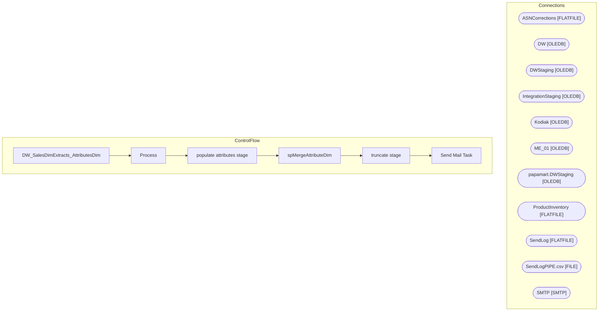

# SSIS Package: DW_SalesDimExtracts_AttributesDim

**Project:** DW_SalesDimExtracts_AttributesDim  
**Folder:** DW  
**Server:** STL-SSIS-P-01  

## Architecture Diagram

## Connection Managers

| Name | Type |
|---|---|
| ASNCorrections | FLATFILE |
| DW | OLEDB |
| DWStaging | OLEDB |
| IntegrationStaging | OLEDB |
| Kodiak | OLEDB |
| ME_01 | OLEDB |
| papamart.DWStaging | OLEDB |
| ProductInventory | FLATFILE |
| SendLog | FLATFILE |
| SendLogPIPE.csv | FILE |
| SMTP | SMTP |

## Control Flow Tasks

| Task | Type |
|---|---|
| DW_SalesDimExtracts_AttributesDim | Microsoft.Package |
| Process | STOCK:SEQUENCE |
| populate attributes stage | Microsoft.Pipeline |
| spMergeAttributeDim | Microsoft.ExecuteSQLTask |
| truncate stage | Microsoft.ExecuteSQLTask |
| Send Mail Task | Microsoft.SendMailTask |

## Data Flow: Sources

| Component | SQL Preview |
|---|---|
|  | select  	'p' + cast(ecp.entity_custom_property_id as varchar(32)) as entitykey, 	s.style_code,  	cp.cust_prop_code AttributeName,  	ecp.custom_property_value AttributeValue from me_01.dbo.style s (nolock) join me_01.dbo.entity_custom_property ecp (nolock) on s.style_id = ecp.parent_id and ecp.parent_type = 1 join me_01.dbo.custom_property cp (nolock) on cp.custom_property_id = ecp.custom_property_ |

## Data Flow: Destinations

| Component | Destination |
|---|---|
|  | [dbo].[Attribute_Staging] |

