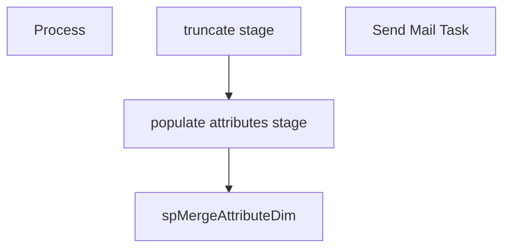

# SSIS Package: DW_SalesDimExtracts_AttributesDim

**Project:** DW_SalesDimExtracts_AttributesDim  
**Folder:** DW  
**Server:** STL-SSIS-P-01  

## Connection Managers

| Name | Type | Server | Catalog | Connection (sanitized) |
|---|---|---|---|---|
| ASNCorrections | FLATFILE |  |  |  |
| DW | OLEDB | papamarttest | dw | Data Source=papamarttest; Initial Catalog=dw; Provider=SQLNCLI11.1; Integrated Security=SSPI; Auto Translate=False |
| DWStaging | OLEDB | papamarttest | DWStaging | Data Source=papamarttest; Initial Catalog=DWStaging; Provider=SQLNCLI11.1; Integrated Security=SSPI; Auto Translate=False |
| IntegrationStaging | OLEDB | STL-SSIS-T-01 | IntegrationStaging | Data Source=STL-SSIS-T-01; Initial Catalog=IntegrationStaging; Provider=SQLNCLI11.1; Integrated Security=SSPI; Auto Translate=False |
| Kodiak | OLEDB | kodiaktest | BABWMstrData | Data Source=kodiaktest; Initial Catalog=BABWMstrData; Provider=SQLNCLI11.1; Integrated Security=SSPI; Auto Translate=False |
| ME_01 | OLEDB | bedrocktestdb02 | me_01 | Data Source=bedrocktestdb02; Initial Catalog=me_01; Provider=SQLNCLI11.1; Integrated Security=SSPI; Auto Translate=False |
| ProductInventory | FLATFILE |  |  |  |
| SMTP | SMTP |  |  |  |
| SendLog | FLATFILE |  |  |  |
| SendLogPIPE.csv | FILE |  |  |  |
| papamart.DWStaging | OLEDB | papamart | DWStaging | Data Source=papamart; Initial Catalog=DWStaging; Provider=SQLNCLI11.1; Integrated Security=SSPI; Auto Translate=False |

## Control Flow Tasks

| Task | Type |
|---|---|
| DW_SalesDimExtracts_AttributesDim | Package |
| Process | SEQUENCE |
| populate attributes stage | Pipeline |
| spMergeAttributeDim | ExecuteSQLTask |
| truncate stage | ExecuteSQLTask |
| Send Mail Task | SendMailTask |

## Control Flow Outline

```text
- Send Mail Task [SendMailTask]
- Process [SEQUENCE]
  - populate attributes stage [Pipeline]
  - spMergeAttributeDim [ExecuteSQLTask]
  - truncate stage [ExecuteSQLTask]
```

## Architecture Diagram



## Variables

| Namespace | Name | Expression-bound |
|---|---|---|
| System | Propagate | No |
| User | DateTimeStamp | Yes |
| User | EndDate | Yes |
| User | EndDateAsDATE | Yes |
| User | GetDate | Yes |
| User | GetDateAsDATE | Yes |
| User | StartDate | Yes |
| User | StartDateAsDATE | Yes |
| User | auditDestCount | No |
| User | auditInvalidCount | No |
| User | auditSrcCount | No |
| User | errorEmailActive | No |

### Expression-bound variable values

#### User::DateTimeStamp

**Expression:**

```sql
(DT_WSTR,4)DATEPART("yyyy",GetDate()) 
+ (DT_WSTR,4)DATEPART("mm",GetDate()) 
+ (DT_WSTR,4)DATEPART("dd",GetDate()) 
+ (DT_WSTR,4)DATEPART("hh",GetDate()) 
+ (DT_WSTR,4)DATEPART("mi",GetDate()) 
+ (DT_WSTR,4)DATEPART("ss",GetDate()) 
+ (DT_WSTR,4)DATEPART("ms",GetDate())
```

**Evaluated value:**

```sql
20211129345090
```

#### User::EndDate

**Expression:**

```sql
dateadd("dd", @[$Package::DaysToInclude], @[User::StartDate])
```

**Evaluated value:**

```sql
11/2/2021
```

#### User::EndDateAsDATE

**Expression:**

```sql
(DT_WSTR, 4) datepart("year", @[User::EndDate])  + "-" +
right("0"+ (DT_WSTR, 2) datepart("mm", @[User::EndDate]),2)  + "-" +
right("0" +(DT_WSTR, 2) datepart("dd",  @[User::EndDate]),2)
```

**Evaluated value:**

```sql
2021-11-02
```

#### User::GetDate

**Expression:**

```sql
(DT_DATE)DATEDIFF("Day", (DT_DATE) 0, GETDATE())
```

**Evaluated value:**

```sql
11/2/2021
```

#### User::GetDateAsDATE

**Expression:**

```sql
(DT_WSTR, 4) datepart("year", @[User::GetDate])  + "-" +
right("0"+ (DT_WSTR, 2) datepart("mm", @[User::GetDate]),2)  + "-" +
right("0" +(DT_WSTR, 2) datepart("dd",  @[User::GetDate]),2)
```

**Evaluated value:**

```sql
2021-11-02
```

#### User::StartDate

**Expression:**

```sql
dateadd("dd", -@[$Package::DaysToGoBack] , @[User::GetDate] )
```

**Evaluated value:**

```sql
11/1/2021
```

#### User::StartDateAsDATE

**Expression:**

```sql
(DT_WSTR, 4) datepart("year", @[User::StartDate])  + "-" +
right("0"+ (DT_WSTR, 2) datepart("mm", @[User::StartDate]),2)  + "-" +
right("0" +(DT_WSTR, 2) datepart("dd",  @[User::StartDate]),2)
```

**Evaluated value:**

```sql
2021-11-01
```

## Execute SQL Tasks

### spMergeAttributeDim

**Path:** `Package\Process\spMergeAttributeDim`  
**Connection:** DWStaging (papamarttest/DWStaging)  

```sql
EXEC spDWMergeAttribute_Dim
```

### truncate stage

**Path:** `Package\Process\truncate stage`  
**Connection:** DWStaging (papamarttest/DWStaging)  

```sql
TRUNCATE TABLE Attribute_Staging

```

## Data Flow: Sources

| Component | Source Object | Type | Data Flow Task | Connection | SQL Kind |
|---|---|---|---|---|---|
| ME_01 |  | OLEDBSource | populate attributes stage | ME_01 | SqlCommand |

#### ME_01 — SqlCommand

```sql
select 
	'p' + cast(ecp.entity_custom_property_id as varchar(32)) as entitykey,
	s.style_code, 
	cp.cust_prop_code AttributeName, 
	ecp.custom_property_value AttributeValue
from me_01.dbo.style s (nolock)
join me_01.dbo.entity_custom_property ecp (nolock) on s.style_id = ecp.parent_id and ecp.parent_type = 1
join me_01.dbo.custom_property cp (nolock) on cp.custom_property_id = ecp.custom_property_id 
union
select	
	'a' + cast(eas.entity_attribute_set_id as varchar(32)) as entitykey,
	s.style_code, 
	a.attribute_code AttributeName, 
	att.attribute_set_code AttributeValue
from me_01.dbo.style s (nolock)
join me_01.dbo.entity_attribute_set eas (nolock) on s.style_id = eas.parent_id
join me_01.dbo.attribute_set att (nolock) on eas.attribute_set_id = att.attribute_set_id
join me_01.dbo.attribute a (nolock) on att.attribute_id = a.attribute_id and a.parent_type = 1
```

## Data Flow: Destinations

| Component | Target Table | Type | Data Flow Task | Connection | SQL Kind |
|---|---|---|---|---|---|
| OLE DB Destination |  | OLEDBDestination | populate attributes stage | DWStaging |  |
