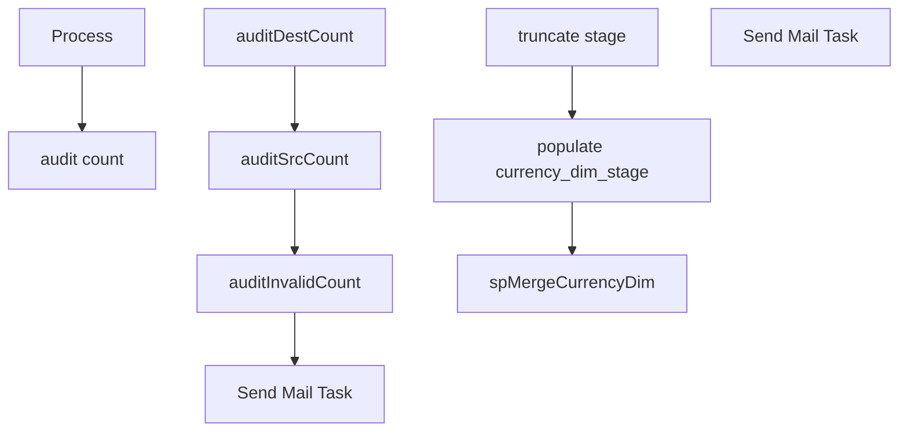

# SSIS Package: DW_SalesDimExtracts_CurrencyDim

**Project:** DW_SalesDimExtracts_CurrencyDim  
**Folder:** DW  
**Server:** STL-SSIS-P-01  

## Connection Managers

| Name | Type | Server | Catalog | Connection (sanitized) |
|---|---|---|---|---|
| ASNCorrections | FLATFILE |  |  |  |
| Auditworks | OLEDB | bedrocktestdb01 | auditworks | Data Source=bedrocktestdb01; Initial Catalog=auditworks; Provider=SQLNCLI11.1; Integrated Security=SSPI; Auto Translate=False |
| DW | OLEDB | papamarttest | dw | Data Source=papamarttest; Initial Catalog=dw; Provider=SQLNCLI11.1; Integrated Security=SSPI; Auto Translate=False |
| DWStaging | OLEDB | papamarttest | DWStaging | Data Source=papamarttest; Initial Catalog=DWStaging; Provider=SQLNCLI11.1; Integrated Security=SSPI; Auto Translate=False |
| IntegrationStaging | OLEDB | STL-SSIS-T-01 | IntegrationStaging | Data Source=STL-SSIS-T-01; Initial Catalog=IntegrationStaging; Provider=SQLNCLI11.1; Integrated Security=SSPI; Auto Translate=False |
| Kodiak | OLEDB | kodiaktest | BABWMstrData | Data Source=kodiaktest; Initial Catalog=BABWMstrData; Provider=SQLNCLI11.1; Integrated Security=SSPI; Auto Translate=False |
| ProductInventory | FLATFILE |  |  |  |
| SMTP | SMTP |  |  |  |
| SendLog | FLATFILE |  |  |  |
| SendLogPIPE.csv | FILE |  |  |  |
| papamart.DWStaging | OLEDB | papamart | DWStaging | Data Source=papamart; Initial Catalog=DWStaging; Provider=SQLNCLI11.1; Integrated Security=SSPI; Auto Translate=False |

## Control Flow Tasks

| Task | Type |
|---|---|
| DW_SalesDimExtracts_CurrencyDim | Package |
| audit count | SEQUENCE |
| auditDestCount | ExecuteSQLTask |
| auditInvalidCount | ExecuteSQLTask |
| auditSrcCount | ExecuteSQLTask |
| Send Mail Task | SendMailTask |
| Process | SEQUENCE |
| populate currency_dim_stage | Pipeline |
| spMergeCurrencyDim | ExecuteSQLTask |
| truncate stage | ExecuteSQLTask |
| Send Mail Task | SendMailTask |

## Control Flow Outline

```text
- Send Mail Task [SendMailTask]
- Process [SEQUENCE]
  - populate currency_dim_stage [Pipeline]
  - spMergeCurrencyDim [ExecuteSQLTask]
  - truncate stage [ExecuteSQLTask]
- audit count [SEQUENCE]
  - Send Mail Task [SendMailTask]
  - auditDestCount [ExecuteSQLTask]
  - auditInvalidCount [ExecuteSQLTask]
  - auditSrcCount [ExecuteSQLTask]
```

## Architecture Diagram



## Variables

| Namespace | Name | Expression-bound |
|---|---|---|
| System | Propagate | No |
| User | DateTimeStamp | Yes |
| User | EndDate | Yes |
| User | EndDateAsDATE | Yes |
| User | GetDate | Yes |
| User | GetDateAsDATE | Yes |
| User | StartDate | Yes |
| User | StartDateAsDATE | Yes |
| User | auditDestCount | No |
| User | auditInvalidCount | No |
| User | auditSrcCount | No |
| User | errorEmailActive | No |

### Expression-bound variable values

#### User::DateTimeStamp

**Expression:**

```sql
(DT_WSTR,4)DATEPART("yyyy",GetDate()) 
+ (DT_WSTR,4)DATEPART("mm",GetDate()) 
+ (DT_WSTR,4)DATEPART("dd",GetDate()) 
+ (DT_WSTR,4)DATEPART("hh",GetDate()) 
+ (DT_WSTR,4)DATEPART("mi",GetDate()) 
+ (DT_WSTR,4)DATEPART("ss",GetDate()) 
+ (DT_WSTR,4)DATEPART("ms",GetDate())
```

**Evaluated value:**

```sql
20211129263627
```

#### User::EndDate

**Expression:**

```sql
dateadd("dd", @[$Package::DaysToInclude], @[User::StartDate])
```

**Evaluated value:**

```sql
11/2/2021
```

#### User::EndDateAsDATE

**Expression:**

```sql
(DT_WSTR, 4) datepart("year", @[User::EndDate])  + "-" +
right("0"+ (DT_WSTR, 2) datepart("mm", @[User::EndDate]),2)  + "-" +
right("0" +(DT_WSTR, 2) datepart("dd",  @[User::EndDate]),2)
```

**Evaluated value:**

```sql
2021-11-02
```

#### User::GetDate

**Expression:**

```sql
(DT_DATE)DATEDIFF("Day", (DT_DATE) 0, GETDATE())
```

**Evaluated value:**

```sql
11/2/2021
```

#### User::GetDateAsDATE

**Expression:**

```sql
(DT_WSTR, 4) datepart("year", @[User::GetDate])  + "-" +
right("0"+ (DT_WSTR, 2) datepart("mm", @[User::GetDate]),2)  + "-" +
right("0" +(DT_WSTR, 2) datepart("dd",  @[User::GetDate]),2)
```

**Evaluated value:**

```sql
2021-11-02
```

#### User::StartDate

**Expression:**

```sql
dateadd("dd", -@[$Package::DaysToGoBack] , @[User::GetDate] )
```

**Evaluated value:**

```sql
11/1/2021
```

#### User::StartDateAsDATE

**Expression:**

```sql
(DT_WSTR, 4) datepart("year", @[User::StartDate])  + "-" +
right("0"+ (DT_WSTR, 2) datepart("mm", @[User::StartDate]),2)  + "-" +
right("0" +(DT_WSTR, 2) datepart("dd",  @[User::StartDate]),2)
```

**Evaluated value:**

```sql
2021-11-01
```

## Execute SQL Tasks

### spMergeCurrencyDim

**Path:** `Package\Process\spMergeCurrencyDim`  
**Connection:** DWStaging (papamarttest/DWStaging)  

```sql
exec [dbo].[spMergeCurrencyDim]
```

### truncate stage

**Path:** `Package\Process\truncate stage`  
**Connection:** DWStaging (papamarttest/DWStaging)  

```sql
truncate table [dbo].[currency_dim_stage]

```

### auditDestCount

**Path:** `Package\audit count\auditDestCount`  
**Connection:** DW (papamarttest/dw)  

```sql
SELECT COUNT(*) AS auditDestCount FROM dbo.currency_dim where currency_code > '0' AND currency_code not in ('RUB', 'ZUR')
```

### auditInvalidCount

**Path:** `Package\audit count\auditInvalidCount`  
**Connection:** DW (papamarttest/dw)  

```sql
SELECT dbo.fnDW_AuditRowCounts (?,?) AS auditCountFlag
```

### auditSrcCount

**Path:** `Package\audit count\auditSrcCount`  
**Connection:** Auditworks (bedrocktestdb01/auditworks)  

```sql
SELECT COUNT(*) AS auditSrcCount FROM dbo.vwDW_Currency_Dim where currency_code > '0' AND currency_code not in ('RUB', 'ZUR')
```

## Data Flow: Sources

| Component | Source Object | Type | Data Flow Task | Connection | SQL Kind |
|---|---|---|---|---|---|
| auditworks vwDW_Currency_Dim |  | OLEDBSource | populate currency_dim_stage | Auditworks | SqlCommand |

#### auditworks vwDW_Currency_Dim — SqlCommand

```sql
SELECT currency_code
      ,currency_desc
FROM dbo.vwDW_Currency_Dim with (nolock)
ORDER BY currency_code
```

## Data Flow: Destinations

| Component | Target Table | Type | Data Flow Task | Connection | SQL Kind |
|---|---|---|---|---|---|
| currency_dim_stage |  | OLEDBDestination | populate currency_dim_stage | DWStaging |  |
