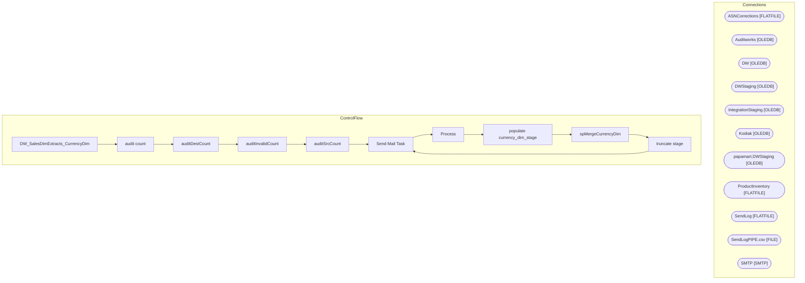

# SSIS Package: DW_SalesDimExtracts_CurrencyDim

**Project:** DW_SalesDimExtracts_CurrencyDim  
**Folder:** DW  
**Server:** STL-SSIS-P-01  

## Architecture Diagram

## Connection Managers

| Name | Type |
|---|---|
| ASNCorrections | FLATFILE |
| Auditworks | OLEDB |
| DW | OLEDB |
| DWStaging | OLEDB |
| IntegrationStaging | OLEDB |
| Kodiak | OLEDB |
| papamart.DWStaging | OLEDB |
| ProductInventory | FLATFILE |
| SendLog | FLATFILE |
| SendLogPIPE.csv | FILE |
| SMTP | SMTP |

## Control Flow Tasks

| Task | Type |
|---|---|
| DW_SalesDimExtracts_CurrencyDim | Microsoft.Package |
| audit count | STOCK:SEQUENCE |
| auditDestCount | Microsoft.ExecuteSQLTask |
| auditInvalidCount | Microsoft.ExecuteSQLTask |
| auditSrcCount | Microsoft.ExecuteSQLTask |
| Send Mail Task | Microsoft.SendMailTask |
| Process | STOCK:SEQUENCE |
| populate currency_dim_stage | Microsoft.Pipeline |
| spMergeCurrencyDim | Microsoft.ExecuteSQLTask |
| truncate stage | Microsoft.ExecuteSQLTask |
| Send Mail Task | Microsoft.SendMailTask |

## Data Flow: Sources

| Component | SQL Preview |
|---|---|
|  | SELECT currency_code       ,currency_desc FROM dbo.vwDW_Currency_Dim with (nolock) ORDER BY currency_code |

## Data Flow: Destinations

| Component | Destination |
|---|---|
|  | [dbo].[currency_dim_stage] |

