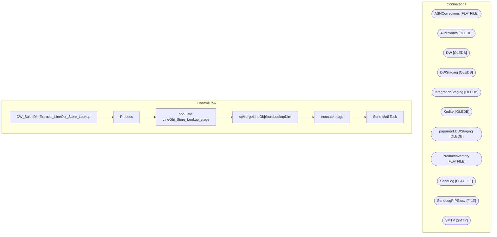

# SSIS Package: DW_SalesDimExtracts_LineObj_Store_Lookup

**Project:** DW_SalesDimExtracts_LineObj_Store_Lookup  
**Folder:** DW  
**Server:** STL-SSIS-P-01  

## Architecture Diagram

## Connection Managers

| Name | Type |
|---|---|
| ASNCorrections | FLATFILE |
| Auditworks | OLEDB |
| DW | OLEDB |
| DWStaging | OLEDB |
| IntegrationStaging | OLEDB |
| Kodiak | OLEDB |
| papamart.DWStaging | OLEDB |
| ProductInventory | FLATFILE |
| SendLog | FLATFILE |
| SendLogPIPE.csv | FILE |
| SMTP | SMTP |

## Control Flow Tasks

| Task | Type |
|---|---|
| DW_SalesDimExtracts_LineObj_Store_Lookup | Microsoft.Package |
| Process | STOCK:SEQUENCE |
| populate LineObj_Store_Lookup_stage | Microsoft.Pipeline |
| spMergeLineObjStoreLookupDim | Microsoft.ExecuteSQLTask |
| truncate stage | Microsoft.ExecuteSQLTask |
| Send Mail Task | Microsoft.SendMailTask |

## Data Flow: Sources

| Component | SQL Preview |
|---|---|
|  | SELECT [STS_line_object]       ,[StoreNo]       ,[Beehive_line_object]   FROM [auditworks].[dbo].[vwDW_LineObj_Store_Lookup]  ORDER BY [STS_line_object], [StoreNo] |

## Data Flow: Destinations

| Component | Destination |
|---|---|
|  | [dbo].[LineObj_Store_Lookup_stage] |

